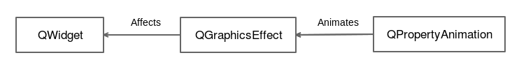
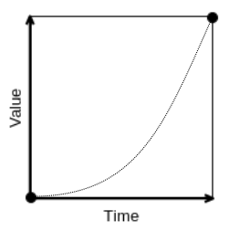

# 写真をフェードインして

ユーザーが画像を開いたときに、その不透明度を利用して画像をフェードインさせたいと考えています。QLabel や QWidget クラスには不透明度プロパティはありません。しかし、QGraphicsEffect を使って任意の QWidget に視覚効果を追加することができます。このアニメーションでは、QGraphicsOpacityEffect を使って opacity プロパティを提供します。

ここでは、それぞれの役割を説明するためのスキーマを紹介します。



この例では、QWidget クラスが QLabel で、QGraphicsEffect クラスが QGraphicsOpacityEffect です。Qt は QWidget クラスのレンダリングを変更するためのグラフィックスエフェクトシステムを提供しています。抽象クラス QGraphicsEffect には純粋な仮想メソッド draw() があり、これはそれぞれのグラフィックスエフェクトによって実装されています。

これで次のスニペットに従ってMainWindow.hを更新することができました。

```C++
#include <QPropertyAnimation>
#include <QGraphicsOpacityEffect>

class MainWindow : public QMainWindow
{
    ...

private:
    ...
    void initAnimations();

private:
    ...
    QPropertyAnimation mLoadPictureAnimation;
    QGraphicsOpacityEffect mPictureOpacityEffect;
};
```

initAnimations()プライベート関数は、すべてのアニメーションの初期化を担当します。mLoadPictureAnimation メンバ変数は、読み込まれた画像に対してフェードインアニメーションを実行します。最後に、必須のQGraphicsOpacityEffectであるmPictureOpacityEffectを宣言します。

MainWindow.cppのコンストラクタで実装部分に切り替えてみましょう。

```C++
MainWindow::MainWindow(QWidget *parent) :
    QMainWindow(parent),
    ...
    mLoadPictureAnimation(),
    mPictureOpacityEffect()
{
    ...
    initFilters();
    initAnimations();
}
```

驚くようなことはありません。イニシャライザ・リストを使用して、2 つの新しいメンバ変数を作成します。MainWindow コンストラクタは initAnimations() も呼び出しています。

このアニメーションがどのように初期化されているか見てみましょう。

```C++
void MainWindow::initAnimations()
{
    ui->pictureLabel->setGraphicsEffect(&mPictureOpacityEffect);
    mLoadPictureAnimation.setTargetObject(&mPictureOpacityEffect);
    mLoadPictureAnimation.setPropertyName("opacity");
    mLoadPictureAnimation.setDuration(500);
    mLoadPictureAnimation.setStartValue(0);
    mLoadPictureAnimation.setEndValue(1);
    mLoadPictureAnimation.setEasingCurve(QEasingCurve::InCubic);
}
```

最初にすべきことは、QGraphicsOpacityEffectをQLabelにリンクすることです。これは pictureLabel の setGraphicsEffect() 関数を呼び出すことで簡単にできます。

これでアニメーションを設定することができます。この場合、mLoadPictureAnimationはmPictureOpacityEffectをターゲットにしており、opacityというプロパティに影響を与えます。アニメーションの持続時間は500ミリ秒です。次に、アニメーションの開始時と終了時の不透明度の値を設定します。

* 最初は、画像が完全に透過しています(opacityの値は0)
* 最後に、画像が完全に見えるようになります(opacityの値は1)

このアニメーションには、緩和曲線 InCubic を使用します。この曲線は次のようになります。



あなたのために最もよく見えるものを見つけるために他のカーブを自由に試してみて下さい。

***

## Info

すべての緩和曲線のリストは、ここで視覚的なプレビューとともに入手できます。
<http://doc.qt.io/qt-5/qeasingcurve.html>

***

最後のステップは、適切な場所でアニメーションを開始することです。

```C++
void MainWindow::loadPicture()
{
    ...
    mCurrentFilter->process();
    mLoadPictureAnimation.start();
}
```

これでアプリケーションを起動して画像を読み込むことができます。500ミリ秒以上で写真がフェードするのがわかるはずです!

***

**[戻る](../index.html)**
