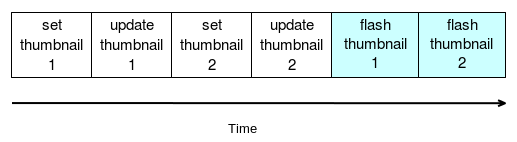
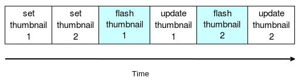

# サムネイルを連続で点滅させる

この最後のアニメーションでは、サムネイルが更新されたときに、各フィルターのプレビューに青色のフラッシュを表示させたいと思います。すべてのプレビューを同時に点滅させるのではなく、 順を追って一つずつ点滅させたいのです。この機能は 2 つの部分で実現します。

* FilterWidget でカラーアニメーションを作成して青いフラッシュを表示します。
* すべての FilterWidget カラー アニメーションを含むシーケンシャル アニメーション グループを MainWindow に作成します。

まずはカラーアニメーションを追加してみましょう。以下のスニペットのようにFilterWidget.hを更新します。

```C++
#include <QGraphicsColorizeEffect>

class FilterWidget : public QWidget
{
    Q_OBJECT

public:
    explicit FilterWidget(Filter& filter, QWidget *parent = 0);
    ~FilterWidget();
    ...
    QPropertyAnimation* colorAnimation();

private:
    ...
    QPropertyAnimation mSelectionAnimation;
    QPropertyAnimation* mColorAnimation;
    QGraphicsColorizeEffect mColorEffect;
};
```

今回は不透明度に影響を与えるのではなく、サムネイルを青く着色しています。そこで、別のQt標準エフェクトを使用します。QGraphicsColorizeEffectです。また、mColorAnimationという名前の新しいQPropertyAnimationと、それに対応するゲッターであるcolorAnimation()を宣言します。所有権はMainWindowのアニメーション・グループが持つことになるので、mColorAnimationをポインタとして宣言しています。このトピックは近日中に取り上げます。

FilterWidget.cppのコンストラクタを更新してみましょう。

```C++
FilterWidget::FilterWidget(Filter& filter, QWidget *parent) :
    QWidget(parent),
    ...
    mColorAnimation(new QPropertyAnimation()),
    mColorEffect()
{
    ...
}
```

2 つの新しいメンバ変数 mColorAnimation と mColorEffect を作成するだけです。ゲッターの驚くべき複雑さを見てみましょう。

```C++
QPropertyAnimation* FilterWidget::colorAnimation()
{
    return mColorAnimation;
}
```

それは嘘でした：私たちは常に包括的なコードを書こうとしています!

前置きが終わったので、initAnimations()関数を次のように更新して、カラーアニメーションを初期化します。

```C++
void FilterWidget::initAnimations()
{
    ...
    mColorEffect.setColor(QColor(0, 150, 150));
    mColorEffect.setStrength(0.0);
    ui->thumbnailLabel->setGraphicsEffect(&mColorEffect);

    mColorAnimation->setTargetObject(&mColorEffect);
    mColorAnimation->setPropertyName("strength");
    mColorAnimation->setDuration(200);
    mColorAnimation->setStartValue(1.0);
    mColorAnimation->setEndValue(0.0);
}
```

最初の部分では、カラーフィルターを設定します。ここではフラッシュ効果のためにターコイズ色のような色を選びました。カラーライズ効果は strength プロパティで処理されます。デフォルトでは、値は1.0なので、Lennaのデフォルトのサムネイルに影響を与えないように0.0に設定しています。最後に、setGraphicsEffect()を呼び出してサムネイルラベルをこのmColorEffectにリンクします。

第二部はカラーアニメーションの準備です。このアニメーションは、カラー効果とそのプロパティであるstrengthをターゲットにしています。これは短いフラッシュです。200ミリ秒で十分です。

* 強度のあるエフェクトでスタートしたいので、スタート値を1.0にします。
* アニメーションの間、カラーライズ効果は0.0になるまで減少します。

ここではデフォルトの線形補間で良いので、緩和曲線は使用していません。ここでは、これを使っています。色の効果/アニメーションを初期化し、colorAnimation() ゲッターを提供しました。これで、この機能の第二部である MainWindow.h の更新を始めることができます。

```C++
#include <QSequentialAnimationGroup>

class MainWindow : public QMainWindow
{
    Q_OBJECT
    ...

private:
    ...
    QSequentialAnimationGroup mFiltersGroupAnimation;
};
```

QSequentialAnimationGroup クラスを宣言して、青色のフラッシュを表示する FilterWidget カラーアニメーションを一つずつ起動させます。MainWindow.cppのコンストラクタを更新してみましょう。

```C++
MainWindow::MainWindow(QWidget *parent) :
    QMainWindow(parent),
    ...
    mFiltersGroupAnimation()
{
    ...
}
```

新しいメンバ変数は、イニシャライザリストでの新しい構築を意味します: それがルールです!

initAnimations()を更新してアニメーショングループを準備します。

```C++
void MainWindow::initAnimations()
{
    ...
    for (FilterWidget* filterWidget : mFilters) {
        mFiltersGroupAnimation.addAnimation(
        filterWidget->colorAnimation());
    }
}
```

アニメーショングループはアニメーションコンテナであることを覚えていますか？結果として、すべての FilterWidget を繰り返し処理してその色のアニメーションを取得し、addAnimation() を呼び出して mFiltersGroupAnimation を埋めます。C++11 の範囲ベースの for ループのおかげで、非常に読みやすくなっています。アニメーションをアニメーション グループに追加すると、そのグループがそのアニメーションの所有権を持つことに注意してください。

アニメーショングループの準備が整いました。これで始められます。

```C++
void MainWindow::loadPicture()
{
    ...
    mCurrentFilter->process();
    mLoadPictureAnimation.start();
    mFiltersGroupAnimation.start();
}
```

アプリケーションを起動して画像を開きます。すると、すべてのフィルターのサムネイルが左から右に一つずつ点滅するのがわかると思います。これは私たちが意図したものですが、すべてのサムネイルが点滅する前にすでに更新されてしまっているため、完璧ではありません。loadPicture() 関数が実際にすべてのサムネイルを設定して更新し、最終的にシーケンシャルアニメーショングループを開始するため、このような動作になっています。現在の動作を示すスキーマを以下に示します。



スキーマではサムネイル2枚分の動作しか記載されていませんが、サムネイル3枚分の動作でも原理は同じです。対象となる動作は以下の通りです。



フラッシュアニメーションが終了したときだけサムネイルを更新しなければなりません。幸いなことに、QPropertyAnimation はアニメーション終了時に finished シグナルを発するので、少し変更を加えるだけです。MainWindow.cpp から loadPicture() 関数を更新。

```C++
void MainWindow::loadPicture()
{
    ...
    for (int i = 0; i <mFilters.size(); ++i) {
        mFilters[i]->setSourcePicture(mSourcePicture);
        mFilters[i]->setSourceThumbnail(mSourceThumbnail);
        //mFilters[i]->updateThumbnail();
    }
    ...
}
```

ご覧のように、セットはそのままにして、ユーザーが新しい画像を開いたときだけ更新サムネイルを削除しました。この段階では、すべての FilterWidget インスタンスに正しいサムネイルが表示されていますが、表示されません。FilterWidget.cppを更新して修正してみましょう。

```C++
void FilterWidget::initAnimations()
{
    ...
    mColorAnimation->setTargetObject(&mColorEffect);
    mColorAnimation->setPropertyName("strength");
    mColorAnimation->setDuration(200);
    mColorAnimation->setStartValue(1.0);
    mColorAnimation->setEndValue(0.0);
    connect(mColorAnimation, &QPropertyAnimation::finished, [this]
    {
        updateThumbnail();
    });
}
```

カラーアニメーションの完成信号にlambda関数を接続します。このlambdaは単純にサムネイルを更新します。これで、アプリケーションを再度起動して画像を読み込むことができます。シーケンシャルブルーフラッシュだけでなく、サムネイルの更新もアニメーションしていることがわかるはずです。

***

## 概要

この章では、独自のSDKでFilterインターフェースを定義しました。これでフィルタはプラグインになりました。新しいプラグインを作成してロードする方法を知っているので、アプリケーションはモジュール化され、簡単に拡張することができます。また、Qt Animation Frameworkを使ってアプリケーションを強化しました。必要に応じて QGraphicsEffect を使って、任意の QWidget の位置、色、不透明度をアニメーション化する方法を知っています。QSequentialAnimationGroupを使って3つのアニメーションを1つずつ起動するシーケンシャルアニメーションを作成しました。

次の章では、大きなテーマであるスレッド処理についてお話します。Qtフレームワークは、堅牢で信頼性の高いマルチスレッドアプリケーションを構築するのに役立ちます。この章を説明するために、スレッドプールを使ってマンデルブロフラクタルジェネレータを作成します。

***

**[戻る](../index.html)**
