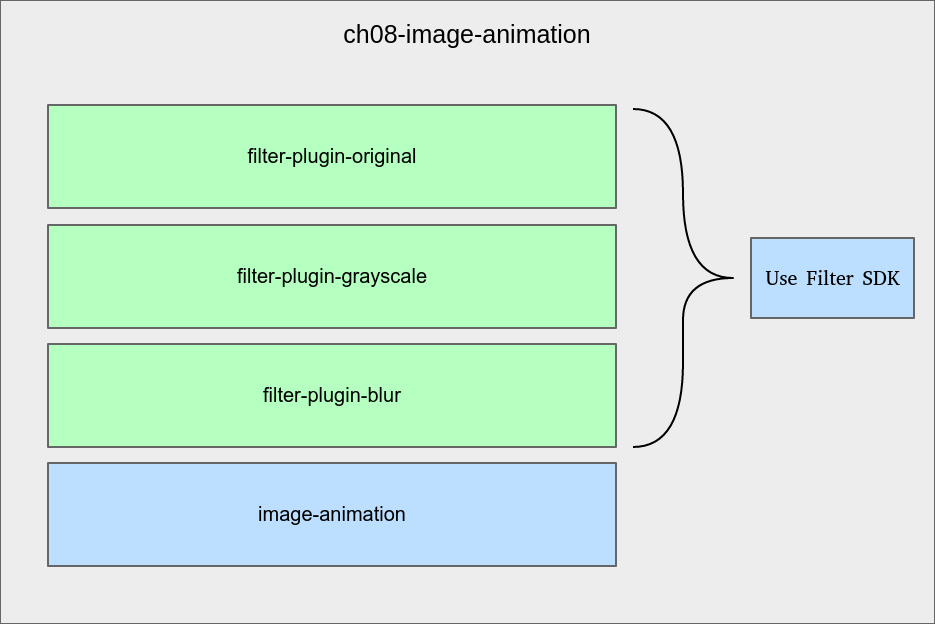

# SDKの準備

コードに飛び込む前に、どのような構造にするのか、少し時間をかけて反省しなければなりません。この章には二つの目的があります。

* Qtプラグインシステムをより深くカバーする
* Qtアニメーションフレームワークの学習と統合

この章の最初の部分では、プラグインシステムに焦点を当てます。私たちが目指しているのは、サードパーティの開発者にアプリケーションに統合できるプラグインを構築する方法を提供することです。これらのプラグインは動的にロードされるべきです。このアプリケーションは、第7章「頭の痛いことをしないサードパーティ・ライブラリ」のサンプルプロジェクトの直系の子孫になります。機能は全く同じですが、この新しいプラグインシステムを使用し、派手なアニメーションを持つことを除いては、全く同じです。

プロジェクトの構成は以下のとおりです。



親プロジェクトはch08-image-animationで、以下のように構成されています。

* filter-plugin-original: オリジナルのフィルタを実装したライブラリプロジェクト
* filter-plugin-grayscale: グレースケールフィルタの実装であるライブラリプロジェクト
* filter-plugin-blur: ぼかしフィルタの実装であるライブラリプロジェクト
* image-animation: 表示に必要なプラグインを読み込み、読み込んだ画像にそれぞれのプラグインを適用できるようにする Qt ウィジェットアプリケーション

これらのプラグインは一つ一つ開発していきますが、サードパーティの開発者が作成したものである可能性があることを念頭に置いてください。このオープン性を実現するために、各プラグインにはSDKが用意されています。このSDKはQtプラグインシステムに依存しています。

プラグインで何を処理するかを考えることは非常に重要です。私たちのアプリケーションは画像処理ソフトウェアです。プラグインの責任を画像処理の部分に限定することにしましたが、これは間違いなく設計上の選択です。

別のアプローチとして、プラグイン開発者が独自の UI を提供してプラグインを設定できるようにすることも考えられます (例えば、ぼかしの強度を変更するなど)。この章では、プラグインの開発自体にのみ焦点を当て、シンプルにしています。アプリケーションをどのように設計したいかは、本当にあなた次第です。プラグインができることの範囲を広げることで、プラグイン開発者の負担を増やすことになります。常にトレードオフがあります。より多くの選択肢を与えることは複雑さを増す傾向があります。私たち開発者が怠け者の集まりであることはよく知られた事実です。少なくとも、私たちはコンピュータが私たちのために働いてくれている間は、怠け者でありたいと思っています。

まずは、各プラグインにデプロイするSDKの構築から始めます。以下の手順を実行します。

1. ch08-image-animationという名前のSubdirsプロジェクトを作成します（ウィザードの最後にサブプロジェクトを追加しないでください）。
2. ファイルシステムエクスプローラで ch08-image-animation ディレクトリを開き、sdk ディレクトリを作成します。
3. sdk 内に空の Filter.h ファイルを作成します。

私たちのSDKは、各プラグインで実装されるべきインターフェース（またはヘッダー）であるFilter.hという単一のファイルで構成されています。各プラグインは、必要な機能に応じて変更された画像を返す役割を担っています。このSDKは特定のプロジェクトにリンクされていないので、Qt Creatorの特別フォルダ「**Other files**」の下に表示されます。そのためには、ch08-image-animation.proをアップデートします。

```QMake
TEMPLATE = subdirs
CONFIG += c++14
OTHER_FILES += \
    sdk/Filter.h
```

ch08-image-animation.proがQt Creatorによって解析されると、**Projects**タブに以下のように表示されるはずです。


Filter.hファイルは親プロジェクトレベルで利用可能です。その結果、様々なプラグイン間のSDK配管コードの因数分解が容易になります。それでは、Filter.hを実装してみましょう。

```C++
#include <QImage>

class Filter
{
public:
    virtual ~Filter() {}
    virtual QString name() const = 0;
    virtual QImage process(const QImage& image) = 0;
};

#define Filter_iid "org.masteringqt.imageanimation.filters.Filter"

Q_DECLARE_INTERFACE(Filter, Filter_iid)
```

Filter のサブクラスは name() を実装して名前を与え、process() を実装して処理された画像を返さなければなりません。ご覧のように、Filter.h は第 7 章「頭の痛いことをしないサードパーティライブラリ」で見たバージョンに非常に近いものです。

しかし、本当に新しいものは、クラス定義の直後に来ます。

```C++
#define Filter_iid "org.masteringqt.imageanimation.filters.Filter"

Q_DECLARE_INTERFACE(Filter, Filter_iid)
```

Filter_iidはQtにインターフェース名を知らせるためのユニークな識別子です。これは実装者側で強制され、実装者側もこの識別子を記述しなければなりません。

***

## Tips

実際のユースケースでは、このユニークな識別子にバージョン番号を追加する必要があります。これにより、あなたのSDKと付属のプラグインのバージョン管理を適切に処理できるようになります。

***

Q_DECLARE_INTERFACE マクロは、指定した識別子にクラスを関連付けます。これにより、ロードされたプラグインが安全に Filter 型にキャストできるかどうかを Qt がチェックできるようになります。

***

## Tips2

実運用のコードでは、名前空間内でインターフェースを宣言した方が安全です。SDKがデプロイされるコード環境がどのようなものかはわかりません。このようにして、名前の衝突の可能性を避けることができます。名前空間で宣言する場合は、Q_DECLARE_INTERFACE マクロが名前空間のスコープ外にあることを確認してください。

***

**[戻る](../index.html)**
