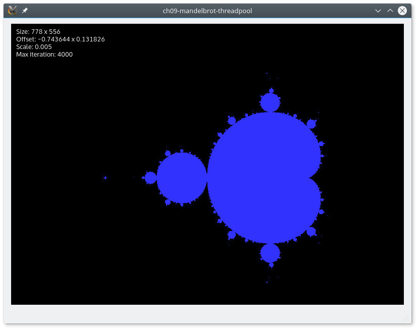
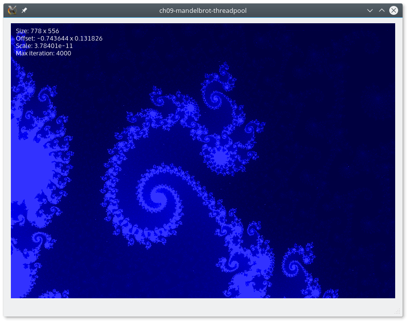

# MandelbrotWidgetでフラクタルを表示する

マンデルブロアルゴリズムが完了し、マルチスレッドシステムがすべてのCPUコアにわたって複雑なフラクタルを計算する準備が整いました。これで、すべての JobResult を変換してきれいな画像を表示するウィジェットを作成することができます。MandelbrotWidgetという新しいC++クラスを作成します。このウィジェットでは、自分たちで描画を行います。そのため、.uiQt Designer Formファイルは必要ありません。まずはMandelbrotWidget.hファイルから始めてみましょう。

```C++
#include <memory>
#include <QWidget>
#include <QPoint>
#include <QThread>
#include <QList>

#include "MandelbrotCalculator.h"

class QResizeEvent;

class MandelbrotWidget : public QWidget
{
    Q_OBJECT

public:
    explicit MandelbrotWidget(QWidget *parent = 0);
    ~MandelbrotWidget();

private:
    MandelbrotCalculator mMandelbrotCalculator;
    QThread mThreadCalculator;
    double mScaleFactor;
    QPoint mLastMouseMovePosition;
    QPointF mMoveOffset;
    QSize mAreaSize;
    int mIterationMax;
    std::unique_ptr<QImage> mImage;
};
```

mScaleFactor、mMoveOffset、mAreaSize、またはmIterationMaxのような既知の変数名を認識する必要があります。これらは既にJobResultとJobの実装でカバーしています。ここに新しいものがあります。

* mMandelbrotCalculator変数はマルチスレッドJobマネージャです。ウィジェットはそれにリクエストを行い、結果を待ちます。
* mThreadCalculator変数は、マンデルブロ計算機が自分のスレッドで実行できるようにします。
* mLastMouseMovePosition 変数は、パン機能のユーザイベントを処理するためにウィジェットで使用されます。
* mImage変数はウィジェットに表示される現在の画像です。これは unique_ptr ポインタなので、MandelbrotWidget が mImage の所有者です。

これで関数を追加することができます。このようにコードを更新してください。

```C++
class MandelbrotWidget : public QWidget
{
    ...

public slots:
    void processJobResults(QList<JobResult> jobResults);

signals:
    void requestPicture(QSize areaSize, QPointF moveOffset, double
        scaleFactor, int iterationMax);

protected:
    void paintEvent(QPaintEvent*) override;
    void resizeEvent(QResizeEvent* event) override;
    void wheelEvent(QWheelEvent* event) override;
    void mousePressEvent(QMouseEvent* event) override;
    void mouseMoveEvent(QMouseEvent* event) override;

private:
    QRgb generateColorFromIteration(int iteration);

private:
    ...
};
```

実装に飛び込む前に、これらの関数について説明しましょう。

* processJobResults() 関数は、MandelbrotCalculator によってディスパッチされた JobResult リストを処理します。
* requestPicture()シグナルは、ユーザが入力データ(オフセット、スケール、またはエリアサイズ)を変更するたびに発行されます。
* paintEvent()関数は、現在のmImageでウィジェットを描画します。
* resizeEvent()関数は、ユーザがウィンドウのサイズを変更したときにマンデルブロ領域のサイズを変更します。
* wheelEvent()関数は、スケールファクタを適用するためにユーザのマウスホイールイベントを処理します。
* mousePressEvent()関数とmouseMoveEvent()関数は、マンデルブロ画像を移動させるためのユーザマウスイベントを取得します。
* generateColorFromIteration()関数は、マンデルブロ画像に色をつけるためのヘルパー関数です。ピクセル単位の反復値を色値に変換します。

これでMandelbrotWidgetクラスを実装できるようになりました。以下はMandelbrotWidget.cppファイルの冒頭です。

```C++
#include "MandelbrotWidget.h"

#include <QResizeEvent>
#include <QImage>
#include <QPainter>
#include <QtMath>

const int ITERATION_MAX = 4000;
const double DEFAULT_SCALE = 0.005;
const double DEFAULT_OFFSET_X = -0.74364390249094747;
const double DEFAULT_OFFSET_Y = 0.13182589977450967;

MandelbrotWidget::MandelbrotWidget(QWidget *parent) :
    QWidget(parent),
    mMandelbrotCalculator(),
    mThreadCalculator(this),
    mScaleFactor(DEFAULT_SCALE),
    mLastMouseMovePosition(),
    mMoveOffset(DEFAULT_OFFSET_X, DEFAULT_OFFSET_Y),
    mAreaSize(),
    mIterationMax(ITERATION_MAX)
{
    mMandelbrotCalculator.moveToThread(&mThreadCalculator);

    connect(this, &MandelbrotWidget::requestPicture,
        &mMandelbrotCalculator,
        &MandelbrotCalculator::generatePicture);

    connect(&mMandelbrotCalculator,
        &MandelbrotCalculator::pictureLinesGenerated,
        this, &MandelbrotWidget::processJobResults);

    mThreadCalculator.start();
}
```

スニペットの先頭には、いくつかの定数のデフォルト値を設定しています。アプリケーションを起動したときに別のビューを表示したい場合は、これらの値を自由に微調整してください。コンストラクタが最初に行うことは、mMandelbrotCalculator クラスのスレッドの親和性を変更することです。これにより、電卓で実行される処理（ジョブの作成と開始、ジョブ結果の集計、ジョブのクリア）はUIスレッドを邪魔しません。次に、MandelbrotCalculatorのシグナルとスロットとの接続を行います。ウィジェットと電卓はスレッドの親和性が違うので、接続は自動的にQt::QueuedConnectionのスロットになります。最後に、mThreadCalculatorのスレッドを起動します。これでデストラクタを追加することができます。

```C++
MandelbrotWidget::~MandelbrotWidget()
{
    mThreadCalculator.quit();
    mThreadCalculator.wait(1000);
    if (!mThreadCalculator.isFinished()) {
        mThreadCalculator.terminate();
    }
}
```

電卓スレッドに終了を要求する必要があります。計算機スレッドのイベントループがリクエストを処理すると、スレッドはコード 0 を返します。スレッドが終了するまで1,000ミリ秒待ちます。新しい画像を要求するすべてのケースでこの実装を続けることができます。ここに resizeEvent() スロットがあります。

```C++
void MandelbrotWidget::resizeEvent(QResizeEvent* event)
{
    mAreaSize = event->size();

    mImage = std::make_unique<QImage>(mAreaSize,
    QImage::Format_RGB32);
    mImage->fill(Qt::black);

    emit requestPicture(mAreaSize, mMoveOffset, mScaleFactor,
        mIterationMax);
}
```

新しいウィジェットサイズで mAreaSize を更新します。そして、新しい黒いQImageを正しい寸法で作成します。最後に、MandelbrotCalculatorに画像の計算を要求します。マウスホイールの処理を見てみましょう。

```C++
void MandelbrotWidget::wheelEvent(QWheelEvent* event)
{
    int delta = event->delta();
    mScaleFactor *= qPow(0.75, delta / 120.0);
    emit requestPicture(mAreaSize, mMoveOffset, mScaleFactor,
        mIterationMax);
}
```

マウスホイールの値はQWheelEvent::delta()から取得できます。パワー関数を使用してmScaleFactorにコヒーレント値を適用し、更新された画像を要求しています。これでパン機能を実装できるようになりました。

```C++
void MandelbrotWidget::mousePressEvent(QMouseEvent* event)
{
    if (event->buttons() & Qt::LeftButton) {
        mLastMouseMovePosition = event->pos();
    }
}
```

最初の関数は、ユーザーが移動ジェスチャーを開始したマウスの位置を格納します。そして次の関数は、mLastMouseMovePositionを使用してオフセットを作成します。

```C++
void MandelbrotWidget::mouseMoveEvent(QMouseEvent* event)
{
    if (event->buttons() & Qt::LeftButton) {
        QPointF offset = event->pos() - mLastMouseMovePosition;
        mLastMouseMovePosition = event->pos();
        offset.setY(-offset.y());
        mMoveOffset += offset * mScaleFactor;
        emit requestPicture(mAreaSize, mMoveOffset, mScaleFactor,
            mIterationMax);
    }
}
```

新しいマウス位置と古いマウス位置の差からパンオフセットが得られます。マンデルブロ・アルゴリズムが左下参照に依存しているのに対し、マウスイベントは左上参照にあるため、y軸の値を反転させていることに注意してください。最後に、更新された入力値を持つ画像を要求します。ここまでで、requestPicture() シグナルを発するユーザイベントをすべて取り上げました。ここでは、MandelbrotCalculatorによってディスパッチされたJobResultをどのように扱うかを見てみましょう。

```C++
void MandelbrotWidget::processJobResults(QList<JobResult> jobResults)
{
    int yMin = height();
    int yMax = 0;

    for(JobResult& jobResult : jobResults) {

        if (mImage->size() != jobResult.areaSize) {
            continue;
        }

        int y = jobResult.pixelPositionY;
        QRgb* scanLine =
            reinterpret_cast<QRgb*>(mImage->scanLine(y));

        for (int x = 0; x < mAreaSize.width(); ++x) {
            scanLine[x] =
                generateColorFromIteration(jobResult.values[x]);
        }

        if (y < yMin) {
            yMin = y;
        }

        if (y > yMax) {
            yMax = y;
        }
    }

    repaint(0, yMin,
        width(), yMax);
}
```

計算機は、JobResultのQListを送ってきます。それぞれについて、該当する領域サイズがまだ有効かどうかをチェックする必要があります。mImageのピクセルカラーを直接更新します。scanLine() 関数は、ピクセルデータ上のポインタを返します。これは、QImage のピクセルカラーを高速に更新する方法です。JobResult関数には反復回数が含まれており、ヘルパー関数のgenerateColorFromIteration()は反復回数に応じてRGB値を返します。QImageの数行を更新するだけなので、ウィジェットの完全な再描画は必要ありません。したがって、更新された領域のみを再描画します。

ここでは、反復値をRGB値に変換する方法を説明します。

```C++
QRgb MandelbrotWidget::generateColorFromIteration(int iteration)
{
    if (iteration == mIterationMax) {
        return qRgb(50, 50, 255);
    }

    return qRgb(0, 0, (255.0 * iteration / mIterationMax));
}
```

マンデルブロを着色することは、それ自体が芸術です。ここでは青チャンネルの単純な線形補間を実装しています。素敵なマンデルブロ画像は、ピクセルごとの最大反復とその色のテクニックに依存します。あなたが望むようにそれを強化するために自由に感じてください

ここで、最後になりますが、最後の関数、paintEvent()です。

```C++
void MandelbrotWidget::paintEvent(QPaintEvent* event)
{
    QPainter painter(this);
    painter.save();

    QRect imageRect = event->region().boundingRect();
    painter.drawImage(imageRect, *mImage, imageRect);

    painter.setPen(Qt::white);

    painter.drawText(10, 20, QString("Size: %1 x %2")
        .arg(mImage->width())
        .arg(mImage->height()));

    painter.drawText(10, 35, QString("Offset: %1 x %2")
        .arg(mMoveOffset.x())
        .arg(mMoveOffset.y()));

    painter.drawText(10, 50, QString("Scale: %1")
        .arg(mScaleFactor));

    painter.drawText(10, 65, QString("Max iteration: %1")
        .arg(ITERATION_MAX));

    painter.restore();
}
```

ウィジェットの描画は自分たちで処理するので、この関数をオーバーライドする必要があります。まず、画像の更新された領域を描画します。QPaintEventオブジェクトには、更新する必要のある領域が含まれています。QPainterクラスを使えば簡単に描画できます。最後に、現在の入力データの情報テキストをいくつか白で描画します。これでプログレッシブピクチャ表示の一行一行の概要がわかりましたね。この機能のワークフローをまとめてみましょう。

1. 各 Job::run() は JobResult オブジェクトを生成します。
2. MandelbrotCalculator::process()シグナルは、JobResultオブジェクトを集約し、グループごとにディスパッチします(デフォルトでは10)。
3. MandelbrotWidget::processJobResults()シグナルは、画像の該当行のみを更新し、ウィジェットの部分的な再描画を要求します。
4. MandelbrotWidget::paintEvent()シグナルは、新しい値でピクチャを再描画します。

この機能は多少のオーバーヘッドを引き起こしますが、ユーザーエクスペリエンスはよりスムーズです。実際、アプリケーションはユーザーのイベントに素早く反応します。最初の行はほぼすぐに更新されます。ユーザーは何かが起こっているのを見るために、フルピクチャーの生成を待つ必要はありません。

ウィジェットの準備ができましたので、忘れずに MainWindow に追加してください。これで、カスタム ウィジェットのプロモーションは簡単にできるようになりました。不明な点があれば、第 4 章「デスクトップ UI の克服」またはこの章の完全なソース コードを参照してください。これで、マルチスレッドのマンデルブロセットを表示したり、ナビゲートしたりできるようになりました。

アプリケーションを起動すると、このようなものが表示されるはずです。



今すぐズームして、マンデルブロのセットにパンしてみてください。このような面白い場所を見つけることができるはずです。



***

まとめ

QThread クラスがどのように動作するかを発見し、Qt が提供するツールを効率的に使用して強力なマルチスレッドアプリケーションを作成する方法を学びました。あなたのマンデルブロ・アプリケーションは、CPU のすべてのコアを使用して画像を素早く計算することができます。

マルチスレッドアプリケーションを作成すると、多くの落とし穴（デッドロック、イベントループの洪水、孤児スレッド、オーバーヘッドなど）があります。アプリケーションのアーキテクチャが重要です。並列化したい重いコードを分離できれば、すべてがうまくいくはずです。それにもかかわらず、ユーザーエクスペリエンスが第一に重要です。もしあなたのアプリケーションがユーザーによりスムーズな感覚を与えるのであれば、多少のオーバーヘッドを受け入れなければならないこともあるでしょう。

次の章では、アプリケーション間のIPC(プロセス間通信)を実装するいくつかの方法を見ていきます。このプロジェクトの例では、現在のマンデルブロ・アプリケーションをTCP/IPソケットシステムで強化します。これにより、マンデルブロ・ジェネレーターは、複数のコンピュータから複数のCPUコアを使って画像を計算することができます。

***

**[戻る](../index.html)**
