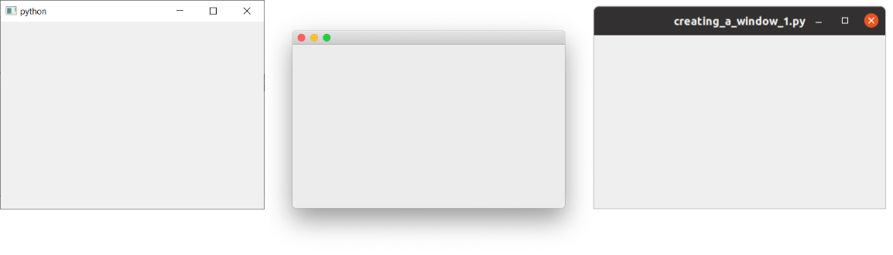
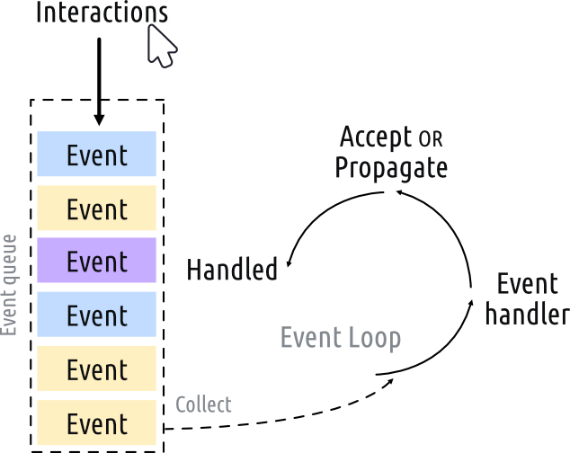
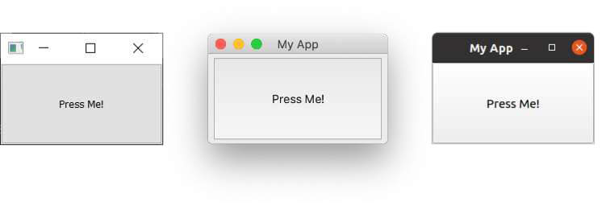
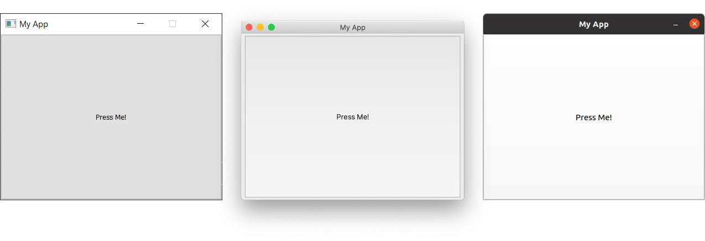

# PySide6の基本機能

PySide6でGUIアプリケーションを作成する第一歩を踏み出す時が来ました！

この章では、作成するアプリケーションの基礎となるPySide6の基本を紹介します。デスクトップ上でシンプルなウィンドウアプリケーションを開発します。ウィジェットを追加し、レイアウトを使って配置し、これらのウィジェットを関数に接続することで、GUIからアプリケーションの動作をトリガーできるようにします。

提供されているコードをガイドとして使いますが、いつでも自由に実験してください。それが物事の仕組みを学ぶ最善の方法です。

## 5. 初めてのアプリケーション

最初のアプリケーションを作ってみましょう！好きな名前（例えば myapp.py）をつけて、アクセスしやすい場所に保存してください。このファイルに簡単なアプリケーションを書きます。

> 作業を進めながらこのファイル内で編集を行っていきますが、以前のバージョンのコードに戻らなければならない場合もあるため、定期的にバックアップを取っておくようにしてください。

### アプリの作成

最初のアプリケーションのソース コードを以下に示します。そのまま入力し、間違いがないように注意してください。間違えた場合は、Python がどこが間違っているかを知らせてくれます。すべてを入力するのが面倒な場合は、この本のソース コードにファイルが含まれています。

***Listing 3. basic/creating_a_window_1.py***

```python
from PySide6.QtWidgets import QApplication, QWidget

# コマンドライン引数へのアクセスにのみ必要
import sys

# アプリケーションごとに 1 つの (そして 1 つのみの) QApplication インスタンスが必要です。
# sys.argv を渡して、アプリのコマンド ライン引数を許可します。
# コマンド ライン引数を使用しないことがわかっている場合は、QApplication([]) も機能します。
app = QApplication(sys.argv)

# ウィンドウとなる Qt ウィジェットを作成します。
window = QWidget()
window.show() # 重要!!!!! ウィンドウはデフォルトで非表示になっています。

# イベント ループを開始します。
app.exec()

# アプリケーションが終了し、イベント ループが停止するまで、アプリケーションはここに到達しません。
```

まず、アプリケーションを起動します。他の Python スクリプトと同様に、コマンドラインから実行できます。たとえば、

```bash
python MyApp.py
```

あるいは、Python 3の場合

```bash
python3 MyApp.py
```

これからは、アプリケーションを実行してテストするためのヒントと、表示される内容を示す次のボックスが表示されます。

* 実行してください。ウィンドウが表示されます。Qt は通常のウィンドウ装飾を備えたウィンドウを自動的に作成し、他のウィンドウと同様にドラッグしてサイズを変更できます。

表示される内容は、この例を実行しているプラ​​ットフォームによって異なります。
下の画像は、Windows、macOS、Linux (Ubuntu) で表示されるウィンドウを示しています。



### コードをステップ実行する

何が起こっているのかを正確に理解するために、コードを 1 行ずつ確認してみましょう。

まず、アプリケーションに必要な PySide6 クラスをインポートします。ここでは、アプリケーション ハンドラーである QApplication と、基本的な空の GUI ウィジェットである QWidget を、どちらも QtWidgets モジュールからインポートしています。

```python
from PySide6.QtWidgets import QApplication, QWidget
```

Qt の主なモジュールは、QtWidgets、QtGui、QtCore です。

> from \<module\> import * とすることもできますが、この種のグローバルインポートは Python では一般的に好ましくないため、ここでは避けます。

次に、アプリケーションに渡されるコマンドライン引数を含む Python リストである sys.arg を渡して、QApplication のインスタンスを作成します。

```python
app = QApplication(sys.argv)
```

Qt を制御するためにコマンドライン引数を使用しないことが分かっている場合は、代わりに空のリストを渡すことができます。例:

```python
app = QApplication([])
```

次に、変数名 window を使用して QWidget のインスタンスを作成します。

```python
window = QWidget()
window.show()
```

Qt では、トップレベルのウィジェットはすべてウィンドウです。つまり、親を持たず、別のウィジェットやレイアウト内にネストされていません。つまり、技術的には好きなウィジェットを使用してウィンドウを作成できます。

> ウィンドウが表示されません!
>
> 親のないウィジェットは、デフォルトでは表示されません。そのため、ウィンドウ オブジェクトを作成した後は、常に .show() を呼び出して表示する必要があります。.show() を削除してアプリを実行することはできますが、終了する方法はありません。
>
> ウィンドウとは何ですか?
>
> • アプリケーションのユーザー インターフェースを保持します
> • すべてのアプリケーションには少なくとも 1 つのウィンドウが必要です (…ただし、それ以上のウィンドウも使用できます)
> • 最後のウィンドウが閉じられると、アプリケーションは (デフォルトで) 終了します

最後に、app.exec() を呼び出してイベント ループを開始します。

### イベントループとは何ですか?

画面にウィンドウを表示する前に、Qt の世界でアプリケーションがどのように構成されているかについて、いくつかの重要な概念を紹介します。イベント ループについてすでによく知っている場合は、次のセクションに進んでも問題ありません。

すべての Qt アプリケーションの中核となるのは QApplication クラスです。すべてのアプリケーションが機能するには、1 つの QApplication オブジェクトだけが必要です。このオブジェクトは、アプリケーションのイベント ループ (GUI とのすべてのユーザー インタラクションを制御するコア ループ) を保持します。



アプリケーションとの各インタラクション (キーの押下、マウスのクリック、マウスの移動など) により、イベント キューに配置されるイベントが生成されます。イベント ループでは、各反復でキューがチェックされ、待機中のイベントが見つかった場合は、イベントと制御がそのイベントの特定のイベント ハンドラーに渡されます。イベント ハンドラーはイベントを処理し、その後、イベント ループに制御を戻して、さらにイベントを待機します。実行中のイベント ループは、アプリケーションごとに 1 つだけです。

> QApplication クラス
>
> • QApplication は Qt イベント ループを保持します
> • 1 つの QApplication インスタンスが必要です
> • アプリケーションは、アクションが実行されるまでイベント ループ内で待機します
> • 一度に 1 つのイベント ループのみ存在します

アンダースコアがあるのは、exec が Python 2.7 で予約語だったためです。PySide6 は、C++ ライブラリで使用される名前にアンダースコアを追加することでこれを処理します。
たとえば、ウィジェットに .print_() メソッドがあります。

#### QMainWindow

前回説明したように、Qt ではどのウィジェットもウィンドウにすることができます。たとえば、QtWidget を QPushButton に置き換えます。以下の例では、1 つのプッシュ可能なボタンを含むウィンドウが作成されます。

```python
import sys

from PySide6.QtWidgets import QApplication, QPushButton

app = QApplication(sys.argv)

window = QPushButton("Push Me")
window.show()

app.exec()
```

これは便利ですが、実際にはあまり役に立ちません。単一のコントロールのみで構成される UI が必要になることはまれです。ただし、後で説明するように、レイアウトを使用してウィジェットを他のウィジェット内にネストする機能により、空の QWidget 内に複雑な UI を構築できます。

しかし、Qt にはすでに QMainWindow というソリューションがあります。これは、ツールバー、メニュー、ステータスバー、ドッキング可能なウィジェットなど、アプリで使用できる多くの標準的なウィンドウ機能を提供する既製のウィジェットです。
これらの高度な機能については後で説明しますが、今は、単純な空の QMainWindow をアプリケーションに追加します。

```python
from PySide6.QtWidgets import QApplication, QMainWindow

import sys

app = QApplication(sys.argv)

window = QMainWindow()
window.show() # IMPORTANT!!!!! Windows are hidden by default.

# Start the event loop.
app.exec()
```

* 実行してください。メイン ウィンドウが表示されます。見た目は前とまったく同じです。

したがって、QMainWindow は現時点ではあまり興味深いものではありません。コンテンツを追加することでこれを修正できます。カスタム ウィンドウを作成する場合、最適な方法は QMainWindow をサブクラス化し、ウィンドウのセットアップを \_\_init\_\_ ブロックに含めることです。これにより、ウィンドウの動作が自己完結的になります。QMainWindow の独自のサブクラスを追加できます。シンプルにするために MainWindow と呼びます。

```python
import sys

from PySide6.QtCore import QSize, Qt
from PySide6.QtWidgets import QApplication, QMainWindow, QPushButton
①

# Subclass QMainWindow to customize your application's main window
class MainWindow(QMainWindow):
    def __init__(self):
        super().__init__() ②
        self.setWindowTitle("My App")
        button = QPushButton("Press Me!")
        # Set the central widget of the Window.
        self.setCentralWidget(button) ③

app = QApplication(sys.argv)

window = MainWindow()
window.show()

app.exec()
```

① 一般的な Qt ウィジェットは常に QtWidgets 名前空間からインポートされます。
② super() クラスの __init__ メソッドを常に呼び出す必要があります。
③ .setCentralWidget を使用して QMainWindow にウィジェットを配置します。

> Qt クラスをサブクラス化する場合、Qt がオブジェクトを設定できるように、常にスーパー \_\_init\_\_ 関数を呼び出す必要があります。

\_\_init\_\_ ブロックでは、まず .setWindowTitle() を使用してメイン ウィンドウのタイトルを変更します。次に、最初のウィジェットである QPushButton をウィンドウの中央に追加します。これは、Qt で使用できる基本ウィジェットの 1 つです。ボタンを作成するときに、ボタンに表示するテキストを渡すことができます。

最後に、ウィンドウで .setCentralWidget() を呼び出します。これは、ウィンドウの中央に配置されるウィジェットを設定できる QMainWindow 固有の関数です。

* 実行してください。ウィンドウが再び表示されますが、今回は QPushButton ウィジェットが中央に表示されます。ボタンを押しても何も起こりません。次にそれをソートします。



> ウィジェットが欲しくなりましたか?
>
> ウィジェットについては後ほど詳しく説明しますが、待ちきれなくて先に進みたい場合は、QWidget のドキュメントをご覧ください。さまざまなウィジェットをウィンドウに追加してみてください。

### ウィンドウとウィジェットのサイズ設定

ウィンドウは現在、自由にサイズを変更できます。マウスで任意のコーナーをつかんでドラッグし、任意のサイズに変更できます。ユーザーがアプリケーションのサイズを変更できるようにすることは良いことですが、最小サイズや最大サイズに制限を設けたり、ウィンドウを固定サイズにロックしたりする必要がある場合もあります。

Qt では、サイズは QSize オブジェクトを使用して定義されます。これは、幅と高さのパラメータをこの順序で受け入れます。たとえば、次の例では、400 x 300 ピクセルの固定サイズのウィンドウが作成されます。

```python
import sys

from PySide6.QtCore import QSize, Qt
from PySide6.QtWidgets import QApplication, QMainWindow, QPushButton

# Subclass QMainWindow to customize your application's main window
class MainWindow(QMainWindow):
    def __init__(self):
        super().__init__()
        self.setWindowTitle("My App")
        button = QPushButton("Press Me!")
        self.setFixedSize(QSize(400, 300)) ①
        # Set the central widget of the Window.
        self.setCentralWidget(button)

app = QApplication(sys.argv)

window = MainWindow()
window.show()

app.exec()
```

①ウィンドウのサイズを設定します。

* 実行してください。固定サイズのウィンドウが表示されます。サイズを変更してみてください。機能しません。



.setFixedSize() だけでなく、.setMinimumSize() と .setMaximumSize() を呼び出して、それぞれ最小サイズと最大サイズを設定することもできます。
ぜひ自分で試してみてください。

> これらのサイズ メソッドはどのウィジェットでも使用できます。

このセクションでは、QApplication クラス、QMainWindow クラス、イベント ループについて説明し、ウィンドウに簡単なウィジェットを追加する実験を行いました。次のセクションでは、ウィジェットとウィンドウが相互に、また独自のコードと通信するために Qt が提供するメカニズムについて説明します。

> 後で必要になるので、ファイルのコピーを myapp.py として保存します。

## 6. シグナルとスロット

