# PySide6の基本機能

PySide6でGUIアプリケーションを作成する第一歩を踏み出す時が来ました！

この章では、作成するアプリケーションの基礎となるPySide6の基本を紹介します。デスクトップ上でシンプルなウィンドウアプリケーションを開発します。ウィジェットを追加し、レイアウトを使って配置し、これらのウィジェットを関数に接続することで、GUIからアプリケーションの動作をトリガーできるようにします。

提供されているコードをガイドとして使いますが、いつでも自由に実験してください。それが物事の仕組みを学ぶ最善の方法です。

## 5. 初めてのアプリケーション

最初のアプリケーションを作ってみましょう！好きな名前（例えば myapp.py）をつけて、アクセスしやすい場所に保存してください。このファイルに簡単なアプリケーションを書きます。

> 作業を進めながらこのファイル内で編集を行っていきますが、以前のバージョンのコードに戻らなければならない場合もあるため、定期的にバックアップを取っておくようにしてください。

### アプリの作成

最初のアプリケーションのソース コードを以下に示します。そのまま入力し、間違いがないように注意してください。間違えた場合は、Python がどこが間違っているかを知らせてくれます。すべてを入力するのが面倒な場合は、この本のソース コードにファイルが含まれています。

***Listing 3. basic/creating_a_window_1.py***

```python
from PySide6.QtWidgets import QApplication, QWidget

# コマンドライン引数へのアクセスにのみ必要
import sys

# アプリケーションごとに 1 つの (そして 1 つのみの) QApplication インスタンスが必要です。
# sys.argv を渡して、アプリのコマンド ライン引数を許可します。
# コマンド ライン引数を使用しないことがわかっている場合は、QApplication([]) も機能します。
app = QApplication(sys.argv)

# ウィンドウとなる Qt ウィジェットを作成します。
window = QWidget()
window.show() # 重要!!!!! ウィンドウはデフォルトで非表示になっています。

# イベント ループを開始します。
app.exec()

# アプリケーションが終了し、イベント ループが停止するまで、アプリケーションはここに到達しません。
```

まず、アプリケーションを起動します。他の Python スクリプトと同様に、コマンドラインから実行できます。たとえば、

```bash
python MyApp.py
```

あるいは、Python 3の場合

```bash
python3 MyApp.py
```

これからは、アプリケーションを実行してテストするためのヒントと、表示される内容を示す次のボックスが表示されます。

* 実行してください。ウィンドウが表示されます。Qt は通常のウィンドウ装飾を備えたウィンドウを自動的に作成し、他のウィンドウと同様にドラッグしてサイズを変更できます。

表示される内容は、この例を実行しているプラ​​ットフォームによって異なります。
下の画像は、Windows、macOS、Linux (Ubuntu) で表示されるウィンドウを示しています。


### コードをステップ実行する

何が起こっているのかを正確に理解するために、コードを 1 行ずつ確認してみましょう。

まず、アプリケーションに必要な PySide6 クラスをインポートします。ここでは、アプリケーション ハンドラーである QApplication と、基本的な空の GUI ウィジェットである QWidget を、どちらも QtWidgets モジュールからインポートしています。

```python
from PySide6.QtWidgets import QApplication, QWidget
```

Qt の主なモジュールは、QtWidgets、QtGui、QtCore です。

> from \<module\> import * とすることもできますが、この種のグローバルインポートは Python では一般的に好ましくないため、ここでは避けます。

次に、アプリケーションに渡されるコマンドライン引数を含む Python リストである sys.arg を渡して、QApplication のインスタンスを作成します。

```python
app = QApplication(sys.argv)
```

Qt を制御するためにコマンドライン引数を使用しないことが分かっている場合は、代わりに空のリストを渡すことができます。例:

```python
app = QApplication([])
```

次に、変数名 window を使用して QWidget のインスタンスを作成します。

```python
window = QWidget()
window.show()
```

Qt では、トップレベルのウィジェットはすべてウィンドウです。つまり、親を持たず、別のウィジェットやレイアウト内にネストされていません。つまり、技術的には好きなウィジェットを使用してウィンドウを作成できます。

> ウィンドウが表示されません!
>
> 親のないウィジェットは、デフォルトでは表示されません。そのため、ウィンドウ オブジェクトを作成した後は、常に .show() を呼び出して表示する必要があります。.show() を削除してアプリを実行することはできますが、終了する方法はありません。
>
> ウィンドウとは何ですか?
>
> • アプリケーションのユーザー インターフェースを保持します
> • すべてのアプリケーションには少なくとも 1 つのウィンドウが必要です (…ただし、それ以上のウィンドウも使用できます)
> • 最後のウィンドウが閉じられると、アプリケーションは (デフォルトで) 終了します

最後に、app.exec() を呼び出してイベント ループを開始します。

### イベントループとは何ですか?

画面にウィンドウを表示する前に、Qt の世界でアプリケーションがどのように構成されているかについて、いくつかの重要な概念を紹介します。イベント ループについてすでによく知っている場合は、次のセクションに進んでも問題ありません。

すべての Qt アプリケーションの中核となるのは QApplication クラスです。すべてのアプリケーションが機能するには、1 つの QApplication オブジェクトだけが必要です。このオブジェクトは、アプリケーションのイベント ループ (GUI とのすべてのユーザー インタラクションを制御するコア ループ) を保持します。


アプリケーションとの各インタラクション (キーの押下、マウスのクリック、マウスの移動など) により、イベント キューに配置されるイベントが生成されます。イベント ループでは、各反復でキューがチェックされ、待機中のイベントが見つかった場合は、イベントと制御がそのイベントの特定のイベント ハンドラーに渡されます。イベント ハンドラーはイベントを処理し、その後、イベント ループに制御を戻して、さらにイベントを待機します。実行中のイベント ループは、アプリケーションごとに 1 つだけです。

> QApplication クラス
>
> • QApplication は Qt イベント ループを保持します
> • 1 つの QApplication インスタンスが必要です
> • アプリケーションは、アクションが実行されるまでイベント ループ内で待機します
> • 一度に 1 つのイベント ループのみ存在します

アンダースコアがあるのは、exec が Python 2.7 で予約語だったためです。PySide6 は、C++ ライブラリで使用される名前にアンダースコアを追加することでこれを処理します。
たとえば、ウィジェットに .print_() メソッドがあります。

#### QMainWindow

前回説明したように、Qt ではどのウィジェットもウィンドウにすることができます。たとえば、QtWidget を QPushButton に置き換えます。以下の例では、1 つのプッシュ可能なボタンを含むウィンドウが作成されます。

```python
import sys

from PySide6.QtWidgets import QApplication, QPushButton

app = QApplication(sys.argv)

window = QPushButton("Push Me")
window.show()

app.exec()
```

これは便利ですが、実際にはあまり役に立ちません。単一のコントロールのみで構成される UI が必要になることはまれです。ただし、後で説明するように、レイアウトを使用してウィジェットを他のウィジェット内にネストする機能により、空の QWidget 内に複雑な UI を構築できます。

しかし、Qt にはすでに QMainWindow というソリューションがあります。これは、ツールバー、メニュー、ステータスバー、ドッキング可能なウィジェットなど、アプリで使用できる多くの標準的なウィンドウ機能を提供する既製のウィジェットです。
これらの高度な機能については後で説明しますが、今は、単純な空の QMainWindow をアプリケーションに追加します。

```python
from PySide6.QtWidgets import QApplication, QMainWindow

import sys

app = QApplication(sys.argv)

window = QMainWindow()
window.show() # IMPORTANT!!!!! Windows are hidden by default.

# Start the event loop.
app.exec()
```

* 実行してください。メイン ウィンドウが表示されます。見た目は前とまったく同じです。

したがって、QMainWindow は現時点ではあまり興味深いものではありません。コンテンツを追加することでこれを修正できます。カスタム ウィンドウを作成する場合、最適な方法は QMainWindow をサブクラス化し、ウィンドウのセットアップを \_\_init\_\_ ブロックに含めることです。これにより、ウィンドウの動作が自己完結的になります。QMainWindow の独自のサブクラスを追加できます。シンプルにするために MainWindow と呼びます。

```python
import sys

from PySide6.QtCore import QSize, Qt
from PySide6.QtWidgets import QApplication, QMainWindow, QPushButton
①

# Subclass QMainWindow to customize your application's main window
class MainWindow(QMainWindow):
    def __init__(self):
        super().__init__() ②
        self.setWindowTitle("My App")
        button = QPushButton("Press Me!")
        # Set the central widget of the Window.
        self.setCentralWidget(button) ③

app = QApplication(sys.argv)

window = MainWindow()
window.show()

app.exec()
```

① 一般的な Qt ウィジェットは常に QtWidgets 名前空間からインポートされます。
② super() クラスの __init__ メソッドを常に呼び出す必要があります。
③ .setCentralWidget を使用して QMainWindow にウィジェットを配置します。

> Qt クラスをサブクラス化する場合、Qt がオブジェクトを設定できるように、常にスーパー \_\_init\_\_ 関数を呼び出す必要があります。

\_\_init\_\_ ブロックでは、まず .setWindowTitle() を使用してメイン ウィンドウのタイトルを変更します。次に、最初のウィジェットである QPushButton をウィンドウの中央に追加します。これは、Qt で使用できる基本ウィジェットの 1 つです。ボタンを作成するときに、ボタンに表示するテキストを渡すことができます。

最後に、ウィンドウで .setCentralWidget() を呼び出します。これは、ウィンドウの中央に配置されるウィジェットを設定できる QMainWindow 固有の関数です。

* 実行してください。ウィンドウが再び表示されますが、今回は QPushButton ウィジェットが中央に表示されます。ボタンを押しても何も起こりません。次にそれをソートします。


> ウィジェットが欲しくなりましたか?
>
> ウィジェットについては後ほど詳しく説明しますが、待ちきれなくて先に進みたい場合は、QWidget のドキュメントをご覧ください。さまざまなウィジェットをウィンドウに追加してみてください。

### ウィンドウとウィジェットのサイズ設定

ウィンドウは現在、自由にサイズを変更できます。マウスで任意のコーナーをつかんでドラッグし、任意のサイズに変更できます。ユーザーがアプリケーションのサイズを変更できるようにすることは良いことですが、最小サイズや最大サイズに制限を設けたり、ウィンドウを固定サイズにロックしたりする必要がある場合もあります。

Qt では、サイズは QSize オブジェクトを使用して定義されます。これは、幅と高さのパラメータをこの順序で受け入れます。たとえば、次の例では、400 x 300 ピクセルの固定サイズのウィンドウが作成されます。

```python
import sys

from PySide6.QtCore import QSize, Qt
from PySide6.QtWidgets import QApplication, QMainWindow, QPushButton

# Subclass QMainWindow to customize your application's main window
class MainWindow(QMainWindow):
    def __init__(self):
        super().__init__()
        self.setWindowTitle("My App")
        button = QPushButton("Press Me!")
        self.setFixedSize(QSize(400, 300)) ①
        # Set the central widget of the Window.
        self.setCentralWidget(button)

app = QApplication(sys.argv)

window = MainWindow()
window.show()

app.exec()
```

①ウィンドウのサイズを設定します。

* 実行してください。固定サイズのウィンドウが表示されます。サイズを変更してみてください。機能しません。


.setFixedSize() だけでなく、.setMinimumSize() と .setMaximumSize() を呼び出して、それぞれ最小サイズと最大サイズを設定することもできます。
ぜひ自分で試してみてください。

> これらのサイズ メソッドはどのウィジェットでも使用できます。

このセクションでは、QApplication クラス、QMainWindow クラス、イベント ループについて説明し、ウィンドウに簡単なウィジェットを追加する実験を行いました。次のセクションでは、ウィジェットとウィンドウが相互に、また独自のコードと通信するために Qt が提供するメカニズムについて説明します。

> 後で必要になるので、ファイルのコピーを myapp.py として保存します。

## 6. シグナルとスロット

これまで、ウィンドウを作成し、それに簡単なプッシュ ボタン ウィジェットを追加しましたが、ボタンは何も実行しません。これではまったく役に立ちません。GUI アプリケーションを作成するときは通常、何かを実行させたいものです。必要なのは、ボタンを押すというアクションを何かの実行に結び付ける方法です。Qt では、これはシグナルとスロットによって提供されます。

シグナルは、何かが起こったときにウィジェットによって発行される通知です。その何かとは、ボタンの押下、入力ボックスのテキストの変更、ウィンドウのテキストの変更など、さまざまなことです。多くのシグナルはユーザーのアクションによって開始されますが、これはルールではありません。

何かが起こっていることを通知するだけでなく、シグナルは何が起こったかについての追加のコンテキストを提供するためのデータを送信することもできます。

> 独自のカスタム シグナルを作成することもできます。これについては、後ほど「シグナルの拡張」で説明します。

スロットは、Qt がシグナルの受信側に使用する名前です。Python では、アプリケーション内の任意の関数 (またはメソッド) をスロットとして使用できます。シグナルを接続するだけです。シグナルがデータを送信すると、受信関数もそのデータを受信します。多くの Qt ウィジェットには独自の組み込みスロットがあり、Qt ウィジェットを直接接続できます。

Qt シグナルの基本と、それを使用してウィジェットを接続し、アプリ内でさまざまなことを実現する方法を見てみましょう。

> myapp.py の新しいコピーを読み込み、このセクション用に新しい名前で保存します。

### QPushButton シグナル

このシンプルなアプリケーションには現在、中央のウィジェットとして QPushButton が設定された QMainWindow があります。まず、このボタンをカスタム Python メソッドに接続してみましょう。
ここでは、QPushButton からのクリックシグナルを受け入れる the_button_was_clicked というシンプルなカスタム スロットを作成します。

```python
from PySide6.QtWidgets import QApplication, QMainWindow, QPushButton
①

import sys

class MainWindow(QMainWindow):
    def __init__(self):
        super().__init__() ②

        self.setWindowTitle("My App")

        button = QPushButton("Press Me!")
        button.setCheckable(True)
        button.clicked.connect(self.the_button_was_clicked)

        # Set the central widget of the Window.
        self.setCentralWidget(button)

    def the_button_was_clicked(self):
        print("Clicked!")

app = QApplication(sys.argv)

window = MainWindow()
window.show()

app.exec()
```

* 実行してください。ボタンをクリックすると、コンソールに「Clicked!」というテキストが表示されます。

```bash
Clicked!
Clicked!
Clicked!
Clicked!
```

#### データの受信

良いスタートですね！シグナルは、何が起こったかについての詳細情報を提供するためのデータを送信することもできるとすでに説明しました。.clicked シグナルも例外ではなく、ボタンのチェック済み（またはトグル済み）状態も提供します。通常のボタンの場合、これは常に False なので、最初のスロットはこのデータを無視しました。ただし、ボタンをチェック可能にして、その効果を確認することはできます。

次の例では、チェック状態を出力する 2 番目のスロットを追加します。

```python
import sys

from PySide6.QtWidgets import QApplication, QMainWindow, QPushButton
①

class MainWindow(QMainWindow):
    def __init__(self):
        super().__init__() ②

        self.setWindowTitle("My App")

        button = QPushButton("Press Me!")
        button.setCheckable(True)
        button.clicked.connect(self.the_button_was_clicked)
        button.clicked.connect(self.the_button_was_toggled)

        # Set the central widget of the Window.
        self.setCentralWidget(button)

    def the_button_was_clicked(self):
        print("Clicked!")

    def the_button_was_toggled(self, checked):
        print("Checked?", checked)

app = QApplication(sys.argv)

window = MainWindow()
window.show()

app.exec()
```

* 実行してください。ボタンを押すと、チェック済みとしてハイライト表示されます。もう一度押すと解除されます。コンソールでチェック状態を確認してください。

```bash
Clicked!
Checked? True
Clicked!
Checked? False
Clicked!
Checked? True
Clicked!
Checked? False
Clicked!
Checked? True
```

シグナルには好きなだけスロットを接続でき、スロットで同時に異なるバージョンのシグナルに応答できます。

#### データの保存

多くの場合、ウィジェットの現在の状態を Python 変数に保存すると便利です。これにより、元のウィジェットにアクセスすることなく、他の Python 変数と同じように値を操作できます。これらの値は個別の変数として保存することも、必要に応じて辞書を使用することもできます。次の例では、ボタンのチェックされた値を self の button_is_checked という変数に保存します。

```python
class MainWindow(QMainWindow):
    def __init__(self):
        super().__init__()

        self.button_is_checked = True ①

        self.setWindowTitle("My App")

        button = QPushButton("Press Me!")
        button.setCheckable(True)
        button.clicked.connect(self.the_button_was_toggled)
        button.setChecked(self.button_is_checked) ②

        # Set the central widget of the Window.
        self.setCentralWidget(button)

    def the_button_was_toggled(self, checked):
        self.button_is_checked = checked ③

        print(self.button_is_checked)
```

① 変数のデフォルト値を設定します。
② デフォルト値を使用してウィジェットの初期状態を設定します。
③ ウィジェットの状態が変わったら、それに合わせて変数を更新します。

この同じパターンは、どの PySide6 ウィジェットでも使用できます。ウィジェットが現在の状態を送信するシグナルを提供しない場合は、ハンドラーでウィジェットから直接値を取得する必要があります。たとえば、ここでは、pressed ハンドラーでチェックされた状態をチェックしています。

```python
class MainWindow(QMainWindow):
    def __init__(self):
        super().__init__()

        self.button_is_checked = True

        self.setWindowTitle("My App")

        self.button = QPushButton("Press Me!") ①
        self.button.setCheckable(True)
        self.button.released.connect(self.the_button_was_released) ②
        self.button.setChecked(self.button_is_checked)

        # Set the central widget of the Window.
        self.setCentralWidget(self.button)

    def the_button_was_released(self):
        self.button_is_checked = self.button.isChecked() ③

        print(self.button_is_checked)
```

①ボタンへの参照を自分自身に保持して、スロット内でボタンにアクセスできるようにする必要があります。
②ボタンが離されるとリリースシグナルが発動しますが、チェック状態は送信されません。
③.isChecked() はボタンのチェック状態を返します。

#### インターフェースの変更

これまで、シグナルを受け入れてコンソールに出力する方法を見てきました。しかし、ボタンをクリックしたときにインターフェイスで何かが起こるようにするにはどうすればよいでしょうか。スロット メソッドを更新してボタンを変更し、テキストを変更してボタンを無効にしてクリックできないようにします。また、 checkable 状態も削除します。

```python
from PySide6.QtWidgets import QApplication, QMainWindow, QPushButton

import sys

class MainWindow(QMainWindow):
    def __init__(self):
        super().__init__()

        self.setWindowTitle("My App")

        self.button = QPushButton("Press Me!") ①
        self.button.clicked.connect(self.the_button_was_clicked)

        # Set the central widget of the Window.
        self.setCentralWidget(self.button)

    def the_button_was_clicked(self):
        self.button.setText("You already clicked me.") ②
        self.button.setEnabled(False) ③

        # Also change the window title.
        self.setWindowTitle("My Oneshot App")

app = QApplication(sys.argv)

window = MainWindow()
window.show()

app.exec()
```

①the_button_was_clicked メソッドでボタンにアクセスできるようにする必要があるため、self にボタンへの参照を保持します。
② .setText() に str を渡すことで、ボタンのテキストを変更できます。
③ ボタンを無効にするには、False で .setEnabled() を呼び出します。

* 実行してください。ボタンをクリックするとテキストが変わり、ボタンはクリックできなくなります。

シグナルをトリガーするボタンを変更するだけでなく、スロット メソッドで何でも実行できます。たとえば、ウィンドウのタイトルも変更するには、the_button_was_clicked メソッドに次の行を追加してみてください。

```python
self.setWindowTitle("A new window title")
```

ほとんどのウィジェットには独自のシグナルがあり、ウィンドウに使用している QMainWindow も例外ではありません。次のより複雑な例では、QMainWindow の .windowTitleChanged シグナルをカスタム スロット メソッドに接続します。

次の例では、QMainWindow の .windowTitleChanged 信号をメソッド スロット the_window_title_changed に接続します。このスロットは新しいウィンドウ タイトルも受け取ります。

```python
from PySide6.QtWidgets import QApplication, QMainWindow, QPushButton

import sys
from random import choice

window_titles = [ ①
    'My App',
    'My App',
    'Still My App',
    'Still My App',
    'What on earth',
    'What on earth',
    'This is surprising',
    'This is surprising',
    'Something went wrong'
]

class MainWindow(QMainWindow):
    def __init__(self):
        super().__init__()

        self.n_times_clicked = 0

        self.setWindowTitle("My App")

        self.button = QPushButton("Press Me!")
        self.button.clicked.connect(self.the_button_was_clicked)

        self.windowTitleChanged.connect(self.the_window_title_changed)
        ②

        # Set the central widget of the Window.
        self.setCentralWidget(self.button)

    def the_button_was_clicked(self):
        print("Clicked.")
        new_window_title = choice(window_titles)
        print("Setting title: %s" % new_window_title)
        self.setWindowTitle(new_window_title) ③

    def the_window_title_changed(self, window_title):
        print("Window title changed: %s" % window_title) ④

        if window_title == 'Something went wrong':
            self.button.setDisabled(True)

app = QApplication(sys.argv)

window = MainWindow()
window.show()

app.exec()
```

① random.choice() を使用して選択するウィンドウタイトルのリスト。
② カスタム スロット メソッド the_window_title_changed を windows の .windowTitleChanged シグナルに接続します。
③ ウィンドウ タイトルを新しいタイトルに設定します。
④ 新しいウィンドウ タイトルが「Something went wrong」と等しい場合は、ボタンを無効にします。

* 実行してください。タイトルが「問題が発生しました」に変わり、ボタンが無効になるまで、ボタンを繰り返しクリックします。

この例では注目すべき点がいくつかあります。

まず、ウィンドウ タイトルを設定するときに、windowTitleChanged シグナルが常に発行されるわけではありません。シグナルは、新しいタイトルが以前のタイトルから変更された場合にのみ発行されます。同じタイトルを複数回設定した場合、シグナルは最初の 1 回のみ発行されます。シグナルが発行される条件を再確認して、アプリでシグナルを使用するときに驚かないようにすることが重要です。

次に、シグナルを使用して物事を連鎖させる方法に注目してください。ボタンの押下など、1 つの出来事がきっかけとなって、複数の出来事が順番に発生することがあります。これらの後続効果は、その原因を知る必要はなく、単純なルールの結果として発生するだけです。効果とトリガーを切り離すことは、GUI アプリケーションを構築するときに理解しておくべき重要な概念の 1 つです。この本では、この点について繰り返し取り上げます。

このセクションでは、シグナルとスロットについて説明しました。いくつかの簡単なシグナルと、それらを使用してアプリケーション内でデータと状態を渡す方法を説明しました。次に、アプリケーションで使用するために Qt が提供するウィジェットと、それらが提供するシグナルについて説明します。

#### ウィジェットを直接接続する

これまで、ウィジェット シグナルを Python メソッドに接続する例を見てきました。
ウィジェットからシグナルが発行されると、Python メソッドが呼び出され、シグナルからデータを受信します。ただし、シグナルを処理するために必ずしも Python 関数を使用する必要はありません。Qt ウィジェットを互いに直接接続することもできます。

次の例では、QLineEdit ウィジェットと QLabel をウィンドウに追加します。
ウィンドウの \_\_init\_\_ で、行編集の .textChanged シグナルを QLabel の .setText メソッドに接続します。これで、QLineEdit でテキストが変更されるたびに、QLabel はそのテキストを .setText メソッドで受け取るようになります。

```python
from PySide6.QtWidgets import QApplication, QMainWindow, QLabel, QLineEdit, QVBoxLayout, QWidget

import sys

class MainWindow(QMainWindow):
    def __init__(self):
        super().__init__()

        self.setWindowTitle("My App")

        self.label = QLabel()

        self.input = QLineEdit()
        self.input.textChanged.connect(self.label.setText) ①

        layout = QVBoxLayout() ②
        layout.addWidget(self.input)
        layout.addWidget(self.label)

        container = QWidget()
        container.setLayout(layout)

        # Set the central widget of the Window.
        self.setCentralWidget(container)

app = QApplication(sys.argv)

window = MainWindow()
window.show()

app.exec()
```

① 入力をラベルに接続するには、入力とラベルの両方を定義する必要があることに注意してください。
② このコードは、2 つのウィジェットをレイアウトに追加し、それをウィンドウに設定します。これについては次の章で詳しく説明しますが、今は無視してかまいません。

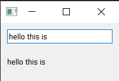

ほとんどの Qt ウィジェットにはスロットが用意されており、受け入れるのと同じタイプを発行する任意のシグナルを接続できます。ウィジェットのドキュメントには、各ウィジェットのスロットが「Public Slots」の下にリストされています。たとえば、[QLabel](https://doc.qt.io/qt-5/qlabel.html#public-slots) を参照してください。

## 7. ウィジェット

Qt では、ウィジェットはユーザーが操作できる UI コンポーネントに付けられた名前です。ユーザー インターフェイスは、ウィンドウ内に配置された複数のウィジェットで構成されています。Qt には、利用可能なウィジェットの幅広い選択肢が付属しており、独自のカスタム ウィジェットを作成することもできます。

この本のコード例には、basic/widgets_list.py ファイルがあり、これを実行するとウィンドウにウィジェットのコレクションを表示できます。このファイルでは、後で説明するいくつかの複雑なトリックが使用されているため、今はコードについて心配する必要はありません。

* 実行してください。複数のインタラクティブなウィジェットを含むウィンドウが表示されます。

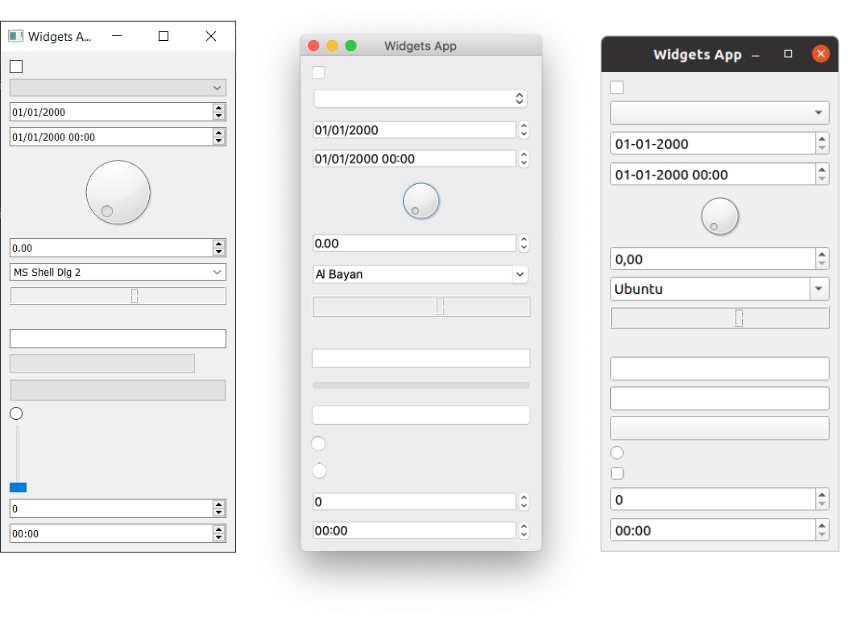

例に示されているウィジェットは、上から下へ順に以下のとおりです。

|ウィジェット|用途|
|--|--|
|QCheckbox|チェックボックス|
|QComboBox|ドロップダウンリストボックス|
|QDateEdit|日付の編集|
|QDateTimeEdit|日付と日時の編集|
|QDial|回転ダイヤル|
|QDoubleSpinbox|浮動小数点値用の数字スピナー|
|QFontComboBox|フォントリスト|
|QLCDNumber|かなり醜いLCDディスプレイ|
|QLabel|単なるラベル、非インタラクティブ|
|QLineEdit|テキストの1行入力|
|QProgressBar|進捗バー|
|QPushButton|ボタン|
|QRadioButton|アクティブな選択肢が 1 つだけのグループ|
|QSlider|スライダー|
|QSpinBox|整数スピナー|
|QTimeEdit|時間編集|

これよりはるかに多くのウィジェットがありますが、うまく収まりきりません。完全なリストについては、Qt のドキュメントを参照してください。ここでは、最も便利なウィジェットのいくつかを詳しく見ていきます。

> myapp.py の新しいコピーを読み込み、このセクション用に新しい名前で保存します。

### QLabel

まずはQtツールボックスで利用できる最もシンプルなウィジェットの1つであるQLabelからツアーを始めましょう。これは、アプリケーション内に配置できるシンプルな1行のテキストです。作成時に文字列を渡すことでテキストを設定できます。

```python
widget = QLabel("Hello")
```

または、.setText() メソッドを使用して、

```python
widget = QLabel("1") # The label is created with the text 1
widget.setText("2") # The label now shows 2
```

ウィジェット内のテキストのサイズや配置などのフォントパラメータを調整することもできます。

```python
import sys

from PySide6.QtCore import Qt
from PySide6.QtWidgets import QApplication, QLabel, QMainWindow

class MainWindow(QMainWindow):
    def __init__(self):
        super().__init__()

        self.setWindowTitle("My App")

        widget = QLabel("Hello")
        font = widget.font() ①
        font.setPointSize(30)
        widget.setFont(font)
        widget.setAlignment(Qt.AlignHCenter | Qt.AlignVCenter) ②

        self.setCentralWidget(widget)

app = QApplication(sys.argv)

window = MainWindow()
window.show()

app.exec()
```

①\<widget\>.font() を使用して現在のフォントを取得し、それを変更してから再度適用します。これにより、フォント フェイスがデスクトップの規則に準拠した状態を維持できます。

② アライメントはQt.名前空間のフラグを使用して指定します。

* 実行してください。フォントパラメータを調整して効果を確認してください。

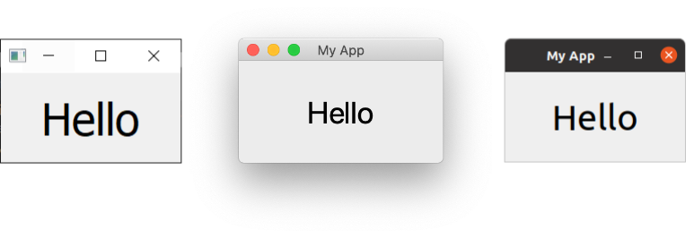

> Qt 名前空間 (Qt.) には、Qt ウィジェットをカスタマイズおよび制御するために使用できるさまざまな属性が満載されています。これについては、後ほど「列挙型と Qt 名前空間」で詳しく説明します。

水平方向の配置に使用できるフラグは次のとおりです。

|フラグ|挙動|
|--|--|
|Qt.AlignLeft|左端に揃えます。|
|Qt.AlignRight|右端に揃えます。|
|Qt.AlignHCenter|使用可能なスペースの水平方向の中央に配置します。|
|Qt.AlignJustify|使用可能なスペース内でテキストを揃えます。|

垂直方向の配置に使用できるフラグは次のとおりです。

|フラグ|挙動|
|--|--|
|Qt.AlignTop|上部に揃えます。|
|Qt.AlignBottom|下部に揃えます。|
|Qt.AlignVCenter|使用可能なスペースの垂直方向の中央に配置します。|

パイプ (|) を使用してフラグを組み合わせることができますが、一度に使用できる垂直または水平配置フラグは 1 つだけであることに注意してください。

```python
align_top_left = Qt.AlignLeft | Qt.AlignTop
```

* 実行してください。さまざまな配置フラグを組み合わせて、テキストの位置への影響を確認してください。

> Qt フラグ
>
> 慣例により、2 つのフラグを組み合わせるには OR パイプ (|) を使用することに注意してください。フラグは重複しないビットマスクです。たとえば、Qt.AlignLeft のバイナリ値は 0b0001 ですが、Qt.AlignBottom は 0b0100 です。これらを OR すると、'左下' を表す値 0b0101 が得られます。
>
> Qt 名前空間と Qt フラグについては、後ほど「列挙型と Qt 名前空間」で詳しく説明します。

最後に、両方向を同時に中央に配置する速記フラグもあります。

|フラグ|挙動|
|--|--|
|Qt.AlignCenter|水平方向と垂直方向に中央揃え|

奇妙なことに、QLabel では .setPixmap() メソッドを使用して画像を表示することもできます。これは、画像ファイル名を QPixmap に渡すことで作成できる pixmap (ピクセル配列) を受け入れます。この本に付属するサンプル ファイルには、次のようにしてウィンドウに表示できる otje.jpg ファイルがあります。

```python
import sys

from PySide6.QtGui import QPixmap
from PySide6.QtWidgets import QApplication, QLabel, QMainWindow

class MainWindow(QMainWindow):
    def __init__(self):
        super().__init__()

        self.setWindowTitle("My App")

        widget = QLabel("Hello")
        widget.setPixmap(QPixmap("otje.jpg"))

        self.setCentralWidget(widget)


app = QApplication(sys.argv)

window = MainWindow()
window.show()

app.exec()
```

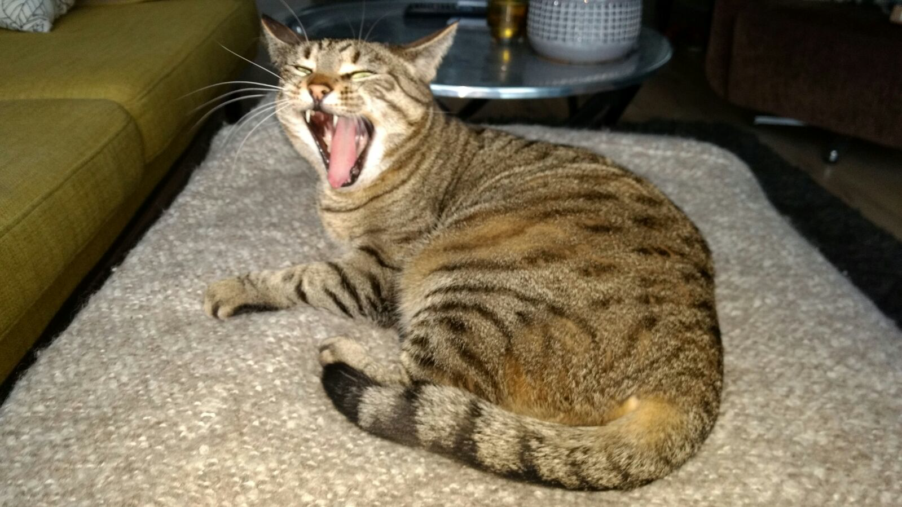

* 実行してください。ウィンドウのサイズを変更すると、画像が空白で囲まれます。

デフォルトでは、画像はアスペクト比を維持しながら拡大縮小されます。ウィンドウに完全に収まるように画像を引き伸ばして拡大縮小したい場合は、QLabel で .setScaledContents(True) を設定できます。

コードを変更して、ラベルに.setScaledContents(True)を追加します。

```python
        widget.setPixmap(QPixmap("otje.jpg"))
        widget.setScaledContents(True)
```

* 実行してください。ウィンドウのサイズを変更すると、画像がそれに合わせて変形します。

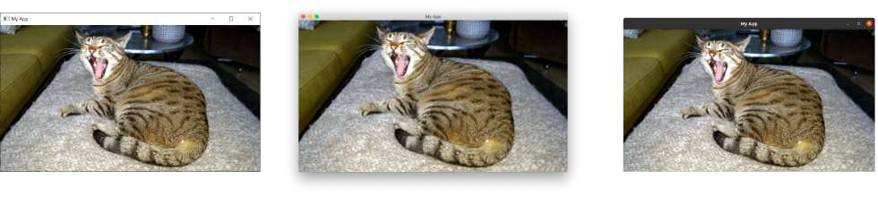

### QCheckBox

次に見るウィジェットは QCheckBox です。これは、名前が示すように、ユーザーにチェックボックスを表示します。ただし、すべての Qt ウィジェットと同様に、ウィジェットの動作を変更するための構成可能なオプションがいくつかあります。

```python
import sys

from PySide6.QtCore import Qt
from PySide6.QtWidgets import QApplication, QCheckBox, QMainWindow

class MainWindow(QMainWindow):
    def __init__(self):
        super().__init__()

        self.setWindowTitle("My App")

        widget = QCheckBox("This is a checkbox")
        widget.setCheckState(Qt.Checked)

        # For tristate: widget.setCheckState(Qt.PartiallyChecked)
        # Or: widget.setTristate(True)
        widget.stateChanged.connect(self.show_state)

        self.setCentralWidget(widget)

    def show_state(self, s):
        print(s == Qt.Checked)
        print(s)


app = QApplication(sys.argv)

window = MainWindow()
window.show()

app.exec()
```

* 実行してください。ラベル テキスト付きのチェックボックスが表示されます。

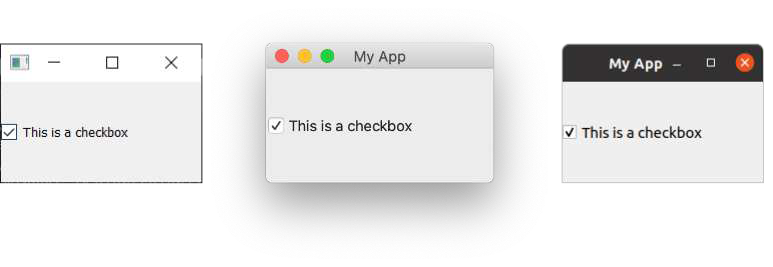

チェックボックスの状態は、.setChecked または .setCheckState を使用してプログラムで設定できます。前者は、それぞれチェック済みまたは未チェックを表す True または False を受け入れます。ただし、.setCheckState では、Qt の名前空間フラグを使用して部分的にチェックされた状態も指定できます。

|フラグ|挙動|
|--|--|
|Qt.Checked|アイテムがチェックされています|
|Qt.Unchecked|アイテムはチェックされていません|
|Qt.PartiallyChecked|アイテムは部分的にチェックされています|

部分的にチェックされた状態 (Qt.PartiallyChecked) をサポートするチェックボックスは、通常、オンでもオフでもない「トライステート」と呼ばれます。この状態のチェックボックスは、通常、グレー表示されたチェックボックスとして表示され、サブ項目が親チェックボックスにリンクされている階層的なチェックボックスの配置でよく使用されます。

値を Qt.PartiallyChecked に設定すると、チェックボックスは 3 状態になります。つまり、3 つの状態を持つことになります。.setTristate(True) を使用すると、現在の状態を部分的にチェックした状態に設定せずに、チェックボックスを 3 状態に設定することもできます。

> スクリプトの実行中、現在の状態番号が、チェック済み = 2、未チェック = 0、部分的にチェック済み = 1 の int として表示されることに気付くかもしれません。これらの値を覚えておく必要はありません。これらは、それぞれのフラグの内部値にすぎません。state == Qt.Checked を使用して状態をテストできます。

### QComboBox

QComboBox はドロップダウン リストで、デフォルトでは閉じており、開くには矢印をクリックします。リストから 1 つの項目を選択できます。現在選択されている項目はウィジェットのラベルとして表示されます。コンボ ボックスは、長いオプション リストから選択するのに適しています。

> おそらく、ワードプロセッサ アプリケーションでフォント フェイスやサイズを選択するために使用されるコンボ ボックスを見たことがあるでしょう。ただし、Qt は実際には QFontComboBox として特定のフォント選択コンボ ボックスを提供しています。

文字列のリストを .addItems() に渡すことで、QComboBox に項目を追加できます。項目は指定された順序で追加されます。

```python
import sys

from PySide6.QtCore import Qt
from PySide6.QtWidgets import QApplication, QComboBox, QMainWindow

class MainWindow(QMainWindow):
    def __init__(self):
        super().__init__()

        self.setWindowTitle("My App")

        widget = QComboBox()
        widget.addItems(["One", "Two", "Three"])

        widget.currentIndexChanged.connect(self.index_changed)
        widget.currentTextChanged.connect(self.text_changed)

        self.setCentralWidget(widget)

    def index_changed(self, i): # i is an int
        print(i)

    def text_changed(self, s): # s is a str
        print(s)


app = QApplication(sys.argv)

window = MainWindow()
window.show()

app.exec()
```

* 実行してください。3 つのエントリを含むコンボ ボックスが表示されます。 1 つを選択すると、ボックスに表示されます。

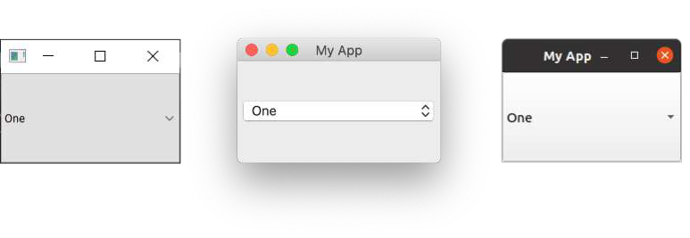

.currentIndexChanged シグナルは、現在選択されている項目が更新されたときにトリガーされ、デフォルトではリスト内の選択されている項目のインデックスを渡します。代わりに現在選択されている項目のラベルを提供する .currentTextChanged シグナルもあり、こちらの方が便利な場合が多いです。

QComboBox は編集可能で、ユーザーはリストに現在含まれていない値を入力して挿入したり、単に値として使用したりすることができます。ボックスを編集可能にするには、次の手順を実行します。

```python
widget.setEditable(True)
```

挿入の処理方法を決定するフラグを設定することもできます。これらのフラグはQComboBoxクラス自体に保存され、以下にリストされています。

|フラグ|挙動|
|--|--|
|QComboBox.NoInsert|挿入なし|
|QComboBox.InsertAtTop|最初の項目として挿入|
|QComboBox.InsertAtCurrent|現在選択されている項目を置き換える|
|QComboBox.InsertAtBottom|最後の項目の後に挿入|
|QComboBox.InsertAfterCurrent|現在の項目の後に挿入|
|QComboBox.InsertBeforeCurrent|現在の項目の前に挿入|
|QComboBox.InsertAlphabetically|アルファベット順に挿入|

これらを使用するには、次のようにフラグを適用します。

```python
widget.setInsertPolicy(QComboBox.InsertAlphabetically)
```

.setMaxCount を使用して、ボックス内に許可されるアイテムの数を制限することもできます。例:

```python
widget.setMaxCount(10)
```

### QListWidget

次は QListWidget です。このウィジェットは QComboBox に似ていますが、オプションがスクロール可能なアイテム リストとして表示されます。また、一度に複数のアイテムを選択することもできます。QListWidget は、QListItem (リスト ウィジェットの要素) を送信する currentItemChanged シグナルと、現在のアイテムのテキストを送信する currentTextChanged シグナルを提供します。

```python
import sys

from PySide6.QtWidgets import QApplication, QListWidget, QMainWindow

class MainWindow(QMainWindow):
    def __init__(self):
        super().__init__()

        self.setWindowTitle("My App")

        widget = QListWidget()
        widget.addItems(["One", "Two", "Three"])

        widget.currentItemChanged.connect(self.index_changed)
        widget.currentTextChanged.connect(self.text_changed)

        self.setCentralWidget(widget)

    def index_changed(self, i): # Not an index, i is a QListItem
        print(i.text())

    def text_changed(self, s): # s is a str
        print(s)


app = QApplication(sys.argv)

window = MainWindow()
window.show()

app.exec()
```

* 実行してください。同じ 3 つの項目がリストに表示されます。選択された項目 (ある場合) は強調表示されます。

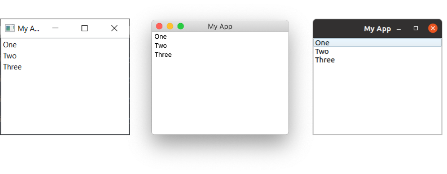

### QLineEdit

QLineEdit ウィジェットは、ユーザーが入力できるシンプルな 1 行のテキスト編集ボックスです。これらは、フォーム フィールドや、有効な入力の制限リストがない設定に使用されます。たとえば、電子メール アドレスやコンピューター名を入力する場合などです。

```python
import sys

from PySide6.QtCore import Qt
from PySide6.QtWidgets import QApplication, QLineEdit, QMainWindow


class MainWindow(QMainWindow):
    def __init__(self):
        super().__init__()
        self.setWindowTitle("My App")

        widget = QLineEdit()
        widget.setMaxLength(10)
        widget.setPlaceholderText("Enter your text")

        # widget.setReadOnly(True) # uncomment this to make readonly

        widget.returnPressed.connect(self.return_pressed)
        widget.selectionChanged.connect(self.selection_changed)
        widget.textChanged.connect(self.text_changed)
        widget.textEdited.connect(self.text_edited)

        self.setCentralWidget(widget)

    def return_pressed(self):
        print("Return pressed!")
        self.centralWidget().setText("BOOM!")

    def selection_changed(self):
        print("Selection changed")
        print(self.centralWidget().selectedText())

    def text_changed(self, s):
        print("Text changed...")
        print(s)

    def text_edited(self, s):
        print("Text edited...")
        print(s)


app = QApplication(sys.argv)

window = MainWindow()
window.show()

app.exec()
```

* 実行してください。ヒント付きのシンプルなテキスト入力ボックスが表示されます。

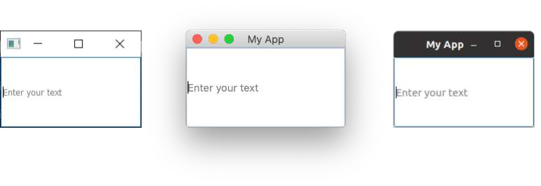

上記のコードで示されているように、.setMaxLength を使用してテキスト フィールドの最大長を設定できます。ユーザーが何かを入力するまで表示されるプレースホルダー テキストは、.setPlaceholderText を使用して追加できます。

QLineEdit には、Return キーが押されたとき (ユーザーによる)、ユーザー選択が変更されたときなど、さまざまな編集イベントに使用できるシグナルが多数あります。また、ボックス内のテキストが編集されたときと変更されたときの 2 つの編集シグナルもあります。ここでの区別は、ユーザーによる編集とプログラムによる変更です。textEdited シグナルは、ユーザーがテキストを編集したときにのみ送信されます。

さらに、入力マスクを使用して入力検証を実行し、サポートされる文字とその場所を定義することもできます。これは、次のようにフィールドに適用できます。

```python
widget.setInputMask('000.000.000.000;_')
```

上記では、ピリオドで区切られた 3 桁の数字の連続が許可されるため、IPv4 アドレスの検証に使用できます。

### QSpinBox と QDoubleSpinBox

QSpinBox は、値を増減するための矢印が付いた小さな数値入力ボックスを提供します。QSpinBox は整数をサポートし、関連ウィジェット QDoubleSpinBox は浮動小数点数をサポートします。

```python
import sys

from PySide6.QtCore import Qt
from PySide6.QtWidgets import QApplication, QMainWindow, QSpinBox


class MainWindow(QMainWindow):
    def __init__(self):
        super().__init__()

        self.setWindowTitle("My App")

        widget = QSpinBox()
        # Or: widget = QDoubleSpinBox()

        widget.setMinimum(-10)
        widget.setMaximum(3)
        # Or: widget.setRange(-10,3)

        widget.setPrefix("$")
        widget.setSuffix("c")
        widget.setSingleStep(3) # Or e.g. 0.5 for QDoubleSpinBox
        widget.valueChanged.connect(self.value_changed)
        widget.textChanged.connect(self.value_changed_str)

        self.setCentralWidget(widget)

    def value_changed(self, i):
        print(i)

    def value_changed_str(self, s):
        print(s)


app = QApplication(sys.argv)

window = MainWindow()
window.show()

app.exec()
```

* 実行してください。数値入力ボックスが表示されます。値には接頭辞と接尾辞の単位が表示され、+3 から -10 の範囲に制限されます。

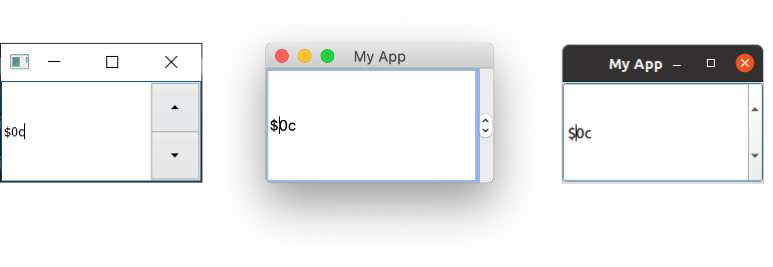

上記のデモ コードは、ウィジェットで使用できるさまざまな機能を示しています。

許容値の範囲を設定するには、setMinimum と setMaximum を使用するか、setRange を使用して両方を同時に設定します。値の種類の注釈は、数値に追加できるプレフィックスとサフィックスの両方でサポートされています。たとえば、通貨マーカーや単位の場合は、それぞれ .setPrefix と .setSuffix を使用します。

ウィジェットの上矢印と下矢印をクリックすると、ウィジェットの値が .setSingleStep を使用して設定できる量だけ増加または減少します。これはウィジェットが受け入れ可能な値には影響しないことに注意してください。

QSpinBox と QDoubleSpinBox には、値が変更されるたびに発生する .valueChanged シグナルがあります。生の .valueChanged シグナルは数値 (int または float) を送信しますが、.textChanged はプレフィックスとサフィックスの両方の文字を含む文字列として値を送信します。

### QSlider

QSlider はスライド バー ウィジェットを提供します。これは内部的には QSpinBox とよく似た機能を持ちます。現在の値を数値で表示するのではなく、ウィジェットの長さに沿ったスライダー ハンドルの位置で表されます。これは、2 つの極端な値の間で調整を行うときに役立ちますが、絶対的な精度は要求されません。このタイプのウィジェットの最も一般的な用途は、ボリューム コントロールです。

スライダーの位置が移動するたびにトリガーされる追加の .sliderMoved シグナルと、スライダーがクリックされるたびに発行される .sliderPressed シグナルがあります。

```python
import sys

from PySide6.QtCore import Qt
from PySide6.QtWidgets import QApplication, QMainWindow, QSlider


class MainWindow(QMainWindow):
    def __init__(self):
        super().__init__()

        self.setWindowTitle("My App")

        widget = QSlider()

        widget.setMinimum(-10)
        widget.setMaximum(3)
        # Or: widget.setRange(-10,3)

        widget.setSingleStep(3)

        widget.valueChanged.connect(self.value_changed)
        widget.sliderMoved.connect(self.slider_position)
        widget.sliderPressed.connect(self.slider_pressed)
        widget.sliderReleased.connect(self.slider_released)

        self.setCentralWidget(widget)

    def value_changed(self, i):
        print(i)

    def slider_position(self, p):
        print("position", p)

    def slider_pressed(self):
        print("Pressed!")

    def slider_released(self):
        print("Released")


app = QApplication(sys.argv)

window = MainWindow()
window.show()

app.exec()
```

* 実行してください。スライダー ウィジェットが表示されます。スライダーをドラッグして値を変更します。

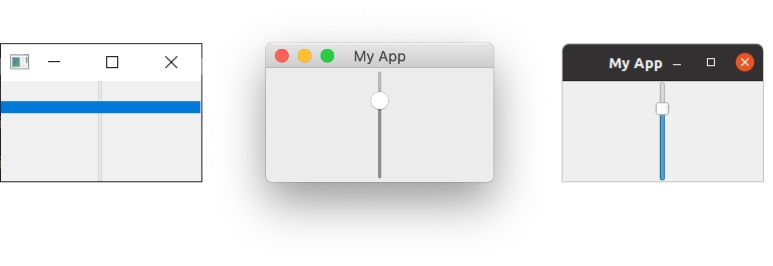

作成時に方向を渡すことで、垂直または水平方向のスライダーを構築することもできます。方向フラグは Qt. 名前空間で定義されています。たとえば、

```python
widget.QSlider(Qt.Vertical)
```

または -

```python
widget.QSlider(Qt.Horizontal)
```

### QDial

最後に、QDial はスライダーと同じように機能する回転可能なウィジェットですが、アナログ ダイヤルとして表示されます。これは見た目は良いですが、UI の観点からは特にユーザー フレンドリーではありません。ただし、オーディオ アプリケーションでは、実際のアナログ ダイヤルの表現としてよく使用されます。

```python
import sys

from PySide6.QtCore import Qt
from PySide6.QtWidgets import QApplication, QDial, QMainWindow


class MainWindow(QMainWindow):
    def __init__(self):
        super().__init__()

        self.setWindowTitle("My App")

        widget = QDial()
        widget.setRange(-10, 100)
        widget.setSingleStep(1)

        widget.valueChanged.connect(self.value_changed)
        widget.sliderMoved.connect(self.slider_position)
        widget.sliderPressed.connect(self.slider_pressed)
        widget.sliderReleased.connect(self.slider_released)

        self.setCentralWidget(widget)

    def value_changed(self, i):
        print(i)

    def slider_position(self, p):
        print("position", p)

    def slider_pressed(self):
        print("Pressed!")

    def slider_released(self):
        print("Released")


app = QApplication(sys.argv)

window = MainWindow()
window.show()

app.exec()
```

* 実行してください。ダイヤルが表示されるので、それを回して範囲から数字を選択します。

シグナルは QSlider と同じであり、同じ名前 (例: .sliderMoved) を保持します。

これで、PySide6 で使用できる Qt ウィジェットの簡単な説明は終了です。使用可能なウィジェットの完全なリスト (すべてのシグナルと属性を含む) を確認するには、[Qt ドキュメント](https://doc.qt.io/qt-5/)を参照してください。

### QWidget

デモには QWidget がありますが、表示されません。最初の例では、空のウィンドウを作成するために QWidget を使用しました。ただし、QWidget は、レイアウトと一緒に他のウィジェットのコンテナーとして使用して、ウィンドウや複合ウィジェットを構築することもできます。カスタム ウィジェットの作成については、後で詳しく説明します。

QWidget は頻繁に目にすることになるため、覚えておいてください。

## 8. レイアウト
