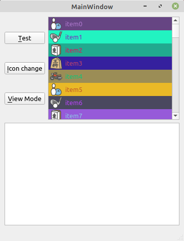

# 細かいことはいいから、とにかく QListWidget が使いたい

環境: Linux Mint 20 + Qt 5.15.1

**[全ソースはここ](https://github.com/Taro3/QListWidgetSample)**

タイトル通り、とにかく QListWidget の使い方です。

## アイテムの追加

QListWidget にアイテムを追加するには、 **QListWidget::addItem** または **QListWidget::addItems** を使います。
addItem は、アイテム名を引数で渡して直接アイテムを追加する方法と、 QListWidgetItem のインスタンスを使って追加する方法と、 QStringList を使って一気に追加する方法 (QListWidget::addItems) があります。

ここでは、 QListItemWidget を使ったアイテムの追加をしてみます。

```C++
        QColor foreColor(randColorValue(), randColorValue(), randColorValue());
        QColor backColor(randColorValue(), randColorValue(), randColorValue());
        QIcon icon(QString(":/icons/%1.png").arg(i % 5 + 1));
        QListWidgetItem* item = new QListWidgetItem(icon, tr("item%1").arg(i));
        item->setForeground(QBrush(foreColor));
        item->setBackground(QBrush(backColor));
        item->setFlags(item->flags() | Qt::ItemIsEditable);
        ui->listWidget->addItem(item);
```

こんな感じに表示されます。



このコードでは、フォアグラウンドカラー(文字色)とバックグラウンドカラーをランダムに生成して設定しています。
更に、リソースからアイコンを読み込み、ランダムに設定しています。
また、 QListWidgetItem::setFlags に Qt::ItemIsEditable を追加して、アイテムの編集を許可しています。

## QListWidget のシグナル

QListWidget のシグナルを使ってみます。

```C++
    connect(ui->listWidget, &QListWidget::currentItemChanged
            , [this] (QListWidgetItem *current, QListWidgetItem *previous) {
        if (current && previous)
            ui->plainTextEdit->appendPlainText(tr("%1 -> %2").arg(previous->text()).arg(current->text()));
    });

    connect(ui->listWidget, &QListWidget::currentRowChanged, [this] (int currentRow) {
        ui->plainTextEdit->appendPlainText(tr("current row = %1").arg(currentRow));
    });

    connect(ui->listWidget, &QListWidget::currentTextChanged, [this] (const QString &currentText) {
        ui->plainTextEdit->appendPlainText(tr("current text -> %1").arg(currentText));
    });

    connect(ui->listWidget, &QListWidget::itemActivated, [this] (QListWidgetItem *item) {
        ui->plainTextEdit->appendPlainText(tr("active -> %1").arg(item->text()));
    });

    // text, icon, etc changed
    connect(ui->listWidget, &QListWidget::itemChanged, [this] (QListWidgetItem *item) {
        ui->plainTextEdit->appendPlainText(tr("item changed -> %1").arg(item->text()));
    });

    connect(ui->listWidget, &QListWidget::itemClicked, [this] (QListWidgetItem *item) {
        ui->plainTextEdit->appendPlainText(tr("%1 clicked").arg(item->text()));
    });

    connect(ui->listWidget, &QListWidget::itemDoubleClicked, [this] (QListWidgetItem *item) {
        ui->plainTextEdit->appendPlainText(tr("%1 double clicked").arg(item->text()));
    });

    connect(ui->listWidget, &QListWidget::itemEntered, [this] (QListWidgetItem *item) {
        ui->plainTextEdit->appendPlainText(tr("%1 entered").arg(item->text()));
    });

    connect(ui->listWidget, &QListWidget::itemPressed, [this] (QListWidgetItem *item) {
        ui->plainTextEdit->appendPlainText(tr("%1 pressed").arg(item->text()));
    });

    connect(ui->listWidget, &QListWidget::itemSelectionChanged, [this] () {
        ui->plainTextEdit->appendPlainText(tr("item selection changed"));
    });
```

だいたいシグナルの名前の通りの動作なので、一部の説明は割愛します。^^;
ちょっとわかりにくいのは、 currentTextChanged と itemActivated と itemChanged と itemEntered あたりでしょうか。

currentTextChanged は、アイテムのテキストが編集によって変更されたとき**ではなく**、選択アイテムの変更によって、テキスト内容が変わったときに emit されます。

itemActivated は、アイテムがダブルクリックや Enter キー押下されたときに emit されます。(ダブルクリックと Enter キー押下がアイテムの編集に設定されていない場合のみ)

itemChanged は、アイテム内のなにか(アイコンやテキスト)が変更されたときに emit されます。

```C++
        QIcon icon(":/icons/6.png");
        item->setIcon(icon);
```

こんな風に、アイコンを変更した場合も emit されます。

itemEntered は、マウスカーソルがアイテム内に入った場合に emit されますが、 emit されるのは、 setMouseTracking によってマウスがキャプチャされているときと、マウスボタンを押下したままアイテム内で移動したときだけ emit されます。

## View Mode

QListWidget の表示モードには、リストモードと、アイコンモードがあります。
文字通り、表示がリストとアイコンで切り替わります。

アイコンモードにするとこんな風になる。


以上、とりあえず QListWidget の使い方でした。

***

**[戻る](../Qt.md)**
