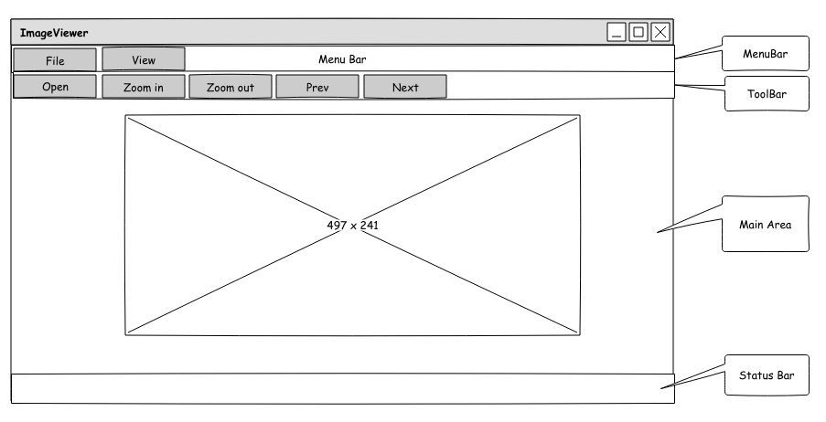
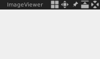
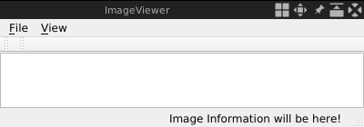
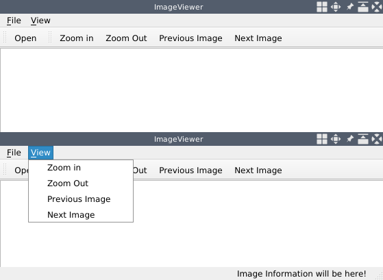
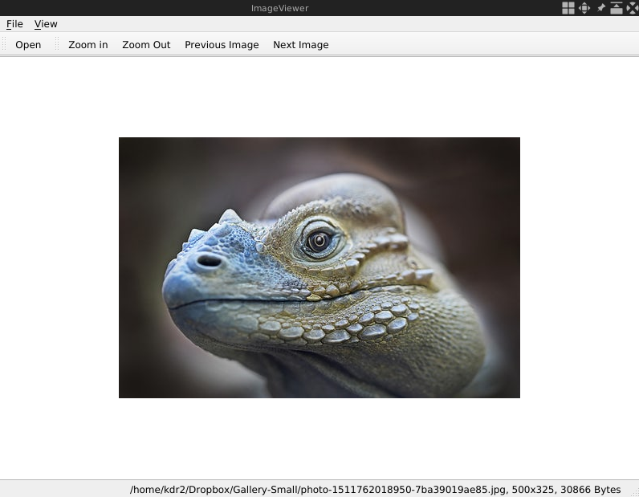

# 画像ビューアの構築

コンピュータビジョンは、デジタル画像や映像をバイトやピクセルとして扱うだけでなく、コンピュータが高度に理解することを可能にする技術である。シーン再構成、イベント検出、ビデオトラッキング、物体認識、3D姿勢推定、モーション推定、画像復元などに広く利用されている。

OpenCV（オープンソースコンピュータビジョン）は、ほぼすべてのコンピュータビジョンの手法とアルゴリズムを実装したライブラリです。 Qt は、すべての主要なデスクトッププラットフォーム、ほとんどの組み込みプラットフォーム、さらにモバイルプラットフォームで動作するグラフィカルユーザーインターフェースを備えたアプリケーションを作成するための、クロスプラットフォームアプリケーションフレームワークとウィジェットツールキットです。

この2つの強力なライブラリは、コンピュータビジョン技術の恩恵を受ける産業において、強固なGUIを持つプロフェッショナルなソフトウェアを作成するために、多くの開発者によって共に使用されています。本書では、親しみやすいGUIとコンピュータビジョン技術に関連するいくつかの機能を持つQt 5とOpenCV 4を用いて、この種の機能的なアプリケーションを構築する方法を紹介します。

この第1章では、まずQt 5を使って画像閲覧用の簡単なGUIアプリケーションを構築します。

本章では、以下のようなトピックを以下のように取り上げます。

* ユーザインタフェースの設計
* Qt による画像の読み込みと表示
* 画像のズームイン・ズームアウト
* 画像のコピーを任意のフォーマットで保存する
* Qt アプリケーションでホットキーに対応する

***

## 技術的要件

少なくとも Qt バージョン 5 がインストールされており、C++ および Qt プログラミングの基本的な知識があることを確認してください。また、互換性のあるC++コンパイラー（LinuxではGCC 5以降、macOSではClang 7.0以降、Microsoft WindowsではMSVC 2015以降）が必要です。

前提条件として適切な基礎知識が必要なため、Qtのインストールとコンパイラ環境のセットアップは本書には含まれていません。これらの基本的な設定方法については、多くの書籍やオンラインドキュメント、チュートリアル（例えば、Lee Zhi Eng著「GUI Programming with C++ and Qt5」や、Qtライブラリの公式ドキュメント）がありますので、必要に応じてご自身で参照してください。

これらの前提条件をすべて満たした上で、最初のアプリケーションであるシンプルな画像ビューアーの開発を始めましょう。

この章のすべてのコードは、私たちのコードリポジトリ([https://github.com/PacktPublishing/Qt-5-and-OpenCV-4-Computer-Vision-Projects/tree/master/Chapter-01](https://github.com/PacktPublishing/Qt-5-and-OpenCV-4-Computer-Vision-Projects/tree/master/Chapter-01))にあります。

次のビデオで、コードが実際に動いているところをご覧ください： [http://bit.ly/2KoYWFx](http://bit.ly/2KoYWFx)

***

## ユーザーインターフェースの設計

アプリケーションを構築する最初の部分は、そのアプリケーションが何をするのかを定義することです。この章では、画像ビューアーのアプリを開発します。そのために必要な機能は、次のとおりです。

* ハードディスクから画像を開く
* ズームイン/ズームアウト
* 同じフォルダー内の前後の画像を見ることができる
* 現在の画像のコピーを、別のファイル（パスやファイル名が異なる）として、別のフォーマットで保存する。

LinuxのgThumbやmacOSのPreview appなど、多くの画像ビューアアプリケーションがあります。しかし、今回のアプリケーションは、事前準備を行ったという点で、それらよりもシンプルになります。そのために、Pencilを使って、アプリケーションのプロトタイプのワイヤーフレームを描きました。[https://pencil.evolus.vn/](https://pencil.evolus.vn/)

以下は、アプリケーションのプロトタイプを示すワイヤーフレームです。



先ほどの図にあるように、メインウィンドウには **「メニューバー」「ツールバー」「メインエリア」「ステータスバー」** の4つのエリアが用意されています。

メニューバーには、 **「ファイル」** メニューと **「表示」** メニューの2つのメニューオプションがあります。それぞれのメニューには、独自のアクションが用意されています。ファイルメニューは、以下の3つのアクションで構成されています。

* **開く**：このオプションは、ハードディスクから画像を開きます。
* **名前を付けて保存**： このオプションは、現在の画像のコピーを、サポートされている任意の形式の別のファイル（異なるパスまたはファイル名）として保存します。
* **終了**： このオプションは、アプリケーションを終了します。

**「表示」** メニューは、以下の4つのアクションで構成されています。

* **ズームイン**： このオプションは、画像を拡大します。
* **ズームアウト**： このオプションは、画像をズームアウトします。
* **前**：このオプションは、現在のフォルダー内の前の画像を開きます。
* **次**： このオプションは、現在のフォルダー内の次のイメージを開きます。

ツールバーは、メニューオプションにもあるいくつかのボタンで構成されています。これらのボタンをツールバーに配置したのは、これらのアクションを実行するためのショートカットをユーザーに提供するためです。そのため、以下を含め、頻繁に使用するアクションをすべて含める必要があります。

* 開く
* ズームイン
* ズームアウト
* 前の画像
* 次の画像

メインエリアは、アプリケーションで開いている画像を表示するために使用されます。

ステータス・バーは、表示中の画像に関する情報（パス、サイズ、バイト単位サイズ）を表示するために使用されます。

このデザインのソースファイルは、GitHubのコードレポジトリ([https://github.com/PacktPublishing/Qt-5-and-OpenCV-4-Computer-Vision-Projects](https://github.com/PacktPublishing/Qt-5-and-OpenCV-4-Computer-Vision-Projects))で見ることができます。このファイルは、リポジトリのルートディレクトリに WireFrames.epgz という名前で存在するだけです。このファイルは、Pencilアプリケーションで開く必要があります。

***

## プロジェクトをゼロから始める

このセクションでは、画像ビューアーアプリケーションをゼロから構築します。統合開発環境（IDE）やエディターを使用することは想定していません。ここでは、コード自体に注目し、ターミナルで qmake を使用してアプリケーションをビルドする方法について説明します。

まず、ImageViewerという名前で、プロジェクト用の新しいディレクトリを作成しましょう。私はLinuxを使用しているので、以下のようにTerminalで実行します。

```sh
$ pwd
/home/kdr2/Work/Books/Qt5-And-OpenCV4-Computer-Vision-Projects/Chapter-01
$ mkdir ImageViewer
$
```

次に、そのディレクトリにmain.cppという名前のC++のソースファイルを以下の内容で作成します。

```cpp
    #include <QApplication>
    #include <QMainWindow> です。

    int main(int argc, char *argv[])
    {
        QApplication app(argc, argv);
        QMainWindowのwindow.SetWindowTitleを設定します。
        window.setWindowTitle("ImageViewer")。
        window.show()を実行します。
        return app.exec()。
    }
```

このファイルは、アプリケーションの入り口となるものです。このファイルでは、まずQtライブラリが提供するGUIベースのQtアプリケーション専用のヘッダファイルをインクルードします。次に、多くのC++アプリケーションと同様に、main関数を定義します。main関数では、画像閲覧アプリケーションの実行中を表すQApplicationクラスのインスタンスと、前節で設計したメインUIウィンドウとなるQMainWindowのインスタンスを定義しています。QMainWindowのインスタンスを生成した後、そのメソッドをいくつか呼びます：setWindowTitleでウィンドウのタイトルを設定し、showでウィンドウを出現させます。最後に、アプリケーションインスタンスのexecメソッドを呼び出し、Qtアプリケーションのメインイベントループに入ります。これにより、アプリケーションはexit()が呼ばれるまで待機し、exit()に設定された値を返すようになります。

main.cppファイルがプロジェクトディレクトリに保存されたら、ターミナルでそのディレクトリに入り、qmake -projectを実行して、以下のようにQtのプロジェクトファイルを生成します。

```sh
    $ cd ImageViewer/
    $ ls
    main.cpp
    $ qmake -project
    $ ls
    ImageViewer.pro main.cpp
    $
```

このように、ImageViewer.proというファイルが生成されます。このファイルには、Qtプロジェクトの多くのディレクティブや設定が含まれており、qmakeはこのImageViewer.proファイルを使って、後でmakefileを生成します。そのプロジェクトファイルを調べてみましょう。その内容は、以下のように#で始まるコメント行をすべて省略した後、以下のスニペットに記載されています。

```qmake
    TEMPLATE = app
    TARGET = ImageViewer
    includeepath += .

    defines += qt_deprecated_warnings

    SOURCES += main.cpp
```

これを一行ずつ見ていきましょう。

最初の行、TEMPLATE = appは、プロジェクトを生成するときに使用するテンプレートとしてappを指定しています。ここには、例えばlibやsubdirsなど、他の多くの値を指定することができます。私たちは、直接実行できるアプリケーションを構築しているので、appという値が適切です。他の値を使用することは、この章の範囲外です。[http://doc.qt.io/qt-5/qmake-manual.html](http://doc.qt.io/qt-5/qmake-manual.html) 自分でqmakeのマニュアルを参照して調べてみてください。

2行目のTARGET = ImageViewerは、アプリケーションの実行ファイル名を指定しています。つまり、プロジェクトがビルドされると、ImageViewerという名前の実行ファイルが生成されます。

残りの行では、インクルードパス、マクロ定義、入力ソースファイルなど、コンパイラのオプションをいくつか定義しています。どの行が何を行うかは、これらの行の変数名から簡単に確認することができます。

では、プロジェクトをビルドし、qmake -makefile を実行して makefile を生成し、make を実行してプロジェクトをビルド、つまりソースをコンパイルして目的の実行ファイルを生成してみましょう。

```sh
    $ qmake -makefile
    $ ls
    ImageViewer.pro main.cpp Makefile
    $ make
    g++ -c -pipe -O2 -Wall -W -D_REENTRANT -fPIC -DQT_DEPRECATED_WARNINGS -DQT_NO_DEBUG -DQT_GUI_LIB -DQT_CORE_LIB -I. -I. -isystem /usr/include/x86_64-linux-gnu/qt5 -isystem /usr/include/x86_64-linux-gnu/qt5/QtGui -isystem /usr/include/x86_64-linux-gnu/qt5/QtCore -I. -isystem /usr/include/libdrm -I/usr/lib/x86_64-linux-gnu/qt5/mkspecs/linux-g++
    -o main.o main.cpp
    main.cpp:1:10: fatal error: QApplication: No such file or directory
     #include <QApplication>
              ^~~~~~~~~~~~~~
    compilation terminated.
    make: *** [Makefile:395: main.o] Error 1
    $
```

おっと！？大きなエラーが出ました。これは、Qtバージョン5から、すべてのネイティブGUI機能がコアモジュールからウィジェットモジュールという別のモジュールに移動したためです。私たちのアプリケーションがそのモジュールに依存していることをqmakeに伝えるために、 greaterThan(QT_MAJOR_VERSION, 4)という行を追加する必要があります。QT += widgets をプロジェクトファイルに追加してください．この修正により、ImageViewer.proの中身は以下のようになります。

```qmake
    TEMPLATE = app
    TARGET = ImageViewer
    greaterThan(QT_MAJOR_VERSION, 4): QT += widgets

    INCLUDEPATH += .

    DEFINES += QT_DEPRECATED_WARNINGS

    SOURCES += main.cpp
```

それでは、Terminalでqmake -makefileとmakeコマンドを発行して、以下のようにアプリケーションを再度ビルドしてみましょう。

```sh
    $ qmake -makefile
    $ make
    g++ -c -pipe -O2 -Wall -W -D_REENTRANT -fPIC -DQT_DEPRECATED_WARNINGS -DQT_NO_DEBUG -DQT_WIDGETS_LIB -DQT_GUI_LIB -DQT_CORE_LIB -I.D. -DQT_CORE_LIB -I. -I. -isystem /usr/include/x86_64-linux-gnu/qt5 -isystem /usr/include/x86_64-linux-gnu/qt5/QtWidgets -isystem /usr/include/x86_64-linux-gnu/qt5/QtGui -isystem /usr/include/x86_64-linux-gnu/qt5/QtCore -I. -isystem /usr/include/libdrm -I/usr/lib/x86_64-linux-gnu/qt5/mkspecs/linux-g++ -o main.o main.cpp
    g++ -Wl,-O1 -o ImageViewer main.o -lQt5Widgets -lQt5Gui -lQt5Core -lGL -lpthread
    $ ls
   ImageViewer ImageViewer.pro main.cpp main.o Makefile
    $
```

やったー! これでようやく、プロジェクトディレクトリに実行ファイルImageViewerができました。では、実行し、ウィンドウがどのように見えるか見てみましょう。



見ての通り、これはただの空白のウィンドウです。次の「ユーザーインターフェースの設定」で、設計したワイヤーフレームに従って、ユーザーインターフェース全体を実装していきます。

ここでは、IDEやエディタには触れず、アプリケーションをターミナル上でqmakeでビルドしましたが、使い慣れたIDE、例えば、Qt Creatorでもかまいません。特にWindowsでは、ターミナル（cmdやMinGW）はLinuxやmacOSのTerminalほど性能が良くないので、気軽にIDEを使用してください。

***

## フルユーザーインターフェースを設定する

それでは、開発を進めていきましょう。前節では、空白のウィンドウを作成しましたが、これから、メニューバー、ツールバー、画像表示コンポーネント、ステータスバーをウィンドウに追加していきます。

まず、QMainWindowクラスを使うのではなく、QMainWindowクラスを継承したMainWindowというクラスを自分で定義してみます。mainwindow.hでその宣言を見てみましょう。

```cpp
    class MainWindow : public QMainWindow
    {
        Q_OBJECT

    public:
        explicit MainWindow(QWidget *parent = nullptr);
        ~MainWindow();

    private:
        void initUI();

    private:
        QMenu *fileMenu;
        QMenu *viewMenu;

        QToolBar *fileToolBar;
        QToolBar *viewToolBar;

        QGraphicsScene *imageScene;
        QGraphicsView *imageView;

        QStatusBar *mainStatusBar;
        QLabel *mainStatusLabel;
    };
```

すべて簡単です。Q_OBJECTは、Qtライブラリが提供する重要なマクロです。もし、それ自身のシグナルやスロットをカスタマイズしたクラスを宣言したい場合や、Qtメタオブジェクトシステムの他の機能を使用したい場合は、クラス宣言で、より正確には、今行ったようにクラスのプライベートセクションで、この重要なマクロを組み込む必要があります。initUIメソッドは、privateセクションで宣言されたすべてのウィジェットを初期化します。imageSceneとimageViewウィジェットは、画像を表示するためにウィンドウのメインエリアに配置されます。その他のウィジェットは、その型と名前から自明なので、この章を簡潔にするために、あまり多くを語らないことにします。

*この章を簡潔にするため、本文中で各ソースファイルを紹介する際、その全体を掲載することはしていません。例えば、ファイルの冒頭にある#include ...の指示は省略することがほとんどです。必要に応じて、GitHubのコードリポジトリにあるソースファイルを参照し、詳細を確認してください。*

もうひとつのポイントは、mainwindow.cppのinitUIメソッドを次のように実装している点です。

```cpp
    void MainWindow::initUI()
    {
        this->resize(800, 600);
        // メニューバーの設定
        fileMenu = menuBar()->addMenu("&File");
        viewMenu = menuBar()->addMenu("&View");

        // ツールバーの設定
        fileToolBar = addToolBar("File");
        viewToolBar = addToolBar("View");
        // 画像を表示するメインエリア
        imageScene = new QGraphicsScene(this);
        imageView = new QGraphicsView(imageScene);
        setCentralWidget(imageView)を設定します。

        // ステータスバーの設定
        mainStatusBar = statusBar();
        mainStatusLabel = new QLabel(mainStatusBar); // ステータスバーの設定
        mainStatusBar->addPermanentWidget(mainStatusLabel);
        mainStatusLabel->setText("Image Information will be here!");
    }
```

この段階では、メニューやツールバーのすべてのアイテムやボタンを作成するのではなく、大枠を設定するだけです。先のコードでは、変数 imageScene は QGraphicsSence のインスタンスです。このようなインスタンスは、2D グラフィックアイテムのコンテナです。その設計によれば、グラフィック・アイテムを管理するだけで、視覚的な外観を持ちません。それを視覚化するためには、QGraphicsViewクラスのインスタンスを一緒に作成する必要があり、それがimageView変数が存在する理由です。今回のアプリケーションでは、この2つのクラスを使って画像を表示させています。

MainWindowクラスのすべてのメソッドを実装したら、いよいよソースをコンパイルします。その前に、ImageViewer.proのプロジェクトファイルに対して、以下のようにいくつかの変更を加える必要があります。

1. 新しいソースファイルを書くだけなので、qmakeでわかるようになっているはずです。

    ```cpp
     # in ImageViewer.pro
     SOURCES += main.cpp mainwindow.cpp
    ```

2. ヘッダーファイルであるmainwindow.hにはQ_OBJECTという特殊なマクロがあり、これは標準的なC++プリプロセッサでは扱えないものがあることを表しています。このヘッダファイルは、Qtが提供するmoc（メタオブジェクトコンパイラ）というプリプロセッサによって正しく処理され、Qtのメタオブジェクトシステムに関連するいくつかのコードを含むC++ソースファイルを生成する必要があります。そこで、ImageViewer.proに以下の行を追加して、qmakeにこのヘッダファイルをチェックするように指示する必要があります。

    ```cpp
     HEADERS += mainwindow.h
    ```

OKです。さて、これですべてが完了しましたので、qmake -makefile と make を再度実行し、新しい実行ファイルを実行してみましょう。以下のようなウィンドウが表示されるはずです。



さて、ここまでは順調です。さて、次にメニューに表示されるべき項目を意図したとおりに追加していきましょう。Qt では、メニューの各項目は QAction のインスタンスで表現されます。ここでは、新しい画像を開くというアクションを例にとって説明します。まず、QActionのインスタンスへのポインタをMainWindowクラスのプライベートメンバとして宣言しておきます。

```cpp
    QAction *openAction;
```

次に、initUIメソッド本体で、new演算子を呼び出してメインウィンドウの子ウィジェットとしてアクションを作成し、以下のようにFileメニューに追加しています。

```cpp
    openAction = new QAction("&Open", this);
    fileMenu->addAction(openAction);
```

*new 演算子を呼び出して多くの Qt オブジェクトを作成しましたが、決して削除していないことにお気づきでしょう。これは、これらのオブジェクトがすべてQObjectのインスタンス、またはそのサブクラスであるためです。QObject のインスタンスは、Qt ライブラリの中の一つあるいは多くのオブジェクトツリーに整理されています。QObject が他のオブジェクトの子として作成されると、そのオブジェクトは自動的にその親の children() リストに追加されます。親オブジェクトは、子オブジェクトの所有権を取得します。そして、親オブジェクトが破棄されると、その子オブジェクトはそのデストラクタで自動的に削除されます。私たちのアプリケーションでは、ほとんどのQObjectのインスタンスをメインウィンドウオブジェクトの子として作成しているので、それらを削除する必要はないでしょう。*

幸いなことに、ツールバーのボタンもQActionで表現できるので、ファイルツールバーに直接openActionを追加することができます。

```cpp
    fileToolBar->addAction(openAction);
```

前述したように、作成するアクションは、開く、名前を付けて保存、終了、ズームイン、ズームアウト、前の画像、次の画像の7つです。これらはすべて、openアクションを追加したのと同じ方法で追加することができます。また、これらのアクションを追加するには多くのコード行が必要なため、コードを少しリファクタリングして、createActionsという新しいプライベートメソッドを作成し、そのメソッドにアクションのコードをすべて挿入し、initUIで呼び出すことも可能です。

リファクタリングの結果、すべてのアクションは、別のメソッドcreateActionsで作成されるようになりました。ソースをコンパイルして、ウィンドウがどのようになったか見てみましょう。



素晴らしい！ ウィンドウは私たちがデザインしたワイヤーフレームと同じように見え、メニューバーの項目をクリックすることでメニューを展開することができるようになりました！

***

## アクションのための関数を実装する

前のセクションで、メニューとツールバーにいくつかのアクションを追加しました。しかし、これらのアクションをクリックしても、何も起こりません。それは、それらのハンドラをまだ何も書いていないからです。Qt は、シグナルとスロットの接続メカニズムを使って、イベントとそのハンドラの関係を確立しています。ユーザがあるウィジェットに対して操作を行うと、そのウィジェットのシグナルが発せられます。そして、Qtはそのシグナルに接続されたスロットがあるかどうかを確認します。スロットが見つかれば、それが呼ばれます。 この節では、前の節で作成したアクションのスロットを作成し、アクションのシグナルとこれらのスロットをそれぞれ接続します。また、よく使うアクションのホットキーをいくつか設定します。

***

### Exitアクション

Exitアクションを例にとります。ユーザーがFileメニューからこれをクリックすると、triggeredというシグナルが発信されます。そこで、MainWindowクラスのメンバ関数createActionsで、このシグナルをアプリケーションのインスタンスのスロットに接続してみましょう。

```cpp
     connect(exitAction, SIGNAL(triggered(bool)), QApplication::instance(), SLOT(quit()));
```

connectメソッドは、シグナル送信者、シグナル、受信者、スロットの4つのパラメータを取ります。接続が行われると、送信側のシグナルが発せられた時点で受信側のスロットが呼び出されます。ここでは、Exitアクションのトリガーとなるシグナルを、アプリケーションインスタンスのquitスロットと接続し、Exitアクションをクリックしたときにアプリケーションが終了するようにしました。

さて、コンパイルして実行するには、FileメニューからExitの項目をクリックします。うまくいけば、アプリケーションは期待通りに終了します。

***

### 画像を開く

QApplicationのquitスロットはQtによって提供されていますが、openアクションをクリックしたときに画像を開きたい場合、どのスロットを使うべきでしょうか？このシナリオでは、この種のカスタマイズされたタスクのためのビルトインスロットは存在しません。自前でスロットを書く必要があります。

スロットを書くには、まず、MainWindowクラスのボディで関数を宣言し、それをスロットセクションに配置する必要があります。この関数は他のクラスでは使われないので、以下のように private slots セクションに置きます。

```cpp
     private slots:
         void openImage();
```

そして、このスロット（これもメンバ関数）には、テスト用に簡単な定義を与えます。

```cpp
     void MainWindow::openImage()
     {
         qDebug() << "スロット openImage が呼び出されました";
     }
```

ここで、createActionsメソッドのボディで、openアクションのトリガーされたシグナルをメインウィンドウのopenImageスロットに接続します。

```cpp
     connect(openAction, SIGNAL(triggered(bool)), this, SLOT(openImage()));
```

では、もう一度コンパイルして実行してみましょう。ファイルメニューの「開く」、またはツールバーの「開く」ボタンをクリックすると、スロット openImage が呼び出されます。 メッセージが Terminal に出力されます。

これで、open アクションとうまく連動するテストスロットができました。次のコードのように、そのボディを変更して、ディスクから画像を開く機能を実装してみましょう。

```cpp
         QFileDialog dialog(this);
         dialog.setWindowTitle("画像を開く");
         dialog.setFileMode(QFileDialog::ExistingFile);
         dialog.setNameFilter(tr("Images (*.png *.bmp *.jpg)"));
         QStringList filePaths;
         if (dialog.exec()) {
             filePaths = dialog.selectedFiles();
             showImage(filePaths.at(0));
         }
```

このコードブロックを一行ずつ見ていきましょう。最初の行では、QFileDialog のインスタンスを作成し、その名前を dialog にしています。そして、ダイアログのプロパティを設定しています。このダイアログはディスクからローカルに画像ファイルを選択するために使用されるので、そのタイトルを画像を開くと設定し、そのファイルモードを QFileDialog::ExistingFile に設定して、多数のファイルや存在しないファイルではなく、既存の1つのファイルのみを選択できるようにしています。名前フィルタImages (\*.png \*.bmp \*.jpg) は、言及された拡張子を持つファイル（つまり、.png, .bmp, .jpg）だけが選択できることを保証します。これらの設定の後、ダイアログを開くためにダイアログのexecメソッドを呼び出します。これは次のように表示されます。


ユーザがファイルを選択してOpenボタンをクリックすると、dialog.execから0でない値が返されます。次に、dialog.selectedFilesを呼び出して、選択されたファイルのパスをQStringListのインスタンスとして取得します。ここで、選択できるのは1つだけです。したがって、結果のリストには、開きたい画像のパスという要素が1つだけあります。そこで、MainWindowクラスのshowImageメソッドを、その唯一の要素で呼び出して、画像を表示させています。もし、ユーザーがキャンセルボタンを押した場合は、execメソッドからゼロの値が返されます。これは、ユーザーが画像を開くことをあきらめたことを意味するので、この分岐は無視すればいいのです。

showImage メソッドも、MainWindow クラスに追加したプライベートメンバー関数です。 以下のように実装しています。

```cpp
     void MainWindow::showImage(QString path)
     {
         imageScene->clear();
         imageView->resetMatrix();
         QPixmap image(path);
         imageScene->addPixmap(image);
         imageScene->update();
         imageView->setSceneRect(image.rect());
         QString status = QString("%1, %2x%3, %4 Bytes").arg(path).arg(image.width())
             .arg(image.height()).arg(QFile(path).size());
         mainStatusLabel->setText(status);
     }
```

画像を表示する処理では、imageSceneに画像を追加し、シーンを更新しています。その後、imageViewでシーンを可視化する。このとき、すでにアプリケーションで開いている画像がある可能性があるので、古い画像を削除し、ビューの変形（拡大縮小や回転など）をリセットしてから新しい画像を表示する必要があります。この作業は、最初の2行で行われます。この後、選択したファイルパスで QPixmap の新しいインスタンスを構築し、それをシーンに追加してシーンを更新しています。次に、imageViewのsetSceneRectを呼び出して、シーンの新しい範囲を伝えています（画像と同じサイズです）。

この時点で、メインエリアの中央にターゲット画像を元のサイズで表示することができました。最後に、画像に関連する情報をステータスバーに表示します。画像のパス、寸法、サイズをバイト単位で表した文字列を作成し、ステータスバーに追加したmainStatusLabelのテキストとして設定します。



悪くないですね。これで本物の画像ビューアーのようなアプリケーションになりました。

***

### ズームイン・ズームアウト

OK 無事、画像が表示されました。では、拡大してみましょう。ここでは、拡大・縮小を例に説明します。先ほどの操作で、どうすればいいのかがわかっているはずです。まず、zoomInという名前のプライベートスロットを宣言し、次のような実装をします。

```cpp
     void MainWindow::zoomIn()
     {
         imageView->scale(1.2, 1.2);
     }
```

簡単でしょう？imageViewのscaleメソッドに幅と高さのスケールレートを指定して呼び出すだけです。そして、zoomInActionのトリガーシグナルをMainWindowクラスのcreateActionsメソッドでこのスロットに接続します。

```cpp
     connect(zoomInAction, SIGNAL(triggered(bool)), this, SLOT(zoomIn()));
```

このアプリケーションをコンパイルして実行し、画像を開いて、ツールバーのズームインボタンをクリックします。クリックするたびに、画像が現在の120%まで拡大されることがわかります。

ズームアウトは、imageViewを1.0以下の割合で拡大縮小するだけです。ぜひ、ご自身で実装してみてください。もし難しければ、GitHubのコードリポジトリ [https://github.com/PacktPublishing/Qt-5-and-OpenCV-4-Computer-Vision-Projects/tree/master/Chapter-01](https://github.com/PacktPublishing/Qt-5-and-OpenCV-4-Computer-Vision-Projects/tree/master/Chapter-01) を参照してください。

今回のアプリケーションで、画像を開き、拡大縮小して表示することができるようになりました。次に、saveAsAction アクションの関数を実装します。

***

### コピーの保存

MainWindowのshowImageメソッドを振り返ってみましょう。このメソッドでは、画像から QPixmap のインスタンスを生成し、imageScene->addPixmap で imageScene に追加しています。そのため、saveAsActionで実装する新しいスロットにQPixmapのインスタンスを取得する便利な方法がありません。

そこで、MainWindowのコンストラクタで、QGraphicsPixmapItem *currentImage という新しいプライベートメンバーフィールドを追加して、imageScene->addPixmapの戻り値を保持し、nullptrで初期化することにしました。そして、MainWindow::showImageのボディにあるコードの行を探します。

```cpp
   imageScene->addPixmap(image);
```

この行を次の行に置き換えて、戻り値を保存します。

```cpp
   currentImage = imageScene->addPixmap(image);
```

さて、saveAsAction用の新しいスロットを作成する準備ができました。プライベートスロットセクションでの宣言は、以下のように簡単です。

```cpp
       void saveAs();
```

定義も簡単です。

```cpp
     void MainWindow::saveAs()
     {
         if (currentImage == nullptr) {
             QMessageBox::information(this, "Information", "Nothing to save.");
             return;
         }
         QFileDialog dialog(this);
         dialog.setWindowTitle("Save Image As ...");
         dialog.setFileMode(QFileDialog::AnyFile);
         dialog.setAcceptMode(QFileDialog::AcceptSave);
         dialog.setNameFilter(tr("Images (*.png *.bmp *.jpg)"));
         QStringList fileNames;
         if (dialog.exec()) {
             fileNames = dialog.selectedFiles();
             if(QRegExp(".+\\.(png|bmp|jpg)").exactMatch(fileNames.at(0))) {
                 currentImage->pixmap().save(fileNames.at(0));
             } else {
                 QMessageBox::information(this, "Information", "Save error: bad format or filename.");
             }
         }
     }
```

まず、currentImageがnullptrかどうかをチェックします。もし真なら、まだ何も画像を開いていないことを意味します。そこで、QMessageBoxを開いて、保存するものがないことをユーザーに伝えます。そうでなければ、QFileDialogを作成し、それに関連するプロパティを設定し、execメソッドを呼び出してそれを開きます。ユーザがダイアログにファイル名を与えて開くボタンをクリックすると、QFileDialogの最後の使い方として、要素が1つしかないファイルパスのリストを取得することになります。そして、ファイルパスの末尾がサポートしている拡張子であるかどうかを正規表現によるマッチングでチェックします。うまくいけば、currentImage->pixmap()から現在の画像のQPixmapインスタンスを取得し、指定されたパスに保存します。スロットの準備ができたら、createActionsのシグナルに接続します。

```cpp
   connect(saveAsAction, SIGNAL(triggered(bool)), this, SLOT(saveAs()));
```

この機能を試すために、PNG画像を開いて、Save Image As... ファイルダイアログで .jpg で終わるファイル名を指定してJPG画像として保存してみます。次に、保存した新しいJPG画像を別の画像表示アプリケーションで開き、画像が正しく保存されたかどうかを確認します。

***

### フォルダー内を移動する

さて、1枚の画像に関するアクションはすべて完了したので、さらに進んで、現在の画像が存在するディレクトリに存在するすべての画像、つまりprevActionとnextActionをナビゲートしてみましょう。

何が前の画像か、次の画像かを知るためには、次の2つを意識する必要があります。

* 現在のものがどれであるか
* 数える順番

そこで、まず、MainWindow クラスに新しいメンバーフィールド QString currentImagePath を追加し、現在の画像のパスを保存するようにします。そして、showImage で画像を表示しながら、そのパスを保存するために、メソッドに次の行を追加します。

```cpp
     currentImagePath = path;
```

そして、画像は名前のアルファベット順にカウントすることにします。この2つの情報があれば、どちらが前の画像か次の画像かを判断することができます。prevActionのスロットをどのように定義するか見てみましょう。

```cpp
     void MainWindow::prevImage()
     {
         QFileInfo current(currentImagePath);
         QDir dir = current.absoluteDir();
         QStringList nameFilters;
         nameFilters << "*.png" << "*.bmp" << "*.jpg";
         QStringList fileNames = dir.entryList(nameFilters, QDir::Files, QDir::Name);
         int idx = fileNames.indexOf(QRegExp(QRegExp::escape(current.fileName())));
         if(idx > 0) {
             showImage(dir.absoluteFilePath(fileNames.at(idx - 1)));
         } else {
             QMessageBox::information(this, "Information", "Current image is the first one.");
         }
     }
```

まず、現在の画像が存在するディレクトリを QDir のインスタンスとして取得し、PNG、BMP、JPG のファイルだけが返されるように名前フィルタリングしてリストアップしています。ディレクトリをリストアップしている間、QDir::Name を第三引数として使用し、返されるリストがアルファベット順にファイル名でソートされていることを確認します。現在表示している画像もこのディレクトリにあるので、そのファイル名はファイル名リストの中にあるはずです。そのインデックスを見つけるには、QRegExp::escape で生成される正規表現を使ってリストの indexOf を呼び出し、ファイル名と正確に一致するようにします。インデックスが0であれば、現在の画像はこのディレクトリの最初の画像であることを意味します。メッセージボックスがポップアップして、この情報をユーザーに知らせます。そうでない場合は、index - 1 の位置にあるファイル名の画像を表示して操作を完了します。

prevActionが動作するかどうかをテストする前に、createActionsメソッドのボディに次の行を追加して、シグナルとスロットを接続することを忘れないでください。

```cpp
   connect(prevAction, SIGNAL(triggered(bool)), this, SLOT(prevImage()));
```

まあ、それほど難しいことではないので、自分でnextActionの作業を試みるか、GitHubのコード・リポジトリでそのコードを読んでみてください。

***

### ホットキーへの対応

この時点で、ほぼすべての機能が意図したとおりに実装されました。では、よく使うアクションにホットキーを追加して、アプリケーションをより使いやすくしてみましょう。

アクションを作成する際に、&FileやE&exitのように、テキストに奇妙な&を付けることがあることにお気づきでしょうか。実は、これはQtでショートカットを設定するための方法なのです。ある種のQtウィジェットでは、文字の前に&をつけると、その文字のニモニック（ショートカット）が自動的に作られます。したがって、今回のアプリケーションでは、Alt + Fを押すとファイルメニューが起動し、ファイルメニューが展開された状態で、その上にExitアクションが表示されます。このとき、Alt + Xを押すと、Exitアクションが発動し、アプリケーションが終了します。

では、よく使うアクションにシングルキーのショートカットをつけて、より便利に速く使えるようにすると、次のようになります。

* プラス（+）またはイコール（=）でズームイン
* マイナス（-）またはアンダースコア（_）でズームアウト
* 上または左に移動すると、前の画像に移動します。
* 次の画像を表示する場合は、下または右に移動します。

これを実現するために、MainWindowクラスにsetupShortcutsという新しいプライベートメソッドを追加し、以下のように実装しています。

```cpp
     void MainWindow::setupShortcuts()
     {
         QList<QKeySequence> shortcuts;
         shortcuts << Qt::Key_Plus << Qt::Key_Equal;
         zoomInAction->setShortcuts(shortcuts)を実行します。

         shortcuts.clear()を実行します。
         shortcuts << Qt::Key_Minus << Qt::Key_Underscore;
         zoomOutAction->setShortcuts(shortcuts)を実行します。

         shortcuts.clear()を実行します。
         shortcuts << Qt::Key_Up << Qt::Key_Left;
         prevAction->setShortcuts(shortcuts)を実行します。

         shortcuts.clear()を実行します。
         shortcuts << Qt::Key_Down << Qt::Key_Right;
         nextAction->setShortcuts(shortcuts);
     }
```

一つのアクションに対して複数のショートカット、例えばズームインするための + と = をサポートするために、アクションごとに空の QList of QKeySequence を作成し、各ショートカットキー列をリストに追加しています。Qtでは、QKeySequenceはショートカットで使用されるキーシーケンスをカプセル化します。QKeySequenceはint型の引数を持つ非明示的なコンストラクタを持っているので、Qt::Keyの値を直接リストに追加すれば、それらは暗黙のうちにQKeySequenceのインスタンスに変換されます。リストが満たされた後、満たされたリストを使って各アクションで setShortcuts メソッドを呼び出すと、ショートカットの設定が簡単になります。
createActionsメソッドのボディの最後にsetupShortcuts()メソッド呼び出しを追加し、コンパイルと実行を行います。これで、アプリケーションでショートカットをテストすることができ、うまく動作するはずです。

***

## まとめ

この章では、Qt を使って、画像閲覧用のデスクトップアプリケーションをゼロから作成しました。ユーザインタフェースの設計、Qt プロジェクトの作成、ユーザインタフェースの構築、画像を開いて表示する方法、ホットキーに反応する方法、画像のコピーを保存する方法を学びました。

次の章では、OpenCVが提供する機能を使ってユーザーが画像を編集できるように、アプリケーションにアクションを追加していきます。また、これらの編集アクションは、Qtのプラグイン機構を利用して、より柔軟な方法で追加していく予定です。

***

## 問題集

この章に関する知識を試すために、これらの問題に挑戦してください。

1. メッセージボックスを使って、ユーザーが最初の画像の前の画像や最後の画像の次の画像を見ようとしているときに、すでに最初の画像や最後の画像を表示していることを伝えます。しかし、この状況に対処する別の方法があります。ユーザーが最初の画像を見ているときは prevAction を無効にし、ユーザーが最後の画像を見ているときは nextAction を無効にするのです。これはどのように実装するのでしょうか？
2. メニュー項目やツールボタンには、テキストしか含まれていません。これにアイコン画像を追加するにはどうしたらよいでしょうか？
3. QGraphicsView.scaleを使用して、イメージビューを拡大・縮小していますが、イメージビューを回転させるにはどうすればよいでしょうか？
4. mocは何をするのですか？SIGNALマクロとSLOTマクロは、どのような動作をするのですか？

***

**[次へ](../2/2.EditingImagesLikeAPro.md)**
