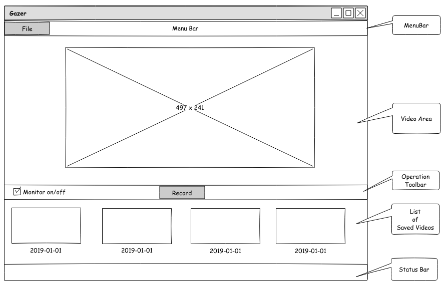
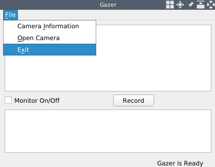
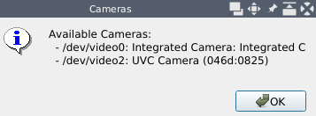
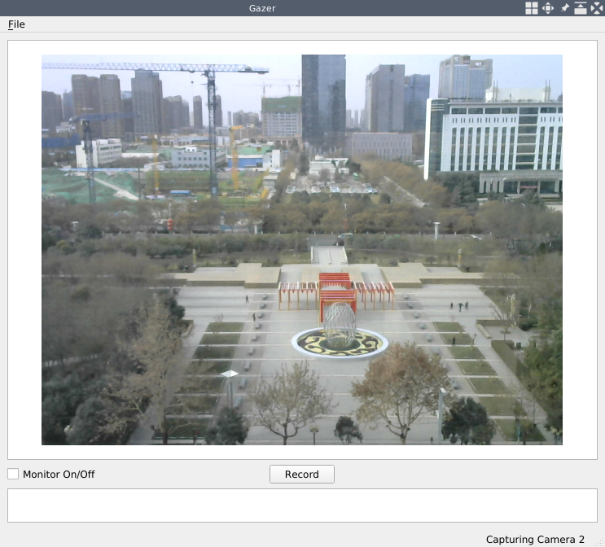

# ホームセキュリティアプリケーション

第2章「プロ並みの画像編集」では、独自の画像編集アプリケーションを作ることで、Qtライブラリのプラグイン機構とOpenCVライブラリの多くの画像フィルタと変換について学びました。この章では、画像を扱うことから、動画を扱うことに移行します。例えば、ウェブカメラからキャプチャしたビデオをリアルタイムで再生したり、ビデオフィードからビデオの一部を録画したり、フレーム/秒（FPS）を計算したり、ビデオフィードをリアルタイムで解析して動きを検出したりなど、PCのウェブカメラを使っていろいろなことができる新しいアプリケーションを構築します。

この章では、以下のトピックを取り上げます。

* ユーザーインターフェース（UI）の設計と作成
* カメラとビデオの操作
* 映像の記録
* リアルタイムのFPS計算
* モーション解析と動きの検出
* デスクトップアプリケーションでモバイルに通知を送る

***

## 技術的要件

前の章で見たように、Qt バージョン 5 が（少なくとも）インストールされており、C++ と Qt プログラミングの基本的な知識を持っていることが要求されます。また、OpenCVの最新版（4.0）が正しくインストールされている必要があります。この章では、OpenCV の core モジュールと imgproc モジュールの他に、video モジュールと videoio モジュールも利用されます。前の章に引き続き、これらの要件はすでに満たされている必要があります。

この章では、カメラの扱い方を紹介しますので、パソコンからアクセスできるWebカメラ（内蔵または外付け）が必要です。

また、マルチスレッドに関する基本的な知識もこの章の必要条件です。

この章のコードはすべて、本書のGitHubリポジトリ（[https://github.com/PacktPublishing/Qt-5-and-OpenCV-4-Computer-Vision-Projects/tree/master/Chapter-03](https://github.com/PacktPublishing/Qt-5-and-OpenCV-4-Computer-Vision-Projects/tree/master/Chapter-03)）で見ることができます。

次のビデオでコードの動作を確認してください： [http://bit.ly/2Fj4BJ8](http://bit.ly/2Fj4BJ8)

***

## Gazerアプリケーション

カメラ操作、映像処理、モーション解析について掘り下げるため、全く新しいアプリケーションを開発します。これらのトピックを学ぶだけでなく、Webカメラでビデオを録画し、ホームセキュリティを監視し、不審な動きが検出されたらモバイルで通知するという、多くの実用的な機能を持つアプリケーションを手に入れることができます。その機能は以下の通りです。

* ウェブカメラを開き、撮影した映像をリアルタイムで再生することができます。
* スタート/ストップボタンでウェブカメラからビデオを録画する。
* 保存されたビデオの一覧表示
* 動きを検知してビデオを保存し、不審な動きがあれば携帯電話に通知を送る
* カメラとアプリケーションの状態に関する情報を表示する。

これらの機能を明確にした上で、UIをデザインしていきます。ここでも、第1章「画像ビューアの構築」で使用したオープンソースのGUIプロトタイピングツール「Pencil」を使って、以下の図のように、アプリケーションのプロトタイプのワイヤーフレームを描きます。



先ほどのワイヤーフレームにあるように、ウィンドウ全体を、メニューバー、動画を再生するメインエリア、操作ボタンのあるオペレーションエリア、保存した動画のサムネイルが配置される水平リスト、そしてステータスバーの5つのパーツに分割しています。

このデザインのソースファイルは、GitHubのコードリポジトリ（[https://github.com/PacktPublishing/Qt-5-and-OpenCV-4-Computer-Vision-Projects](https://github.com/PacktPublishing/Qt-5-and-OpenCV-4-Computer-Vision-Projects)）から入手できます。このファイルは、リポジトリのルートディレクトリに存在し、WireFrames.epgzという名前です。このファイルは、Pencilアプリケーションで開くことを忘れないでください。ワイヤーフレームは、このファイルの2ページ目にあります。

***

## プロジェクトの開始と UI のセットアップ

さて、アプリケーションがどのようなものかわかったので、腕まくりをして Qt で UI をセットアップしてみましょう!

プロジェクトと Gazer アプリケーションに名前を付けます。 では、ターミナルでプロジェクトを作成しましょう。

```sh
     $ mkdir Gazer/
     $ cd Gazer/
     $ touch main.cpp
     $ ls
     main.cpp
     $ qmake -project
     $ ls
     Gazer.pro main.cpp
     $
```

次に、Gazer.pro プロジェクトファイルを編集してみましょう。まず、アプリケーションの情報と、使用する Qt ライブラリのモジュールを設定する必要があります。

```qmake
     TEMPLATE = app
     TARGET = Gazer
     INCLUDEPATH += .

     QT += core gui multimedia
     greaterThan(QT_MAJOR_VERSION, 4): QT += widgets
```

私たちはqmakeとQtプロジェクトのプロジェクトファイルに非常に慣れているので、ここでこのコードの断片を一行ずつ説明する必要はありません。唯一注意すべき点は、この後使用するQtライブラリのマルチメディアモジュールをインクルードしていることです。

次に、OpenCVライブラリの設定を行います。

```qmake
     unix: !mac {
         INCLUDEPATH += /home/kdr2/programs/opencv/include/opencv4
         LIBS += -L/home/kdr2/programs/opencv/lib -lopencv_core -lopencv_imgproc -lopencv_video -lopencv_videoio
     }

     unix: mac {
         INCLUDEPATH += /path/to/opencv/include/opencv4
         LIBS += -L/path/to/opencv/lib -lopencv_world
     }

     win32 {
         INCLUDEPATH += c:/path/to/opencv/include/opencv4
         LIBS += -lc:/path/to/opencv/lib/opencv_world
     }
```

OpenCV ライブラリの video と videoio モジュールを LIBS キーの値の最後に追加しています。もう一つ注意すべき点は、このコードのパスを、実際の OpenCV のインストールパスに変更する必要があるということです。

最後に、ヘッダとソースをセットアップしましょう。

```qmake
     HEADERS += mainwindow.h
     SOURCES += main.cpp mainwindow.cpp
```

ヘッダファイルを含めて3つのソースファイルをセットしていますが、今は空のmain.cppファイルが1つだけです。この点については心配しないでください。この種の作業は以前のプロジェクトでたくさん行っているので、コピー、ペースト、変更を行ってみましょう。

1. 「第1章 画像ビューアの構築」の ImageViewer プロジェクトから、main.cpp ファイルを Gazer プロジェクトにコピーし、その内容を変更しないようにします。
2. mainwindown.h を Gazer プロジェクトにコピーし、ファイルを開いて、クラス本体の Q_OBJECT マクロ、コンストラクタ、デストラクタ以外の行をすべて削除してください。変更後のクラス本体は以下のようになっているはずです。

```cpp
       class MainWindow : public QMainWindow
       {
           Q_OBJECT
       public:
           explicit MainWindow(QWidget *parent=nullptr);
           ~MainWindow();
       }
```

3. 空のファイルとしてmainwindow.cppのソースファイルを作成し、そこにコンストラクタとデストラクタの実装を追加します。

```cpp
       MainWindow::MainWindow(QWidget *parent) :
           QMainWindow(parent)
       {
       }

       MainWindow::~MainWindow()
       {
       }
```

これで、私たちのアプリケーションをコンパイルして実行することができます。しかし、実行したときに見えるのは空白のウィンドウでしょう。

設計通りの完全なUIを設定するために、いくつかのQtウィジェットを空白のウィンドウに追加する必要があります。まず、MainWindowクラスのボディのプライベートセクションで、QMenuメソッドとそのメニューのための3つのQActionメソッドを宣言します。

```cpp
     private:
         QMenu *fileMenu;

         QAction *cameraInfoAction;
         QAction *openCameraAction;
         QAction *exitAction;
```

次に、動画を表示するメインエリアです。映像はOpenCVライブラリを使って1フレームずつキャプチャされ、各フレームは画像そのものとなります。動画を再生するには、フレームをキャプチャすると同時に、そのフレームを一定の範囲に表示すればよいのです。そのため、やはりQGraphicsSenceとQGraphicsViewを使ってフレームを1つずつ表示し、動画を再生しているような効果を実現します。

```cpp
         QGraphicsScene *imageScene;
         QGraphicsView *imageView;
```

そして、操作部のボタン、保存した動画の横並びリスト、ステータスバーです。

```cpp
         QCheckBox *monitorCheckBox;
         QPushButton *recordButton;

         QListView *saved_list;

         QStatusBar *mainStatusBar;
         QLabel *mainStatusLabel;
```

最初に宣言した行のチェックボックスは、セキュリティモニターのステータスがオンになっているかどうかを示すために使用されます。もしチェックされていれば、このアプリケーションは動体検知を行い、何かあったときに通知を送ります。そうでなければ、アプリケーションはカメラプレーヤーとしてのみ動作します。プッシュボタンは、動画の撮影を開始または停止するために使用されます。

ヘッダーファイルでは、これらのウィジェットを宣言しましたが、プロトタイプのワイヤーフレームで設計したように、これらのウィジェットを正しい位置に配置するには、Qt のレイアウトシステムを使用する必要があります。Qt レイアウトシステムを使用すると、親ウィジェットの子ウィジェットを自動的に配置し、利用可能なスペースをすべて子ウィジェットが適切に使用できるようにすることができます。また、管理対象ウィジェットの親ウィジェットのサイズや位置が変更された場合や、管理対象ウィジェット自体のサイズや位置が変更された場合も、レイアウトシステムが全てのウィジェットの配置を管理し、確実に変更します。

このレイアウトシステムのために、Qtは、すべてQLayoutクラスから派生した多くのクラスを提供しています。いくつかの例を見てみましょう。

* QHBoxLayout クラスは、ウィジェットを左から右へ横一列に並べます。
* QVBoxLayout クラスは、ウィジェットを縦列に上から下へ並べます。
* QGridLayout クラスは、複数のセルを占有するウィジェットを二次元のグリッドに配置します。
* QFormLayoutクラスは，2列のグリッドにウィジェットを配置し，各行には説明用のラベルフィールドに配置された2つのウィジェットを配置します．

今回のアプリケーションGazerのデザインには、複数行で1列だけのQGridLayoutクラスを使用することができます。私の概算では、この3つの部分（メイン領域、操作領域、保存された動画のリスト）の高さの比率は、12：1：4くらいになります。したがって、17×1のQGridLayoutクラスを作れば、今回設計・宣言したウィジェットを配置することができます。

レイアウトシステムの知識が導入されたので、設計したUIをフルに使って設定してみましょう。まず、MainWindowクラスの本体に、initUIとcreateActionsという2つのプライベートメソッドを宣言します。

```cpp
     private:
         void initUI();
         void createActions();
```

そして、それらを実装するためにmainwindow.cppのソースファイルに移動します。まず、void MainWindow::initUI()を見てみましょう。このメソッドでは、アプリケーションのメインウィンドウを適切なサイズに設定し、冒頭にファイルメニューを作成しています。

```cpp
         this->resize(1000, 800);
         // setup menubar
         fileMenu = menuBar()->addMenu("&File");
```

次に、ウィンドウの中心領域を設定します。

```cpp
         QGridLayout *main_layout = new QGridLayout();
         imageScene = new QGraphicsScene(this);
         imageView = new QGraphicsView(imageScene);
         main_layout->addWidget(imageView, 0, 0, 12, 1);
```

このコードでは、QGridLayout クラスのインスタンスを新規に作成しています。このクラスのサイズは、以前計画したとおり 17 x 1 です。次に、QGraphicsSence と QGraphicsView のインスタンスを作成し、画像を表示したり、動画を再生したりするのに使用します。最後の行は、レイアウトにウィジェットを追加する方法を示すもので、非常に新しいものです。QGridLayoutインスタンスのaddWidgetメソッドを5つの引数で呼び出します。最初の引数はレイアウトに追加したいウィジェットで、次の4つの数字は追加されたウィジェットが占める矩形（開始行、開始列、跨ぐ行数、跨ぐ列数）を記述しています。このコードでは、QGraphicsViewはグリッドレイアウトの最初の12行を占めることになります。

次の動画再生エリアは、操作エリアです。このエリアには、2つのウィジェット、チェックボックス、プッシュボタンがあります。したがって、それらを配置するための新しいレイアウトが必要です。ここでの配置もQGridLayoutを選択することにします。つまり、メインのグリッドレイアウトの中に別のグリッドレイアウトをネストさせることになります。

```cpp
         QGridLayout *tools_layout = new QGridLayout();
         main_layout->addLayout(tools_layout, 12, 0, 1, 1);

         monitorCheckBox = new QCheckBox(this);
         monitorCheckBox->setText("Monitor On/Off");
         tools_layout->addWidget(monitorCheckBox, 0, 0);

         recordButton = new QPushButton(this);
         recordButton->setText("Record");
         tools_layout->addWidget(recordButton, 0, 1, Qt::AlignHCenter);
         tools_layout->addWidget(new QLabel(this), 0, 2);
```

前のコードの最初の 2 行で、tools_layout という新しいグリッドレイアウトを作成し、それをメインのグリッドレイアウトに追加しています。12, 0, 1, 1を位置決め矩形として、この子レイアウトはメイン・グリッドレイアウトの1行、つまり13行目だけを占有します。子レイアウトの位置が決まったら、子ウィジェットを作成し、追加してみましょう。ウィジェットは1つの行に水平に配置する必要があるため、レイアウトのサイズは1xNとなります。前述したように、操作エリアに配置するウィジェットは2つありますが、デザイン上、最も重要なウィジェットであるレコードプッシュボタンを横方向の中央に配置したいと思います。そのために、tools_layoutに空のQLableメソッドというプレースホルダーを追加しています。これで、レイアウトに3つのウィジェットができました。レコード・プッシュ・ボタンは2番目、つまり真ん中のウィジェットです。

前のコードでは、ウィジェットを作成し、テキストを設定し、レイアウトに追加していることは明らかです。グリッド・レイアウト・オブジェクトのaddWidgetメソッドを呼び出すとき、メイン・レイアウト・オブジェクトで呼び出したときのような5つの引数ではなく、3つの引数しか使っていないことに注目すべきです。これは、このレイアウトではウィジェットの行や列をまたがないためで、行インデックスと列インデックスを与えるだけで、ウィジェットの1つのセルを見つけるのに十分です。また、プッシュボタンを追加する際には、Qt::AlignHCenter という追加のアライメント引数を使用し、ボタンが中央のセルだけでなくそのセルの中心にも配置されるようにしています。

操作領域の下には、保存されたビデオのリストが表示されます。Qt は、ここで直接使用できる QListView というウィジェットを提供しているので、そのオブジェクトを作成してメイン レイアウトに追加するだけです。

```cpp
         // list of saved videos
         saved_list = new QListView(this);
         main_layout->addWidget(saved_list, 13, 0, 4, 1);
```

12:1:4 の比率を覚えていますか？ここでは、リストウィジェットがメイングリッドレイアウトの14行目から始まる4つの行を占めるようにします。

ここまでで、メイン・レイアウトのすべてのウィジェットが所定の位置に配置されました。いよいよメイン・レイアウトをメイン・ウィンドウに追加します。ここで、this->setLayout(main_layout); を直接呼び出すことはできません。なぜなら、メイン・ウィンドウはそのコンテンツを管理する独自の方法を持っているからです。前の章で完成したプロジェクトを思い出すかもしれませんが、これらのプロジェクトではメインウィンドウのコンテンツを設定するために setCentralWidget を呼び出したことに気づかれることでしょう。ここでは、メイン・グリッド・レイアウトをレイアウトとして持つ新しいウィジェットを作成し、このウィジェットをメイン・ウィンドウのセントラル・ウィジェットとして設定できます。

```cpp
         QWidget *widget = new QWidget();
         widget->setLayout(main_layout);
         setCentralWidget(widget);
```

次に見るべきは、ステータスバーとアクションです。

```cpp
         // setup status bar
         mainStatusBar = statusBar();
         mainStatusLabel = new QLabel(mainStatusBar);
         mainStatusBar->addPermanentWidget(mainStatusLabel);
         mainStatusLabel->setText("Gazer is Ready");

         createActions();
```

先のコードにあるように、ステータスバーの他に、initUIメソッドの最後には、MainWindow::createActionsを呼んで、Fileメニューにアクションを作成しています。createActionsメソッドの実装は簡単で、QActionsのインスタンスを生成して、Fileメニューに追加しています。このようなことは、これまでのプロジェクトで何度もやってきたので、ここでは一行ずつの説明はしていません。exitアクションについては、アプリケーションのquitスロットをそのトリガーされたシグナルに接続します。他のアクションについては、現時点ではスロットを用意していませんが、次のセクションで用意する予定です。

さて、MainWindowクラスのコンストラクタでinitUIメソッドを呼び出します。最後に、完全なUIを設定しましたので、アプリケーションをコンパイルして実行し、どのように見えるかを見てみましょう。



ご覧のように、Qtが提供するレイアウトシステムの助けを借りて、設計されたUIを完璧に実装することができました。この強力なレイアウトシステムについてもっと知りたければ、[https://doc.qt.io/qt-5/layout.html](https://doc.qt.io/qt-5/layout.html) のドキュメントを参照してください。

***

## カメラへのアクセス

前項では、アプリケーションのUIを設定しました。このセクションでは、カメラから提供されたビデオフィードをパーソナルコンピュータから再生します。

カメラにアクセスする前に、カメラに関するいくつかの情報を調べておく必要があります。OpenCVを使う場合は、ビデオをキャプチャしたいカメラのインデックスが必要で、Qtを使う場合は、そのデバイス名が必要です。典型的なラップトップの場合、通常、インデックスが0のデフォルトの内蔵ウェブカメラが1つありますが、その名前はプラットフォームや環境に依存します。コンピュータに複数のウェブカメラがある場合、通常、それらのインデックスと名前の両方がプラットフォームまたは環境に依存します。この情報を得るには、QtライブラリのQCameraInfoクラスを使用します。

***

## Qtによるカメラのリストアップ

QtライブラリのQCameraInfoクラスを使うと、現在のコンピュータで利用可能なカメラを簡単に取得することができます。このクラスにはavailableCamerasという静的メソッドがあり、QCameraInfoオブジェクトのリストを返します。

さて、この作業を行うために、cameraInfoActionのスロットを追加していきます。まず、mainwindow.hファイルのMainWindowクラスの本体に、プライベートスロットを宣言します。

```cpp
     private slots:
         void showCameraInfo();
```

そして、その実装を以下のように示す。

```cpp
     void MainWindow::showCameraInfo()
     {
         QList<QCameraInfo> cameras = QCameraInfo::availableCameras();
         QString info = QString("Available Cameras: \n");

         foreach (const QCameraInfo &cameraInfo, cameras) {
             info += " - " + cameraInfo.deviceName() + ": ";
             info += cameraInfo.description() + "\n";
         }
         QMessageBox::information(this, "Cameras", info);
     }
```

このコードでは、カメラ情報リストを取得し、リスト内のすべてのカメラを含む人間が読める文字列を作成し、プロンプトメッセージボックスでそれを表示します。

最後に、このスロットをMainWindow::createActionsメソッド内のcameraInfoActionのトリガーシグナルに接続します。

```cpp
         connect(cameraInfoAction, SIGNAL(triggered(bool)), this, SLOT(showCameraInfo()));
```

それでは、Gazer アプリケーションをコンパイルして実行してみましょう。ここで、ファイルメニューのカメラ情報という項目をクリックして、どのような情報が提供されるかを見てみましょう。



私のノートパソコンには内蔵のウェブカメラとUSBポートに接続された外付けのウェブカメラがあり、アプリケーションは私のパソコンで実行中に2つのカメラを表示しています。  /dev/video0と/dev/video2です。私はノートパソコンでGNU/Linuxを使用していますが、このプラットフォームでは、デバイス名は/dev/video\<N>のパターンで、\<N>はカメラのインデックスを表しています。他のオペレーティングシステムを使用している場合、表示される情報は私のとは異なるかもしれません。

*この文脈では、Available Cameras の単語は、カメラがコンピュータに正しく接続され、駆動しており、ビジー状態でないこと、つまり、どのアプリケーションによっても使用されていないことを意味します。カメラがアプリケーションによって使用されている場合、そのカメラはQCameraInfo::availableCamerasメソッドの戻りリストには含まれません。*

***

## キャプチャと再生

前節でウェブカメラの情報を得たので、選んだウェブカメラからのビデオフィードをOpenCVを使ってキャプチャし、再生してみましょう。

OpenCV を使ってビデオをキャプチャするのはとても簡単です。以下はその例です。

```cpp
     #include <iostream>
     #include "opencv2/opencv.hpp"

     using namespace std;
     using namespace cv;

     int main() {
         VideoCapture cap(0);
         if(!cap.isOpened()) {
             return -1;
         }

         while(1) {
             Mat frame;
             cap >> frame;

             if (frame.empty())
                 break;

             imshow( "Frame", frame );

             char c = (char)waitKey(25);
             if(c==27) // ESC
                 break;
         }

         cap.release();
         destroyAllWindows();

         return 0;
     }
```

このコードでは、まずデフォルトのウェブカメラのインデックスでVideoCaptureのインスタンスを生成し、カメラが正常にオープンされたかどうかをテストします。開いた場合は、無限ループに入ります。ループ内では、VideoCapture インスタンスから Mat インスタンスに画像を読み込みます。ループが進むと、ウェブカメラから連続した画像が読み込まれ、それらが動画を構成することになります。ビデオ処理においては、この連続した画像の 1 つ 1 つを通常フレームと呼びます。そのため、前のコードではフレームという名前を使っています。フレームを読み込んだら、それが空かどうかをチェックします。trueの場合は無限ループを抜け、そうでない場合はimshow関数を呼び出して表示します。次に、キーが押されるまで最大25ミリ秒待ちます。待機中にEscキーが押された場合はループを抜け、そうでない場合は無限ループが続く。ループ終了後は、カメラの解放、映像表示用のウィンドウの破棄など、割り当てたリソースを解放しています。

このように、OpenCVを使った動画のキャプチャは非常に簡単です。しかし、この機能を実際のGUIアプリケーションに組み込み始めると、少し複雑になってきます。第2章「プロ並みの画像編集」の「カートゥーン効果」で、画像にカートゥーン効果を生成する機能を作ったのを覚えていますか？その機能を実現するために、かなり低速なアルゴリズムをいくつか採用しています。GUIスレッドで遅いタスクを実行すると、そのタスクの実行期間中にUIがフリーズしてしまいます。アプリケーションを複雑にしないために、その場合はアルゴリズムを最適化してタスクの実行時間を短くし、GUIのフリーズ時間を短くする方法に頼ります。しかし、今回のビデオキャプチャの場合、時間軸で最適化する方法がないため、ユーザーがカメラを開いている間は常にフレームをキャプチャし続けなければなりません。GUIスレッドでビデオをキャプチャすると、UIがずっとフリーズしたままになってしまいます。そこで、アプリケーションのインターフェイスをレスポンシブに保つために、GUIスレッドとは異なる別のスレッドでビデオをキャプチャする必要があります。

Qtライブラリには、アプリケーションのマルチスレッド化に対応するためのさまざまな技術が用意されています。QThreadクラスは、最もわかりやすく、基本的な機能です。シンプルでありながら、強力で柔軟性があります。このセクションでは、主にキャプチャタスクを新しいスレッドに分離するためにこのクラスを使用します。

ビデオキャプチャを別のスレッドで行うために、まず必要なことは、QThreadクラスから派生した新しいクラスを定義することです。このクラスをCaptureThreadと名付け、capture_thread.hファイルで宣言します。

ヘッダーファイルを見てみましょう。このファイルの最初と最後には、include-onceマクロの定義と、ヘッダーファイルのincludingディレクティブがあります。

```cpp
     #ifndef CAPTURE_THREAD_H
     #define CAPTURE_THREAD_H

     #include <QString>
     #include <QThread>
     #include <QMutex>

     #include "opencv2/opencv.hpp"

     // ... the class declaration goes here.

     #endif // CAPTURE_THREAD_H
```

真ん中がクラス宣言です。

```cpp
     class CaptureThread : public QThread
     {
         Q_OBJECT
     public:
         CaptureThread(int camera, QMutex *lock);
         CaptureThread(QString videoPath, QMutex *lock);
         ~CaptureThread();
         void setRunning(bool run) {running = run; };

     protected:
         void run() override;

     signals:
         void frameCaptured(cv::Mat *data);

     private:
         bool running;
         int cameraID;
         QString videoPath;
         QMutex *data_lock;
         cv::Mat frame;
     };
```

このクラスは、前に述べたようにQThreadクラスから派生したもので、その本体の最初の行でQ_OBJECTマクロを使って、Qtライブラリのメタ・オブジェクト・システムにこのクラスの面倒を見るように指示しています。

そして、publicセクションで2つのコンストラクタと1つのデストラクタを宣言しています。最初のコンストラクタは、ターゲットのウェブカメラのインデックスである整数と、レース状態でのデータ保護に使用される QMutex のポインタを受け取ります。2番目のコンストラクタは、ビデオファイルへのパスとして扱われる文字列とQMutexのポインタを受け取ります。このコンストラクタで、ビデオファイルを使用してウェブカメラをエミュレートすることができます。また、setRunningというパブリックメソッドがあり、これはキャプチャスレッドの実行状態を設定するために使用されます。

次に、protectedセクションです。このセクションでは、runという名前のメソッドを宣言しています。overrideキーワードは、このメソッドが仮想メソッドであることと、ベースクラスのメソッドと同じ名前のメソッドをオーバーライドしていることを示します。QThreadのrunメソッドは、スレッドの起点となるメソッドです。スレッドのstartメソッドを呼び出すと、新しいスレッドが生成された後、そのrunメソッドが呼び出されます。このメソッドでの捕捉作業は後ほど行います。

そして、 Mat オブジェクトへのポインタを唯一の引数として受け取る、frameCapture という名前のシグナルを宣言します。このシグナルは、Webcam からフレームがキャプチャされるたびに出力されます。このシグナルに興味がある場合は、スロットを接続することができます。

最後に、private セクションで、多くのメンバフィールドを宣言しています。

* スレッドステートのためのrunning
* cameraID: カメラのインデックス
* videoPath: ウェブカメラをエミュレートするために使用するビデオのパス。
* data_lock: レースコンディションでデータを保護するためのロック
* frame: 現在キャプチャされているフレームを格納するためのもの

クラスの宣言は以上です。次に、capture_thread.cppファイルのメソッド実装に移ります。まず、コンストラクタとデストラクタです。どれも簡単で、フィールドの初期化などの情報を提供するだけです。

```cpp
     CaptureThread::CaptureThread(int camera, QMutex *lock):
         running(false), cameraID(camera), videoPath(""), data_lock(lock)
     {
     }

     CaptureThread::CaptureThread(QString videoPath, QMutex *lock):
         running(false), cameraID(-1), videoPath(videoPath), data_lock(lock)
     {
     }

     CaptureThread::~CaptureThread() {
     }
```

そして、最も重要な部分であるrunメソッドの実装が行われます。

```cpp
     void CaptureThread::run() {
         running = true;
         cv::VideoCapture cap(cameraID);
         cv::Mat tmp_frame;
         while(running) {
             cap >> tmp_frame;
             if (tmp_frame.empty()) {
                 break;
             }
             cvtColor(tmp_frame, tmp_frame, cv::COLOR_BGR2RGB);
             data_lock->lock();
             frame = tmp_frame;
             data_lock->unlock();
             emit frameCaptured(&frame);
         }
         cap.release();
         running = false;
     }
```

このメソッドはスレッドが生成された直後に呼ばれ、このメソッドから戻ったときにスレッドの寿命が終了します。したがって、このメソッドに入るときに実行状態を true に設定し、このメソッドから戻る前に実行状態を false に設定します。そして、冒頭の例と同様に、カメラインデックスを用いて VideoCapture クラスのインスタンスを生成し、キャプチャされたフレームを保存するために Mat のインスタンスを生成します。その後、無限ループに入ります。このループでは、フレームをキャプチャして、それが空であるかどうかをチェックします。ここでは、OpenCV を用いてフレームをキャプチャしているので、キャプチャフレームの色の順番は RGB ではなく BGR になっています。Qtで表示することを考えると、RGBを色順とする新しいフレームに変換する必要があります。これが、cvtColor関数の呼び出しの目的です。

キャプチャしたフレームの準備が終わったら、それをframeクラスのメンバに代入し、先ほど変更したframeメンバフィールドを指すポインタを持つframeCaptureシグナルを出力しています。このシグナルに興味がある場合は、スロットを接続することができます。接続されたスロットでは、このフレームメンバーへのポインタを引数として持つことになります。つまり、接続されたスロットでは、このフレームオブジェクトから自由に読み書きすることができるのです。接続されたスロットは、捕捉スレッドとは異なる別のスレッドで実行される可能性が高いことを考えると、2つの異なるスレッドで同時にフレームメンバーが変更される可能性が非常に高く、この挙動は中のデータを破損させる可能性があります。このような事態を防ぐために、QMutexを使用して、フレームメンバーフィールドにアクセスするスレッドが常に1つだけであることを確認します。ここで使用したQMutexのインスタンスは、QMutex *data_lockメンバフィールドです。フレーム・メンバーに割り当てる前にそのロック・メソッドを呼び出し、割り当て後にそのアンロック・メソッドを呼び出しています。

誰かが実行状態をfalseに設定すると（通常は別のスレッドで）、無限ループが解除されます。
ループが解除され、その後、VideoCapture インスタンスを解放し、実行中フラグが false に設定されるようにするなど、いくつかのクリーンアップ作業が行われます。

この時点で、キャプチャスレッドのすべての作業が完了します。次に、このスレッドをメインウィンドウに統合する必要があります。では、さっそく始めましょう。

まず、mainwindow.hヘッダーファイルで、MainWindowクラスにいくつかのプライベートメンバーフィールドを追加します。

```cpp
         cv::Mat currentFrame;

         // for capture thread
         QMutex *data_lock;
         CaptureThread *capturer;
```

currentFrameメンバは、キャプチャースレッドがキャプチャしているフレームを格納するために使用します。 capturerは、キャプチャースレッドのハンドルで、ユーザがカメラを開いたときにビデオのキャプチャ作業をするために使用しています。QMutextオブジェクトのdata_lockは、レースコンディションでCaptureThread.frameのデータを保護するために使用します。GUIスレッドとキャプチャースレッドの両方で使用されます。そして、MainWindowクラスのコンストラクタで、initUIメソッドを呼び出した後に、data_lockフィールドを初期化します。

```cpp
         initUI();
         data_lock = new QMutex();
```

次に、mainwindow.hヘッダーファイルに戻り、クラス宣言でさらに2つのプライベートスロットを追加してみましょう。

```cpp
         void openCamera();
         void updateFrame(cv::Mat*);
```

openCameraスロットは、新しいキャプチャスレッドを作成するために使用され、ファイルメニューのOpen Cameraアクションがトリガーされたときに呼び出されます。まず、このスロットをcreateActionsメソッドでOpen Cameraアクションのトリガーされたシグナルに接続します。

```cpp
         connect(openCameraAction, SIGNAL(triggered(bool)), this, SLOT(openCamera()));
```

続いて、openCameraスロットの実装に入ります。

```cpp
         int camID = 2;
         capturer = new CaptureThread(camID, data_lock);
         connect(capturer, &CaptureThread::frameCaptured, this, &MainWindow::updateFrame);
         capturer->start();
         mainStatusLabel->setText(QString("Capturing Camera %1").arg(camID));
```

このコードでは、CaptureThreadクラスのインスタンスを、カメラインデックスとMainWindowのコンストラクタで生成したQMutexオブジェクトで生成し、capturerのメンバフィールドに代入しています。

そして、capturerのframeCapturedシグナルをメインウィンドウのupdateFrameスロットに接続し、CaptureThread::frameCapturedシグナルが発せられると、そのシグナルが発せられたときと同じ引数でMainWindow::updateFrameスロット（メソッド）が呼び出されるようにしています。

この準備が終わったので、capturerと呼ばれるCaptureThreadインスタンスのstartメソッドを呼び出すことで、キャプチャーのスレッドを開始することができます。ちなみに、あるカメラが開かれたことは、ステータスバーにテキストを表示することでユーザーに伝えています。

*既に述べたように、私のラップトップには2つのウェブカメラがあり、インデックスが2である2番目のものを使用しています。 あなたの選択に従って、camID変数の値を正しいカメラインデックスに変更する必要があります。一般的なケースでは、デフォルトのウェブカムには値0が使用されるべきです。*

これでキャプチャスレッドが起動し、カメラからのフレームをキャプチャして frameCaptured シグナルを出力し続けます。このシグナルに反応するようにメインウィンドウのupdateFrameスロットを埋めましょう。

```cpp
     void MainWindow::updateFrame(cv::Mat *mat)
     {
         data_lock->lock();
         currentFrame = *mat;
         data_lock->unlock();

         QImage frame(
             currentFrame.data,
             currentFrame.cols,
             currentFrame.rows,
             currentFrame.step,
             QImage::Format_RGB888);
         QPixmap image = QPixmap::fromImage(frame);

         imageScene->clear();
         imageView->resetMatrix();
         imageScene->addPixmap(image);
         imageScene->update();
         imageView->setSceneRect(image.rect());
     }
```

このスロットでは、前述したように、CaptureThreadによってキャプチャされたフレームへのポインタを引数として持っています。スロット本体では、そのキャプチャしたフレームをメインウィンドウクラスのcurrentFrameフィールドに代入しています。この代入式では、キャプチャしたフレームを読み込んでから、代入を行っています。そこで、データが壊れないように、data_lock mutex を使って、キャプチャしたスレッドがフレームフィールドに書き込んでいる間は、読み込みが行われないようにしています。

キャプチャしたフレームを取得したら、第2章「プロ並みの画像編集」で作成した画像編集アプリケーションで行ったように、グラフィックスシーンとビューでそれを表示します。

ユーザがOpen Cameraアクションをクリックすると、そのアクションのトリガー信号が出力され、openCameraスロットが呼び出され、キャプチャスレッドが生成されてカメラからのフレームをキャプチャし始めます。そして、メインウィンドウの updateFrame スロットがキャプチャしたフレームごとに呼び出されます。その結果、メインウィンドウのメインエリアのグラフィックビューには、キャプチャした連続したフレームが次々と素早く表示され、エンドユーザには動画が再生されているのが見えるようになります。

しかし、このコードにはまだ不具合があります。ユーザーが「カメラを開く」アクションを複数回クリックすると、複数のキャプチャ用スレッドが作成され、それらが同時に実行されます。これは、私たちが望んでいる状況ではありません。そこで、新しいスレッドを開始する前に、すでに実行中のスレッドがないかどうかを確認し、もしある場合はそれを停止してから新しいスレッドを開始する必要があります。そのために、openCameraスロットの最初に次のコードを追加しましょう。

```cpp
         if(capturer != nullptr) {
             // if a thread is already running, stop it
             capturer->setRunning(false);
             disconnect(capturer, &CaptureThread::frameCaptured, this, &MainWindow::updateFrame);
             connect(capturer, &CaptureThread::finished, capturer, &CaptureThread::deleteLater);
         }
```

このコードでは、CaptureThreadインスタンス、つまりcapturerの実行状態をfalseに設定し、nullでないことがわかったら無限ループを解除するようにしています。そして、接続されているシグナルとスロットを切断し、終了したシグナルに自分自身の新しいスロット、deleteLaterを接続します。無限ループが終了し、runメソッドが戻った後、スレッドはそのライフタイムが終了し、そのfinishedシグナルが発信されます。finishedシグナルからdeleteLaterスロットに接続されているため、スレッドが終了するとdeleteLaterスロットが呼び出されます。その結果、プログラムの制御フローがQtライブラリのイベントループに戻ったときに、Qtライブラリはこのスレッドインスタンスを削除することになります。

さて、新しいヘッダーファイルとソースファイルをアプリケーションに追加できるように、Gazer.pro プロジェクトファイルを更新してみましょう。

```qmake
     HEADERS += mainwindow.h capture_thread.h
     SOURCES += main.cpp mainwindow.cpp capture_thread.cpp
```

次に、アプリケーションをコンパイルして実行する必要があります。

```sh
     $ qmake -makefile
     $ make
     g++ -c -pipe -O2 -Wall -W...
     # output truncated
     $ echo $LD_LIBRARY_PATH
     /home/kdr2/programs/opencv/lib/
     $ ./Gazer
     # the application is running now.
```

アプリケーションの起動後、ファイルメニューの「カメラを開く」アクションをクリックすると、我々のカメラの視点からの景色を見ることができます。以下は、私のウェブカメラから見た私のオフィスの外の風景です。



***

## スレッドとリアルタイムビデオ処理の性能

このセクションでは、マルチスレッド技術を私たちのアプリケーションに取り込みます。これは以下の2つの目的のためです。

* メインスレッド（GUIスレッド）がフリーズするのを避けるため
* 動画処理における性能低下の可能性を回避するため

まず、前述したように、GUI スレッドで低速なタスクを実行すると、そのタスクの実行期間中に UI がフリーズしてしまいます。カメラから動画をキャプチャして処理するのは継続的な処理であり、カメラを閉じるまで延々とGUIをフリーズさせ続けることになります。そのため、メインスレッドとビデオキャプチャーのスレッドを分離する必要があります。

一方、動画処理、特にリアルタイムでの動画処理は、CPUに負荷のかかる、時間に追われる作業です。フレームをキャプチャし、処理し、表示する-すべての作業をできるだけ早く行わなければならない。

そのために重要なのが、各フレームを処理するためのアルゴリズムです。そのためには、十分なパフォーマンスが必要です。あまりに遅いと、カメラで新しいフレームが生成されている間、プログラムは前に撮影したフレームの処理に忙しく、新しいフレームを読み込むチャンスがありません。そうすると、新しいフレームが失われてしまうのです。

もうひとつのポイントは、フレームのデータを共有するスレッドが複数あり、同時にデータの安全性を保つためにロックを使用する場合、ロックがスレッドを長時間ブロックしてはいけないということです。例えば、今回のアプリケーションでは、キャプチャースレッドで、次のようなロックを使用するとします。

```cpp
              while(running) {
                  data_lock->lock(); // notice here,
                  cap >> tmp_frame;
                  if (tmp_frame.empty()) {
                      data_lock->unlock(); // and here,
                      break;
                  }
                  cvtColor(tmp_frame, tmp_frame, cv::COLOR_BGR2RGB);
                  frame = tmp_frame;
                  data_lock->unlock(); // and here.
                  emit frameCaptured(&frame);
              }
```

ロックでガードされているスコープにさらに行を移動し、アプリケーションを再コンパイルして実行すると、フレームやフレームロストのラグを感じるでしょう。 それは、今回の変更で、UIスレッドがupdateFrameスロットで長い時間待つ必要があるためです。

***

## Qtのキャプチャと再生
