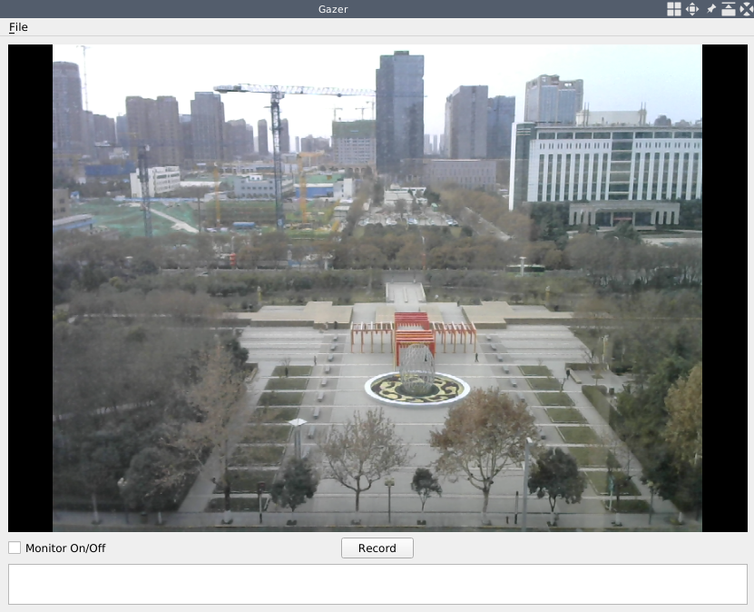
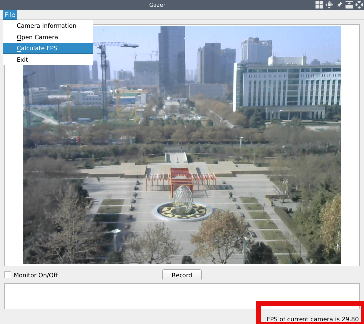
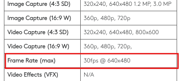
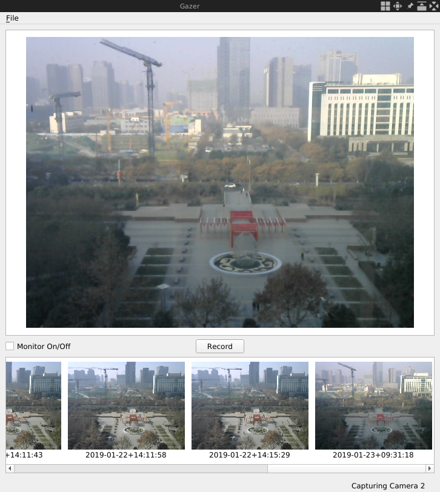
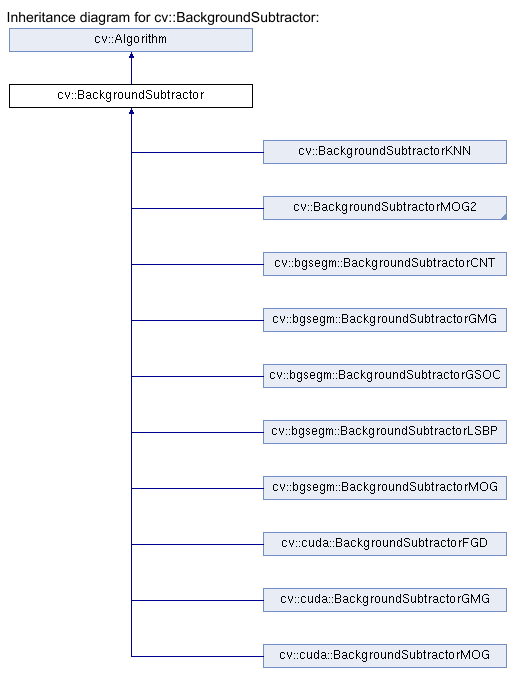
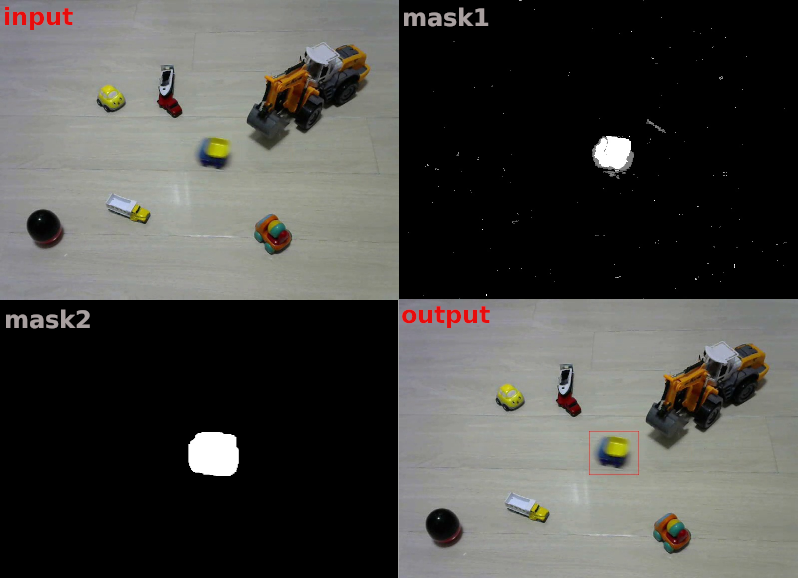
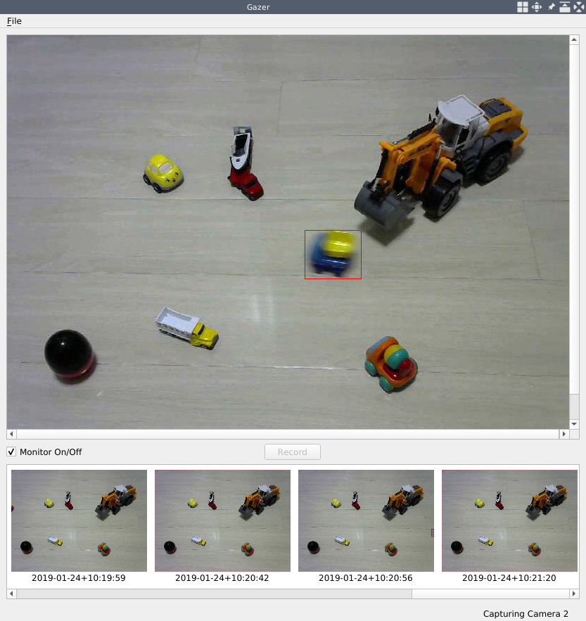

# ホームセキュリティアプリケーション

第2章「プロ並みの画像編集」では、独自の画像編集アプリケーションを作ることで、Qtライブラリのプラグイン機構とOpenCVライブラリの多くの画像フィルタと変換について学びました。この章では、画像を扱うことから、動画を扱うことに移行します。例えば、ウェブカメラからキャプチャしたビデオをリアルタイムで再生したり、ビデオフィードからビデオの一部を録画したり、フレーム/秒（FPS）を計算したり、ビデオフィードをリアルタイムで解析して動きを検出したりなど、PCのウェブカメラを使っていろいろなことができる新しいアプリケーションを構築します。

この章では、以下のトピックを取り上げます。

* ユーザーインターフェース（UI）の設計と作成
* カメラとビデオの操作
* 映像の記録
* リアルタイムのFPS計算
* モーション解析と動きの検出
* デスクトップアプリケーションでモバイルに通知を送る

***

## 技術的要件

前の章で見たように、Qt バージョン 5 が（少なくとも）インストールされており、C++ と Qt プログラミングの基本的な知識を持っていることが要求されます。また、OpenCVの最新版（4.0）が正しくインストールされている必要があります。この章では、OpenCV の core モジュールと imgproc モジュールの他に、video モジュールと videoio モジュールも利用されます。前の章に引き続き、これらの要件はすでに満たされている必要があります。

この章では、カメラの扱い方を紹介しますので、パソコンからアクセスできるWebカメラ（内蔵または外付け）が必要です。

また、マルチスレッドに関する基本的な知識もこの章の必要条件です。

この章のコードはすべて、本書のGitHubリポジトリ（[https://github.com/PacktPublishing/Qt-5-and-OpenCV-4-Computer-Vision-Projects/tree/master/Chapter-03](https://github.com/PacktPublishing/Qt-5-and-OpenCV-4-Computer-Vision-Projects/tree/master/Chapter-03)）で見ることができます。

次のビデオでコードの動作を確認してください： [http://bit.ly/2Fj4BJ8](http://bit.ly/2Fj4BJ8)

***

## Gazerアプリケーション

カメラ操作、映像処理、モーション解析について掘り下げるため、全く新しいアプリケーションを開発します。これらのトピックを学ぶだけでなく、Webカメラでビデオを録画し、ホームセキュリティを監視し、不審な動きが検出されたらモバイルで通知するという、多くの実用的な機能を持つアプリケーションを手に入れることができます。その機能は以下の通りです。

* ウェブカメラを開き、撮影した映像をリアルタイムで再生することができます。
* スタート/ストップボタンでウェブカメラからビデオを録画する。
* 保存されたビデオの一覧表示
* 動きを検知してビデオを保存し、不審な動きがあれば携帯電話に通知を送る
* カメラとアプリケーションの状態に関する情報を表示する。

これらの機能を明確にした上で、UIをデザインしていきます。ここでも、第1章「画像ビューアの構築」で使用したオープンソースのGUIプロトタイピングツール「Pencil」を使って、以下の図のように、アプリケーションのプロトタイプのワイヤーフレームを描きます。


先ほどのワイヤーフレームにあるように、ウィンドウ全体を、メニューバー、動画を再生するメインエリア、操作ボタンのあるオペレーションエリア、保存した動画のサムネイルが配置される水平リスト、そしてステータスバーの5つのパーツに分割しています。

このデザインのソースファイルは、GitHubのコードリポジトリ（[https://github.com/PacktPublishing/Qt-5-and-OpenCV-4-Computer-Vision-Projects](https://github.com/PacktPublishing/Qt-5-and-OpenCV-4-Computer-Vision-Projects)）から入手できます。このファイルは、リポジトリのルートディレクトリに存在し、WireFrames.epgzという名前です。このファイルは、Pencilアプリケーションで開くことを忘れないでください。ワイヤーフレームは、このファイルの2ページ目にあります。

***

### プロジェクトの開始と UI のセットアップ

さて、アプリケーションがどのようなものかわかったので、腕まくりをして Qt で UI をセットアップしてみましょう!

プロジェクトと Gazer アプリケーションに名前を付けます。 では、ターミナルでプロジェクトを作成しましょう。

```sh
     $ mkdir Gazer/
     $ cd Gazer/
     $ touch main.cpp
     $ ls
     main.cpp
     $ qmake -project
     $ ls
     Gazer.pro main.cpp
     $
```

次に、Gazer.pro プロジェクトファイルを編集してみましょう。まず、アプリケーションの情報と、使用する Qt ライブラリのモジュールを設定する必要があります。

```qmake
     TEMPLATE = app
     TARGET = Gazer
     INCLUDEPATH += .

     QT += core gui multimedia
     greaterThan(QT_MAJOR_VERSION, 4): QT += widgets
```

私たちはqmakeとQtプロジェクトのプロジェクトファイルに非常に慣れているので、ここでこのコードの断片を一行ずつ説明する必要はありません。唯一注意すべき点は、この後使用するQtライブラリのマルチメディアモジュールをインクルードしていることです。

次に、OpenCVライブラリの設定を行います。

```qmake
     unix: !mac {
         INCLUDEPATH += /home/kdr2/programs/opencv/include/opencv4
         LIBS += -L/home/kdr2/programs/opencv/lib -lopencv_core -lopencv_imgproc -lopencv_video -lopencv_videoio
     }

     unix: mac {
         INCLUDEPATH += /path/to/opencv/include/opencv4
         LIBS += -L/path/to/opencv/lib -lopencv_world
     }

     win32 {
         INCLUDEPATH += c:/path/to/opencv/include/opencv4
         LIBS += -lc:/path/to/opencv/lib/opencv_world
     }
```

OpenCV ライブラリの video と videoio モジュールを LIBS キーの値の最後に追加しています。もう一つ注意すべき点は、このコードのパスを、実際の OpenCV のインストールパスに変更する必要があるということです。

最後に、ヘッダとソースをセットアップしましょう。

```qmake
     HEADERS += mainwindow.h
     SOURCES += main.cpp mainwindow.cpp
```

ヘッダファイルを含めて3つのソースファイルをセットしていますが、今は空のmain.cppファイルが1つだけです。この点については心配しないでください。この種の作業は以前のプロジェクトでたくさん行っているので、コピー、ペースト、変更を行ってみましょう。

1. 「第1章 画像ビューアの構築」の ImageViewer プロジェクトから、main.cpp ファイルを Gazer プロジェクトにコピーし、その内容を変更しないようにします。
2. mainwindown.h を Gazer プロジェクトにコピーし、ファイルを開いて、クラス本体の Q_OBJECT マクロ、コンストラクタ、デストラクタ以外の行をすべて削除してください。変更後のクラス本体は以下のようになっているはずです。

```cpp
       class MainWindow : public QMainWindow
       {
           Q_OBJECT
       public:
           explicit MainWindow(QWidget *parent=nullptr);
           ~MainWindow();
       }
```

3. 空のファイルとしてmainwindow.cppのソースファイルを作成し、そこにコンストラクタとデストラクタの実装を追加します。

```cpp
       MainWindow::MainWindow(QWidget *parent) :
           QMainWindow(parent)
       {
       }

       MainWindow::~MainWindow()
       {
       }
```

これで、私たちのアプリケーションをコンパイルして実行することができます。しかし、実行したときに見えるのは空白のウィンドウでしょう。

設計通りの完全なUIを設定するために、いくつかのQtウィジェットを空白のウィンドウに追加する必要があります。まず、MainWindowクラスのボディのプライベートセクションで、QMenuメソッドとそのメニューのための3つのQActionメソッドを宣言します。

```cpp
     private:
         QMenu *fileMenu;

         QAction *cameraInfoAction;
         QAction *openCameraAction;
         QAction *exitAction;
```

次に、動画を表示するメインエリアです。映像はOpenCVライブラリを使って1フレームずつキャプチャされ、各フレームは画像そのものとなります。動画を再生するには、フレームをキャプチャすると同時に、そのフレームを一定の範囲に表示すればよいのです。そのため、やはりQGraphicsSenceとQGraphicsViewを使ってフレームを1つずつ表示し、動画を再生しているような効果を実現します。

```cpp
         QGraphicsScene *imageScene;
         QGraphicsView *imageView;
```

そして、操作部のボタン、保存した動画の横並びリスト、ステータスバーです。

```cpp
         QCheckBox *monitorCheckBox;
         QPushButton *recordButton;

         QListView *saved_list;

         QStatusBar *mainStatusBar;
         QLabel *mainStatusLabel;
```

最初に宣言した行のチェックボックスは、セキュリティモニターのステータスがオンになっているかどうかを示すために使用されます。もしチェックされていれば、このアプリケーションは動体検知を行い、何かあったときに通知を送ります。そうでなければ、アプリケーションはカメラプレーヤーとしてのみ動作します。プッシュボタンは、動画の撮影を開始または停止するために使用されます。

ヘッダーファイルでは、これらのウィジェットを宣言しましたが、プロトタイプのワイヤーフレームで設計したように、これらのウィジェットを正しい位置に配置するには、Qt のレイアウトシステムを使用する必要があります。Qt レイアウトシステムを使用すると、親ウィジェットの子ウィジェットを自動的に配置し、利用可能なスペースをすべて子ウィジェットが適切に使用できるようにすることができます。また、管理対象ウィジェットの親ウィジェットのサイズや位置が変更された場合や、管理対象ウィジェット自体のサイズや位置が変更された場合も、レイアウトシステムが全てのウィジェットの配置を管理し、確実に変更します。

このレイアウトシステムのために、Qtは、すべてQLayoutクラスから派生した多くのクラスを提供しています。いくつかの例を見てみましょう。

* QHBoxLayout クラスは、ウィジェットを左から右へ横一列に並べます。
* QVBoxLayout クラスは、ウィジェットを縦列に上から下へ並べます。
* QGridLayout クラスは、複数のセルを占有するウィジェットを二次元のグリッドに配置します。
* QFormLayoutクラスは，2列のグリッドにウィジェットを配置し，各行には説明用のラベルフィールドに配置された2つのウィジェットを配置します．

今回のアプリケーションGazerのデザインには、複数行で1列だけのQGridLayoutクラスを使用することができます。私の概算では、この3つの部分（メイン領域、操作領域、保存された動画のリスト）の高さの比率は、12：1：4くらいになります。したがって、17×1のQGridLayoutクラスを作れば、今回設計・宣言したウィジェットを配置することができます。

レイアウトシステムの知識が導入されたので、設計したUIをフルに使って設定してみましょう。まず、MainWindowクラスの本体に、initUIとcreateActionsという2つのプライベートメソッドを宣言します。

```cpp
     private:
         void initUI();
         void createActions();
```

そして、それらを実装するためにmainwindow.cppのソースファイルに移動します。まず、void MainWindow::initUI()を見てみましょう。このメソッドでは、アプリケーションのメインウィンドウを適切なサイズに設定し、冒頭にファイルメニューを作成しています。

```cpp
         this->resize(1000, 800);
         // setup menubar
         fileMenu = menuBar()->addMenu("&File");
```

次に、ウィンドウの中心領域を設定します。

```cpp
         QGridLayout *main_layout = new QGridLayout();
         imageScene = new QGraphicsScene(this);
         imageView = new QGraphicsView(imageScene);
         main_layout->addWidget(imageView, 0, 0, 12, 1);
```

このコードでは、QGridLayout クラスのインスタンスを新規に作成しています。このクラスのサイズは、以前計画したとおり 17 x 1 です。次に、QGraphicsSence と QGraphicsView のインスタンスを作成し、画像を表示したり、動画を再生したりするのに使用します。最後の行は、レイアウトにウィジェットを追加する方法を示すもので、非常に新しいものです。QGridLayoutインスタンスのaddWidgetメソッドを5つの引数で呼び出します。最初の引数はレイアウトに追加したいウィジェットで、次の4つの数字は追加されたウィジェットが占める矩形（開始行、開始列、跨ぐ行数、跨ぐ列数）を記述しています。このコードでは、QGraphicsViewはグリッドレイアウトの最初の12行を占めることになります。

次の動画再生エリアは、操作エリアです。このエリアには、2つのウィジェット、チェックボックス、プッシュボタンがあります。したがって、それらを配置するための新しいレイアウトが必要です。ここでの配置もQGridLayoutを選択することにします。つまり、メインのグリッドレイアウトの中に別のグリッドレイアウトをネストさせることになります。

```cpp
         QGridLayout *tools_layout = new QGridLayout();
         main_layout->addLayout(tools_layout, 12, 0, 1, 1);

         monitorCheckBox = new QCheckBox(this);
         monitorCheckBox->setText("Monitor On/Off");
         tools_layout->addWidget(monitorCheckBox, 0, 0);

         recordButton = new QPushButton(this);
         recordButton->setText("Record");
         tools_layout->addWidget(recordButton, 0, 1, Qt::AlignHCenter);
         tools_layout->addWidget(new QLabel(this), 0, 2);
```

前のコードの最初の 2 行で、tools_layout という新しいグリッドレイアウトを作成し、それをメインのグリッドレイアウトに追加しています。12, 0, 1, 1を位置決め矩形として、この子レイアウトはメイン・グリッドレイアウトの1行、つまり13行目だけを占有します。子レイアウトの位置が決まったら、子ウィジェットを作成し、追加してみましょう。ウィジェットは1つの行に水平に配置する必要があるため、レイアウトのサイズは1xNとなります。前述したように、操作エリアに配置するウィジェットは2つありますが、デザイン上、最も重要なウィジェットであるレコードプッシュボタンを横方向の中央に配置したいと思います。そのために、tools_layoutに空のQLableメソッドというプレースホルダーを追加しています。これで、レイアウトに3つのウィジェットができました。レコード・プッシュ・ボタンは2番目、つまり真ん中のウィジェットです。

前のコードでは、ウィジェットを作成し、テキストを設定し、レイアウトに追加していることは明らかです。グリッド・レイアウト・オブジェクトのaddWidgetメソッドを呼び出すとき、メイン・レイアウト・オブジェクトで呼び出したときのような5つの引数ではなく、3つの引数しか使っていないことに注目すべきです。これは、このレイアウトではウィジェットの行や列をまたがないためで、行インデックスと列インデックスを与えるだけで、ウィジェットの1つのセルを見つけるのに十分です。また、プッシュボタンを追加する際には、Qt::AlignHCenter という追加のアライメント引数を使用し、ボタンが中央のセルだけでなくそのセルの中心にも配置されるようにしています。

操作領域の下には、保存されたビデオのリストが表示されます。Qt は、ここで直接使用できる QListView というウィジェットを提供しているので、そのオブジェクトを作成してメイン レイアウトに追加するだけです。

```cpp
         // list of saved videos
         saved_list = new QListView(this);
         main_layout->addWidget(saved_list, 13, 0, 4, 1);
```

12:1:4 の比率を覚えていますか？ここでは、リストウィジェットがメイングリッドレイアウトの14行目から始まる4つの行を占めるようにします。

ここまでで、メイン・レイアウトのすべてのウィジェットが所定の位置に配置されました。いよいよメイン・レイアウトをメイン・ウィンドウに追加します。ここで、this->setLayout(main_layout); を直接呼び出すことはできません。なぜなら、メイン・ウィンドウはそのコンテンツを管理する独自の方法を持っているからです。前の章で完成したプロジェクトを思い出すかもしれませんが、これらのプロジェクトではメインウィンドウのコンテンツを設定するために setCentralWidget を呼び出したことに気づかれることでしょう。ここでは、メイン・グリッド・レイアウトをレイアウトとして持つ新しいウィジェットを作成し、このウィジェットをメイン・ウィンドウのセントラル・ウィジェットとして設定できます。

```cpp
         QWidget *widget = new QWidget();
         widget->setLayout(main_layout);
         setCentralWidget(widget);
```

次に見るべきは、ステータスバーとアクションです。

```cpp
         // setup status bar
         mainStatusBar = statusBar();
         mainStatusLabel = new QLabel(mainStatusBar);
         mainStatusBar->addPermanentWidget(mainStatusLabel);
         mainStatusLabel->setText("Gazer is Ready");

         createActions();
```

先のコードにあるように、ステータスバーの他に、initUIメソッドの最後には、MainWindow::createActionsを呼んで、Fileメニューにアクションを作成しています。createActionsメソッドの実装は簡単で、QActionsのインスタンスを生成して、Fileメニューに追加しています。このようなことは、これまでのプロジェクトで何度もやってきたので、ここでは一行ずつの説明はしていません。exitアクションについては、アプリケーションのquitスロットをそのトリガーされたシグナルに接続します。他のアクションについては、現時点ではスロットを用意していませんが、次のセクションで用意する予定です。

さて、MainWindowクラスのコンストラクタでinitUIメソッドを呼び出します。最後に、完全なUIを設定しましたので、アプリケーションをコンパイルして実行し、どのように見えるかを見てみましょう。


ご覧のように、Qtが提供するレイアウトシステムの助けを借りて、設計されたUIを完璧に実装することができました。この強力なレイアウトシステムについてもっと知りたければ、[https://doc.qt.io/qt-5/layout.html](https://doc.qt.io/qt-5/layout.html) のドキュメントを参照してください。

***

## カメラへのアクセス

前項では、アプリケーションのUIを設定しました。このセクションでは、カメラから提供されたビデオフィードをパーソナルコンピュータから再生します。

カメラにアクセスする前に、カメラに関するいくつかの情報を調べておく必要があります。OpenCVを使う場合は、ビデオをキャプチャしたいカメラのインデックスが必要で、Qtを使う場合は、そのデバイス名が必要です。典型的なラップトップの場合、通常、インデックスが0のデフォルトの内蔵ウェブカメラが1つありますが、その名前はプラットフォームや環境に依存します。コンピュータに複数のウェブカメラがある場合、通常、それらのインデックスと名前の両方がプラットフォームまたは環境に依存します。この情報を得るには、QtライブラリのQCameraInfoクラスを使用します。

***

### Qtによるカメラのリストアップ

QtライブラリのQCameraInfoクラスを使うと、現在のコンピュータで利用可能なカメラを簡単に取得することができます。このクラスにはavailableCamerasという静的メソッドがあり、QCameraInfoオブジェクトのリストを返します。

さて、この作業を行うために、cameraInfoActionのスロットを追加していきます。まず、mainwindow.hファイルのMainWindowクラスの本体に、プライベートスロットを宣言します。

```cpp
     private slots:
         void showCameraInfo();
```

そして、その実装を以下のように示す。

```cpp
     void MainWindow::showCameraInfo()
     {
         QList<QCameraInfo> cameras = QCameraInfo::availableCameras();
         QString info = QString("Available Cameras: \n");

         foreach (const QCameraInfo &cameraInfo, cameras) {
             info += " - " + cameraInfo.deviceName() + ": ";
             info += cameraInfo.description() + "\n";
         }
         QMessageBox::information(this, "Cameras", info);
     }
```

このコードでは、カメラ情報リストを取得し、リスト内のすべてのカメラを含む人間が読める文字列を作成し、プロンプトメッセージボックスでそれを表示します。

最後に、このスロットをMainWindow::createActionsメソッド内のcameraInfoActionのトリガーシグナルに接続します。

```cpp
         connect(cameraInfoAction, SIGNAL(triggered(bool)), this, SLOT(showCameraInfo()));
```

それでは、Gazer アプリケーションをコンパイルして実行してみましょう。ここで、ファイルメニューのカメラ情報という項目をクリックして、どのような情報が提供されるかを見てみましょう。


私のノートパソコンには内蔵のウェブカメラとUSBポートに接続された外付けのウェブカメラがあり、アプリケーションは私のパソコンで実行中に2つのカメラを表示しています。  /dev/video0と/dev/video2です。私はノートパソコンでGNU/Linuxを使用していますが、このプラットフォームでは、デバイス名は/dev/video\<N>のパターンで、\<N>はカメラのインデックスを表しています。他のオペレーティングシステムを使用している場合、表示される情報は私のとは異なるかもしれません。

*この文脈では、Available Cameras の単語は、カメラがコンピュータに正しく接続され、駆動しており、ビジー状態でないこと、つまり、どのアプリケーションによっても使用されていないことを意味します。カメラがアプリケーションによって使用されている場合、そのカメラはQCameraInfo::availableCamerasメソッドの戻りリストには含まれません。*

***

### キャプチャと再生

前節でウェブカメラの情報を得たので、選んだウェブカメラからのビデオフィードをOpenCVを使ってキャプチャし、再生してみましょう。

OpenCV を使ってビデオをキャプチャするのはとても簡単です。以下はその例です。

```cpp
     #include <iostream>
     #include "opencv2/opencv.hpp"

     using namespace std;
     using namespace cv;

     int main() {
         VideoCapture cap(0);
         if(!cap.isOpened()) {
             return -1;
         }

         while(1) {
             Mat frame;
             cap >> frame;

             if (frame.empty())
                 break;

             imshow( "Frame", frame );

             char c = (char)waitKey(25);
             if(c==27) // ESC
                 break;
         }

         cap.release();
         destroyAllWindows();

         return 0;
     }
```

このコードでは、まずデフォルトのウェブカメラのインデックスでVideoCaptureのインスタンスを生成し、カメラが正常にオープンされたかどうかをテストします。開いた場合は、無限ループに入ります。ループ内では、VideoCapture インスタンスから Mat インスタンスに画像を読み込みます。ループが進むと、ウェブカメラから連続した画像が読み込まれ、それらが動画を構成することになります。ビデオ処理においては、この連続した画像の 1 つ 1 つを通常フレームと呼びます。そのため、前のコードではフレームという名前を使っています。フレームを読み込んだら、それが空かどうかをチェックします。trueの場合は無限ループを抜け、そうでない場合はimshow関数を呼び出して表示します。次に、キーが押されるまで最大25ミリ秒待ちます。待機中にEscキーが押された場合はループを抜け、そうでない場合は無限ループが続く。ループ終了後は、カメラの解放、映像表示用のウィンドウの破棄など、割り当てたリソースを解放しています。

このように、OpenCVを使った動画のキャプチャは非常に簡単です。しかし、この機能を実際のGUIアプリケーションに組み込み始めると、少し複雑になってきます。第2章「プロ並みの画像編集」の「カートゥーン効果」で、画像にカートゥーン効果を生成する機能を作ったのを覚えていますか？その機能を実現するために、かなり低速なアルゴリズムをいくつか採用しています。GUIスレッドで遅いタスクを実行すると、そのタスクの実行期間中にUIがフリーズしてしまいます。アプリケーションを複雑にしないために、その場合はアルゴリズムを最適化してタスクの実行時間を短くし、GUIのフリーズ時間を短くする方法に頼ります。しかし、今回のビデオキャプチャの場合、時間軸で最適化する方法がないため、ユーザーがカメラを開いている間は常にフレームをキャプチャし続けなければなりません。GUIスレッドでビデオをキャプチャすると、UIがずっとフリーズしたままになってしまいます。そこで、アプリケーションのインターフェイスをレスポンシブに保つために、GUIスレッドとは異なる別のスレッドでビデオをキャプチャする必要があります。

Qtライブラリには、アプリケーションのマルチスレッド化に対応するためのさまざまな技術が用意されています。QThreadクラスは、最もわかりやすく、基本的な機能です。シンプルでありながら、強力で柔軟性があります。このセクションでは、主にキャプチャタスクを新しいスレッドに分離するためにこのクラスを使用します。

ビデオキャプチャを別のスレッドで行うために、まず必要なことは、QThreadクラスから派生した新しいクラスを定義することです。このクラスをCaptureThreadと名付け、capture_thread.hファイルで宣言します。

ヘッダーファイルを見てみましょう。このファイルの最初と最後には、include-onceマクロの定義と、ヘッダーファイルのincludingディレクティブがあります。

```cpp
     #ifndef CAPTURE_THREAD_H
     #define CAPTURE_THREAD_H

     #include <QString>
     #include <QThread>
     #include <QMutex>

     #include "opencv2/opencv.hpp"

     // ... the class declaration goes here.

     #endif // CAPTURE_THREAD_H
```

真ん中がクラス宣言です。

```cpp
     class CaptureThread : public QThread
     {
         Q_OBJECT
     public:
         CaptureThread(int camera, QMutex *lock);
         CaptureThread(QString videoPath, QMutex *lock);
         ~CaptureThread();
         void setRunning(bool run) {running = run; };

     protected:
         void run() override;

     signals:
         void frameCaptured(cv::Mat *data);

     private:
         bool running;
         int cameraID;
         QString videoPath;
         QMutex *data_lock;
         cv::Mat frame;
     };
```

このクラスは、前に述べたようにQThreadクラスから派生したもので、その本体の最初の行でQ_OBJECTマクロを使って、Qtライブラリのメタ・オブジェクト・システムにこのクラスの面倒を見るように指示しています。

そして、publicセクションで2つのコンストラクタと1つのデストラクタを宣言しています。最初のコンストラクタは、ターゲットのウェブカメラのインデックスである整数と、レース状態でのデータ保護に使用される QMutex のポインタを受け取ります。2番目のコンストラクタは、ビデオファイルへのパスとして扱われる文字列とQMutexのポインタを受け取ります。このコンストラクタで、ビデオファイルを使用してウェブカメラをエミュレートすることができます。また、setRunningというパブリックメソッドがあり、これはキャプチャスレッドの実行状態を設定するために使用されます。

次に、protectedセクションです。このセクションでは、runという名前のメソッドを宣言しています。overrideキーワードは、このメソッドが仮想メソッドであることと、ベースクラスのメソッドと同じ名前のメソッドをオーバーライドしていることを示します。QThreadのrunメソッドは、スレッドの起点となるメソッドです。スレッドのstartメソッドを呼び出すと、新しいスレッドが生成された後、そのrunメソッドが呼び出されます。このメソッドでの捕捉作業は後ほど行います。

そして、 Mat オブジェクトへのポインタを唯一の引数として受け取る、frameCapture という名前のシグナルを宣言します。このシグナルは、Webcam からフレームがキャプチャされるたびに出力されます。このシグナルに興味がある場合は、スロットを接続することができます。

最後に、private セクションで、多くのメンバフィールドを宣言しています。

* スレッドステートのためのrunning
* cameraID: カメラのインデックス
* videoPath: ウェブカメラをエミュレートするために使用するビデオのパス。
* data_lock: レースコンディションでデータを保護するためのロック
* frame: 現在キャプチャされているフレームを格納するためのもの

クラスの宣言は以上です。次に、capture_thread.cppファイルのメソッド実装に移ります。まず、コンストラクタとデストラクタです。どれも簡単で、フィールドの初期化などの情報を提供するだけです。

```cpp
     CaptureThread::CaptureThread(int camera, QMutex *lock):
         running(false), cameraID(camera), videoPath(""), data_lock(lock)
     {
     }

     CaptureThread::CaptureThread(QString videoPath, QMutex *lock):
         running(false), cameraID(-1), videoPath(videoPath), data_lock(lock)
     {
     }

     CaptureThread::~CaptureThread() {
     }
```

そして、最も重要な部分であるrunメソッドの実装が行われます。

```cpp
     void CaptureThread::run() {
         running = true;
         cv::VideoCapture cap(cameraID);
         cv::Mat tmp_frame;
         while(running) {
             cap >> tmp_frame;
             if (tmp_frame.empty()) {
                 break;
             }
             cvtColor(tmp_frame, tmp_frame, cv::COLOR_BGR2RGB);
             data_lock->lock();
             frame = tmp_frame;
             data_lock->unlock();
             emit frameCaptured(&frame);
         }
         cap.release();
         running = false;
     }
```

このメソッドはスレッドが生成された直後に呼ばれ、このメソッドから戻ったときにスレッドの寿命が終了します。したがって、このメソッドに入るときに実行状態を true に設定し、このメソッドから戻る前に実行状態を false に設定します。そして、冒頭の例と同様に、カメラインデックスを用いて VideoCapture クラスのインスタンスを生成し、キャプチャされたフレームを保存するために Mat のインスタンスを生成します。その後、無限ループに入ります。このループでは、フレームをキャプチャして、それが空であるかどうかをチェックします。ここでは、OpenCV を用いてフレームをキャプチャしているので、キャプチャフレームの色の順番は RGB ではなく BGR になっています。Qtで表示することを考えると、RGBを色順とする新しいフレームに変換する必要があります。これが、cvtColor関数の呼び出しの目的です。

キャプチャしたフレームの準備が終わったら、それをframeクラスのメンバに代入し、先ほど変更したframeメンバフィールドを指すポインタを持つframeCaptureシグナルを出力しています。このシグナルに興味がある場合は、スロットを接続することができます。接続されたスロットでは、このフレームメンバーへのポインタを引数として持つことになります。つまり、接続されたスロットでは、このフレームオブジェクトから自由に読み書きすることができるのです。接続されたスロットは、捕捉スレッドとは異なる別のスレッドで実行される可能性が高いことを考えると、2つの異なるスレッドで同時にフレームメンバーが変更される可能性が非常に高く、この挙動は中のデータを破損させる可能性があります。このような事態を防ぐために、QMutexを使用して、フレームメンバーフィールドにアクセスするスレッドが常に1つだけであることを確認します。ここで使用したQMutexのインスタンスは、QMutex *data_lockメンバフィールドです。フレーム・メンバーに割り当てる前にそのロック・メソッドを呼び出し、割り当て後にそのアンロック・メソッドを呼び出しています。

誰かが実行状態をfalseに設定すると（通常は別のスレッドで）、無限ループが解除されます。
ループが解除され、その後、VideoCapture インスタンスを解放し、実行中フラグが false に設定されるようにするなど、いくつかのクリーンアップ作業が行われます。

この時点で、キャプチャスレッドのすべての作業が完了します。次に、このスレッドをメインウィンドウに統合する必要があります。では、さっそく始めましょう。

まず、mainwindow.hヘッダーファイルで、MainWindowクラスにいくつかのプライベートメンバーフィールドを追加します。

```cpp
         cv::Mat currentFrame;

         // for capture thread
         QMutex *data_lock;
         CaptureThread *capturer;
```

currentFrameメンバは、キャプチャースレッドがキャプチャしているフレームを格納するために使用します。 capturerは、キャプチャースレッドのハンドルで、ユーザがカメラを開いたときにビデオのキャプチャ作業をするために使用しています。QMutextオブジェクトのdata_lockは、レースコンディションでCaptureThread.frameのデータを保護するために使用します。GUIスレッドとキャプチャースレッドの両方で使用されます。そして、MainWindowクラスのコンストラクタで、initUIメソッドを呼び出した後に、data_lockフィールドを初期化します。

```cpp
         initUI();
         data_lock = new QMutex();
```

次に、mainwindow.hヘッダーファイルに戻り、クラス宣言でさらに2つのプライベートスロットを追加してみましょう。

```cpp
         void openCamera();
         void updateFrame(cv::Mat*);
```

openCameraスロットは、新しいキャプチャスレッドを作成するために使用され、ファイルメニューのOpen Cameraアクションがトリガーされたときに呼び出されます。まず、このスロットをcreateActionsメソッドでOpen Cameraアクションのトリガーされたシグナルに接続します。

```cpp
         connect(openCameraAction, SIGNAL(triggered(bool)), this, SLOT(openCamera()));
```

続いて、openCameraスロットの実装に入ります。

```cpp
         int camID = 2;
         capturer = new CaptureThread(camID, data_lock);
         connect(capturer, &CaptureThread::frameCaptured, this, &MainWindow::updateFrame);
         capturer->start();
         mainStatusLabel->setText(QString("Capturing Camera %1").arg(camID));
```

このコードでは、CaptureThreadクラスのインスタンスを、カメラインデックスとMainWindowのコンストラクタで生成したQMutexオブジェクトで生成し、capturerのメンバフィールドに代入しています。

そして、capturerのframeCapturedシグナルをメインウィンドウのupdateFrameスロットに接続し、CaptureThread::frameCapturedシグナルが発せられると、そのシグナルが発せられたときと同じ引数でMainWindow::updateFrameスロット（メソッド）が呼び出されるようにしています。

この準備が終わったので、capturerと呼ばれるCaptureThreadインスタンスのstartメソッドを呼び出すことで、キャプチャーのスレッドを開始することができます。ちなみに、あるカメラが開かれたことは、ステータスバーにテキストを表示することでユーザーに伝えています。

*既に述べたように、私のラップトップには2つのウェブカメラがあり、インデックスが2である2番目のものを使用しています。 あなたの選択に従って、camID変数の値を正しいカメラインデックスに変更する必要があります。一般的なケースでは、デフォルトのウェブカムには値0が使用されるべきです。*

これでキャプチャスレッドが起動し、カメラからのフレームをキャプチャして frameCaptured シグナルを出力し続けます。このシグナルに反応するようにメインウィンドウのupdateFrameスロットを埋めましょう。

```cpp
     void MainWindow::updateFrame(cv::Mat *mat)
     {
         data_lock->lock();
         currentFrame = *mat;
         data_lock->unlock();

         QImage frame(
             currentFrame.data,
             currentFrame.cols,
             currentFrame.rows,
             currentFrame.step,
             QImage::Format_RGB888);
         QPixmap image = QPixmap::fromImage(frame);

         imageScene->clear();
         imageView->resetMatrix();
         imageScene->addPixmap(image);
         imageScene->update();
         imageView->setSceneRect(image.rect());
     }
```

このスロットでは、前述したように、CaptureThreadによってキャプチャされたフレームへのポインタを引数として持っています。スロット本体では、そのキャプチャしたフレームをメインウィンドウクラスのcurrentFrameフィールドに代入しています。この代入式では、キャプチャしたフレームを読み込んでから、代入を行っています。そこで、データが壊れないように、data_lock mutex を使って、キャプチャしたスレッドがフレームフィールドに書き込んでいる間は、読み込みが行われないようにしています。

キャプチャしたフレームを取得したら、第2章「プロ並みの画像編集」で作成した画像編集アプリケーションで行ったように、グラフィックスシーンとビューでそれを表示します。

ユーザがOpen Cameraアクションをクリックすると、そのアクションのトリガー信号が出力され、openCameraスロットが呼び出され、キャプチャスレッドが生成されてカメラからのフレームをキャプチャし始めます。そして、メインウィンドウの updateFrame スロットがキャプチャしたフレームごとに呼び出されます。その結果、メインウィンドウのメインエリアのグラフィックビューには、キャプチャした連続したフレームが次々と素早く表示され、エンドユーザには動画が再生されているのが見えるようになります。

しかし、このコードにはまだ不具合があります。ユーザーが「カメラを開く」アクションを複数回クリックすると、複数のキャプチャ用スレッドが作成され、それらが同時に実行されます。これは、私たちが望んでいる状況ではありません。そこで、新しいスレッドを開始する前に、すでに実行中のスレッドがないかどうかを確認し、もしある場合はそれを停止してから新しいスレッドを開始する必要があります。そのために、openCameraスロットの最初に次のコードを追加しましょう。

```cpp
         if(capturer != nullptr) {
             // if a thread is already running, stop it
             capturer->setRunning(false);
             disconnect(capturer, &CaptureThread::frameCaptured, this, &MainWindow::updateFrame);
             connect(capturer, &CaptureThread::finished, capturer, &CaptureThread::deleteLater);
         }
```

このコードでは、CaptureThreadインスタンス、つまりcapturerの実行状態をfalseに設定し、nullでないことがわかったら無限ループを解除するようにしています。そして、接続されているシグナルとスロットを切断し、終了したシグナルに自分自身の新しいスロット、deleteLaterを接続します。無限ループが終了し、runメソッドが戻った後、スレッドはそのライフタイムが終了し、そのfinishedシグナルが発信されます。finishedシグナルからdeleteLaterスロットに接続されているため、スレッドが終了するとdeleteLaterスロットが呼び出されます。その結果、プログラムの制御フローがQtライブラリのイベントループに戻ったときに、Qtライブラリはこのスレッドインスタンスを削除することになります。

さて、新しいヘッダーファイルとソースファイルをアプリケーションに追加できるように、Gazer.pro プロジェクトファイルを更新してみましょう。

```qmake
     HEADERS += mainwindow.h capture_thread.h
     SOURCES += main.cpp mainwindow.cpp capture_thread.cpp
```

次に、アプリケーションをコンパイルして実行する必要があります。

```sh
     $ qmake -makefile
     $ make
     g++ -c -pipe -O2 -Wall -W...
     # output truncated
     $ echo $LD_LIBRARY_PATH
     /home/kdr2/programs/opencv/lib/
     $ ./Gazer
     # the application is running now.
```

アプリケーションの起動後、ファイルメニューの「カメラを開く」アクションをクリックすると、我々のカメラの視点からの景色を見ることができます。以下は、私のウェブカメラから見た私のオフィスの外の風景です。


***

### スレッドとリアルタイムビデオ処理の性能

このセクションでは、マルチスレッド技術を私たちのアプリケーションに取り込みます。これは以下の2つの目的のためです。

* メインスレッド（GUIスレッド）がフリーズするのを避けるため
* 動画処理における性能低下の可能性を回避するため

まず、前述したように、GUI スレッドで低速なタスクを実行すると、そのタスクの実行期間中に UI がフリーズしてしまいます。カメラから動画をキャプチャして処理するのは継続的な処理であり、カメラを閉じるまで延々とGUIをフリーズさせ続けることになります。そのため、メインスレッドとビデオキャプチャーのスレッドを分離する必要があります。

一方、動画処理、特にリアルタイムでの動画処理は、CPUに負荷のかかる、時間に追われる作業です。フレームをキャプチャし、処理し、表示する-すべての作業をできるだけ早く行わなければならない。

そのために重要なのが、各フレームを処理するためのアルゴリズムです。そのためには、十分なパフォーマンスが必要です。あまりに遅いと、カメラで新しいフレームが生成されている間、プログラムは前に撮影したフレームの処理に忙しく、新しいフレームを読み込むチャンスがありません。そうすると、新しいフレームが失われてしまうのです。

もうひとつのポイントは、フレームのデータを共有するスレッドが複数あり、同時にデータの安全性を保つためにロックを使用する場合、ロックがスレッドを長時間ブロックしてはいけないということです。例えば、今回のアプリケーションでは、キャプチャースレッドで、次のようなロックを使用するとします。

```cpp
              while(running) {
                  data_lock->lock(); // notice here,
                  cap >> tmp_frame;
                  if (tmp_frame.empty()) {
                      data_lock->unlock(); // and here,
                      break;
                  }
                  cvtColor(tmp_frame, tmp_frame, cv::COLOR_BGR2RGB);
                  frame = tmp_frame;
                  data_lock->unlock(); // and here.
                  emit frameCaptured(&frame);
              }
```

ロックでガードされているスコープにさらに行を移動し、アプリケーションを再コンパイルして実行すると、フレームやフレームロストのラグを感じるでしょう。 それは、今回の変更で、UIスレッドがupdateFrameスロットで長い時間待つ必要があるためです。

***

### Qtのキャプチャと再生

前節では、OpenCV を使って Web カメラからビデオをキャプチャする方法を紹介しました。QtライブラリのQt Multimediaモジュールには、マルチメディアを扱うための多くの機能があり、その中にはWebカメラからビデオをキャプチャするための機能も含まれています。このセクションでは、OpenCVを使う代わりに、これらの機能を使ってウェブカメラからビデオをキャプチャしてみましょう。

Qt を使ってビデオをキャプチャするには、QGraphicsSence と QGraphicsView オブジェクトの代わりに、QCamera クラスのインスタンスと QCameraViewfinder オブジェクトを使えばよいのです。mainwindow.hのヘッダファイルの中で、それらの宣言を見てみましょう。

```cpp
     #ifdef GAZER_USE_QT_CAMERA
         QCamera *camera;
         QCameraViewfinder *viewfinder;
     #endif
```

ご覧のように、私たちのコードでは、変数宣言が ifdef/endif ブロックで囲まれています。これにより、アプリケーションのコンパイル中に GAZER_USE_QT_CAMERA マクロが定義されたときのみ、Qt を使用したビデオキャプチャに関するコードが使用されるようになります。それ以外の場合は、アプリケーションは依然としてOpenCVを使用してビデオをキャプチャします。

そして、mainwindow.cppファイルのinitUIメソッドの実装で、先ほど宣言したQCameraとQCameraViewfinderオブジェクトを生成し、設定します。

```cpp
     #ifdef GAZER_USE_QT_CAMERA
         QList<QCameraInfo> cameras = QCameraInfo::availableCameras();
         // I have two cameras and use the second one here
         camera = new QCamera(cameras[1]);
         viewfinder = new QCameraViewfinder(this);
         QCameraViewfinderSettings settings;
         // the size must be compatible with the camera
         settings.setResolution(QSize(800, 600));
         camera->setViewfinder(viewfinder);
         camera->setViewfinderSettings(settings);
         main_layout->addWidget(viewfinder, 0, 0, 12, 1);
     #else
         imageScene = new QGraphicsScene(this);
         imageView = new QGraphicsView(imageScene);
         main_layout->addWidget(imageView, 0, 0, 12, 1);
     #endif
```

前述のコードでは、まず、GAZER_USE_QT_CAMERA マクロがコンパイル時に定義されているかどうかをテストします。まず、利用可能なすべてのカメラの情報を取得し、そのうちの1つを選択してQCameraオブジェクトを作成します。

次に、QCameraViewfinderとQCameraViewfinderSettingsを作成します。このオブジェクトは、ビューファインダーオブジェクトを設定するために使用されます。今回のコードでは、ビューファインダーの解像度を設定するために使用しています。ここでの解像度の値は、カメラと互換性のあるものでなければなりません。私のカメラはLogitech C270で、その仕様ページ（[https://support.logitech.com/en_us/product/hd-webcam-c270/specs](https://support.logitech.com/en_us/product/hd-webcam-c270/specs)）を見ると、320 x 240、640 x 480、800 x 600の解像度をサポートしていることがわかります。私はコード内で800 x 600を使用しています。設定とファインダーの準備ができたら、カメラオブジェクトのsetViewfinderメソッドとsetViewfinderSettingsメソッドを呼び出して、それらをカメラオブジェクトに設定します。そして、メインウィンドウのグリッドレイアウトにビューファインダーを追加し、最初の12行を占有させます。

GAZER_USE_QT_CAMERAマクロが定義されていない場合、#elseブランチのコードが使用されます。つまり、Webカメラで撮影したビデオを再生するために、グラフィックシーンとグラフィックビューを引き続き使用します。

ウィジェットの変更が終わったので、openCameraスロットを変更します。

```cpp
     #ifdef GAZER_USE_QT_CAMERA
     void MainWindow::openCamera()
     {
         camera->setCaptureMode(QCamera::CaptureVideo);
         camera->start();
     }
     #else
     // The original implementation which uses QThread and OpenCV
     #endif
```

GAZER_USE_QT_CAMERA マクロが定義されている場合、Qt を使用している openCamera のバージョンが定義されます。カメラのキャプチャモードを設定し、カメラの start メソッドを呼び出すというシンプルなバージョンです。QCameraクラスが処理してくれるので、スレッドに関する明示的な処理は必要ありません。

最後に、Gazer.pro プロジェクトファイルを更新し、以下の行を追加します。

```qmake
     # Using OpenCV or QCamera
     DEFINES += GAZER_USE_QT_CAMERA=1
     QT += multimediawidgets
```

DEFINES += GAZER_USE_QT_CAMERA=1 の行は、コンパイル時に GAZER_USE_QT_CAMERA マクロを 1 と定義し、次の QT += multimediawidgets は、プロジェクトに multimediawidgets Qt モジュールを組み込んでいます。プロジェクトファイルが更新されたら、アプリケーションをコンパイルして実行することができます。コンパイルして起動し、「Open Camera」アクションをクリックすると、アプリケーションのメインエリアに動画が表示されます。以下は、私のコンピュータで実行中のアプリケーションのスクリーンショットです。



先のスクリーンショットにあるように、QCameraViewfinderの背景が黒いことを除けば、OpenCVを使ったときとほぼ同じ効果が得られます。このように、Qtを使ってビデオをキャプチャすることは、OpenCVを使うよりもずっと簡単です。しかし、私たちのアプリケーションの機能の一つである動きの検出は、Qtライブラリの領域を超えているため、プロジェクトではQtではなく、依然としてOpenCVを使用することにします。Qtは主にGUIライブラリやフレームワークですが、OpenCVは画像や映像の処理を含むコンピュータビジョンの領域に特化しています。開発では、正しいことを行うために正しいツールを使う必要があるので、この2つのライブラリを活用してアプリケーションを構築していきます。

この章の残りの部分では、先ほどプロジェクトファイルに追加した行をコメントアウトしてもらい、OpenCVを使ってビデオ処理作業を続けていきます。

```qmake
     # Using OpenCV or QCamera
     # DEFINES += GAZER_USE_QT_CAMERA=1
     # QT += multimediawidgets
```

*アプリケーションをコンパイルする際、ソースファイルに変更がなければ、プロジェクトファイルだけが更新されるため、何も起こりません。make cleanコマンドを実行してプロジェクトをクリーンアップしてから、makeコマンドを実行してコンパイルする必要があります。*

***

### FPSの計算

これまでの節で、OpenCVのvideoモジュールとvideoioモジュール、およびQtが提供するマルチメディア機能を使って、ビデオをキャプチャして再生する方法を学びました。前にも述べたように、この章の続きでは、Qtライブラリのマルチメディアモジュールではなく、OpenCVライブラリを使ってビデオを処理します。QtライブラリはUIにのみ使用することになります。

ウェブカメラから取り込んだ動画を保存する前に、動画やカメラに関する重要な指標であるFPSについて説明します（フレームレートやフレーム周波数と呼ばれる場合もあります）。FPSとは、カメラで1秒間に撮影できるフレーム数のことです。この数値が小さすぎると、ユーザーは連続したフレームを動きのように感じるのではなく、1つ1つのフレームを知覚することになります。一方、この数値が大きすぎると、短時間に大量のフレームを取り込むことになり、映像処理プログラムの性能が低いと破綻してしまう可能性があります。通常、映画やアニメーションの場合、FPSは24です。これは、人間の目がフレームを動きとして認識するのに適した数値であり、また、一般的な映像処理プログラムにとっても十分親しみやすい数値です。

このFPSがわかれば、あるカメラのFPSを簡単に計算することができます。カメラから一定数のフレームを読み取り、その取り込みにかかった時間を計測します。そして、そのフレーム数を使用した時間で割って、FPSを算出することができます。簡単だと思いませんか？では、実際にアプリケーションでやってみましょう。

UIがフリーズしないように、ビデオキャプチャースレッドで計算を行い、計算が終わったらメインスレッドにシグナルで通知することにします。そこで、capture_thread.hヘッダファイルを開き、CaptureThreadクラスにいくつかのフィールドとメソッドを追加してみましょう。まず、privateセクションに2つのフィールドを追加します。

```cpp
         // FPS calculating
         bool fps_calculating;
         float fps;
```

bool型のfps_calculatingフィールドは、キャプチャスレッドがFPSの計算を行っているか、または行うべきかどうかを示すために使用されます。fpsという別のフィールドは、計算されたFPSを保存するために使用されます。capture_thread.cpp ソースファイルのコンストラクタで、これらを false と 0.0 に初期化します。

```cpp
         fps_calculating = false;
         fps = 0.0;
```

次に、いくつかのメソッドを追加します。

* startCalcFPSメソッドは、FPS計算のトリガーとして使用されます。ユーザーがカメラのFPSを計算したいとき、このメソッドがUIスレッドで直接呼び出されます。このメソッドでは、単純にfps_calculatingフィールドをtrueに設定します。このメソッドは単純なインラインメソッドなので、.cppファイル内で実装を与える必要はありません。
* void fpsChanged(float fps)メソッドは、シグナルセクションにあるので、シグナルになります。FPSの計算が終わると、このシグナルは計算されたFPSの値で発信されます。このメソッドはシグナルなので、その実装はmocが行います。
* void calculateFPS(cv::VideoCapture &cap) というプライベートメソッドがあり，これは FPS を計算するために使用されます．

3番目のメソッドである calculateFPS は，.cpp ファイルに実装が必要な唯一のメソッドです．capture_thread.cpp ファイルにあるそのメソッド本体を見てみましょう。

```cpp
     void CaptureThread::calculateFPS(cv::VideoCapture &cap)
     {
         const int count_to_read = 100;
         cv::Mat tmp_frame;
         QTime timer;
         timer.start();
         for(int i = 0; i < count_to_read; i++) {
                 cap >> tmp_frame;
         }
         int elapsed_ms = timer.elapsed();
         fps = count_to_read / (elapsed_ms / 1000.0);
         fps_calculating = false;
         emit fpsChanged(fps);
     }
```

本体では、唯一の引数として渡されたカメラから100フレームを読み込むことにしています。読み出しが始まる前に、QTimerのインスタンスを作成し、読み出し処理の時間を計るために起動します。forループが実行されると読み込み処理が終了するので、timer.elapsed()式で経過時間をミリ秒単位で取得します。そして、フレーム数を経過時間（秒）で割ることでFPSを算出しています。最後に、fps_calculating フラグを false に設定し、計算した FPS を fpsChanged シグナルとして送出します。

キャプチャースレッドの最後の仕事は、fps_calculatingフィールドがtrueに設定されているときに、runメソッド内の無限ループでcalculateFPSメソッドを呼び出すことです。その無限ループの最後に以下のコードを追加してみましょう。

```cpp
             if(fps_calculating) {
                 calculateFPS(cap);
             }
```

さて、キャプチャ・スレッドの作業は終わったので、UIスレッドでFPS計算のトリガーとなるアクションを提供し、計算が終わったときにメイン・ウィンドウのステータス・バーに計算されたFPSを表示させましょう。

mainwindow.hのヘッダーファイルで、新しいQActionメソッドと2つのスロットを追加します。

```cpp
     private slots:
         // ....
         void calculateFPS();
         void updateFPS(float);
     //...
     private:
         //...
         QAction *calcFPSAction;
```

このアクションは、ファイルメニューに追加されます。それがクリックされると、新しく追加されたcalculateFPSスロットが呼び出されます。これは、createActionsメソッド内の次のコードによって行われます。

```cpp
         calcFPSAction = new QAction("&Calculate FPS", this);
         fileMenu->addAction(calcFPSAction);
         // ...
         connect(calcFPSAction, SIGNAL(triggered(bool)), this, SLOT(calculateFPS()));
```

では、アクションが発生したときのcalculateFPSのスロットを見てみましょう。

```cpp
     void MainWindow::calculateFPS()
     {
         if(capturer != nullptr) {
             capturer->startCalcFPS();
         }
     }
```

これは簡単で、もしキャプチャースレッドオブジェクトがNULLでなければ、そのstartCalcFPSメソッドを呼び出し、runメソッド内の無限ループでFPSを計算するように指示するのです。計算が終了すると、キャプチャースレッドオブジェクトのfpsChangedシグナルが発信されます。発せられたシグナルを受信するためには、それをスロットに接続する必要があります。これは、MainWindow::openCameraメソッド内のコードで行われ、その中でキャプチャリングスレッドを生成しています。キャプチャスレッドが生成されたら、すぐにシグナルをスロットに接続します。

```cpp
         if(capturer != nullptr) {
             // ...
             disconnect(capturer, &CaptureThread::fpsChanged, this, &MainWindow::updateFPS);
         }
         // ...
         connect(capturer, &CaptureThread::fpsChanged, this, &MainWindow::updateFPS);
         capturer->start();
         // ...
```

ご覧のように、シグナルとスロットを接続する以外に、キャプチャースレッドを停止するときに、それらを切断することも行っています。接続されたスロットも、このセクションで新しく追加されたものです。その実装を見てみましょう。

```cpp
     void MainWindow::updateFPS(float fps)
     {
         mainStatusLabel->setText(QString("FPS of current camera is %1").arg(fps));
     }
```

単純に、QStringを構築し、それをステータスバーに設定します。

すべての作業が終わったので、アプリケーションをコンパイルして実行し、ウェブカメラのFPSを計算することができます。これは、私の外付けウェブカメラ、Logitech C270の結果です。



その結果、現在のカメラのFPSは29.80であるという。これをそのホームページ（[https://support.logitech.com/en_us/product/hd-webcam-c270/specs](https://support.logitech.com/en_us/product/hd-webcam-c270/specs)）で確認してみましょう。



そのWebページでは、プロバイダーはそのFPSが30だと言っています。私たちの結果は非常に近いです。

*フレームレートを計算する前に、ウェブカメラを開く必要があります。ですから、このアプリケーションでは、Calculate FPSアクションをクリックする前に、Open Cameraアクションをクリックしてください。もうひとつ注目すべきは、フレームレート計算中にキャプチャしたフレームはすべて破棄されるので、計算前にキャプチャした最後のフレームがその間のUI上でフリーズした状態で表示されることです。*

*このように計算されたFPSは理論上の上限であり、ハードウェアのものであって、アプリケーション（ソフトウェア）のものではありません。アプリケーションのFPSを知りたい場合は、runメソッドでループ内のフレームと経過時間をカウントし、そのデータからFPSを算出することができます。*

***

## 動画の保存

前項では、パソコンに接続されたカメラにアクセスする方法と、すべてのカメラの情報を取得する方法、カメラから取り込んだビデオをリアルタイムで再生する方法、カメラのフレームレートを計算する方法について学びました。ここでは、カメラからの動画を録画する方法を学びます。

動画の録画の原理は簡単で、カメラからフレームを取り込みながら、それぞれのフレームをある方法で圧縮して動画ファイルに書き出します。OpenCVライブラリのvideoioモジュールに含まれるVideoWriterクラスは、これを便利に行う方法を提供しており、本節ではこれを用いて動画を記録します。

動画を録画する作業を始める前に、動画をどこに保存するか、各動画ファイルの名前をどうするかなど、アプリケーションの準備作業を行う必要があります。これらの前提条件を解決するために、utilities.hという新しいヘッダーファイルの中にUtilitiesというアシスタントクラスを作成することにします。

```cpp
    class Utilities
    {
     public:
        static QString getDataPath();
        static QString newSavedVideoName();
        static QString getSavedVideoPath(QString name, QString postfix);
    };
```

ifndef/define イディオムや #include ディレクティブの行を省略しているので、クラス宣言は非常に明快で、その中に 3 つの静的メソッドを用意しています。

* QString getDataPath() メソッドは、ビデオ ファイルを保存するディレクトリを返します。
* QString newSavedVideoName() メソッドは、保存される動画の新しい名前を生成します。
* QString getSavedVideoPath(QString name, QString postfix) メソッドは、名前と接尾辞（拡張子名）を受け取り、与えられた名前のビデオファイルの絶対パスを返します。

utilities.cppのソースファイルから、その実装を見てみましょう。

getDataPathメソッドでは、Qtが提供するQStandardPathsクラスを使って、QStandardPaths::StandardLocationsスタティックメソッドをQStardPaths::MoviesLocationで呼び出して、返ったリストの最初の要素を拾って、動画や映画の保存場所である標準場所を得ています。私のラップトップ、Linuxボックスでは、このパスは/home/\<USERNAME>/Videos/です。他のオペレーティングシステムを使用している場合、パスはmacOSでは/Users/\<USERNAME>/Movies、WindowsではC:InthexUsers\<USERNAME>/Videosになるでしょう。そして、そのビデオ・ディレクトリの中にGazerというサブディレクトリを作成し、新しいディレクトリの絶対パスを返します。以下はそのコードです。

```cpp
    QString Utilities::getDataPath()
    {
        QString user_movie_path = QStandardPaths::standardLocations(QStandardPaths::MoviesLocation)[0];
        QDir movie_dir(user_movie_path);
        movie_dir.mkpath("Gazer");
        return movie_dir.absoluteFilePath("Gazer");
    }
```

newSavedVideoName メソッドでは、メソッドが呼び出されたときの日付と時刻を使用して、新しい名前を生成しています。時刻は yyyy-MM-dd+HH:mm:ss パターンでフォーマットされ、年から秒まで日付と時刻のほとんどのフィールドが含まれています。

```cpp
    QString Utilities::newSavedVideoName()
    {
        QDateTime time = QDateTime::currentDateTime();
        return time.toString("yyyy-MM-dd+HH:mm:ss");
    }
```

QString getSavedVideoPath(QString name, QString postfix) メソッドでは、単純に、与えられた名前と postfix をドットで連結した新しい文字列を返し、その連結文字列と直前のスラッシュを getDataPath が返す文字列に付加しているだけです。

```cpp
        return QString("%1/%2.%3").arg(Utilities::getDataPath(), name, postfix);
```

さて、動画保存場所の準備が終わったので、CaptureThreadクラスに移り、動画保存作業を開始しましょう。

まず、CaptureThreadクラスのpublicセクションにenum型を追加します。

```cpp
        enum VideoSavingStatus {
                                STARTING,
                                STARTED,
                                STOPPING,
                                STOPPED
        };
```

キャプチャースレッドで動画保存を行う予定です。このenum型は、そのスレッドでの動画保存作業の状況を示すために使用されます。このenumの値については、後ほど紹介します。

次に、CaptureThreadクラスのprivateセクションにいくつかのメンバフィールドを追加します。

```cpp
        // video saving
        int frame_width, frame_height;
        VideoSavingStatus video_saving_status;
        QString saved_video_name;
        cv::VideoWriter *video_writer;
```

frame_width と frame_height 変数は、その名前が非常にわかりやすく、ビデオライターを作成するときに使用されます。video_saving_status フィールドは、これまで述べてきたビデオの保存状態を示す指標ですが、 saved_video_name フィールドは、保存されているビデオの名前を保持します。最後の cv::VideoWriter *video_writer は、キャプチャされたフレームを書き込むビデオライタです。これは、ターゲットとなるビデオファイルにフレームを保存するのに役立ちます。これらのメンバは、コンストラクタの中で初期化されている必要があります。

```cpp
        frame_width = frame_height = 0;
        video_saving_status = STOPPED;
        saved_video_name = "";
        video_writer = nullptr;
```

次に、新しいメソッド、シグナル、スロットの宣言を行います。

```cpp
    public:
        // ...
        void setVideoSavingStatus(VideoSavingStatus status) {video_saving_status = status; };
        // ...
    signals:
        // ...
        void videoSaved(QString name);
        // ...
    private:
        // ...
        void startSavingVideo(cv::Mat &firstFrame);
        void stopSavingVideo();
```

setVideoSavingStatus インラインメソッドは、ビデオの保存状態を設定するために使用されます。録画が停止し、ビデオファイルが完全に保存されると、保存されたビデオファイル名でvideoSavedシグナルが出力されます。ヘッダーファイルで定義されたインラインメソッドや、Qtのメタオブジェクトシステムが担当するシグナルメソッドのため、この2つのメソッドについては、.cppファイル内でそれらの実装を提供する必要はありません。startSavingVideoメソッドとstopSavingVideoメソッドは、ビデオの保存作業が開始または停止されようとするときに呼び出されます。capture_thread.cppソースファイルにあるそれらの実装を見てみましょう。

```cpp
    void CaptureThread::startSavingVideo(cv::Mat &firstFrame)
    {
        saved_video_name = Utilities::newSavedVideoName();

        QString cover = Utilities::getSavedVideoPath(saved_video_name, "jpg");
        cv::imwrite(cover.toStdString(), firstFrame);

        video_writer = new cv::VideoWriter(
            Utilities::getSavedVideoPath(saved_video_name, "avi").toStdString(),
            cv::VideoWriter::fourcc('M','J','P','G'),
            fps? fps: 30,
            cv::Size(frame_width,frame_height));
        video_saving_status = STARTED;
    }
```

ご覧のように、startSavingVideo メソッドは引数としてフレームへの参照を受け取ります。そのフレームは、ビデオに保存する最初のフレームです。メソッド本体では、まず動画の新しい名前を生成し、その名前と jpg という文字列をポストフィックスとするパスを取得します。明らかに、拡張子名が jpg であるため、このパスはビデオ ファイルではなく画像用です。そう、まず imwrite 関数を呼び出してビデオの最初のフレームを画像に保存し、この画像が UI に保存されている現在のビデオのカバーとして使用されるのです。カバー画像が保存されると、VideoWriter クラスのインスタンスを、Utilities クラスが生成した適切なビデオ ファイル パスを使用して作成します。ファイルパスの他に、ビデオライターを作成するためにいくつかの引数が必要です。

* フレームを圧縮するために使用する 4 文字のコーデック。ここでは VideoWriter::fourcc('M','J','P','G') を使って motion-jpeg コーデックを取得し、ライターのコンストラクタに渡しています。
* ビデオファイルのフレームレート。カメラと同じである必要があります。カメラのFPS計算がある場合はそれを使用し、そうでない場合は、私のカメラの仕様からデフォルト値である30を使用します。
* ビデオフレームの大きさです。CaptureThreadクラスのrunメソッドでサイズ引数を構成するための変数は、後ほど初期化します。

ビデオライターを作成したら、video_saving_statusにSTARTEDをセットしています。

stopSavingVideoメソッドの実装に入る前に、CaptureThreadクラスのrunメソッドで、いくつかの更新を行います。まず、カメラを開いた後、無限ループに入る前に、ビデオフレームの幅と高さを取得し、対応するクラスメンバに代入しています。

```cpp
        frame_width = cap.get(cv::CAP_PROP_FRAME_WIDTH);
        frame_height = cap.get(cv::CAP_PROP_FRAME_HEIGHT);
```

そして、無限ループの中で、フレームをキャプチャした後、キャプチャしたフレームをRGB色順序の画像に変換する前に、以下のコードを追加します。

```cpp
            if(video_saving_status == STARTING) {
                startSavingVideo(tmp_frame);
            }
            if(video_saving_status == STARTED) {
                video_writer->write(tmp_frame);
            }
            if(video_saving_status == STOPPING) {
                stopSavingVideo();
            }
```

このコードでは、video_saving_status フィールドの値をチェックします。

* STARTING に設定されている場合、startSavingVideo メソッドを呼び出します。このメソッドでは、現在のフレームをカバー画像として保存し、ビデオ ライターを作成し、video_saving_status を STARTED に設定します。
* STARTEDに設定された場合、キャプチャしたフレームをビデオファイルに書き込みます。
* STOPPINGに設定されている場合は、stopSavingVideoメソッドを呼び出して、クリーニング処理を行います。

では、stopSavingVideoに戻り、クリーニング作業を見てみましょう。

```cpp
    void CaptureThread::stopSavingVideo()
    {
        video_saving_status = STOPPED;
        video_writer->release();
        delete video_writer;
        video_writer = nullptr;
        emit videoSaved(saved_video_name);
    }
```

video_saving_statusをSTOPPEDに設定し、ビデオライタを解放して削除し、ビデオライタをnullに設定し、VideoSavedシグナルを発信する、という単純なクリーニング作業です。

これまでは、キャプチャ スレッドですべての動画保存処理を完了させていました。次に、これをUIに統合します。そこで、mainwindow.hファイルを開き、いくつかのスロットとフィールドを追加しましょう。

```cpp
    private slots:
        // ...
        void recordingStartStop();
        void appendSavedVideo(QString name);
        //...
    private:
        // ...
        QStandardItemModel *list_model;
```

list_model フィールドは、QListView オブジェクトである saved_list にデータを提供するために使用されます。QListViewクラスはモデル/ビューパターンに従って設計されています。このパターンでは、データを保持するモデルと、データを表現する担当であるビューが分離されています。 そのため、そのデータを提供するためのモデルが必要になります。MainWindow::initUI() メソッドの本文では、saved_list を作成した後、保存した動画を表示するためのリストをセットアップするコードを追加しています。

```cpp
        // list of saved videos
        saved_list = new QListView(this);
        saved_list->setViewMode(QListView::IconMode);
        saved_list->setResizeMode(QListView::Adjust);
        saved_list->setSpacing(5);
        saved_list->setWrapping(false);
        list_model = new QStandardItemModel(this);
        saved_list->setModel(list_model);
        main_layout->addWidget(saved_list, 13, 0, 4, 1);
```

そのアイテムが大きなサイズでLeftToRightフローを使用してレイアウトされることを保証するために、そのビューモードをQListView::IconModeに設定します。そして、そのリサイズモードをQListView::Adjustに設定し、ビューがリサイズされるたびにそのアイテムがレイアウトされるようにする。spacingとwrappingの設定は、項目と項目の間に適切なスペースがあり、項目がいくつあってもすべて1列に配置されるようにするためのものです。リストビューの設定が終わったら、モデルを作成し、ビューに設定します。

リストビューの設定が終わったので、スロットの設定に移りましょう。recordingStartStopスロットは、recordButtonプッシュボタン用のスロットです。以下のように実装します。

```cpp
    void MainWindow::recordingStartStop() {
        QString text = recordButton->text();
        if(text == "Record" && capturer != nullptr) {
            capturer->setVideoSavingStatus(CaptureThread::STARTING);
            recordButton->setText("Stop Recording");
        } else if(text == "Stop Recording" && capturer != nullptr) {
            capturer->setVideoSavingStatus(CaptureThread::STOPPING);
            recordButton->setText("Record");
        }
    }
```

recordButtonボタンのテキストとキャプチャースレッドオブジェクトを確認します。テキストが「Record」で、キャプチャ・スレッドがNULLでなければ、キャプチャ・スレッドのビデオ保存状態をCaptureThread::STARTINGに設定して、録画を開始するように伝え、recordButtonのテキストをStop Recordingに設定します。テキストが録画の停止、キャプチャ・スレッドがNULLでなければ、キャプチャ・スレッドのビデオ保存状態をCaptureThread::STOPINGに設定して録画を停止し、recordButtonのテキストをRecordに戻しています。この実装があれば、MainWindow::initUIメソッドでボタンを作成した後、recordButtonのclickedシグナルにこのスロットを接続することができます。

```cpp
        connect(recordButton, SIGNAL(clicked(bool)), this, SLOT(recordingStartStop()));
```

さて、録画ボタンをクリックすることで、動画の録画を開始したり停止したりすることができます。しかし、メインスレッドでは、録画が終了したことをどうやって知ることができるのでしょうか？CaptureThread::videoSaved シグナルは、ビデオ ファイルが完全に保存されると発行されます。新しいMainWindow::appendSavedVideoスロットは、このシグナルのためのものです。このスロットの実装を見てみましょう。

```cpp
    void MainWindow::appendSavedVideo(QString name)
    {
        QString cover = Utilities::getSavedVideoPath(name, "jpg");
        QStandardItem *item = new QStandardItem();
        list_model->appendRow(item);
        QModelIndex index = list_model->indexFromItem(item);
        list_model->setData(index, QPixmap(cover).scaledToHeight(145), Qt::DecorationRole);
        list_model->setData(index, name, Qt::DisplayRole);
        saved_list->scrollTo(index);
    }
```

スロットは、CaptureThread::videoSavedシグナルが発せられたときに持ってきたビデオ名で呼び出されます。メソッド本体では、Utilities クラスを使用して、保存されたビデオのカバー画像のパスを生成しています。そして、新しいQStandardItemオブジェクトを作成し、リストビューのモデルであるlist_modelに追加しています。QStandarditemアイテムは、標準的なアイコン画像と文字列を持つアイテムです。そのアイコンはUIデザイン上小さすぎるので、空のアイテムをプレースホルダーとして使用し、後でその位置に大きな画像を装飾データとしてセットします。そのため、空の項目を追加した後、モデル内のインデックスを見つけ、モデルの setData メソッドを呼び出して QPixmap オブジェクトを設定します。このオブジェクトはカバー画像から構築され、見つかった Qt::DecorationRole ロールのインデックスが示す位置に適切なサイズに拡大縮小されて配置されます。同様に、Qt::DisplayRole ロールの表示データとして、同じ位置にビデオ名を設定します。最後に、リストビューを新しく追加されたアイテムのインデックスまでスクロールするように指示します。

MainWindow::appendSavedVideoスロットが完成しましたので、スレッド生成後のMainWindow::openCameraメソッドでキャプチャスレッドのvideoSavedシグナルに接続しましょう。

```cpp
        connect(capturer, &CaptureThread::videoSaved, this, &MainWindow::appendSavedVideo);
```

同じ方法で、既存のキャプチャースレッドを停止させながら、それらを切断することを忘れないでください。

```cpp
            disconnect(capturer, &CaptureThread::videoSaved, this, &MainWindow::appendSavedVideo);
```

アプリケーションを起動すると、前回起動時にアプリケーションによって保存された多くのビデオファイルが存在する可能性があります。そこで、これらのファイルにデータを入力し、下のリストビューに表示する必要があります。これを行うために MainWindow::populateSavedList という新しいメソッドを作成しましたが、その実装には新しい知識はありません。

* 動画ディレクトリを一覧表示し、すべてのカバーファイルを見つける。これは、第2章「プロ並みの画像編集」でプラグインをロードしている間に行った作業に対するものである。
* 各カバー画像を一番下のリストビューに追加する。これは、先ほど作成した MainWindow::appendSavedVideo メソッドが行うことです。

ここでは、このメソッドのコードを貼り付けて説明することはしませんので、自分で実装してみてください。もし助けが必要な場合は、付属のGitHubリポジトリにあるコードを自由に参照してください。

これで、コードに関する作業はすべて終了です。アプリケーションをコンパイルする前に、プロジェクトファイルを更新する必要があります。

* 新しいソースファイルを追加します。
* LIBS 設定に opencv_imgcodecs OpenCV モジュールを追加します。表紙画像を保存するために使用した imwrite 関数は、このモジュールによって提供されているからです。

プロジェクトファイルの変更された行は以下のようなコードになります。

```qmake
    # ...
        LIBS += -L/home/kdr2/programs/opencv/lib -lopencv_core -lopencv_imgproc -lopencv_imgcodecs -lopencv_video -lopencv_videoio
    # ...
    # Input
    HEADERS += mainwindow.h capture_thread.h utilities.h
    SOURCES += main.cpp mainwindow.cpp capture_thread.cpp utilities.cpp
```

最後に、このアプリケーションをコンパイルして実行します。次のスクリーンショットは、いくつかのビデオファイルを録画した後のアプリケーションの様子です。



この章とプロジェクトをシンプルで簡潔なものにするために、保存したビデオをアプリケーションで再生する機能は提供していません。もし再生したい場合は、お好みのビデオプレーヤーを使ってください。

***

## OpenCVによるモーション解析

前のセクションでは、カメラで動画を再生したり保存したりするための完全なアプリケーションを作りました。しかし、ホームセキュリティのアプリケーションでは、それだけでは十分ではありません。自宅で何かが起こっているときの状況を知る必要があります。これは、OpenCVが提供する動体検知機能を使って行います。

***

### OpenCVによる動体検知

通常、動きの検出は、画像中の背景と前景のコンテンツをセグメンテーションすることによって行われます。そのため、動きを検出する際には、通常、カメラに映る所定のシーンの背景部分は静的で、ビデオの連続したフレーム間で変化しないものと仮定します。この連続するフレームを解析することで、そのシーンの背景を何らかの方法で抽出することができるため、前景も抽出することができます。前景の中に何らかの物体が見つかれば、動きが検出されたと考えることができます。

しかし、現実の世界では、太陽が昇ったり沈んだり、照明がついたり消えたり、影ができたり動いたり消えたりして、この仮定が常に正しいとは限りません。このような変化があると背景が変わってしまうので、その前提でアルゴリズムを考えています。したがって、固定されたカメラと制御された照明条件を使用することが、正確な背景/前景のセグメンテーションシステムを構築するための前提条件となるのです。

このアプリケーションの実装を簡単にするために、ウェブカメラは固定されているか、または安定した照明条件のある場所に取り付けられていると仮定します。

*コンピュータビジョンの領域では、背景/前景抽出、背景減算、背景/前景分割という用語は、我々が議論している技術と同じものを指します。本書では、これらを互換的に使用することにします。*

OpenCVでは、背景のセグメンテーションを行うための多くのアルゴリズムが提供されています。それらの多くは，video モジュールにある BackgroundSubtractor クラスのサブクラスとして実装されています。そのクラス階層は [https://docs.opencv.org/4.0.0/d7/df6/classcv_1_1BackgroundSubtractor.html](https://docs.opencv.org/4.0.0/d7/df6/classcv_1_1BackgroundSubtractor.html) で見ることができます。以下のスクリーンショットは、その Web ページにある関連するクラスを示しています。



見ての通り、10個のクラスがあり、そのうちの2個は OpenCV のメインモジュール（video モジュール）に含まれています。cv::bgsegm 名前空間のクラスは bgsegm エクストラモジュールに、 cv::cuda 名前空間のクラスは cudabgsegm エクストラモジュールに含まれています。これらの追加モジュールに含まれるアルゴリズムを利用する場合、OpenCV ライブラリをビルドする際に、これらのモジュールが適切に設定されていることを確認する必要があります。そのためには、[https://github.com/opencv/opencv_contrib](https://github.com/opencv/opencv_contrib) からエクストラモジュールのソースディレクトリを用意し、OpenCV のビルド時に CMake に -DOPENCV_EXTRA_MODULES_PATH オプションを指定してそのディレクトリを渡せばよいでしょう。このセクションでは、学びやすいように OpenCV の主要なモジュールから BackgroundSubtractorMOG2 クラスを使用することにします。しかし、他のアルゴリズムの実装を自分で試すのは自由です。

では、作業を始めましょう。まず、capture_thread.h ヘッダーファイルを開き、いくつかの新しいフィールドとメソッドを追加します。

```cpp
     public:
         // ...
         void setMotionDetectingStatus(bool status) {
             motion_detecting_status = status;
             motion_detected = false;
             if(video_saving_status != STOPPED) video_saving_status = STOPPING;
         };
         // ...
     private:
         void motionDetect(cv::Mat &frame);
         // ...
     private:
         // ...
         // motion analysis
         bool motion_detecting_status;
         bool motion_detected;
         cv::Ptr<cv::BackgroundSubtractorMOG2> segmentor;
```

まず、3つのフィールドを見てみましょう。

* bool motion_detecting_status は、私たちのアプリケーションが自宅のセキュリティを担当しているかどうかを示すために使用されます。true の場合、モーション機能がオンになります。そうでない場合、私たちのアプリケーションは、単なるカメラのビデオプレーヤーになります。
* bool motion_detected は，Web カメラによってキャプチャされた最後のフレームでモーションが検出されたかどうかを示す状態を保存するために利用されます。
* cv::Ptr<cv::BackgroundSubtractorMOG2> segmentor は、明らかに、ビデオ内のモーションを検出するために使用される減算器のインスタンスです。

それでは、新しいメソッドを見てみましょう。

* setMotionDetectingStatus メソッドは、動き検出機能のオンとオフを切り替えるために使用されます。メソッドは、モーション検出機能のオンとオフを切り替えるために使用されます。motion_detecting_status 機能スイッチの値を設定するほかに、motion_detected フラグをリセットし、動画撮影作業がある場合はそれを停止します。なお、このメソッドはインラインメソッドなので、他のファイルでの実装は不要です。 
* motionDetectメソッドは、動画キャプチャの無限ループの中で、動き検出機能スイッチがオンになっていれば、フレームごとに呼び出されて動きを検出することになります。

では、ソースファイルのcapture_thread.cppで、どのような変更を行うべきかを見てみましょう。まず、コンストラクタで機能スイッチをfalseに初期化します。

```cpp
         motion_detecting_status = false;
```

そして、CaptureThread::runメソッドで、カメラを開いた後に減算器のインスタンスを生成しています。

```cpp
         segmentor = cv::createBackgroundSubtractorMOG2(500, 16, true);
```

3つの引数が減算器の作成に使用されます。

* このアルゴリズムは、サンプリングされた背景画像を作成するために、ピクセルの履歴に渡ってサンプリング技術を使用します。最初の引数は history と呼ばれ、その値として 500 を渡します。これは、背景画像のサンプリングに使用される前のフレーム数を定義するために使用されます。
* 2つ目はdist2Thresholdという名前で、ピクセルの現在値とサンプリングした背景画像の対応するピクセル値との二乗距離の閾値を指定します。
* 3つ目の detectShadows は、背景のセグメンテーションの際に影を検出するかどうかを決定するために使用されます。

減算器が作成された後、無限ループの中で新しい motionDetect メソッドを呼び出します。

```cpp
             if(motion_detecting_status) {
                 motionDetect(tmp_frame);
             }
```

動きを検出したら録画のスイッチを入れるので、このメソッド呼び出しは録画作業のコードの前に置かなければなりません。現在のフレームは、録画されたビデオに含まれている必要があります。

このクラスでは、最後にmotionDetectメソッドの実装を行います。これは動き検出機能の肝となる部分なので、詳しく見ていきましょう。

```cpp
         cv::Mat fgmask;
         segmentor->apply(frame, fgmask);
         if (fgmask.empty()) {
                 return;
         }
```

前述したメソッドの冒頭では、前景マスクを保存するために新しい Mat インスタンスを生成しています。そして、キャプチャされたフレームと前景マスクを用いて、segmentor subtractor の apply メソッドを呼び出します。このメソッドは、キャプチャされたフレーム毎に呼び出されるので、減算器はシーンを認識し、背景と前景を抽出します。その後、fgmask は、背景が黒く塗りつぶされ、前景部分が非ブロックピクセルで塗りつぶされたグレースケール画像となります。

グレースケールの前景マスクができたので、これに画像処理を施してノイズを除去し、興味のあるオブジェクトを強調しましょう。

```cpp
         cv::threshold(fgmask, fgmask, 25, 255, cv::THRESH_BINARY);

         int noise_size = 9;
         cv::Mat kernel = cv::getStructuringElement(cv::MORPH_RECT, cv::Size(noise_size, noise_size));
         cv::erode(fgmask, fgmask, kernel);
         kernel = cv::getStructuringElement(cv::MORPH_RECT, cv::Size(noise_size, noise_size));
         cv::dilate(fgmask, fgmask, kernel, cv::Point(-1,-1), 3);
```

前述のコードでは、しきい値関数を用いて、小さすぎる値を持つピクセルをフィルタリングしています。このステップでは、前景マスクから暗いノイズを除去します。次に、一般的にイメージオープンと呼ばれる操作を行い、あるカーネルサイズでマスクを浸食し、拡張します。このステップでは、カーネルサイズより小さいサイズのノイズを除去します。例えば、遠距離の動き検出には小さな値を、近距離の動き検出には大きな値を使用するなど、さまざまなシナリオに対応するためにnoise_sizeの値を調整することができる。

ノイズを除去した後、findContours メソッドを呼び出すことで、前景マスクに含まれるオブジェクトの輪郭を見つけることができる。

```cpp
         vector<vector<cv::Point> > contours;
         cv::findContours(fgmask, contours, cv::RETR_TREE, cv::CHAIN_APPROX_SIMPLE);
```

輪郭は複数見つかる可能性があり、各輪郭は一連の点によって記述される。マスク内に1つ以上の輪郭が見つかれば、動きが検出されたと判断することができる。

```cpp
         bool has_motion = contours.size() > 0;
         if(!motion_detected && has_motion) {
             motion_detected = true;
             setVideoSavingStatus(STARTING);
             qDebug() << "new motion detected, should send a notification.";
         } else if (motion_detected && !has_motion) {
             motion_detected = false;
             setVideoSavingStatus(STOPPING);
             qDebug() << "detected motion disappeared.";
         }
```

先のコードでは、最後のフレームで動きが検出されず、現在のフレームで1つ以上の動きが検出された場合、新しい動きが検出されたと言うことができ、その後、カメラからのビデオの記録を開始し、何かが起こっていることを誰かに伝えることができます。一方、現在のフレームでは動きが検出されないが、最後のフレームで1つ以上検出された場合、動きがなくなったと言えるので、ビデオ録画を停止する。

最後に、マスクで検出された各輪郭に対応する外接矩形を求め、キャプチャフレーム上に描画して、検出されたものを強調します。

```cpp
         cv::Scalar color = cv::Scalar(0, 0, 255); // red
         for(size_t i = 0; i < contours.size(); i++) {
             cv::Rect rect = cv::boundingRect(contours[i]);
             cv::rectangle(frame, rect, color, 1);
         }
```

これで動き検出の作業は終了です。この作業が少し抽象的であることを考慮して、キャプチャしたフレーム、抽出した前景マスク、ノイズを除去したマスク、矩形を描いたフレームを画像としてハードディスクに保存しておくとよい。下図は、数台の車の間を小さなダンプカーが通過したときに保存した画像です。



前図には、これまで述べたステージに対応する4つのラベル付き画像が含まれています。

* inputは、原点となるキャプチャフレームです。
* mask1は、減算器によって抽出された前景マスクである。
* mask2は、ノイズを除去した前景マスクです。
* outputは、矩形が描かれたフレームです。

これらの画像で、動き検出がどのように機能するかを簡単に理解していただけると思います。

キャプチャスレッドでの作業は完了したので、UI に移りましょう。メイン・ウィンドウの操作エリアに設置したチェックボックスを覚えていますか？そろそろそのためのスロットを追加しましょう。mainwindow.hのヘッダーファイルのprivate slotsセクションに新しいスロットを宣言します。

```cpp
     private slots:
         // ...
         void updateMonitorStatus(int status);
```

そして、mainwindow.cppのソースファイルに実装します。

```cpp
     void MainWindow::updateMonitorStatus(int status)
     {
         if(capturer == nullptr) {
             return;
         }
         if(status) {
             capturer->setMotionDetectingStatus(true);
             recordButton->setEnabled(false);
         } else {
             capturer->setMotionDetectingStatus(false);
             recordButton->setEnabled(true);
         }
     }
```

そうでない場合は、チェックボックスの新しい状態に従って、キャプチャスレッドのモーションディテクトの状態をオンまたはオフに設定します。また、動作検出がオンになっている場合は、動作検出時に手動で開始した録画処理が自動で開始した録画処理に干渉しないように、録画ボタンを無効にします。このスロットの準備ができたら、initUIメソッドでチェックボックスを作成した後に、そのチェックボックスに接続することができます。

```cpp
         connect(monitorCheckBox, SIGNAL(stateChanged(int)), this, SLOT(updateMonitorStatus(int)));
```

このスロットの他に、モニター状態のチェックボックスと録画ボタンの状態に関して、いくつか些細なことがあります。

* 録画ボタンのスロットでは、MainWindow::recordingStartStopメソッドで、動画の録画を開始している間はチェックボックスを無効にし、録画処理が停止している間は有効にする必要があります。これは、動作検知時に手動で開始した録画処理が、自動で開始した録画処理に干渉するのを避けるためでもあります。
* MainWindow::openCameraメソッドで、新しいキャプチャースレッドを作成した後、チェックボックスがオフになっていることと、Recordボタンが有効になっていることを確認し、そのテキストがRecordになっていることを確認する必要があります。

これらの変更は非常に些細なことなので、ここではコードを貼り付けていませんが、自分でできるはずですし、ヘルプが必要な場合はコードリポジトリのコードを直接参照してください。

これで、モーション検出機能が完成しましたので、アプリケーションをコンパイルして試してみましょう。次のスクリーンショットは、私のおもちゃの車のシーンでどのように動作するかを示しています。



おもちゃの乗り物は近接シーンです。遠距離のシーン、つまり私の場合はオフィスの外ですが、noise_sizeを4に変更すると、次のような出力が得られます。


公園を歩く人や、公園の向こうの道路を走る車の周りには、たくさんの長方形が見えています。

***

### 携帯電話への通知
