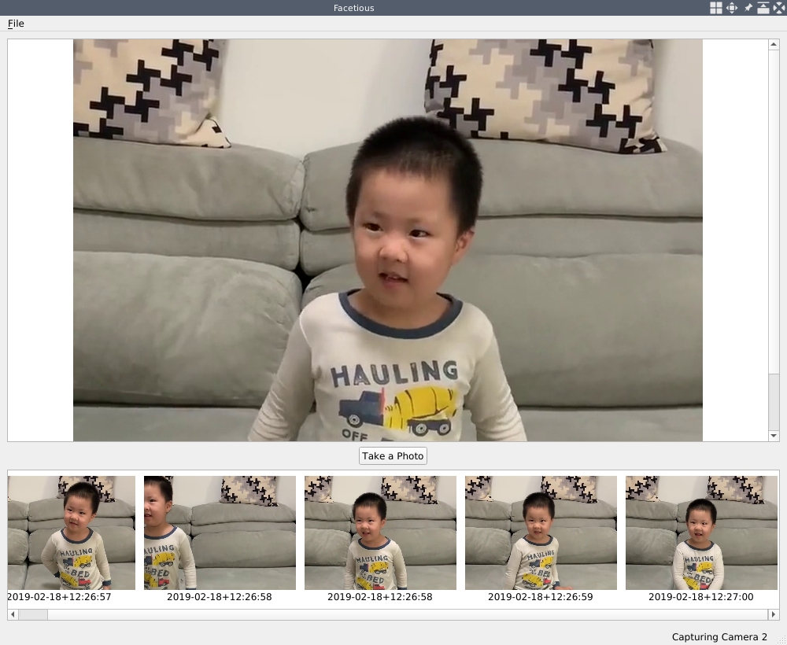
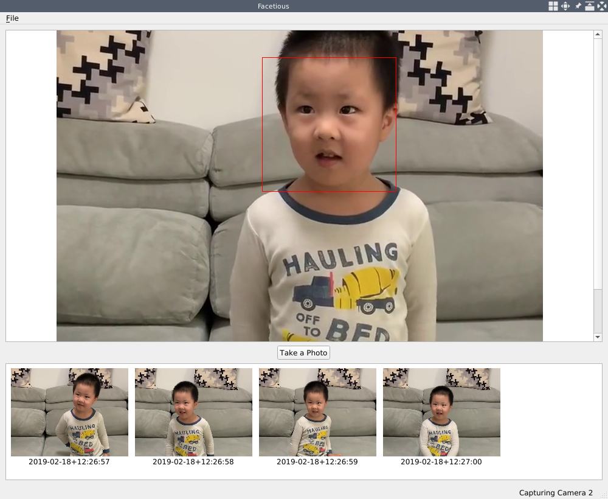
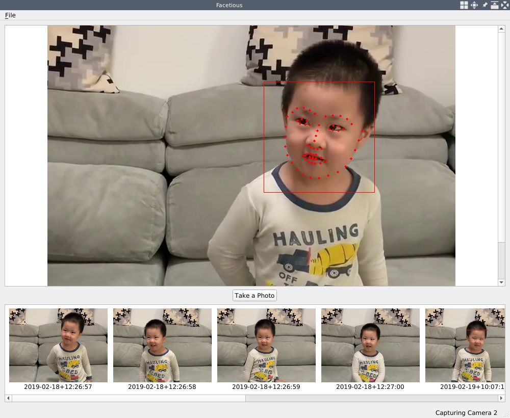

# 顔で楽しむ

第3章「ホームセキュリティアプリケーション」では、Gazerという新しいアプリケーションを作成し、パソコンに取り付けたウェブカメラからビデオを撮影したり、動きを検出したりすることができました。この章では、ウェブカメラを使った遊びを続け、動きを検出する代わりに、カメラを使って顔を検出する新しいアプリケーションを作成します。まず、Webカメラに写っている顔を検出します。次に、検出された顔から顔のランドマークを検出します。この顔のランドマークにより、検出された顔の目、鼻、口、頬の位置がわかるので、顔に面白いマスクを適用することができます。

この章では、以下のトピックを取り上げます。

* ウェブカメラからの写真撮影
* OpenCVを使った顔の検出
* OpenCV を用いた顔のランドマークの検出
* Qt ライブラリのリソースシステム
* 顔へのマスクの適用

***

## 技術的要件

前の章で見たように、ユーザは少なくとも Qt バージョン 5 をインストールし、C++ と Qt プログラミングの基本的な知識を持っていることが要求されます。また、OpenCVの最新版である4.0が正しくインストールされている必要があります。さらに、この章では、OpenCV の core モジュールと imgproc モジュールの他に、video モジュールと videoio モジュールも利用されます。もしあなたがこれまでの章を読んできたのであれば、これらの要件はすでに満たされていることでしょう。

顔や顔のランドマークを検出するために、OpenCVが提供するいくつかの事前学習済みの機械学習モデルを使用しますので、機械学習技術に関する基礎知識があればより良いでしょう。これらの機械学習モデルのいくつかは、OpenCVライブラリのエクストラモジュールのものなので、OpenCVのエクストラモジュールもコアモジュールと一緒にインストールされている必要があります。この章では、OpenCVの追加モジュールを段階的にインストールしてから使用するので、不安な方はご安心ください。

この章のすべてのコードは、私たちのコードリポジトリ（[https://github.com/PacktPublishing/Qt-5-and-OpenCV-4-Computer-Vision-Projects/tree/master/Chapter-04](https://github.com/PacktPublishing/Qt-5-and-OpenCV-4-Computer-Vision-Projects/tree/master/Chapter-04)）で見ることができます。

次のビデオでコードの動作を確認してください： [http://bit.ly/2FfQOmr](http://bit.ly/2FfQOmr)

***

## アプリケーション「Facetious」

この章で作成するアプリケーションは、検出された顔にリアルタイムで面白いマスクを適用することで、多くの楽しみを与えてくれますので、私はこのアプリケーションをFacetiousと名付けました。Facetiousアプリケーションで最初にできることは、ウェブカメラを開き、そこからビデオフィードを再生することです。これは、前章で私たちが作ったGazerアプリケーションで行っていた作業です。そこで、ここでは、Gazerアプリケーションの骨格を借りて、新しいアプリケーションのベースとします。計画としては、まず、Gazerのコピーを作り、Facetiousに名前を変え、動き検出に関する機能を削除し、ビデオ撮影機能を写真撮影の新機能に変更します。そうすることで、シンプルでクリーンなアプリケーションに、顔や顔の特徴を検出する新しい機能を追加することができます。

***

### GazerからFacetiousへ

まず、Gazerアプリケーションのソースをコピーすることから始めましょう。

```sh
     $ mkdir Chapter-04
     $ cp -r Chapter-03/Gazer Chapter-04/Facetious
     $ ls Chapter-04
     Facetious
     $ cd Chapter-04/Facetious
     $ make clean
     $ rm -f Gazer
     $ rm -f Makefile
```

これらのコマンドで、Chapter-03 ディレクトリの下にある Gazer ディレクトリを Chapter-04/Facetious にコピーします。そして、そのディレクトリに入り、make clean を実行して、コンパイル時に生成された中間ファイルをすべてクリーニングし、rm -f Gazer で古いターゲットの実行ファイルを削除しています。

では、プロジェクトファイルごとにリネームとクリーニングを行ってみましょう。

まず、Gazer.pro のプロジェクトファイルです。 Facetious.pro にリネームして、エディタで開き、内容を編集します。エディタで、TARGET キーの値を Gazer から Facetious に変更し、QT キーの値から、この新しいアプリケーションでは使わない Qt モジュール、network と concurrent を削除し、ファイルの最後にある GAZER_USE_QT_CAMERA の関連行を削除しています。Facetious.proの変更された行は以下の通りです。

```qmake
     TARGET = Facetious
     # ...
     QT += core gui multimedia
     # ...
     # the below lines are deleted in this update:
     # Using OpenCV or QCamera
     # DEFINES += GAZER_USE_QT_CAMERA=1
     # QT += multimediawidgets
```

次にmain.cppファイルです。 このファイルは、ウィンドウのタイトルをGazerからFacetiousに変えるだけなので、シンプルです。

```cpp
     window.setWindowTitle("Facetious");
```

次に、capture_thread.h ファイルです。このファイルでは、CaptureThreadクラスから多くのフィールドとメソッドを削除しています。削除されるフィールドは以下の通りです。

```cpp
         // FPS calculating
         bool fps_calculating;
         int fps;

         // video saving
         // int frame_width, frame_height; // notice: we keep this line
         VideoSavingStatus video_saving_status;
         QString saved_video_name;
         cv::VideoWriter *video_writer;

         // motion analysis
         bool motion_detecting_status;
         bool motion_detected;
         cv::Ptr<cv::BackgroundSubtractorMOG2> segmentor;
```

このクラスで削除されるメソッドは以下の通りです。

```cpp
         void startCalcFPS() {...};
         void setVideoSavingStatus(VideoSavingStatus status) {...};
         void setMotionDetectingStatus(bool status) {...};
     // ...
     signals:
         // ...
         void fpsChanged(int fps);
         void videoSaved(QString name);

     private:
         void calculateFPS(cv::VideoCapture &cap);
         void startSavingVideo(cv::Mat &firstFrame);
         void stopSavingVideo();
         void motionDetect(cv::Mat &frame);
```

enum VideoSavingStatus型も不要になったので、同様に削除します。

さて、capture_thread.hはきれいになりましたので、次にcapture_thread.cppに移りましょう。ヘッダファイルの変更点に従って、まず、以下のことを行いましょう。

* コンストラクタの中で，ヘッダファイルで削除したフィールドの初期化を削除する。
* ヘッダファイルで削除したメソッド（スロットを含む）の実装を削除する。
* runメソッドの実装において、動画保存、モーション検出、FPS（Frames per Second）計算に関するコードをすべて削除。

これで、キャプチャスレッドから、ビデオ保存、モーション検出、FPS計算に関するコードがすべて削除されました。この章では、ビデオキャプチャはOpenCVで行うので、まず、#ifdef GAZER_USE_QT_CAMERA から #endif 行の間のコードを削除してください。このようなコードのブロックが2つあるので、その両方を削除します。次に、多くのメソッドとフィールドを削除します。そのほとんどは、ビデオの保存、モーション検出、FPSの計算に関するものです。これらのフィールドとメソッドは次のとおりです。

```cpp
         void calculateFPS();
         void updateFPS(int);
         void recordingStartStop();
         void appendSavedVideo(QString name);
         void updateMonitorStatus(int status);

     private:
         // ...
         QAction *calcFPSAction;
         // ...
         QCheckBox *monitorCheckBox;
         QPushButton *recordButton;
```

appendSavedVideoメソッドとQPushButton *recordButtonフィールドは、実際には削除されないことに注意してください。それぞれ、appendSavedPhoto、QPushButton *shutterButtonに名前を変えています。

```cpp
         void appendSavedPhoto(QString name);
         // ...
         QPushButton *shutterButton;
```

これは、新しいアプリケーションで写真を撮るための準備です。これまで述べてきたように、Facetiousでは、ビデオは録画せず、写真だけを撮ります。

次に、mainwindow.cppのヘッダーファイルと同じように、#ifdef GAZER_USE_QT_CAMERA と #else の間のコードを削除してください。また、この種のブロックが2つありますので、それぞれのブロックの#endif行を削除することを忘れないでください。その後、削除された5つのメソッドの実装を削除します。

* void calculateFPS();
* void updateFPS(int);
* void recordingStartStop();
* void appendSavedVideo(QString name);
* void updateMonitorStatus(int status);

ほとんどの削除は終わりましたが、MainWindowクラスはまだやることがたくさんあります。まずは、ユーザーインターフェースから。MainWindow::initUIメソッドで、モニター状態のチェックボックス、記録ボタン、記録ボタンの横のプレースホルダーに関するコードを削除し、新たにシャッターボタンを作成します。

```cpp
         shutterButton = new QPushButton(this);
         shutterButton->setText("Take a Photo");
         tools_layout->addWidget(shutterButton, 0, 0, Qt::AlignHCenter);
```

先ほどのコードで、シャッターボタンを tools_layout の唯一の子ウィジェットにし、ボタンが中央に配置されていることを確認します。

そして、ステータスバーを作成した後、ステータスバーの起動メッセージを「Facetious is Ready」に変更します。

```cpp
         mainStatusLabel->setText("Facetious is Ready");
```

次に、MainWindow::createActionsメソッドです。このメソッドでは、calcFPSActionアクションの作成とシグナルスロットの接続に関するコードを削除します。

次に、MainWindow::openCameraメソッドで、FPSの計算と動画の保存に関するコードをすべて削除します（そのほとんどはシグナルスロットの接続と切断です）。このメソッドの最後にあるチェックボックスとプッシュボタンに関するコードも削除します。

最後に、新しく追加された appendSavedPhoto メソッドに空の実装を与え、populateSavedList メソッドのボディを空にすることです。次のサブセクションでは、これらのメソッドに新しい実装を追加します。

```cpp
     void MainWindow::populateSavedList()
     {
         // TODO
     }

     void MainWindow::appendSavedPhoto(QString name)
     {
         // TODO
     }
```

次は、utilities.h と utilities.cpp ファイルの番です。ヘッダーファイルでは、notifyMobileメソッドを削除し、newSavedVideoNameメソッドとgetSavedVideoPathメソッドをそれぞれnewPhotoNameとgetPhotoPathにリネームしています。

```cpp
     public:
         static QString getDataPath();
         static QString newPhotoName();
         static QString getPhotoPath(QString name, QString postfix);
```

utilities.cppでは、ヘッダーファイルの変更に合わせて名前の変更と削除を行うほか、getDataPathメソッドの実装を変更しています。

```cpp
     QString Utilities::getDataPath()
     {
         QString user_pictures_path = QStandardPaths::standardLocations(QStandardPaths::PicturesLocation)[0];
         QDir pictures_dir(user_pictures_path);
         pictures_dir.mkpath("Facetious");
         return pictures_dir.absoluteFilePath("Facetious");
     }
```

最も重要な変更点は、QStandardPaths::MoviesLocation の代わりに QStandardPaths::PicturesLocation を使用して、ビデオ用ではなく写真用の標準ディレクトリを取得するようになったことです。

さて、Gazer アプリケーションを簡略化することで、私たちの新しい Facetious アプリケーションの基礎を得ることに成功しました。それでは、コンパイルと実行を試してみましょう。

```sh
     $ qmake -makefile
     $ make
     g++ -c #...
     # output truncated
     $ export LD_LIBRARY_PATH=/home/kdr2/programs/opencv/lib
     $ ./Facetious
```

うまくいけば、Gazer のメイン・ウィンドウに非常によく似た空白のウィンドウが表示されます。このサブセクションのすべてのコードの変更は、[https://github.com/PacktPublishing/Qt-5-and-OpenCV-4-Computer-Vision-Projects/commit/0587c55e4e8e175b70f8046ddd4d67039b431b54](https://github.com/PacktPublishing/Qt-5-and-OpenCV-4-Computer-Vision-Projects/commit/0587c55e4e8e175b70f8046ddd4d67039b431b54) の単一の Git コミットで見つけることができます。もし、このサブセクションを完了するのに問題があれば、遠慮なくそのコミットを参照してください。

***

### 写真を撮る

前節では、Gazerから動画保存機能と動体検知機能を削除し、新しいアプリケーション「Facetious」の基盤を作りました。また、写真撮影のためのいくつかのスタブを新しいアプリケーションに配置しました。このサブセクションでは、写真撮影の機能を完成させます。

ビデオ撮影機能に比べ、写真撮影は非常にシンプルです。まず、capture_thread.h ヘッダーファイルで、CaptureThread クラスにフィールドと多くのメソッドを追加しています。

```cpp
     public:
         // ...
         void takePhoto() {taking_photo = true; }
         // ...
     signals:
         // ...
         void photoTaken(QString name);

     private:
         void takePhoto(cv::Mat &frame);

     private:
         // ...
         // take photos
         bool taking_photo;
```

bool taking_photo フィールドは、キャプチャスレッドが現在のフレームを写真としてハードディスクに保存すべきかどうかを示すフラグであり、void takePhoto() public inline メソッドはこのフラグを true に設定するためのメソッドである。このメソッドは、ユーザがメインウィンドウのシャッターボタンをクリックしたときにメインスレッドで呼び出すことにします。写真を撮るたびに void photoTaken(QString name) シグナルが発行され、Qt メタオブジェクトシステムがその実装を担当します。void takePhoto(cv::Mat &frame) private メソッドは，フレームを写真としてディスクに保存するためのメソッドで， capture_thread.cpp のソースファイルで実装する必要があるのはこのメソッドのみです． その実装を見てみましょう．

```cpp
     void CaptureThread::takePhoto(cv::Mat &frame)
     {
         QString photo_name = Utilities::newPhotoName();
         QString photo_path = Utilities::getPhotoPath(photo_name, "jpg");
         cv::imwrite(photo_path.toStdString(), frame);
         emit photoTaken(photo_name);
         taking_photo = false;
     }
```

メソッド本体では、Utilitiesクラスで書いた関数を使って新しい名前を生成し、生成した名前で保存する写真のパスを取得し、拡張子名をjpgとしています。そして、OpenCVのimgcodecsモジュールのimwrite関数を使って、フレームをJPEG画像ファイルとして、指定したパスのディスクに書き込んでいます。写真が保存された後、写真名とともに photoTaken シグナルを出力します。このシグナルに興味を持つ人がいれば、スロットを接続する必要があり、シグナルが発せられた瞬間にそのスロットが呼ばれます。メソッド本体の最後では、taking_photoフラグをfalseに戻しています。

CaptureThread::takePhoto(cv::Mat &frame) メソッドが実装されたので、 CaptureThread::run() メソッド内のキャプチャ無限ループでこれを呼び出してみましょう。

```cpp
             if(taking_photo) {
                 takePhoto(tmp_frame);
             }
```

このコード片では、写真を撮るべきかどうかを調べるために taking_photo フラグをチェックしています。もしこれが真であれば、 takePhoto(cv::Mat &frame) メソッドを呼び出して、現在のフレームを写真として保存します。このコード片は、 tmp_frame が空でないチェックを通過した後、そのフレームの色順序が BGR から RGB に変換される前に配置されなければならず、これにより、imwrite 関数に渡すことができる適切な色順序のフレームであることが確認されます。

CaptureThreadクラスで最後に行うことは、そのコンストラクタでtaking_photoフラグをfalseに初期化することです。

さて、ユーザーインターフェイスに移りましょう。まず、mainwindow.h で MainWindow クラスに新しいプライベートスロットを追加します。

```cpp
     private slots:
         // ...
         void takePhoto();
```

このスロットは、シャッターボタンのシグナルに接続されることになります。その実装をmainwindow.cppのソースファイルから見てみましょう。

```cpp
     void MainWindow::takePhoto()
     {
         if(capturer != nullptr) {
             capturer->takePhoto();
         }
     }
```

単純な作業です。このメソッドでは、CaptureThreadのインスタンスであるcapturerのvoid takePhoto()メソッドを呼び出して、nullでなければ写真を撮るように指示しています。そして、MainWindow::initUI()メソッドで、シャッターボタンを作成した後、このスロットをshutterButtonのclickedシグナルに接続します。

```cpp
         connect(shutterButton, SIGNAL(clicked(bool)), this, SLOT(takePhoto()));
```

これまでの作業で、キャプチャースレッドに写真を撮るように指示することができるようになりました。しかし、写真が撮影されたとき、メインウィンドウはどうやってそれを知るのでしょうか？CaptureThread::photoTaken シグナルと MainWindow::appendSavedPhoto スロットの間の接続によって実現されます。 この接続は、MainWindow::openCamera()メソッドでキャプチャスレッドのインスタンスが生成された後に行います。

```cpp
         connect(capturer, &CaptureThread::photoTaken, this, &MainWindow::appendSavedPhoto);
```

また、同じメソッドで閉じたキャプチャースレッドインスタンスの前に切断することを忘れないでください。

```cpp
             disconnect(capturer, &CaptureThread::photoTaken, this, &MainWindow::appendSavedPhoto);
```

さて、MainWindow::appendSavedPhoto(QString name) スロットが何をするのかを見てみましょう。前のサブセクションで、私たちはこのスロットに空のボディを与えました。さて、このスロットはその責任を負わなければなりません。

```cpp
     void MainWindow::appendSavedPhoto(QString name)
     {
         QString photo_path = Utilities::getPhotoPath(name, "jpg");
         QStandardItem *item = new QStandardItem();
         list_model->appendRow(item);
         QModelIndex index = list_model->indexFromItem(item);
         list_model->setData(index, QPixmap(photo_path).scaledToHeight(145), Qt::DecorationRole);
         list_model->setData(index, name, Qt::DisplayRole);
         saved_list->scrollTo(index);
     }
```

これは、第3章「ホームセキュリティの応用」でGazerアプリケーションの保存ビデオリストに新しく録画したビデオのカバー画像を追加したときに行ったことと非常によく似ています。したがって、ここではこのコードの一部を一行ずつ説明することはしません。

もうひとつ、アプリケーションの起動中に、撮影したすべての写真を保存済み写真リストに登録するためのメソッド、MainWindow::populateSavedList()を実装する必要があります。このメソッドも、Gazerアプリケーションで保存された動画をポピュレートするために使用したメソッドと非常によく似ているので、実装はおまかせします。もし困ったことがあれば、GitHubにある本書の付属コードリポジトリを参照してください。このサブセクションのすべての変更は、このコミットにあります: [https://github.com/PacktPublishing/Qt-5-and-OpenCV-4-Computer-Vision-Projects/commit/744d445ad4c834cd52660a85a224e48279ac2cf4](https://github.com/PacktPublishing/Qt-5-and-OpenCV-4-Computer-Vision-Projects/commit/744d445ad4c834cd52660a85a224e48279ac2cf4)

さて、もう一度アプリケーションをコンパイルして実行してみましょう。アプリケーションがメインウィンドウを表示した後、FileメニューのOpen Cameraアクションをクリックしてカメラを開き、シャッターボタンをクリックして写真を撮影します。これらのアクションの後、私のメインウィンドウは次のスクリーンショットのようになります。



この章では、新しいアプリケーションの基本的な機能を設定します。次章では、OpenCVを用いて、撮影したフレームからリアルタイムに顔を検出します。

***

## カスケード分類器を用いた顔検出

前節では、カメラの映像を再生したり写真を撮ったりできる新しいアプリケーション、Facetiousを作成しました。本章では、このアプリケーションに新しい機能を追加し、OpenCVライブラリを使ってリアルタイムにビデオ内の顔を検出する方法を紹介します。

顔検出には、OpenCVが提供するカスケード分類器と呼ばれる機能を使用します。カスケード分類器は、顔の検出だけでなく、物体の検出にも使われます。分類器としては、画像中のある注目領域がある種の物体であるか否かを教えてくれます。この分類器は、いくつかの単純な分類器（段階）を含んでおり、その後、これらの単純な分類器を注目領域に適用します。そして、いずれかの簡易分類器が否定的な結果を出した場合、その注目領域には注目すべきオブジェクトが含まれないと判断します。一方、すべての段階が成功すれば、その領域から対象物を発見したと言う。これがカスケード（cascade）の意味です。

カスケード分類器を使用する前に、まず学習させる必要があります。学習過程では、ある種類のオブジェクトの多くのサンプルビュー（正の例と呼ばれる）と、その種類のオブジェクトを含まない多くの画像（負の例）を分類器に与える。例えば、カスケード分類器を人間の顔の検出に役立てたい場合、人間の顔を含む画像と人間の顔を含まない画像を多数用意して学習させる必要があります。カスケード分類器は、これらの正例と負例を用いて、画像中のある領域がある種の物体を含んでいるかどうかを学習します。

この学習プロセスは複雑ですが、幸いなことにOpenCVでは、事前に学習された多くのカスケード分類器がリリースされています。後ほど例に挙げる Haar 分類器を考えてみましょう。インストールされた OpenCV ライブラリのデータディレクトリを調べると、その中にたくさんの事前学習された分類器データがあることが分かります。

```sh
    # if you use a system provided OpenCV, the path is /usr/share/opencv/haarcascades
    $ ls /home/kdr2/programs/opencv/share/opencv4/haarcascades/
    haarcascade_eye_tree_eyeglasses.xml haarcascade_lefteye_2splits.xml
    haarcascade_eye.xml haarcascade_licence_plate_rus_16stages.xml
    haarcascade_frontalcatface_extended.xml haarcascade_lowerbody.xml
    haarcascade_frontalcatface.xml haarcascade_profileface.xml
    haarcascade_frontalface_alt2.xml haarcascade_righteye_2splits.xml
    haarcascade_frontalface_alt_tree.xml haarcascade_russian_plate_number.xml
    haarcascade_frontalface_alt.xml haarcascade_smile.xml
    haarcascade_frontalface_default.xml haarcascade_upperbody.xml
    haarcascade_fullbody.xml
```

学習済みデータファイルは、ファイル名で簡単に見分けることができます。frontalfaceを含むファイル名は、顔検出に必要なものです。

物体検出、特に顔検出に関する知識を得たところで、ビデオフィードから顔を検出するためのアプリケーションに戻りましょう。

まず、Facetious.pro のプロジェクトファイルを更新します。

```qmake
    # ...
    unix: !mac {
        INCLUDEPATH += /home/kdr2/programs/opencv/include/opencv4
        LIBS += -L/home/kdr2/programs/opencv/lib -lopencv_core -lopencv_imgproc -lopencv_imgcodecs -lopencv_video -lopencv_videoio -lopencv_objdetect
    }

    # ...
    DEFINES += OPENCV_DATA_DIR=\\\"/home/kdr2/programs/opencv/share/opencv4/\\\"
    #...
```

LIBS キーの設定では、これから使用する顔検出を含む物体検出の機能は、この OpenCV コアモジュールによって提供されるため、その値に opencv_objdetect OpenCV モジュールを追加しています。変更点の 2 つ目は、OpenCV のインストール先であるデータディレクトリを定義するマクロ定義です。このマクロを使用して、事前学習された分類器データをコードに読み込みます。

次に、capture_thread.h ヘッダファイルに移動します。このファイルでは、CaptureThread クラスに private メソッドと private メンバフィールドを追加しています。

```cpp
    #include "opencv2/objdetect.hpp"
    //...

    private:
        // ...
        void detectFaces(cv::Mat &frame);

    private:
        // ...

        // face detection
        cv::CascadeClassifier *classifier;
```

このメンバフィールドが顔検出に使うカスケード分類器であり、顔検出の作業は新しく追加されたdetectFacesメソッドで行われることは明らかです。

では、capture_thread.cppのソースファイルを見て、そこでカスケード分類器をどのように使うか見てみましょう。まず、CaptureThread::runメソッドの本体を更新します。

```cpp
        classifier = new cv::CascadeClassifier(OPENCV_DATA_DIR "haarcascades/haarcascade_frontalface_default.xml");

        while(running) {
            cap >> tmp_frame;
            if (tmp_frame.empty()) {
                break;
            }

            detectFaces(tmp_frame);
            // ...
        }
        cap.release();
        delete classifier;
        classifier = nullptr;
```

このメソッドを入力して Web カメラを開いた後、cv::CascadeClassifier のインスタンスを生成し、classifier メンバフィールドに代入しています。インスタンスを生成する際に、コンストラクタに事前に学習された分類器のデータパスを渡します。このパスは、プロジェクトファイルで定義されている OPENCV_DATA_DIR マクロを用いて構築されます。また、顔検出用の分類器を作成するために、OpenCV のデータディレクトリの下にある haarcascades/haarcascade_frontalface_default.xml ファイルを使用します。

runメソッド内の無限ループでは、新たに追加したdetectFacesメソッドを、開いたWebカメラからキャプチャしたばかりのフレームで呼び出しています。

無限ループ終了後、キャプチャスレッドが終了する前に、クリーニングを行い、開いたカメラを解放し、分類器を削除し、nullに設定します。

最後に、detectFacesメソッドの実装を見てみましょう。

```cpp
    void CaptureThread::detectFaces(cv::Mat &frame)
    {
        vector<cv::Rect> faces;
        cv::Mat gray_frame;
        cv::cvtColor(frame, gray_frame, cv::COLOR_BGR2GRAY);
        classifier->detectMultiScale(gray_frame, faces, 1.3, 5);

        cv::Scalar color = cv::Scalar(0, 0, 255); // red
        for(size_t i = 0; i < faces.size(); i++) {
            cv::rectangle(frame, faces[i], color, 1);
        }
    }
```

このメソッドの本体では、まず検出された顔の外接矩形を保存するための cv::Rect ベクトルを宣言します。次に、顔検出処理はRGBの色の特徴とは無関係であるため、入力フレームをグレースケール画像に変換します。そして、分類器のdetectMultiScaleメソッドを呼び出します。このメソッドの最初の引数は、顔を検出したいグレースケールの入力フレームです。第2引数は矩形ベクトルへの参照で、先ほど定義した検出された顔の外接矩形を保存するために使用します、第3引数は、画像スケールごとに画像サイズをどれだけ縮小するかを指定するためのもので、一方の顔がカメラに近いという理由だけで他方の顔より大きく見える場合に生じる大きさの誤認識を補償するために作られる。この検出アルゴリズムでは、移動ウィンドウを使用してオブジェクトを検出します。4番目の引数は、顔が検出されたと宣言する前に、現在のオブジェクトの近くでいくつのオブジェクトが検出されたかを定義するためのものです。

detectMultiScale メソッドが返った後、検出された顔の領域をすべて faces vector に取得し、キャプチャしたフレームにこれらの長方形を 1 ピクセルの赤い縁取りで描画します。

さて、顔検出のための機能はこれで完了です。では、プロジェクトをコンパイルして実行してみましょう。開いたウェブカメラの目線の先に誰かが入ってくると、その人の顔の周りに赤い矩形が表示されます。



今回のコードでは、カスケード分類器を作成する際に、haarcascade_frontalface_default.xml ファイルを使用しました。しかし、OpenCVのデータディレクトリを見ると、haarcascade_frontalface_alt.xml, haarcascade_frontalface_alt2.xml, haarcascade_frontalface_alt_tree.xml など、前顔検出のためのファイルであることがわかるファイルが複数あることに気づかれるかもしれません。なぜhaarcascade_frontalface.xmlを選び、他を選ばないのでしょうか？この事前学習済みモデルデータは、異なるデータセット、または異なる設定で学習されます。詳細はこれらのXMLファイルの冒頭にコメントとして記述されていますので、必要であればそちらのドキュメントを参照してください。モデルファイルを選択するもう一つの簡単な方法は、すべてのモデルファイルを試し、あなたのデータセットでテストし、精度と再現率を計算し、あなたのケースに最適なものを選択することです。

Haarカスケード分類器以外にも、Local binary pattern (LBP) カスケード分類器という名前のカスケード分類器があり、これはOpenCVのリリースにデフォルトで同梱されています。この分類器の学習済みモデルデータは、OpenCV のインストールディレクトリのデータパスにある lbpcascades ディレクトリに格納されています。LBP カスケード分類器は、Haar よりも高速ですが、精度も低くなっています。以下の表で、両者を比較することができます。


これらのアルゴリズムと学習済みモデルデータを自由に試して、ご自分のケースに合った最適なものを見つけてください。

***

## 顔のランドマークの検出

前節では、OpenCVが提供するカスケード分類器を用いて顔を検出することで、画像中のどの領域が顔であるかを知ることができました。しかし、矩形領域だけでは、顔の目、眉、鼻がどこにあるのか、といった顔の詳細まではわかりません。顔認識技術では、このような詳細な情報を顔のランドマークと呼んでいます。本章では、このような顔のランドマークを検出する方法を探します。

残念ながら、OpenCVのコアモジュールは顔のランドマークを検出するアルゴリズムを提供していないので、OpenCVの追加モジュールであるfaceモジュールに頼ることになります。

faceモジュールを使用する前に、このモジュールがコンピュータにインストールされていることを確認する必要があります。第2章「プロ並みの画像編集」の「OpenCVをソースからビルドしてインストールする」では、OpenCV v4.0.0を追加モジュールのないソースからビルドしてインストールしました。ここで、追加モジュールを含めて再構築し、再インストールしてみましょう。

前回ビルドした際に、OpenCVのソースをダウンロードして解凍し、あるディレクトリに配置しました。では、OpenCVの追加モジュールのソースを、そのリリースページ（[https://github.com/opencv/opencv_contrib/releases](https://github.com/opencv/opencv_contrib/releases)）からダウンロードしてみましょう。ダウンロードして使用したコアモジュールのバージョンはv4.0.0なので、同じバージョンのエクストラモジュールを [https://github.com/opencv/opencv_contrib/archive/4.0.0.zip](https://github.com/opencv/opencv_contrib/archive/4.0.0.zip) からダウンロードします。ダウンロードしたソースを解凍し、解凍したコアモジュールのソースと同じディレクトリに置き、ターミナルでビルドします。

```sh
    $ ls ~
    opencv-4.0.0 opencv_contrib-4.0.0 # ... other files
    $ cd ~/opencv-4.0.0 # path to the unzipped source of core modules
    $ mkdir release # create the separate dir
    $ cd release
    $ cmake -D OPENCV_EXTRA_MODULES_PATH=../../opencv_contrib-4.0.0/modules \
      -D CMAKE_BUILD_TYPE=RELEASE \
      -D CMAKE_INSTALL_PREFIX=$HOME/programs/opencv ..
    # ... output of cmake ...
    # rm ../CMakeCache.txt if it tells you are not in a separate dir
    $ make
    # ... output of make ...
    $ make install
```

このように、前回のインストールとは異なり、cmake コマンドに -D OPENCV_EXTRA_MODULES_PATH=../../opencv_contrib-4.0.0/modules オプションを追加し、追加モジュールのソースが存在する場所を指定しています。これらのコマンドが終了した後、faceモジュールが正しくインストールされているかどうかを確認します。

```sh
    $ ls ~/programs/opencv/include/opencv4/opencv2/face
    bif.hpp facemark.hpp facerec.hpp
    face_alignment.hpp facemarkLBF.hpp mace.hpp
    facemarkAAM.hpp facemark_train.hpp predict_collector.hpp
    $ ls ~/programs/opencv/lib/libopencv_face*
    /home/kdr2/programs/opencv/lib/libopencv_face.so
    /home/kdr2/programs/opencv/lib/libopencv_face.so.4.0
    /home/kdr2/programs/opencv/lib/libopencv_face.so.4.0.0
    $
```

先のシェルコマンドのように、ヘッダファイルや共有オブジェクトがOpenCVのインストールパスにあれば、OpenCVの追加モジュールが正常にインストールされたことになります。

Faceモジュールがインストールされたら、Webブラウザで[https://docs.opencv.org/4.0.0/d4/d48/namespacecv_1_1face.html](https://docs.opencv.org/4.0.0/d4/d48/namespacecv_1_1face.html)、そのドキュメントを開き、どのような機能を提供しているか見てみましょう。

FacemarkKazemi、FacemarkAAM、FacemarkLBFクラスは、顔のランドマークを検出するために利用されるアルゴリズムです。これらのアルゴリズムはすべて機械学習ベースのアプローチであるため、データセット操作やモデル学習のための設備も充実しています。機械学習モデルの学習は本章の範囲外ですので、本節では、やはり事前に学習させたモデルを使用することにします。

今回のアプリケーションでは、FacemarkLBFクラスで実装されているアルゴリズムを使用します。事前学習済みモデルのデータファイルは、[https://raw.githubusercontent.com/kurnianggoro/GSOC2017/master/data/lbfmodel.yaml](https://raw.githubusercontent.com/kurnianggoro/GSOC2017/master/data/lbfmodel.yaml) からダウンロードすることができます。ダウンロードして、プロジェクトのルートディレクトリにあるdataというサブディレクトリに配置しましょう。

```sh
    $ mkdir -p data
    $ cd data/
    $ pwd
    /home/kdr2/Work/Books/Qt-5-and-OpenCV-4-Computer-Vision-Projects/Chapter-04/Facetious/data
    $ curl -O https://raw.githubusercontent.com/kurnianggoro/GSOC2017/master/data/lbfmodel.yaml
      % Total % Received % Xferd Average Speed Time Time Time Current
                                     Dload Upload Total Spent Left Speed
      0 53.7M 0 53.7k 0 0 15893 0 0:59:07 0:59:07 0:00:00 0
    $ ls
    lbfmodel.yaml
```

これで準備作業はすべて終了です。では、顔のランドマーク検出機能の開発を完了させるために、プロジェクトのコードソースに戻りましょう。capture_thread.hに、CaptureThreadクラスのinclude指示文とprivateメンバ・フィールドを新たに追加します。

```cpp
    // ...
    #include "opencv2/face/facemark.hpp"
    // ...
    class CaptureThread : public QThread
    {
        // ...
    private:
        // ...
        cv::Ptr<cv::face::Facemark> mark_detector;
    };
```

cv::Ptr\<cv::face::Facemark\> 型のメンバフィールド mark_detector は、顔のランドマークを検出するために利用される検出器です。この検出器は、ソースファイルcapture_thread.cppのCaptureThread::runメソッドでインスタンス化されます。

```cpp
        classifier = new cv::CascadeClassifier(OPENCV_DATA_DIR "haarcascades/haarcascade_frontalface_default.xml");
        mark_detector = cv::face::createFacemarkLBF();
        QString model_data = QApplication::instance()->applicationDirPath() + "/data/lbfmodel.yaml";
        mark_detector->loadModel(model_data.toStdString());
```

以下のコードにあるように、runメソッドでは、顔検出に用いる分類器を作成した後、cv::face::createFacemarkLBF() を呼び出して FacemarkLBF のインスタンスを作成し、mark_detector メンバフィールドに代入しています。次に、ダウンロードしたプリトレーニングモデルのデータファイルのパスを文字列で作成します。最後に、モデルデータファイルのパスを指定して loadModel メソッドを呼び出し、mark_detector にデータをロードします。この時点で、検出器は使用可能な状態になりました。では、CaptureThread::detectFacesメソッドでどのように使うか見てみましょう。

```cpp
        vector< vector<cv::Point2f> > shapes;
        if (mark_detector->fit(frame, faces, shapes)) {
            // draw facial land marks
            for (unsigned long i=0; i<faces.size(); i++) {
                for(unsigned long k=0; k<shapes[i].size(); k++) {
                    cv::circle(frame, shapes[i][k], 2, color, cv::FILLED);
                }
            }
        }
```

CaptureThread::detectFaces メソッドの最後で、要素の型が cv::Point2f の vector である変数を宣言しています。1つの顔のランドマークはvector\<cv::Point2f\>型で表現される点の列で、1つのフレームに複数の顔が検出されることがあるので、このように複雑なデータ型を使って表現する必要があるのです。次に、顔のランドマークを検出するために、mark_detector メンバフィールドの fit メソッドを呼び出すことが肝心です。このメソッドには、入力フレーム、カスケード分類器で検出した顔の矩形、そして出力ランドマークを保存するための変数が渡されます。fitメソッドが0以外の値を返した場合、ランドマークの取得に成功したことになります。顔のランドマークが得られたら、検出された顔を繰り返し処理し、各顔のランドマークの点を繰り返し処理し、各点に2ピクセルの円を描いてランドマークを示すようにします。

*前述したように、macOSを使用している場合、コンパイルされたアプリケーションは実際にはFacetious.appというディレクトリであり、QApplication::instance()->applicationDirPath()の表現値はFacetious.app/Contents/MacOSとなります。そのため、macOSでは、lbfmodel.yamlのモデルデータをFacetious.app/Contents/MacOS/dataディレクトリの下に配置する必要があります。*

プロジェクトファイルを除いて、ほとんどすべてが完了しました。LIBS の設定に使用した追加の face モジュールをそのファイルに追加してみましょう。

```qmake
    unix: !mac {
        INCLUDEPATH += /home/kdr2/programs/opencv/include/opencv4
        LIBS += -L/home/kdr2/programs/opencv/lib -lopencv_core -lopencv_imgproc -lopencv_imgcodecs -lopencv_video -lopencv_videoio -lopencv_objdetect -lopencv_face
    }
```

さて、いよいよアプリケーションをコンパイルして実行します。以下は、アプリケーションの実行中にこれらのランドマークがどのように見えるかを示しています。



このように、目、眉、鼻、口、あごに多くのランドマークが得られます。しかし、どの点がどの顔の特徴を表しているのかは、まだわかりません。各顔のランドマークの点の順番が決まっていると考えると、ある点がある顔の特徴を表しているかどうかは、その点のインデックスを利用して判断することができます。そこで、2ピクセルの円ではなく、各点のインデックス番号を描き、その分布を見ることにする。

```cpp
    // cv::circle(frame, shapes[i][k], 2, color, cv::FILLED);
    QString index = QString("%1").arg(k);
    cv::putText(frame, index.toStdString(), shapes[i][k], cv::FONT_HERSHEY_SIMPLEX, 0.4, color, 2);
```

そして、人間の顔のランドマークを検出して描画すると、次のようになります。


このように、インデックス番号で表される点は、顔上の位置が固定されているため、以下のような点のインデックスによって、これらの顔の特徴にアクセスすることができる。

* 口は点[48, 68]
* 右眉は点[17, 22]
* 左眉は点[22, 27]
* 右目は点[36, 42]
* 左目は点[42, 48]
* 鼻は点[27, 35]
* 顎は点[0, 17]

次章では、この位置情報を用いて、検出された顔にマスクを適用する。

***

## 顔へのマスクの貼り付け
