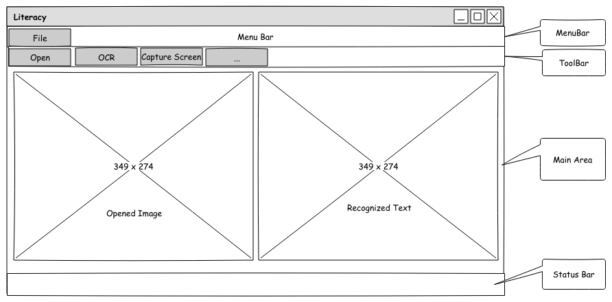
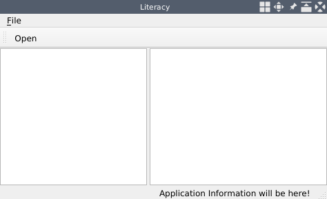
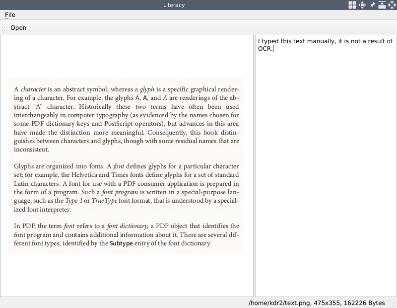
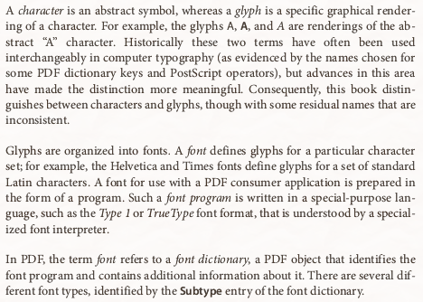
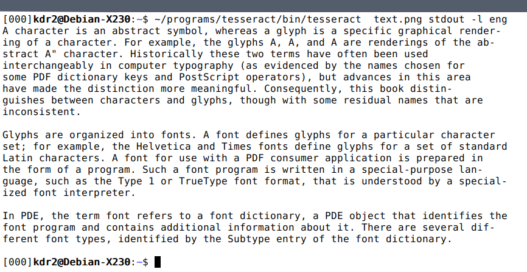
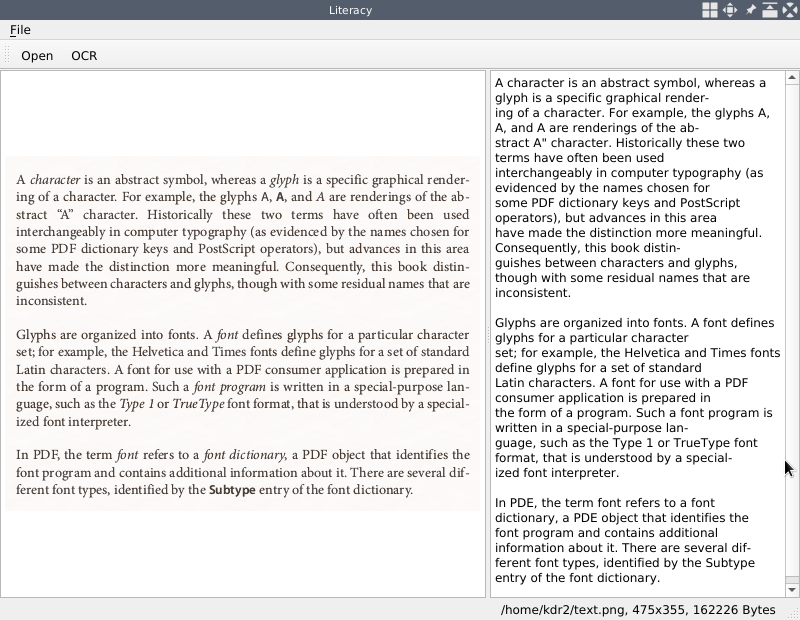
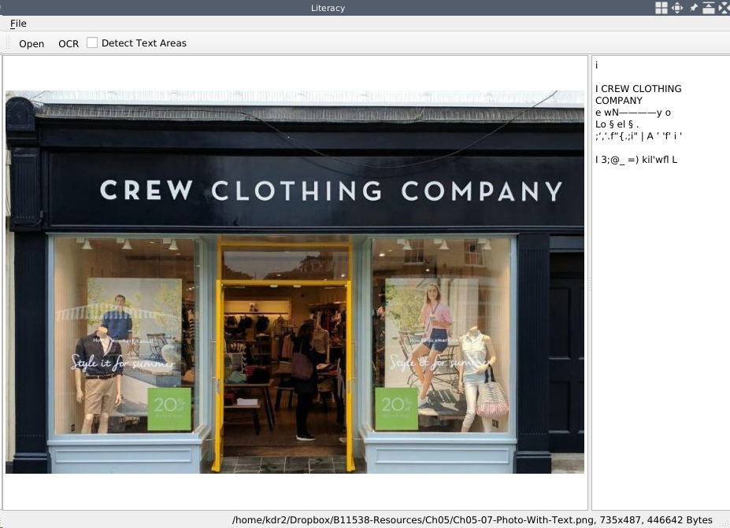
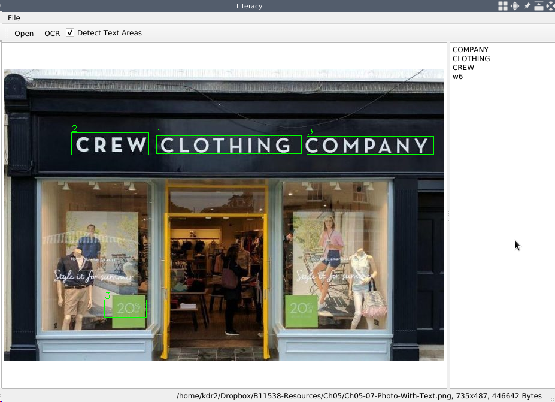

# 光学式文字認識

前の章では、ビデオやカメラを使った作業を多く行いました。パソコンに取り付けたウェブカメラから動画を再生するアプリケーション（GazerとFacetious）を作成しました。また、これらのアプリケーションを使って、動画の撮影、写真撮影、動きや顔の検出、動画から検出した顔へのマスクの適用をリアルタイムに行うことができます。

さて、ここからは画像中の文字に焦点を移します。画像から文字やテキストを抽出したい場面は多くあります。コンピュータビジョンの分野では、このような作業を人手で書き写すのではなく、自動的に行うOCR（Optical Character Recognition）と呼ばれる技術があります。この章では、Qt と数多くの OCR ライブラリを用いて、画像やスキャンした文書からテキストを抽出する新しいアプリケーショ ンを構築します。

この章では、以下のトピックを取り上げます。

* 画像からテキストを抽出する
* 画像からテキストを抽出する 画像からテキスト領域を検出する
* 画面のコンテンツにアクセスする
* ウィジェットへの描画と画面の一部分の切り出し

***

## 技術的要件

これまでの章で見てきたように、ユーザーは少なくともQtバージョン5がインストールされており、C++とQtプログラミングの基本的な知識があることが必要です。また、本章ではOCR機能としてこのライブラリを使用するため、Tesseractの最新版であるバージョン4.0が正しくインストールされている必要があります。Windowsの場合、Tesseractのビルド済みバイナリパッケージは、[https://github.com/UB-Mannheim/tesseract/wiki](https://github.com/UB-Mannheim/tesseract/wiki) にあります。UNIX系システムでは、Tesseractを使用する前に、ソースから順を追ってビルドします。

また、深層学習の知識があれば、本章の内容を理解する上で大きな助けとなるでしょう。

本章のコードは全て、私たちのコードリポジトリ（[https://github.com/PacktPublishing/Qt-5-and-OpenCV-4-Computer-Vision-Projects/tree/master/Chapter-05](https://github.com/PacktPublishing/Qt-5-and-OpenCV-4-Computer-Vision-Projects/tree/master/Chapter-05)）にあります。

次のビデオでコードの動きを確認してください： [http://bit.ly/2FhuTvq](http://bit.ly/2FhuTvq)

***

## Literacyの作成

先に述べたように、画像やスキャンした文書からテキストを抽出するための新しいアプリケーションを作成することにします。まず、このアプリケーションの目的を明確にする必要があります。主な機能は画像からテキストを抽出することですが、ユーザーの利便性を考えて、画像を指定する方法を複数用意する必要があります。

* 画像はローカルのハードディスクにあるものでもよい。
* 画像はローカルのハードディスクにあるものでもよいし、画面からキャプチャしたものでもよい。

このように要件を明確にした上で、UIを設計していきましょう。

***

### UIをデザインする

アプリケーションのUIのデザインとして、以下のワイヤーフレームを描きます。



左側は開いた画像、右側は取り出したテキストを表示するエリアです。その他、メニューバー、ツールバー、ステータスバーなど、私たちがよく知っているウィンドウの構成です。

このデザインのソースファイルは、GitHubのコードリポジトリ（[https://github.com/PacktPublishing/Qt-5-and-OpenCV-4-Computer-Vision-Projects](https://github.com/PacktPublishing/Qt-5-and-OpenCV-4-Computer-Vision-Projects)）から入手できます。このファイルはリポジトリのルートディレクトリにあり、名前は WireFrames.epgz です。この章のワイヤーフレームは、3ページ目にあります。このファイルは、Pencilアプリケーションで開く必要があることを忘れないでください。

***

### UIを設定する

前のサブセクションでは、私たちの新しいアプリケーション、LiteracyのUIをデザインしました。それでは、Qt プロジェクトを作成し、Qt のメインウィンドウに UI を設定してみましょう。

まず、ターミナルでプロジェクトを作成しましょう。

```sh
     $ mkdir Literacy/
     $ cd Literacy/
     $ touch main.cpp
     $ ls
     main.cpp
     $ qmake -project
     $ ls
     Literacy.pro main.cpp
     $
```

そして、プロジェクトファイル「Literacy.pro」を開き、以下の内容を記入します。

```qmake
     TEMPLATE = app
     TARGET = Literacy

     QT += core gui
     greaterThan(QT_MAJOR_VERSION, 4): QT += widgets

     INCLUDEPATH += .

     # Input
     HEADERS += mainwindow.h
     SOURCES += main.cpp mainwindow.cpp
```

これは何度もやっていることなので、簡単です。しかし、このプロジェクトファイルでは、1つのヘッダーファイルと2つのソースファイルを指定していますが、この時点では、空のソースファイルmain.cppが1つしかないことは、やはり注目すべき点でしょう。この点については心配しないでください。このプロジェクトをコンパイルする前に、これらすべてのソースファイルを完成させます。

main.cppも非常にわかりやすいファイルです。

```cpp
     #include <QApplication>
     #include "mainwindow.h"

     int main(int argc, char *argv[])
     {
         QApplication app(argc, argv);
         MainWindow window;
         window.setWindowTitle("Literacy");
         window.show();
         return app.exec();
     }
```

他のプロジェクトで行ったのと同様に、QApplicationのインスタンスとMainWindowのインスタンスを作成し、ウィンドウのshowメソッドとアプリケーションのexecメソッドを呼び出してアプリケーションを起動させます。しかし、MainWindowクラスはまだ存在しないので、今これを作成しましょう。

プロジェクトのルートディレクトリに、MainWindowクラスを収容するためのmainwindow.hというファイルを新規に作成します。ifndef/define のイディオムや include ディレクティブを省略すると、このクラスは次のようになります。

```cpp
     class MainWindow : public QMainWindow
     {
         Q_OBJECT

     public:
         explicit MainWindow(QWidget *parent=nullptr);
         ~MainWindow();

     private:
         void initUI();
         void createActions();
         void setupShortcuts();

     private:
         QMenu *fileMenu;

         QToolBar *fileToolBar;

         QGraphicsScene *imageScene;
         QGraphicsView *imageView;

         QTextEdit *editor;

         QStatusBar *mainStatusBar;
         QLabel *mainStatusLabel;

         QAction *openAction;
         QAction *saveImageAsAction;
         QAction *saveTextAsAction;
         QAction *exitAction;
     };
```

これは明らかにQMainWindowのサブクラスであり、それゆえ本体の最初にQ_OBJECTマクロを持ちます。最も重要な点は、プライベートセクションで宣言したウィジェットです。ファイルメニューのfileMenu、ツールバーのfileToolBar、ターゲット画像を表示するQGraphicsSceneとQGraphicsView、認識したテキスト、ステータスバー、ラベルを配置するQTextEditor、そして、最後に4つのQActionポインターがあります。

これらのウィジェットの宣言とは別に、これらのウィジェットをインスタンス化し、設計通りにメイン・ウィンドウに配置するための3つのプライベート・メソッドも用意されています。

* initUI: アクションを除くすべてのウィジェットをインスタンス化する。
* createActions: initUIメソッドから呼び出されます。
* setupShortcuts: ショートカットの設定。アプリケーションをより使いやすくするために、いくつかのホットキーを設定する。これはcreateActionsメソッドで呼び出される。

さて、いよいよこれらのメソッドを実装してみましょう。これらの実装に対応するために、プロジェクトのルートディレクトリにmainwindow.cppという新しいソースファイルを作成します。まず、initUIメソッドを見てみましょう。

```cpp
     void MainWindow::initUI()
     {
         this->resize(800, 600);
         // setup menubar
         fileMenu = menuBar()->addMenu("&File");

         // setup toolbar
         fileToolBar = addToolBar("File");

         // main area
         QSplitter *splitter = new QSplitter(Qt::Horizontal, this);

         imageScene = new QGraphicsScene(this);
         imageView = new QGraphicsView(imageScene);
         splitter->addWidget(imageView);

         editor = new QTextEdit(this);
         splitter->addWidget(editor);

         QList<int> sizes = {400, 400};
         splitter->setSizes(sizes);

         setCentralWidget(splitter);

         // setup status bar
         mainStatusBar = statusBar();
         mainStatusLabel = new QLabel(mainStatusBar);
         mainStatusBar->addPermanentWidget(mainStatusLabel);
         mainStatusLabel->setText("Application Information will be here!");
         createActions();
     }
```

この方法では、まずウィンドウサイズを設定し、ファイルメニューを作成してメニューバーに追加し、ファイルツールバーを作成し、最後にステータスバーを作成してそこにラベルを貼ります。この作業はすべて、これまでのプロジェクトで行ってきたものと同じです。これまでのプロジェクトと異なる顕著な点は、メソッド本体の中央部分であるメインエリアの作成です。この部分では、グラフィックスビューとエディタに対応するために、QGridLayoutインスタンスの代わりに、水平方向を持つQSplitterオブジェクトを作成します。

QSplitterを使うことで、QGridLayoutでは不可能な、スプリッターバーをドラッグして子ウィジェットの幅を自由に変更することができるようになります。その後、グラフィックシーンとグラフィックビューを作成し、エディタがそれらを整然とスプリッタに追加していきます。スプリッターの子の幅は、intのリストでsetSizesメソッドを呼び出して設定します。各子の幅は、400ピクセルで等しくなるようにします。最後に、スプリッターをメイン・ウィンドウの中心的なウィジェットとして設定する。

次のコードは、createActions メソッドに関連するものです。

```cpp
     void MainWindow::createActions()
     {
         // create actions, add them to menus
         openAction = new QAction("&Open", this);
         fileMenu->addAction(openAction);
         saveImageAsAction = new QAction("Save &Image as", this);
         fileMenu->addAction(saveImageAsAction);
         saveTextAsAction = new QAction("Save &Text as", this);
         fileMenu->addAction(saveTextAsAction);
         exitAction = new QAction("E&xit", this);
         fileMenu->addAction(exitAction);

         // add actions to toolbars
         fileToolBar->addAction(openAction);

         setupShortcuts();
     }
```

ここでは、宣言したすべてのアクションを作成し、ファイルメニューとツールバーに追加しています。このメソッドの最後に、setupShortcutsを呼び出しています。では、その中で設定したショートカットの内容を見てみましょう。

```cpp
     void MainWindow::setupShortcuts()
     {
         QList<QKeySequence> shortcuts;
         shortcuts << (Qt::CTRL + Qt::Key_O);
         openAction->setShortcuts(shortcuts);

         shortcuts.clear();
         shortcuts << (Qt::CTRL + Qt::Key_Q);
         exitAction->setShortcuts(shortcuts);
     }
```

ご覧のように、Ctrl-OでopenActionを、Ctrl-QでexitActionをトリガーしています。

最後に、コンストラクタとデストラクタです。

```cpp
     MainWindow::MainWindow(QWidget *parent) :
         QMainWindow(parent)
     {
         initUI();
     }

     MainWindow::~MainWindow()
     {
     }
```

この2つはかなり簡単なので、ここではあまり詳しく説明しません。では、Literacyアプリケーションをコンパイルして実行します。

```sh
     $ qmake -makefile
     $ make
     g++ -c -pipe -O2 -Wall -W # ...
     # output trucated
     $ ./Literacy
```

アプリケーションを実行すると、デスクトップに次のようなウィンドウが表示されます。



つまり、インタラクティブな機能を持たない完全な UI を設定したことになります。次に、このアプリケーションに以下のようなインタラクティブな機能を追加していきます。

* ローカルディスクから画像を開く
* 現在の画像をファイルとしてローカルディスクに保存する
* エディタウィジェットのテキストを、テキストファイルとしてローカルディスクに保存する。

これらの目標を達成するために、mainwindow.h ヘッダーファイルの MainWindow クラスにいくつかのメソッド、スロット、メンバ フィールドを追加する必要があります。

```cpp
     private:
         // ...
         void showImage(QString);
         // ...
     private slots:
         void openImage();
         void saveImageAs();
         void saveTextAs();

     private:
         // ...
         QString currentImagePath;
         QGraphicsPixmapItem *currentImage;
```

showImageメソッドとopenImageスロットは、ImageViewerアプリケーション（第1章画像ビューアの構築参照）で書いたMainWindow::showImageとMainWindow::openImageメソッドと同じ実装を持ちます。また、saveImageAs スロットは、その ImageViewer アプリケーションの MainWindow::saveAs メソッドと全く同じ実装になっています。新しいアプリケーションではテキストだけでなく画像も保存する必要があり、このメソッドは画像を保存するためだけのものであるという理由から、ここでは異なる名前を使用しているだけです。したがって、これらの実装を新しいプロジェクトにコピーします。この章を簡潔にするために、これらについてあまり詳しく説明することはありません。

まだカバーしていない唯一のメソッドは、saveTextAs スロットです。では、その実装を見てみましょう。

```cpp
     void MainWindow::saveTextAs()
     {
         QFileDialog dialog(this);
         dialog.setWindowTitle("Save Text As ...");
         dialog.setFileMode(QFileDialog::AnyFile);
         dialog.setAcceptMode(QFileDialog::AcceptSave);
         dialog.setNameFilter(tr("Text files (*.txt)"));
         QStringList fileNames;
         if (dialog.exec()) {
             fileNames = dialog.selectedFiles();
             if(QRegExp(".+\\.(txt)").exactMatch(fileNames.at(0))) {
                 QFile file(fileNames.at(0));
                 if (!file.open(QIODevice::WriteOnly | QIODevice::Text)) {
                     QMessageBox::information(this, "Error", "Can't save text.");
                     return;
                 }
                 QTextStream out(&file);
                 out << editor->toPlainText() << "\n";
             } else {
                 QMessageBox::information(this, "Error", "Save error: bad format or filename.");
             }
         }
     }
```

saveImageAsメソッドと非常によく似ています。 異なる点は以下の通りです。

* ファイルダイアログで、拡張子名txtの名前フィルタを設定し、テキストファイルのみが選択できるようにしています。
* テキストを保存しながら、選択されたファイル名でQFileインスタンスを作成し、そのQFileインスタンスで書き込み可能なQTextStreamインスタンスを作成します。最後に、テキストエディタのtoPlainText()メソッドを呼び出して内容を取得し、先ほど作成したストリームに書き込んでいます。

さて、すべてのメソッドとスロットが終了しましたので、createActionsメソッドでシグナルとこれらのスロットを接続してみましょう。

```cpp
         // connect the signals and slots
         connect(exitAction, SIGNAL(triggered(bool)), QApplication::instance(), SLOT(quit()));
         connect(openAction, SIGNAL(triggered(bool)), this, SLOT(openImage()));
         connect(saveImageAsAction, SIGNAL(triggered(bool)), this, SLOT(saveImageAs()));
         connect(saveTextAsAction, SIGNAL(triggered(bool)), this, SLOT(saveTextAs()));
```

最後に、コンストラクタで currentImage メンバフィールドを nullptr に初期化します。

```cpp
     MainWindow::MainWindow(QWidget *parent) :
         QMainWindow(parent), currentImage(nullptr)
     {
         initUI();
     }
```

ここで、新しく追加されたこれらのインタラクティブな機能をテストするために、アプリケーションを再度コンパイルして実行します。アクションをクリックし、画像を開き、エディターで文字を入力し、スプリッターバーをドラッグして列の幅を調整し、画像やテキストをファイルとして保存してみましょう。対話するメインウィンドウは、このようになります。



図にあるように、多くの文字を含む画像を開き、右側のエディタにテキストを入力します。次のセクションでは、画像からテキストを抽出し、ツールバーのボタンをクリックして抽出したテキストを自動的にエディタに入力します。

このセクションのコードにおけるすべての変更は、このコミットにあります: [https://github.com/PacktPublishing/Qt-5-and-OpenCV-4-Computer-Vision-Projects/commit/bc1548b97cf79ddae5184f8009badb278c2750b2(https://github.com/PacktPublishing/Qt-5-and-OpenCV-4-Computer-Vision-Projects/commit/bc1548b97cf79ddae5184f8009badb278c2750b2).

***

## TesseractによるOCR

ここでは、Tesseractを使って画像からテキストを抽出します。TesseractをWindowsにインストールするには、前述したように、ビルド済みのバイナリパッケージを使用することができます。UNIX系のシステムであれば、システムのパッケージマネージャを利用して、例えばDebianであればapt-get、macOSであればbrewでインストールすることが可能です。Debianを例にとると、libtesseract-devとtesseract-ocr-allパッケージをインストールすれば、必要なライブラリやデータファイルがすべてインストールされます。どのようにインストールするにしても、正しいバージョンである4.0.0がインストールされていることを確認してください。

ビルド済みのパッケージもありますが、教育的な目的から、Linuxシステム上でソースからビルドし、どのようなコンポーネントが含まれ、どのようにコマンドラインツールを使用するかを確認することにします。

***

### Tesseractをソースからビルドする

バージョン4.0.0をソースからビルドします。まず、[https://github.com/tesseract-ocr/tesseract/releases](https://github.com/tesseract-ocr/tesseract/releases)、リリースページの4.0.0 Releaseからzipファイルを選択し、ダウンロードを行います。.zipファイルがダウンロードされたら、それを解凍し、ビルドするためのディレクトリを入力します。

```sh
$ curl -L https://github.com/tesseract-ocr/tesseract/archive/4.0.0.zip -o tesseract-4.0.0.zip
  % Total % Received % Xferd Average Speed Time Time Time Current
                                 Dload Upload Total Spent Left Speed
100 127 0 127 0 0 159 0 --:--:-- --:--:-- --:--:-- 159
100 2487k 0 2487k 0 0 407k 0 --:--:-- 0:00:06 --:--:-- 571k
$ unzip tesseract-4.0.0.zip
# output omitted
$ cd tesseract-4.0.0/
$ ./configure --prefix=/home/kdr2/programs/tesseract
# output omitted
$ make && make install
# output omitted
```

Tesseractはautotoolsを使ってビルドシステムを構築しているため、そのビルド方法は非常に簡単です。まず、configureスクリプトを実行し、次にmake && make installを実行します。configureスクリプトを実行する際に、-prefix=/home/kdr2/programs/tesseractという引数を与えてインストール先を指定しているので、予定通りであれば、このディレクトリの下にTesseractライブラリが、ヘッダーファイル、スタティックライブラリ、ダイナミックライブラリと、その他多くのファイルを含めてインストールされることになります。

Tesseract 4では、LSTM（Long Short-Term Memory）ニューラルネットワークをベースとした、線認識に特化した新しいOCRエンジンが導入されましたが、Tesseract 3のレガシーなOCRエンジンである、文字パターンの認識も踏襲されています。そのため、Tesseract 4ではどちらのエンジンを使うかを自由に選択することができます。新しいOCRエンジンを利用するには、そのエンジンに搭載されているLSTM AIモデルの事前学習データをダウンロードする必要があります。この学習済みデータは、GitHubのリポジトリ（[https://github.com/tesseract-ocr/tessdata](https://github.com/tesseract-ocr/tessdata)）で公開されています。このリポジトリの内容をダウンロードし、Tesseractのインストールディレクトリの下に配置します。

```sh
$ curl -O -L https://github.com/tesseract-ocr/tessdata/archive/master.zip
# output omitted
$ unzip master.zip
Archive: master.zip
590567f20dc044f6948a8e2c61afc714c360ad0e
   creating: tessdata-master/
  inflating: tessdata-master/COPYING
  inflating: tessdata-master/README.md
  inflating: tessdata-master/afr.traineddata
  ...
$ mv tessdata-master/* /home/kdr2/programs/tesseract/share/tessdata/
$ ls /home/kdr2/programs/tesseract/share/tessdata/ -l |head
total 1041388
-rw-r--r-- 1 kdr2 kdr2 7851157 May 10 2018 afr.traineddata
-rw-r--r-- 1 kdr2 kdr2 8423467 May 10 2018 amh.traineddata
-rw-r--r-- 1 kdr2 kdr2 2494806 May 10 2018 ara.traineddata
-rw-r--r-- 1 kdr2 kdr2 2045457 May 10 2018 asm.traineddata
-rw-r--r-- 1 kdr2 kdr2 4726411 May 10 2018 aze_cyrl.traineddata
-rw-r--r-- 1 kdr2 kdr2 10139884 May 10 2018 aze.traineddata
-rw-r--r-- 1 kdr2 kdr2 11185811 May 10 2018 bel.traineddata
-rw-r--r-- 1 kdr2 kdr2 1789439 May 10 2018 ben.traineddata
-rw-r--r-- 1 kdr2 kdr2 1966470 May 10 2018 bod.traineddata
```

このステップでは、拡張子が traineddata のファイルが大量に生成されます。これらのファイルは異なる言語の学習済みデータファイルであり、言語名がファイル名のベースとして使用されます。例えば、eng.traineddata は英字を認識するためのファイルです。

*実はこの学習済みデータは、Tesseractのインストール先であるデータディレクトリの下に置く必要はありません。好きな場所にファイルを置き、環境変数TESSDATA_PREFIXにそのディレクトリを設定します。Tesseractはこの環境変数に従うことで、これらのファイルを見つけることができます。*

Tesseractは、画像からテキストを抽出するためのコマンドラインツールを提供しています。このツールを使って、Tesseractのライブラリが正しくインストールされているかどうかを確認してみましょう。

```sh
$ ~/programs/tesseract/bin/tesseract -v
tesseract 4.0.0
 leptonica-1.76.0
  libgif 5.1.4 : libjpeg 6b (libjpeg-turbo 1.5.2) : libpng 1.6.36 : libtiff 4.0.9 : zlib 1.2.11 : libwebp 0.6.1 : libopenjp2 2.3.0
 Found AVX
 Found SSE
```

-v オプションは、テッセラクトツールにバージョン情報を表示する以外何もしないように指示します。Tesseract 4.0.0がインストールされていることが確認できます。このメッセージにあるleptonicaという単語は、Tesseractがデフォルトで使用する別の画像処理ライブラリです。今回のプロジェクトでは、すでにQtとOpenCVで画像処理をしているので、この情報は無視すればよいでしょう。

では、このコマンドラインツールを使って、画像からテキストを抽出してみましょう。入力として以下のような図が用意されています。



そして、これが図上でのコマンドラインツールの性能の結果です。



ご覧のように、今回はコマンドラインツールに多くの引数を与えています。

* 最初の引数は入力画像です。
* 2つ目は出力です。stdoutは、コマンドラインツールが結果をターミナルの標準出力に書き出すことを指示するために使用します。ここでベースとなるファイル名を指定することができます。例えば、text-outと指定すると、テキストファイルtext-out.txtに結果を書き出すように指示します。
* 残りの引数はオプションです。ここでは-l engを使い、抽出したいテキストが英語で書かれていることを伝えています。

Tesseractは図中のテキストを非常によく認識していることがわかります。

Tesseractのコマンドラインツールには、-lオプションの他に、--oemと-psmという重要なオプションがあります。

oemオプションは、その名前から推測できるように、OCRエンジンモードを選択するためのものです。以下のコマンドを実行することで、TesseractがサポートしているすべてのOCRエンジンモードを一覧することができます。

```sh
$ ~/programs/tesseract/bin/tesseract --help-oem
OCR Engine modes:
  0 Legacy engine only.
  1 Neural nets LSTM engine only.
  2 Legacy + LSTM engines.
  3 Default, based on what is available.
```

Tesseract 4.0ではLSTMモードがデフォルトで使用されており、ほとんどの状況において非常に良いパフォーマンスを発揮します。テキストを抽出するために実行したコマンドの最後に--oem 0を追加すれば、レガシーエンジンを試すことができ、この図ではレガシーエンジンがあまりうまく動作していないことがわかるでしょう。

psmオプションは、ページ分割モードを指定するためのものです。tesseract --help-psmを実行すると、Tesseractのページ分割には多くのモードがあることがわかります。

```sh
$ ~/programs/tesseract/bin/tesseract --help-psm
Page segmentation modes:
  0 Orientation and script detection (OSD) only.
  1 Automatic page segmentation with OSD.
  2 Automatic page segmentation, but no OSD, or OCR.
  3 Fully automatic page segmentation, but no OSD. (Default)
  4 Assume a single column of text of variable sizes.
  5 Assume a single uniform block of vertically aligned text.
  6 Assume a single uniform block of text.
  7 Treat the image as a single text line.
  8 Treat the image as a single word.
  9 Treat the image as a single word in a circle.
 10 Treat the image as a single character.
 11 Sparse text. Find as much text as possible in no particular order.
 12 Sparse text with OSD.
 13 Raw line. Treat the image as a single text line,
       bypassing hacks that are Tesseract-specific.
```

複雑なタイプセットを持つスキャン文書を扱う場合は、おそらくそのページ分割モードを選択する必要があります。しかし、今回は単純な画像を扱うので、このオプションは無視することにします。

ここまでで、Tesseractライブラリのインストールに成功し、そのコマンドラインツールを使って画像からテキストを抽出する方法について学びました。次のサブセクションでは、このライブラリを我々のアプリケーションであるLiteracyに統合し、テキスト認識機能を促進させることにします。

***

### リテラシーで文字を認識する

テッサー・アクト・ライブラリーの準備ができたので、それを使ってリタイア・アプリのキャラクターを再定義してみよう。

まず最初にすべきことは、プロジェクトファイルを更新し、Tesserのアクトリブラリに反映させます：

```sh
# use your own path in the following config
unix: {
    INCLUDEPATH += homekdr2/programs/tesseract/include
    LIBS += -Lhomekdr2/programs/tesseract/lib -ltesseract
}
win32 {
    INCLUDEPATH += c:/path/to/tesseract/include
    LIBS += -lc:/path/to/opencv/lib/tesseract
}
DEFINES += TESSDATA_PREFIX=\\\"homekdr2/programs/tesseract/share/tessdata/\\\"
```

先の変更セットでは、異なるプラットフォーム用のTesseractライブラリのインクルードパスとライブラリパスを追加し、TESSDATA_PREFIXというマクロを定義しました。このマクロは後ほど学習済みデータをロードする際に使用します。

次に、mainwindow.hヘッダーファイルを開き、新しい行を追加します：

```cpp
     #include "tesseract/baseapi.h"

     class MainWindow : public QMainWindow
     {
         // ...
     private slots:
         // ...
         void extractText();

     private:
         // ...
         QAction *ocrAction;
         // ...
         tesseract::TessBaseAPI *tesseractAPI;
     };
```

この変更セットでは、まずTesseractライブラリのベースAPIヘッダーファイルをインクルードするためにincludeディレクティブを追加し、次にMainWindowクラスに1つのスロットと2つのメンバーを追加します。

QAction \*ocrActionメンバーは、メインウィンドウのツールバーに表示されます。このアクションがトリガーされると、新しく追加されたスロットであるextractTextが呼び出され、そのスロットはtesseract::TessBaseAPI *tesseractAPIメンバを使用して、開かれたイメージ内の文字を認識します。

では、ソースファイルmainwindow.cppでこれらのことがどのように行われるかを見てみましょう。

MainWindowクラスのコンストラクタで、メンバ・フィールドのtesseractAPIをnullptrに初期化します：

```cpp
     MainWindow::MainWindow(QWidget *parent) :
         QMainWindow(parent)
         , currentImage(nullptr)
         , tesseractAPI(nullptr)
     {
         initUI();
     }
```

createActionsメソッドでは、ocrActionアクションを作成し、ツールバーに追加し、そのトリガーシグナルを新しく追加されたextractTextスロットに接続します：

```cpp
     void MainWindow::createActions()
     {
         // ...
         ocrAction = new QAction("OCR", this);
         fileToolBar->addAction(ocrAction);

         // ...
         connect(ocrAction, SIGNAL(triggered(bool)), this, SLOT(extractText()));
         // ...
     }
```

あとは、最も複雑で重要な部分であるextractTextスロットの実装だけです：

```cpp
     void MainWindow::extractText()
     {
         if (currentImage == nullptr) {
             QMessageBox::information(this, "Information", "No opened image.");
             return;
         }

         char *old_ctype = strdup(setlocale(LC_ALL, NULL));
         setlocale(LC_ALL, "C");
         tesseractAPI = new tesseract::TessBaseAPI();
         // Initialize tesseract-ocr with English, with specifying tessdata path
         if (tesseractAPI->Init(TESSDATA_PREFIX, "eng")) {
             QMessageBox::information(this, "Error", "Could not initialize tesseract.");
             return;
         }

         QPixmap pixmap = currentImage->pixmap();
         QImage image = pixmap.toImage();
         image = image.convertToFormat(QImage::Format_RGB888);

         tesseractAPI->SetImage(image.bits(), image.width(), image.height(),
             3, image.bytesPerLine());
         char *outText = tesseractAPI->GetUTF8Text();
         editor->setPlainText(outText);
         // Destroy used object and release memory
         tesseractAPI->End();
         delete tesseractAPI;
         tesseractAPI = nullptr;
         delete [] outText;
         setlocale(LC_ALL, old_ctype);
         free(old_ctype);
     }
```

メソッド本体の冒頭で、currentImageメンバ・フィールドがnullかどうかをチェックする。もしnullであれば、アプリケーションで開いている画像はないので、メッセージボックスを表示した後、すぐにリターンします。

もしnullでなければ、Tesseract APIインスタンスを作成します。TesseractはロケールをCに設定する必要があるため、まず、LC_ALLカテゴリとnull値でsetlocale関数を呼び出し、現在のロケール設定を取得し保存します。OCR作業が完了したら、保存されたLC_ALL値を使用してロケール設定を復元します。

ロケールをCに設定した後、Tesseract APIのインスタンスを作成します。作成にはnew tesseract::TessBaseAPI()を使用します。新しく作成したAPIインスタンスは、使用する前に初期化する必要があります。初期化はInitメソッドを呼び出すことで実行されます。Initメソッドには多くのバージョン（オーバーロード）があります：

```cpp
// 1
int Init(const char* datapath, const char* language, OcrEngineMode mode,
         char **configs, int configs_size,
         const GenericVector<STRING> *vars_vec,
         const GenericVector<STRING> *vars_values,
         bool set_only_non_debug_params);
// 2
int Init(const char* datapath, const char* language, OcrEngineMode oem) {
  return Init(datapath, language, oem, nullptr, 0, nullptr, nullptr, false);
}
// 3
int Init(const char* datapath, const char* language) {
  return Init(datapath, language, OEM_DEFAULT, nullptr, 0, nullptr, nullptr, false);
}
// 4
int Init(const char* data, int data_size, const char* language,
         OcrEngineMode mode, char** configs, int configs_size,
         const GenericVector<STRING>* vars_vec,
         const GenericVector<STRING>* vars_values,
         bool set_only_non_debug_params, FileReader reader);
```

これらのバージョンのいくつかでは、事前学習されたデータ・パス、言語名、OCR エンジン・モード、ページ分割モード、その他多くの設定を指定することができます。コードを単純化し、API インスタンスを初期化するために、このメソッドの最も単純なバージョンである 3 番目のバージョンを使用します。この呼び出しでは、データパスと言語名を渡すだけです。データ・パスは、プロジェクト・ファイルで定義したマクロで表されていることに注意してください。初期化プロセスは失敗する可能性があるため、その結果をチェックし、初期化に失敗した場合は簡単なメッセージを表示した後、すぐにリターンします。

Tesseract APIインスタンスの準備ができたら、現在開いている画像を取得し、以前のプロジェクトで行ったようにQImage::Format_RGB888フォーマットの画像に変換します。

RGB888フォーマットの画像を取得したら、SetImageメソッドを呼び出すことで、Tesseract APIインスタンスに画像を渡すことができます。SetImageメソッドには様々なオーバーロードがあります：

```cpp
// 1
void SetImage(const unsigned char* imagedata, int width, int height,
              int bytes_per_pixel, int bytes_per_line);
// 2
void SetImage(Pix* pix);
```

最初のものは、指定された画像のデータフォーマットの情報を使って呼び出すことができます。これは、Qt の QImage や OpenCV の Mat などのライブラリで定義されたクラスに制限されません。2番目のバージョンは、入力画像として Pix ポインタを受け付けます。Pix クラスは、画像処理ライブラリ Leptonica によって定義されています。この例で最も適しているのは、明らかに最初のバージョンです。必要な情報はすべてQImageインスタンスから取得でき、QImageは3つのチャンネルと8ビットの深度を持ちます：

```cpp
         tesseractAPI->SetImage(image.bits(), image.width(), image.height(),
             3, image.bytesPerLine());
```

Tesseract APIインスタンスが画像を取得したら、そのGetUTF8Text()メソッドを呼び出し、画像から認識したテキストを取得することができます。ここで注意すべき点は、このメソッドの結果として得られるデータバッファを解放するのは呼び出し側の責任であるということです。

残りのタスクは、抽出されたテキストをエディタ・ウィジェットに設定し、Tesseract APIインスタンスを破棄し、GetUTF8Textコールの結果データ・バッファを削除し、ロケール設定を回復することです。

OK。アプリケーションをコンパイルし、再起動しましょう。アプリケーションが起動したら、テキストを含む画像を開き、ツールバーのOCRアクションをクリックします。すると、画像から抽出されたテキストが左側のエディターに表示されます：



結果に満足したら、ファイルメニューの「名前を付けてテキストを保存」をクリックして、テキストをファイルとして保存できます。

これまでのところ、このアプリケーションは、本の写真やスキャンした文書などの画像からテキストを認識し、抽出する機能を持っています。これらの画像には、活字の組版が上手なテキストしかありません。もしこのアプリケーションに、さまざまな要素を含む写真を与え、テキストがその中のほんの一部を占めるだけ、例えばお店の正面の写真や道路上の交通標識の写真などを与えた場合、どのような確率でも文字を認識できないでしょう。次の写真で試してみよう：


推測通り、我々のアプリケーションはテキストを抽出することができなかった。このような画像を扱うには、単に画像全体をTesseractに渡すだけでは駄目です。画像のどの領域にテキストが含まれているかをTesseractに伝える必要があります。そのため、この種の画像からテキストを抽出する前に、まず画像内のテキスト領域を検出しなければなりません。次のセクションでOpenCVを使ってこれを行います。

***

### OpenCVによるテキスト領域の検出

前節では、たとえばスキャンした文書など、テキストがきちんとタイプセットされた画像からテキストを抽出することに成功しました。しかし、一般的なシーンの写真からテキストを抽出することはできません。本節では、この問題を解決します。

このセクションでは、画像内のテキストの存在を検出するために、OpenCVを使ったEASTテキスト検出器に頼ることにします。EASTとは、Efficient and Accurate Scene Text detectorの略で、解説は https://arxiv.org/abs/1704.03155 にあります。これはニューラルネットワークベースのアルゴリズムですが、そのニューラルネットワークモデルのアーキテクチャと学習プロセスは本章の範囲外です。この章では、OpenCVのEASTテキスト検出器の事前学習済みモデルの使い方に焦点を当てます。

コードを始める前に、まず事前学習済みモデルを用意しましょう。EASTモデルの事前学習済みモデルファイルは、http://depot.kdr2.com/books/Qt-5-and-OpenCV-4-Computer-Vision-Projects/trained-model/frozen_east_text_detection.pb からダウンロードできます。これをダウンロードして、プロジェクトのルート・ディレクトリに置きましょう：

```bash
$ curl -O http://depot.kdr2.com/books/Qt-5-and-OpenCV-4-Computer-Vision-Projects/trained-model/frozen_east_text_detection.pb
# output omitted
$ ls -l
total 95176
-rw-r--r-- 1 kdr2 kdr2 96662756 Mar 22 17:03 frozen_east_text_detection.pb
-rwxr-xr-x 1 kdr2 kdr2 131776 Mar 22 17:30 Literacy
-rw-r--r-- 1 kdr2 kdr2 988 Mar 23 21:13 Literacy.pro
-rw-r--r-- 1 kdr2 kdr2 224 Mar 7 15:32 main.cpp
-rw-r--r-- 1 kdr2 kdr2 11062 Mar 23 21:13 mainwindow.cpp
-rw-r--r-- 1 kdr2 kdr2 1538 Mar 23 21:13 mainwindow.h
# output truncated
```

これはかなり簡単です。ニューラルネットワーク・モードの準備は完了しました。では、コードに移りましょう。

最初に更新する必要があるのは、プロジェクト・ファイルのLiteracy.proです。前の章でやったのと同じように、OpenCVライブラリの設定を組み込む必要があります：

```qmake
# opencv config
unix: !mac {
    INCLUDEPATH += /home/kdr2/programs/opencv/include/opencv4
    LIBS += -L/home/kdr2/programs/opencv/lib -lopencv_core -lopencv_imgproc -lopencv_dnn
}

unix: mac {
    INCLUDEPATH += /path/to/opencv/include/opencv4
    LIBS += -L/path/to/opencv/lib -lopencv_world
}

win32 {
    INCLUDEPATH += c:/path/to/opencv/include/opencv4
    LIBS += -lc:/path/to/opencv/lib/opencv_world
}
```

注目すべきは、LIBSの設定にopencv_dnnモジュールを追加していることです。実際にはディープニューラルネットワークであるEASTアルゴリズムの実装はこのモジュールにあります。

次に更新するのは、mainwindow.h というヘッダー・ファイルです。このファイルに2つのOpenCVヘッダー・ファイルをインクルードし、MainWindowクラスにいくつかのフィールドとメソッドを追加します：

```cpp
    // ...
    #include <QCheckBox>
    // ...
    #include "opencv2/opencv.hpp"
    #include "opencv2/dnn.hpp"

    class MainWindow : public QMainWindow
    {
        // ...
    private:
        // ...
        void showImage(cv::Mat);
        // ...
        void decode(const cv::Mat& scores, const cv::Mat& geometry, float scoreThresh,
            std::vector<cv::RotatedRect>& detections, std::vector<float>& confidences);
        cv::Mat detectTextAreas(QImage &image, std::vector<cv::Rect>&);

        // ...
    private:
        // ...
        QCheckBox *detectAreaCheckBox;
        // ...
        cv::dnn::Net net;
    };
```

まず、新しく追加されたプライベートフィールドを調べてみよう。メンバフィールドである cv::dnn::Net net は、テキスト領域の検出に使用されるディープニューラルネットワークのインスタンスです。detectAreaCheckBoxフィールドはツールバーに表示されるチェックボックスで、TesseractでOCR作業を実行する前にテキストエリアを検出すべきかどうかを判断するためのインジケータをユーザーが与えることができます。

detectTextAreasメソッドはOpenCVで領域を検出するためのもので、decodeメソッドは補助的なメソッドです。画像上のテキスト領域を検出した後、その画像上の各テキスト領域に対して矩形を描画します。これらのステップはすべてOpenCVで行われます。したがって、画像は cv::Mat のインスタンスとして表現されるので、更新された画像を UI に表示するために， cv::Mat のインスタンスを唯一の引数としてとる別のバージョンの showImage メソッドをオーバーロードします。

それでは、xmainwindow.cpp のソースファイルにアクセスして、変更点を確認してみましょう。

まず、最も重要なメソッドである MainWindow::detectTextAreas を見てみましょう。意図したとおり、このメソッドは入力画像としてQImageオブジェクトを第1引数に取ります。このメソッドの第2引数には、検出されたテキスト領域を保持するための cv::Rect ベクタへの参照が渡されます。このメソッドの戻り値は、検出された矩形が描画された入力画像を表す cv::Mat です。その実装を、次のコードを見てみましょう。

```cpp
    cv::Mat MainWindow::detectTextAreas(QImage &image, std::vector<cv::Rect> &areas)
    {
        float confThreshold = 0.5;
        float nmsThreshold = 0.4;
        int inputWidth = 320;
        int inputHeight = 320;
        std::string model = "./frozen_east_text_detection.pb";
        // Load DNN network.
        if (net.empty()) {
            net = cv::dnn::readNet(model);
        }

        // more ...
    }
```

このコードはメソッド本体の最初の部分です。この部分では、多くの変数を定義し、ディープニューラルネットワークを作成します。最初の2つの閾値は確信度と非最大抑制のためのものです。AIモデルの検出結果をフィルタリングするために使用します。EASTモデルでは、画像の幅と高さが32の倍数でなければならないので、値が両方とも320である2つのint変数を定義します。入力画像をDNNモデルに送る前に、この2つの変数に記述された寸法、つまりこの例では320 x 320にリサイズします。

次に、ダウンロードした事前学習済みモデルデータファイルへのパスを文字列で定義し、クラスメンバ net が空であることを条件に cv::dnn::readNet 関数を呼び出してロードします。OpenCV の DNN は、様々な種類の事前学習済みモデルデータファイルをサポートしています。

* *.caffemodel (Caffe, http://caffe.berkeleyvision.org/)
* *.pb (TensorFlow, https://www.tensorflow.org/)
* *.t7 or *.net (Torch, http://torch.ch/)
* *.weights (Darknet, https://pjreddie.com/darknet/)
* *.bin (DLDT, https://software.intel.com/openvino-toolkit)

前のリストから、私たちが使用する事前学習済みモデルは、TensorFlowフレームワークを使用して構築され、学習されていることがわかります。

つまり、DNNモデルがロードされたことになります。では、テキスト検出を行うために、入力画像をモデルに送ってみましょう：

```cpp
        std::vector<cv::Mat> outs;
        std::vector<std::string> layerNames(2);
        layerNames[0] = "feature_fusion/Conv_7/Sigmoid";
        layerNames[1] = "feature_fusion/concat_3";

        cv::Mat frame = cv::Mat(
            image.height(),
            image.width(),
            CV_8UC3,
            image.bits(),
            image.bytesPerLine()).clone();
        cv::Mat blob;

        cv::dnn::blobFromImage(
            frame, blob,
            1.0, cv::Size(inputWidth, inputHeight),
            cv::Scalar(123.68, 116.78, 103.94), true, false
        );
        net.setInput(blob);
        net.forward(outs, layerNames);
```

このコードでは、モデルの出力層を保存するために cv::Mat のベクトルを定義します。そして、DNN モデルから抽出する必要のある 2 つの層の名前を、文字列ベクトル layerNames 変数に入れます。この2つの層は、我々が欲しい情報を含んでいます：

1. 最初の層、feature_fusion/Conv_7/Sigmoidはシグモイド活性化の出力層です。この層のデータは、与えられた領域がテキストを含むかどうかの確率を含みます。
2. 2番目のレイヤ、feature_fusion/concat_3は、特徴マップの出力レイヤです。この層のデータには画像のジオメトリが含まれます。後でこのレイヤーのデータをデコードして、多くのバウンディングボックスを得ます。

この後、入力画像を QImage から cv::Mat に変換し、その行列を DNN モデルの入力、つまり入力層として利用可能な 4 次元の blob である別の行列に変換します。後者の変換は、OpenCV ライブラリの cv::dnn 名前空間にある blobFromImage 関数を呼び出すことで実装されます。この変換では、画像のサイズ変更や中心からの切り出し、平均値の引き算、スケールファクターによる値の拡大縮小、RチャンネルとBチャンネルの入れ替えなど、多くの処理が実行されます。このblobFromImage関数の呼び出しには、多くの引数があります。ひとつずつ説明しましょう：

1. 第1引数は入力画像。
2. 第2引数は出力画像。
3. 第3引数は各ピクセル値のスケールファクター。ここではピクセルを拡大縮小する必要がないため、1.0を使用する。
4. 第4引数は出力画像の空間サイズです。このサイズの幅と高さは32の倍数でなければならないと述べましたが、ここでは定義した変数で320×320を使用します。
5. 第5引数は各画像から差し引かれるべき平均値で、これはモデルの学習中に使用されたからです。ここで使用される平均は (123.68, 116.78, 103.94)です。
6. 次の引数は、RチャンネルとBチャンネルを入れ替えるかどうかです。OpenCVはBGRフォーマットを使用し、TensorFlowはRGBフォーマットを使用するため、これは必須です。
7. 最後の引数は、画像をトリミングして中央を切り取るかどうかです。この場合はfalseを指定します。

この呼び出しが戻ると、DNNモデルの入力として使用できるblobが得られます。次に、これをニューラルネットワークに渡し、モデルのsetInputメソッドとforwardメソッドを呼び出して、出力レイヤーを取得するためにフォワーディングのラウンドを実行します。フォワーディングが完了すると、欲しい2つの出力層が定義したアウトベクターに格納されます。次にすることは、これらの出力レイヤーを処理してテキスト・エリアを得ることです：

```cpp
        cv::Mat scores = outs[0];
        cv::Mat geometry = outs[1];

        std::vector<cv::RotatedRect> boxes;
        std::vector<float> confidences;
        decode(scores, geometry, confThreshold, boxes, confidences);

        std::vector<int> indices;
        cv::dnn::NMSBoxes(boxes, confidences, confThreshold, nmsThreshold, indices);
```

outsベクトルの最初の要素はスコアで、2番目の要素はジオメトリです。次に、MainWindow クラスの別のメソッドである decode を呼び出して、テキストボックスの位置と向きをデコードします。このデコード処理によって、候補となるテキスト領域が cv::RotatedRect として得られ、変数 boxes に格納されます。これらのボックスに対応する信頼度は、 confidences 変数に格納されます。

1つのテキストボックスに対して多くの候補が得られるかもしれないので、最もよく見えるテキストボックスをフィルタリングする必要があります。これは非最大抑制、つまりNMSBoxesメソッドの呼び出しを使って行われます。この呼び出しでは、デコードされたボックス、信頼度、信頼度と非最大抑制のしきい値を与え、排除されなかったボックスのインデックスは最後の引数indicesに格納されます。

デコードメソッドは、出力レイヤからコンフィデンスとボックス情報を抽出するために使用されます。その実装は https://github.com/opencv/opencv/blob/master/samples/dnn/text_detection.cpp#L119 にあります。これを理解するためには、DNNモデルのデータ構造、特に出力層のデータ構造を理解する必要があります。しかし、それは本書の範囲を超えています。もし興味があれば、https://arxiv.org/abs/1704.03155v2 にあるEASTに関連する論文や、https://github.com/argman/EAST にあるTensorflowを使った実装の1つを参照してください。

とりあえず、すべてのテキスト領域を cv::RotatedRect のインスタンスとして取得します。

```cpp
        cv::Point2f ratio((float)frame.cols / inputWidth, (float)frame.rows / inputHeight);
        cv::Scalar green = cv::Scalar(0, 255, 0);

        for (size_t i = 0; i < indices.size(); ++i) {
            cv::RotatedRect& box = boxes[indices[i]];
            cv::Rect area = box.boundingRect();
            area.x *= ratio.x;
            area.width *= ratio.x;
            area.y *= ratio.y;
            area.height *= ratio.y;
            areas.push_back(area);
            cv::rectangle(frame, area, green, 1);
            QString index = QString("%1").arg(i);
            cv::putText(
                frame, index.toStdString(), cv::Point2f(area.x, area.y - 2),
                cv::FONT_HERSHEY_SIMPLEX, 0.5, green, 1
            );
        }
        return frame;
```

テキスト領域を元の画像にマッピングするためには、DNNモデルに送られる前に、画像がどのようにリサイズされるかを知っておく必要があります。そこで、幅と高さの縦横比を計算し、それらを cv::Point2f ratio に保存します。そして、保持しているインデックスを繰り返し処理し、各インデックスで示される cv::RotatedRect オブジェクトを取得します。コードの複雑さを軽減するために、 cv::RotatedRect とその内容を通常の矩形に回転させるのではなく、単にその外接矩形を取得します。そして、その矩形に対して逆リサイズを行い、それを areas vector に押し込みます。これらの領域がどのように表示されるかを示すために、元の画像にも領域を描画し、それぞれの矩形の右上に番号を挿入して、処理される順番を示します。

メソッドの最後には、更新された元画像を返します。

テキスト領域検出メソッドが完成したので、アプリケーションに組み込んでみましょう。

まずinitUIメソッドで、OCRを実行する前にテキスト領域を検出するかどうかを決定するためのチェックボックスを作成し、ファイルツールバーに追加します：

```cpp
        detectAreaCheckBox = new QCheckBox("Detect Text Areas", this);
        fileToolBar->addWidget(detectAreaCheckBox);
```

そしてMainWindow::extractTextメソッドで、画像全体をTesseract APIにセットした後、そのチェックボックスの状態をチェックします：

```cpp
        tesseractAPI->SetImage(image.bits(), image.width(), image.height(),
            3, image.bytesPerLine());

        if (detectAreaCheckBox->checkState() == Qt::Checked) {
            std::vector<cv::Rect> areas;
            cv::Mat newImage = detectTextAreas(image, areas);
            showImage(newImage);
            editor->setPlainText("");
            for(cv::Rect &rect : areas) {
                tesseractAPI->SetRectangle(rect.x, rect.y, rect.width, rect.height);
                char *outText = tesseractAPI->GetUTF8Text();
                editor->setPlainText(editor->toPlainText() + outText);
                delete [] outText;
            }
        } else {
            char *outText = tesseractAPI->GetUTF8Text();
            editor->setPlainText(outText);
            delete [] outText;
        }
```

このように、チェックボックスがチェックされている場合は、 detextTextAreas メソッドを呼び出してテキスト領域を検出します。この呼び出しは、テキスト領域とインデックスが描画された画像を cv::Mat のインスタンスとして返し、この画像を用いて showImage メソッドを呼び出してウィンドウに表示します。次に、テキスト領域を繰り返し処理し、Tesseract API の SetRectangle メソッドを呼び出して、この矩形内にある文字のみを認識するように指示します。そして、認識されたテキストを取得し、エディタに追加し、テキストのメモリを解放します。

チェックボックスがチェックされていない場合は、以前から確立されているロジックを適用します。Tesseractに画像全体のテキストを認識させます。

また、ここでコードのちょっとした最適化を行います。Tesseract APIインスタンスは再利用できるので、作成と初期化は一度だけ行います：

```cpp
        if (tesseractAPI == nullptr) {
            tesseractAPI = new tesseract::TessBaseAPI();
            // Initialize tesseract-ocr with English, with specifying tessdata path
            if (tesseractAPI->Init(TESSDATA_PREFIX, "eng")) {
                QMessageBox::information(this, "Error", "Could not initialize tesseract.");
                return;
            }
        }
```

そして、MainWindowクラスのデストラクタでこれを破棄します：

```cpp
    MainWindow::~MainWindow()
    {
        // Destroy used object and release memory
        if(tesseractAPI != nullptr) {
            tesseractAPI->End();
            delete tesseractAPI;
        }
    }
```

最後に残っているのは、オーバーロードされたshowImageメソッドの実装です。画像フォーマットの変換やQtでの画像表示に関しては、すでに多くの作業を終えているので、これは本当に簡単なことです：

```cpp
    void MainWindow::showImage(cv::Mat mat)
    {
        QImage image(
            mat.data,
            mat.cols,
            mat.rows,
            mat.step,
            QImage::Format_RGB888);

        QPixmap pixmap = QPixmap::fromImage(image);
        imageScene->clear();
        imageView->resetMatrix();
        currentImage = imageScene->addPixmap(pixmap);
        imageScene->update();
        imageView->setSceneRect(pixmap.rect());
    }
```

OK。最後に、アプリケーションをコンパイルして実行し、テストしましょう：

```bash
$ make
# output omitted
$ export LD_LIBRARY_PATH=/home/kdr2/programs/opencv/lib:/home/kdr2/programs/tesseract/lib
$ ./Literacy
```

テキストを含む写真をアプリケーションで開き、[テキスト領域を検出]チェックボックスをオフにしたまま、[OCR]ボタンをクリックしてみましょう。次のような悪い結果が表示されます：



次に、チェックボックスにチェックを入れ、もう一度OCRボタンをクリックして、何が起こるか見てみましょう：



4つのテキストエリアが正しく検出され、そのうち3つのテキストが正しく認識されています。悪くない！

***

### 画面上の文字を認識する
