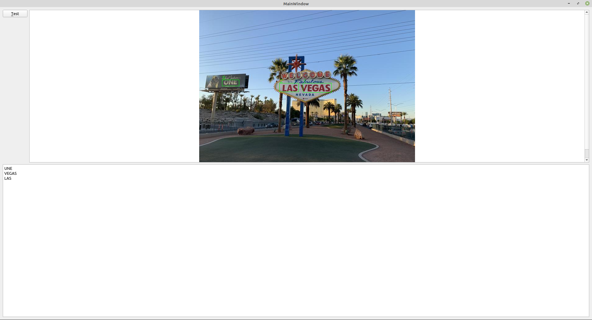

# OpenCV を使用して画像内の文字列を検出する

環境: Linux Mint 20 + Qt 5.15.2

**[全ソースはここ]()**

ここでは、本のような整然と並んだ文字列ではなく、画像の中に存在する文字列を検出してみます。
ここでは、 OpenCV の EAST テキスト検出を使用して文字列を検出します。EAST は Efficient and Accurate Scene Text の略で、<https://arxiv.org/abs/1704.03155> に説明があります。(ニューラルネットワークを使用したアルゴリズムです)ここでは、 OpenCV の EAST 事前トレーニング済みモデルを使用します。

ディープニューラルネットワークのライブラリ *opencv_dnn* もリンクする必要があります。

テキスト領域検出処理の内容を見ていきます。

```C++
cv::Mat MainWindow::detectTextAreas(QImage &image, std::vector<cv::Rect> &) {
    float confThreshold = 0.5;
    float nmsThreshold = 0.4;
    int inputWidth = 320;
    int inputHeight = 320;
    std::string model = "./frozen_east_text_detection.pb";
    // Load DNN network.
    if (_net.empty()) {
        _net = cv::dnn::readNet(model);
    }
```

最初の 2 つの閾値は信頼度と非最大抑制用です。この値を使用して AI モデルの検出結果をフィルタリングします。
EAST モデルでは、画像の幅と高さが 32 の倍数である必要があるため、 320 を幅と高さの変数に入れています。入力画像を DNN モデルに送信する前に、このサイズに変更します。

次に、*cv::dnn::readNet* を使用して、事前学習済みモデルデータファイルを読み込みます。OpenCV の DNN は、様々な種類のトレーニング済みモデルデータファイルをサポートしています。

| 拡張子 | 詳細 |
| -- | --|
|*.caffemodel|Caffe http://caffe.berkeleyvision.org/|
|*.pb|TensorFlow https://www.tensorflow.org/|
|*.t7 または *.net|Torch http://torch.ch/|
|*.weights|Darknet https://pjreddie.com/darknet/|
|*.bin|DLDT https://software.intel.com/openvino-toolkit|

今回使用する事前トレーニング済みモデルは、 TendorFlow フレームワークを使用して構築とトレーニングが行われたものです。

それでは、入力画像をモデルに送信してテキスト検出を行ってみましょう。

```C++
    std::vector<cv::Mat> outs;
    std::vector<std::string> layerNames(2);
    layerNames[0] = "feature_fusion/Conv_7/Sigmoid";
    layerNames[1] = "feature_fusion/concat_3";

    cv::Mat frame = cv::Mat(image.height(), image.width(), CV_8UC3, image.bits(), image.bytesPerLine()).clone();
    cv::Mat blob;

    cv::dnn::blobFromImage(frame, blob, 1.0, cv::Size(inputWidth, inputHeight), cv::Scalar(123.68, 116.78, 103.94),
                           true, false);
    _net.setInput(blob);
    _net.forward(outs, layerNames);
```

ここでは、モデルの出力レイヤー保存のために cv::Mat の vector を定義しています。
次に、 DNN モデルから抽出する必要がある 2 つのレイヤーの名前を layerNames に設定します。2 つのレイヤーには必要な情報が入っています。

最初の feature_fusion/Conv_7/Sigmoid レイヤーは、 Sigmoid アクティベーションの出力レイヤーです。
このレイヤーには、特定の領域にテキストが含まれているかどうかの確率が入っています。

2 番目の feature_fusion/concat_3 レイヤーは、特徴マップ出力レイヤーです。
このレイヤーには、画像のジオメトリが含まれています。このレイヤーのデータを使用することで、境界矩形を取得します。

次に、入力画像を QImage から cv::Mat に変換し、その行列を DNN モデル入力用の 4 次元の blob に変換します。これが入力層になります。
この変換は、 OpenCV ライブラリの *cv::dnn* 名前空間にある *blobFromImage* 関数で行います。
この変換では、画像サイズの変更、中央からのトリミング、平均値の減算、スケール係数によるスケーリング、 R チャネルと B チャネルの交換などの多くの処理が実行されます。

blobFromImage 関数には、下記のように多くの引数があります。

* 最初の引数は、入力画像です。
* 2 番目の引数は、出力画像です。
* 3 番目の引数は、各ピクセル値の倍率です。ここではスケーリングしないので 1.0 を使用します。
* 4 番目の引数は、出力画像のサイズです。 32 の倍数である必要があります。
* 5 番目の引数は、モデルのトレーニング中に使用された各画像から差し引く必要がある平均値です。ここでは、 (123.68, 116.78, 103.94) を使用しています。
* 6 番目の引数は、 R チャネルと B チャネルを交換するかどうかです。 OpenCV は BGR 形式で、 TensorFlow は RGB 形式なので true にします。
* 最後の引数は、画像を中央にトリミングするかどうかです。ここでは false にしています。

この呼び出しが終わると、 DNN の入力として使用可能な blob が取得できます。
次に、そのデータを *setInput* でニューラルネットワークに渡し、 *forward* で出力レイヤーを取得します。
これはが終わると、必要な 2 つの出力レイヤーが *outs* vector に保存されます。

次は、この出力レイヤーを処理してテキスト領域を取得します。

```C++
    cv::Mat scores = outs[0];
    cv::Mat geometry = outs[1];

    std::vector<cv::RotatedRect> boxes;
    std::vector<float> confidences;
    decode(scores, geometry, confThreshold, boxes, confidences);

    std::vector<int> indices;
    cv::dnn::NMSBoxes(boxes, confidences, confThreshold, nmsThreshold, indices);
```

outs ベクトルの最初の要素はスコアで、 2 番目の要素はジオメトリです。
次に、 decode を呼び出してテキストボックスの位置とその方向をデコードします。
このデコード処理は、候補になるテキスト領域が、 cv::RotatedRect として作成され boxes に格納されます。
この boxes に対応する信頼度は、 confidences 変数に格納されます。

テキスト矩形の候補が複数の可能性があるので、最もよく見える矩形にフィルタリングする必要があります。
これは、非最大抑制である NMSBoxes 関数を呼び出して行います。
この呼び出しでは、デコードされた矩形、信頼度、信頼度と非最大抑制の閾値を指定します。フィルタリングされた矩形のインデックスは、最後の引数である indices に格納されます。

decode 関数は、出力レイヤーから信頼度と矩形情報を抽出するために使用されます。
ここでは、実装の詳細は示しません。これを理解するには、 DNN モデルのデータ構造(特に出力層のデータ構造)を理解する必要があります。
詳細が知りたい場合は、 <https://arxiv.org/abs/1704.03155v2> にあるEASTの説明と、 <https://github.com/argman/EAST> にある Tensorflow を使用した実装の例を参照してください。

ここまでで、すべてのテキスト領域を cv::RotatedRect のインスタンスとして取得しました。これはリサイズされた画像の座標なので、元の入力画像にマッピングする必要があります。

```C++
    cv::Point2f ratio((float)frame.cols / inputWidth, (float)frame.rows / inputHeight);
    cv::Scalar green = cv::Scalar(0, 255, 0);

    for (size_t i = 0; i < indices.size(); ++i) {
        cv::RotatedRect& box = boxes[indices[i]];
        cv::Rect area = box.boundingRect();
        area.x *= ratio.x;
        area.width *= ratio.x;
        area.y *= ratio.y;
        area.height *= ratio.y;
        areas.push_back(area);
        cv::rectangle(frame, area, green, 1);
        QString index = QString("%1").arg(i);
        cv::putText(frame, index.toStdString(), cv::Point2f(area.x, area.y - 2), cv::FONT_HERSHEY_SIMPLEX, 0.5, green,
                    1);
    }

    return frame;
```

テキスト領域を元の画像にマッピングするには、画像が DNN モデルに送られる前に画像サイズを変換したのと逆の処理を行う必要があります。
したがって、幅と高さからサイズ変更比率を計算し、それを cv::Point2f に比率として保存します。
次に、 indices を反復で処理し、各インデックスの cv::RotetedRect オブジェクトを取得します。
コードを簡単にするために、 cv::RotetedRect とその内容を、回転させるのではなく、単にその境界の矩形を取得します。
次に、矩形のサイズを逆計算し、 area ベクトルにプッシュします。
この領域をわかりやすくするために、元の画像に矩形を描画し、各矩形の右上隅に番号を表示して処理順を示します。

最後に、更新された元の画像を返します。

テキスト領域の検出処理が終了したので、アプリケーションに組み込みます。

```C++
    QImage image;
    image.load("testimage.jpg");
    image = image.convertToFormat(QImage::Format_RGB888);

    auto tessApi = tesseract::TessBaseAPI();
    tessApi.Init(TESSDATA_PREFIX, "eng");
    tessApi.SetImage(image.bits(), image.width(), image.height(), 3, image.bytesPerLine());

    std::vector<cv::Rect> areas;
    cv::Mat newImage = detectTextAreas(image, areas);
    showImage(newImage);
    ui->plainTextEdit->setPlainText("");
    for (cv::Rect &rect : areas) {
        tessApi.SetRectangle(rect.x, rect.y, rect.width, rect.height);
        char* outText = tessApi.GetUTF8Text();
        ui->plainTextEdit->setPlainText(ui->plainTextEdit->toPlainText() + outText);
        delete [] outText;
    }

    tessApi.End();
```

ここでは、認識した文字列を テキスト表示領域に出力しています。

最後に、 showImage 関数を実装します。

```C++
    QImage image(mat.data, mat.cols, mat.rows, mat.step, QImage::Format_RGB888);

    QPixmap pixmap = QPixmap::fromImage(image);
    QGraphicsScene* imageScene = new QGraphicsScene(this);
    ui->graphicsView->setScene(imageScene);
    imageScene->clear();
    ui->graphicsView->resetTransform();
    auto currentImage = imageScene->addPixmap(pixmap);
    imageScene->update();
    ui->graphicsView->setSceneRect(pixmap.rect());
```

実行結果はこんな感じになります。



うーん。まぁ、こんなもんでしょう…^^;

***

**[戻る](../Qt.md)**
