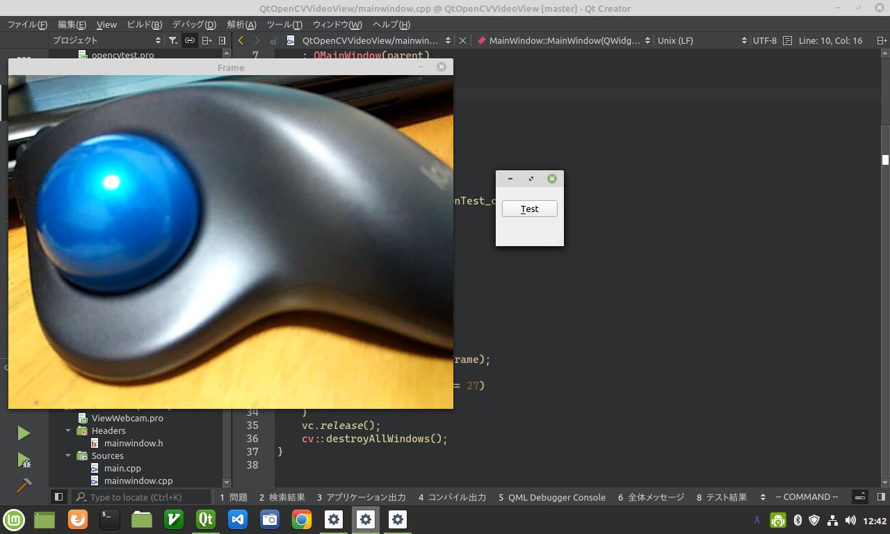

# OpenCV を使用して Qt でウェブカメラの映像を表示する

環境: Linux Mint 20 + Qt 5.15.1

**[全ソースはここ](https://github.com/Taro3/QtOpenCVVideoView)**

Qt と OpenCV を使用して、ウェブカメラの映像を表示してみます。

処理は、非常に単純なもので、 OpenCV の VideoCapture でウェブカメラを選択して、 >> オペレータでフレームの画像を取得し、 imshow で OpenCV がハンドリングするウィンドウにウェブカメラの映像を表示するだけです。

```C++
    cv::VideoCapture vc(0);
    if (!vc.isOpened())
        return;
    while (true) {
        cv::Mat frame;
        vc >> frame;

        if (frame.empty())
            break;

        cv::imshow("Frame", frame);

        if (cv::waitKey(25) == 27)
            break;
    }
```

画像を更新し続けるために、無限ループになっています。 Esc キーを押下すると停止します。

ループから抜けたら、後始末をして終わりです。

```C++
    vc.release();
    cv::destroyAllWindows();
```

当然ですが、無限ループで映像を更新しているので、映像を止めるまでアプリケーションで他の処理を実行することはできません。

実行結果はこんな感じです。



***

**[戻る](../Qt.md)**
