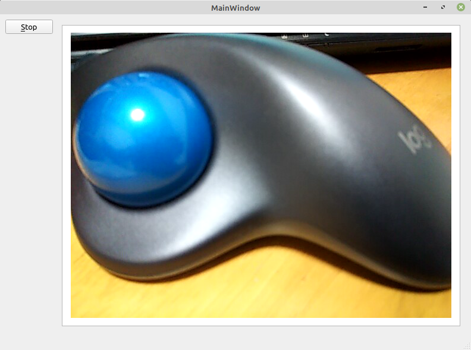

# Qt と OpenCV を使用してウェブカメラの映像を **Qt のウィジェット内に**表示する

**[全ソースはここ](https://github.com/Taro3/QtOpenCVVideoView2)**

Qt と OpenCV を使用して、ウェブカメラの映像を表示してみます。今回は、 Qt のウィジェット内に映像を表示してみます。

今回は、別スレッドで OpenCV の映像を取得更新するので、 ViewThread というクラスを追加しています。

このクラスの中では、VideoCapture でウェブカメラを選択して、 >> オペレータで画像を取得したあとに、 OpenCV の BGR という順番のデータを Qt で使用する RGB に変換しています。変換した画像データは、 frameUpdate シグナルで渡します。

この処理は、スレッドを終了するまで繰り返します。

```C++
    ...
    cv::VideoCapture vc(_cameraId);
    cv::Mat tempFrame;

    while (!_isStop) {
        vc >> tempFrame;
        if (tempFrame.empty())
            break;
        cv::cvtColor(tempFrame, tempFrame, cv::COLOR_BGR2RGB);
        QMutexLocker locker(_lock);
        _frame = tempFrame;
        locker.unlock();
        emit frameUpdated(&_frame);
    }
    vc.release();
    ...
```

メインスレッド側では、 スロットで取得した Mat データを QPixmap に変換して、QGraphicsView 内の QGraphicsScene に表示しています。

```C++
    QMutexLocker locker(_lock);
    cv::Mat data = *mat;
    locker.unlock();

    QImage frame(data.data, data.cols, data.rows, data.step, QImage::Format_RGB888);
    QPixmap image = QPixmap::fromImage(frame);
    QGraphicsView* view = ui->graphicsView;
    QGraphicsScene* scene = view->scene();
    scene->clear();
    view->resetTransform();
    scene->addPixmap(image);
    scene->update();
    view->setSceneRect(image.rect());
```

別スレッドで画像取得処理をしているので、 メインスレッド側で他の処理を行うこともできます。

実行結果はこのようになります。



***

**[戻る](../Qt.md)**
