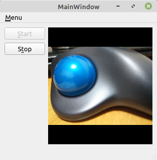

# ウェブカメラの映像を Qt で表示する

**[全ソースはここ](https://github.com/Taro3/ViewWebcam)**

Qt のマルチメディア機能を使用してウェブカメラの映像を表示してみます。

Qt のマルチメディア機能を使用するには、プロジェクトファイル(.pro ファイル)に、multimedia と multimediawidgets を追加する必要があります。

```QMake
QT       += core gui multimedia multimediawidgets
```

表示処理はすべて mainwindow.cpp(.h) にあります。

処理自体は簡単で、 QCamera でカメラのオブジェクトを作成し、 QCamera::setViewfinder で映像を表示する QVideoWidget を指定し、 QCamera::start で表示を開始するだけです。

```C++
    ...
    _cam = new QCamera(QCameraInfo::defaultCamera(), ui->widget);
    ...
    _cam->setViewfinder(_vWidget);
    ...
    _cam->start();
```

QCamera のインスタンス生成時に、 QCameraInfo を渡してどのカメラ(複数ある場合)かを指定します。

ウェブカメラが 1 つしかない場合は、 QCameraInfo::defaultCamera で取得すれば問題ないはずです。複数のカメラがある場合は、 QCameraInfo::availableCameras を使うと使用可能な(未使用なという意味です。使用中のカメラは含まれないので注意)カメラの情報が QList\<QCameraInfo\>として列挙されます。

映像を停止する場合は、QCamera::stop を呼ぶだけです。

```C++
    if (_cam)
        _cam->stop();
```

Linmix Mint と Qt 5.15.1 で確認した感じでは、デバイスがあっても映像が送られてこない場合、 QCamera::status が QCamera::ActiveStatus に切り替わらない仕様のようなので、テストプログラムでは QTimer を使用して、一定時間(10秒) QCamera::status が QCamera::ActiveStatus にならない場合は、処理を中断するようにしています。

アプリケーション終了時には、 QCamera にアタッチされている QVideoWidget を nullptr に設定しています。(これがないと落ちるため)この処理が本当に必要かどうかは定かでは有りません…(^_^;)

```C++
    if (_cam)
        _cam->setViewfinder(static_cast<QVideoWidget*>(nullptr));
```

実行結果はこんな感じ。



***

**[戻る](../Qt.md)**
