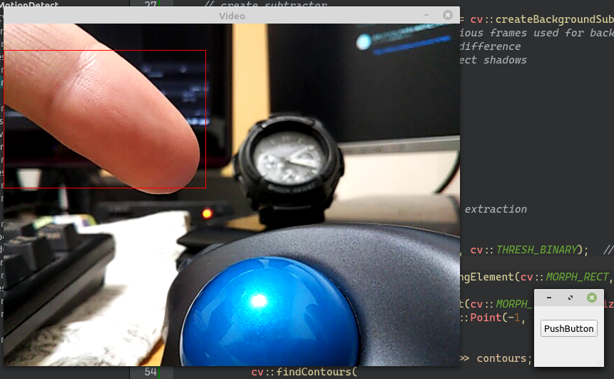

# OpenCV を使用して、動体検出を行う

環境: Linux Mint 20 + Qt 5.15.1

**[全ソースはここ](https://github.com/Taro3/OpenCVMotionDetection)**

OpenCV を使用して、動体検出をしてみます。

動体の検出は、基本的にフレームごとの差分を検出することで行われます。

まず、減算器を作ります。

```C++
    cv::Ptr<cv::BackgroundSubtractorMOG2> bs = cv::createBackgroundSubtractorMOG2(
                500         // number of previous frames used for background image
                , 16        // threshold for difference
                , true);    // whether to detect shadows
```

ここでは、差分として過去 500 フレーム分を使い、差分の閾値を 16 に、影の検出を有効にしています。

次に、前景を抽出します。

```C++
        bs->apply(frame, mask); // foreground extraction
```

これで、前景(変化した部分)のグレースケールの画像を得ることができます。

取得した前景からノイズを除去します

```C++
            cv::threshold(mask, mask, 25, 255, cv::THRESH_BINARY);  // binarization
            int noiseSize = 9;
            cv::Mat kernel = cv::getStructuringElement(cv::MORPH_RECT, cv::Size(noiseSize, noiseSize)); // create rectangle kernel
            cv::erode(mask, mask, kernel);
            kernel = cv::getStructuringElement(cv::MORPH_RECT, cv::Size(noiseSize, noiseSize));
            cv::dilate(mask, mask, kernel, cv::Point(-1, -1), 3);
```

noiseSize を変更することで、ノイズのサイズを変更することができます。

前景画像から、輪郭を抽出します。

```C++
            std::vector<std::vector<cv::Point>> contours;
            cv::findContours(
                        mask                        // image to extract.
                        , contours                  // list of detected contours
                        , cv::RETR_TREE             // all contours
                        , cv::CHAIN_APPROX_SIMPLE); // compresses horizontal, vertical, and diagonal segments and leaves only their end points.
```

これで輪郭の座標リストが取得できます。

最後に、すべての輪郭部分に矩形を描画して視認できるようにします。

```C++
                cv::Scalar color = cv::Scalar(0, 0, 255);   // red
                for (size_t i = 0; i < contours.size(); ++i) {
                    cv::Rect rect = cv::boundingRect(contours[i]);
                    cv::rectangle(frame, rect, color, 1);
                }
```

これを毎フレームごとに行うことで、画面内で変化した部分(動体)の検出を行うことができます。

実行結果はこんな感じ。(あまり良くないサンプルで申し訳ない…(ヽ´ω`))



***

**[戻る](../Qt.md)**
