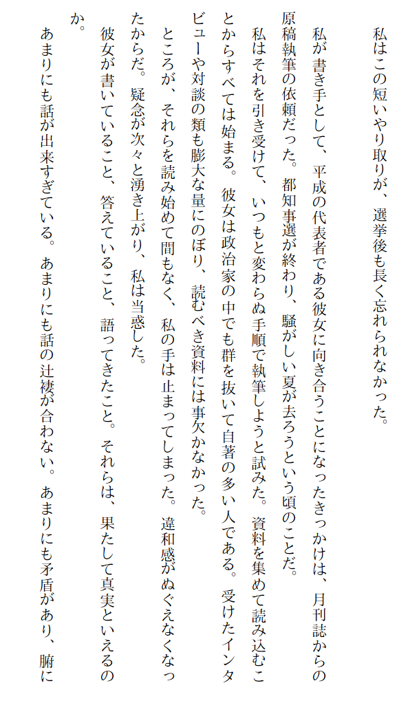
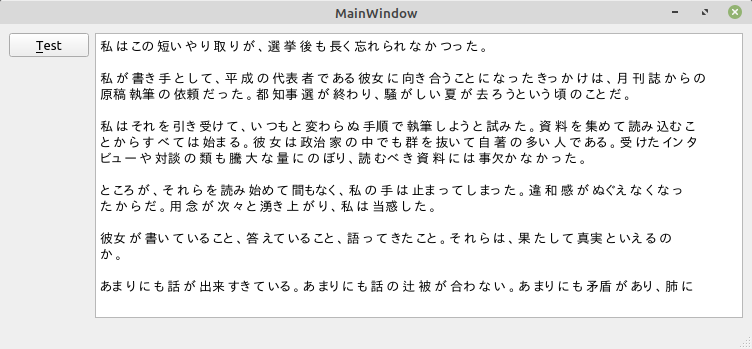

# Tesseract を使用して画像内の文字列認識を行う

環境: Linux Mint 20 + Qt 5.15.1

**[全ソースはここ](https://github.com/Taro3/OpenCVDetectFaceLandmark)**

Tesseract を使用すると文字列の認識が行えます。 OCR ってやつですね。

Tesseract をインストールするには、libtesseract-dev と tesseract-ocr-all をパッケージでインストールするか、ソースからビルドします。
ソース: <https://github.com/tesseract-ocr/tesseract/releases>
ビルド方法は、 <https://tesseract-ocr.github.io/tessdoc/Compiling.html> にありますが、以下を実行するだけです。

```shell
sudo apt-get install g++ # or clang++ (presumably)
sudo apt-get install autoconf automake libtool
sudo apt-get install pkg-config
sudo apt-get install libpng-dev
sudo apt-get install libjpeg8-dev
sudo apt-get install libtiff5-dev
sudo apt-get install zlib1g-dev

sudo apt-get install libleptonica-dev

./autogen.sh
./configure --prefix=$HOME/local/
make
make install
```

以上で、インストールは終わりですが、 Tesseract を使用するには、学習済みのデータが必要です。
学習済みデータは、 <https://github.com/tesseract-ocr/tessdata> にあるので、ダウンロードして解凍しておきます。

今回はテストとして、以下に示す縦書きの文章(あの「女帝」の一部分^^;)を使用します。



ソースですが、 Qt で作る必要はまったくないんですが、流れでそうなってます(・。・;

まず、ヘッダをインクルードします。

```C++
#include <tesseract/baseapi.h>
```

処理本体では、一旦 setlocale で "C" に設定する必要があります。( Tesserect の決まりごとらしい)

次に、TessBaseAPI で Tesserect のインスタンスを生成して、 Init で初期化します。
Init に渡している引数は、 学習済みデータのパス( .pro ファイル中で定義されている TESSDATA_PREFIX ) と、認識に使う言語(ここでは縦書きの日本語である "jpn_vert" ) を指定します。

```C++
    char* oldCType = strdup(setlocale(LC_ALL, NULL));
    setlocale(LC_ALL, "C");

    auto tessApi = tesseract::TessBaseAPI();
    if (tessApi.Init(TESSDATA_PREFIX, "jpn_vert")) {    // virtical text
        qDebug() << "cant load tessdata.";
        return;
    }
```

次に、ここが結構ハマりどころですが、 SetPageSegMode を使って、セグメントモードというのを縦書きの塊のテキストであることを教えます。(これがないとメチャクチャな認識結果になります)

```C++
    tessApi.SetPageSegMode(tesseract::PSM_SINGLE_BLOCK_VERT_TEXT);  // virtical text mode
```

次は、認識に使用する画像を読み込んでフォーマットを RGB 各 8 ビットに変換してから SetImage に渡して設定します。
引数は、ビットデータ、幅、高さ、プレーン数、 1 ラインあたりのバイト数を渡します。

```C++
    QImage image("jpvtext.png");
    image = image.convertToFormat(QImage::Format_RGB888);
    tessApi.SetImage(image.bits(), image.width(), image.height(), 3, image.bytesPerLine());
```

次に、 GetUTF8Text を使って認識された文字列を取得します。ここで重要なことは、この返された文字列のバッファは呼び出し側が開放しなければいけないことです。

```C++
    char* out = tessApi.GetUTF8Text();
    ui->textEdit->setPlainText(out);

    tessApi.End();
    delete [] out;
    setlocale(LC_ALL, oldCType);
    free(oldCType);
```

最後は、 End で終了し、バッファを開放して、ロケールを戻して終了です。

実行結果はこんな感じです。



うーん。まぁこんなもんでしょう…。^^;

***

**[戻る](../Qt.md)**
