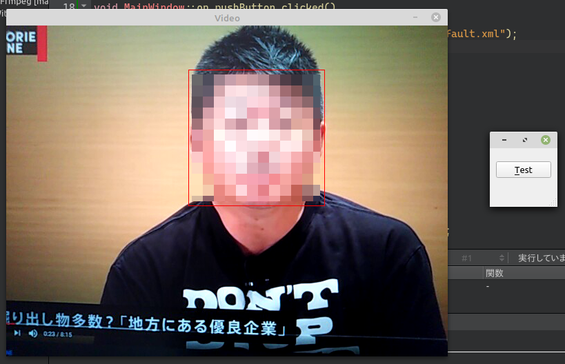

# OpenCVを使用して顔を検出する

環境: Linux Mint 20 + Qt 5.15.1

**[全ソースはここ](https://github.com/Taro3/OpenCVFaceDetect)**

OpenCV を使用して、映像中の人物の顔を検出してみます。

OpenCV には、機械学習で学習済みのデータが入っているので、そのデータを使用します。  
今回は、 haarcascade_frontalface_default.xml を使用します。

OpenCV で、物体を認識するには、 CascadeClassifier を使用します。  
引数に、学習済みデータのファイルを指定します。

```C++
    cv::CascadeClassifier cc("./haarcascade_frontalface_default.xml");
```

顔の矩形を保存するためのリストを作成します。

```C++
        std::vector<cv::Rect> faces;
```

物体認識には、グレースケールの画像を使用するので、キャプチャした画像をグレースケールに変換します。

```C++
        cv::Mat grayFrame;
        cv::cvtColor(frame, grayFrame, cv::COLOR_BGR2GRAY);
```

あとは、 detectMultiScale を使用して顔を検出します。

```C++
        cc.detectMultiScale(grayFrame, faces, 1.3, 5);
```

例では、検出した矩形に赤い四角形を描画しています。

```C++
        cv::Scalar color = cv::Scalar(0, 0, 255);   // red
        for(size_t i = 0; i < faces.size(); ++i)
            cv::rectangle(frame, faces[i], color, 1);
```

実行結果はこんな感じです。



テストには、 Youtube の某有名な方を使用させていただきました。^^;

***

**[戻る](../Qt.md)**
