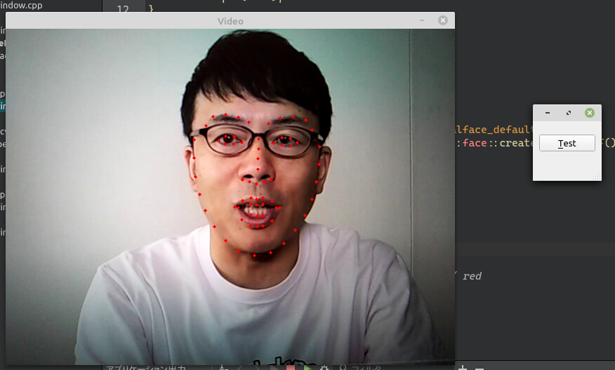

# OpenCV を使用して顔のランドマークを検出する

環境: Linux Mint 20 + Qt 5.15.1

**[全ソースはここ](https://github.com/Taro3/OpenCVDetectFaceLandmark)**

OpenCV を使用して顔のランドマーク検出を行ってみます。つまり、顔の中のパーツ(?)を検出することです。^^;

OpenCV の中には、ランドマーク検出用の学習済みデータがないので、 <https://raw.githubusercontent.com/kurnianggoro/GSOC2017/master/data/lbfmodel.yaml> から学習済みモデルを取得して、実行ファイルと同じディレクトリに置きます。

プロジェクトは、顔の検出のプロジェクトに機能を足す感じになります。

顔のランドマークを検出するには、 Facemark を使用します。
新たに facemark.hpp をインクルードします。

```C++
#include <opencv2/face/facemark.hpp>
```

Facemark のインスタンス生成には、 createFacemarkLBF を使います。
インスタンス生成後に、 loadModel を使用して学習済みデータを読み込みます。

```C++
    cv::Ptr<cv::face::Facemark> markDetector = cv::face::createFacemarkLBF();
    markDetector->loadModel("lbfmodel.yaml");
```

顔の検出後に、 fit を使用して顔検出矩形内のランドマークを検出します。

例では、検出した場所に小さい円を描画しています。

```C++
        if (markDetector->fit(frame, faces, shapes))
            // draw facial land marks
            for (unsigned long i = 0; i < faces.size(); ++i)
                for(unsigned long k = 0; k < shapes[i].size(); ++k)
                    cv::circle(frame, shapes[i][k], 2, color, cv::FILLED);
```

実行するとこんな感じです。



※Youtubeの動画を使っています。すいません上念さん^^;

***

**[戻る](../Qt.md)**
