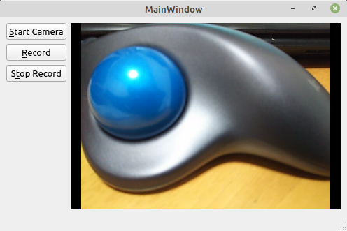

# Qt でウェブカメラの動画を保存する

環境: Linux Mint 20 + Qt 5.15.1

**[全ソースはここ](https://github.com/Taro3/WebcamVideoRecordWithQt)**

Qt を使用して、ウェブカメラの映像を保存してみます。

ウェブカメラ映像の表示は、他の項目で扱っているので、ここでは録画保存することのみを解説します。

Qt でウェブカメラの映像を保存する場合は、 QMediaRecorder を使用します。  
インスタンス生成時に、使用する QCamera を指定します。

```C++
    ...
    , _recorder(new QMediaRecorder(_camera, this))
    ...
```

次に、カメラのキャプチャモードを QCamera::CaptureVideo に設定します。

```C++
    ...
    _camera->setCaptureMode(QCamera::CaptureVideo);
    ...
```

録画を開始する場合は、QMediaRecorder::setVideoSettings を使用して保存する映像の設定をする必要があります。  
これが、結構曲者で**ハマりました**。  
ここで指定する設定値の一部は、ウェブカメラの情報と一致させる必要があります。  
具体的には、フレームレート (setFrameRate) と、解像度 (setResolution) で指定する値を QCamera から取得した値と一致させる必要があります。  
ここでは、 mp4 で動画を保存しています。

```C++
    ...
    auto setting = _recorder->videoSettings();
    setting.setBitRate(5000 * 1000);
    setting.setCodec("video/x-h264");                                       // select h264 codec.
    setting.setEncodingMode(QMultimedia::ConstantQualityEncoding);
    setting.setFrameRate(_camera->viewfinderSettings().maximumFrameRate()); // must just match one of webcam fps.
    setting.setQuality(QMultimedia::NormalQuality);
    setting.setResolution(_camera->viewfinderSettings().resolution());      // must just match one of webcam resolutions.
    _recorder->setVideoSettings(setting);
    ...
```

動画を保存するパスを、 QMediaRecorder::setOutputLocation で指定します。  
QUrl で指定する必要があります。

```C++
    _recorder->setOutputLocation(QUrl::fromLocalFile(qApp->applicationDirPath() + "/" "video.mp4"));
```

録画を開始するには、 QMediaRecorder::record を呼び出し、録画を終了するには、QMediaRecorder::stop を呼び出します。

```C++
    _recorder->record();

    _recorder->stop();
```

実行結果はこんな感じです。



実行ファイルと同じディレクトリに動画ファイルが作成されるはずです。


***

**[戻る](../Qt.md)**
