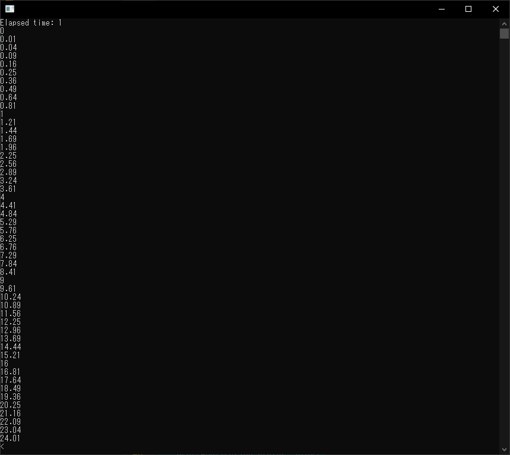

# QtConcurrentを使用してコレクション内の全オブジェクト関数を並列で呼び出し、結果をコレクションで受け取る

QtConcurrentはQtの並列処理を行うモジュールです。

## プロジェクトファイルの設定

QtConcurrentを使用するには、.proファイルにconcurrentを追加します。

```QMake
QT += concurrent
```

## サンプルプログラム

まず、コレクションするオブジェクトのクラスを作成します。

```c++
/**
 * @brief The MyClass class
 */
class MyClass {
public:
    /**
     * @brief       MyClass
     *              コンストラクタ
     * @param[in]   n   データ値
     */
    MyClass(int n) : _n{static_cast<float>(n) / 10.0f} {
    }
    /**
     * @brief   MyClass
     *          デフォルトコンストラクタ
     */
    MyClass() : _n{0.0f} {
    }
    /**
     * @brief   Test
     *          呼び出し関数
     * @return  処理結果値
     */
    float Test() const {
        return std::pow(_n, 2);
    }

private:
    float _n;   //!< データ
};
```

次にコレクション内の関数を呼び出すメイン処理を作成します。

```c++
/**
 * @brief main
 *        プログラムメイン
 * @param argc
 * @param argv
 * @return
 */
int main(int argc, char *argv[]) {
    QCoreApplication a(argc, argv);

    QVector<MyClass> v;
    for (int i = 0; i < 50; ++i) {
        MyClass mc(i);
        v.push_back(mc);
    }
    QElapsedTimer et;
    et.start();
    QVector<float> result = QtConcurrent::blockingMapped<QVector<float> >(v.begin(), v.end(), &MyClass::Test);
    std::cout << "Elapsed time: " << et.elapsed() << std::endl;
    foreach (float f, result)
    {
        std::cout << f << std::endl;
    }

    return 0;
}
```

## 実行結果

実行結果を示します。
コレクション内の全Test関数が呼び出されて結果が保存されています。



## プログラム全体

最後に、プログラム全体を示します。

```c++
#include <iostream>
#include <cmath>

#include <QCoreApplication>
#include <QtConcurrentMap>
#include <QVector>
#include <QElapsedTimer>

/**
 * @brief The MyClass class
 */
class MyClass {
public:
    /**
     * @brief       MyClass
     *              コンストラクタ
     * @param[in]   n   データ値
     */
    MyClass(int n) : _n{static_cast<float>(n) / 10.0f} {
    }
    /**
     * @brief   MyClass
     *          デフォルトコンストラクタ
     */
    MyClass() : _n{0.0f} {
    }
    /**
     * @brief   Test
     *          呼び出し関数
     * @return  処理結果値
     */
    float Test() const {
        return std::pow(_n, 2);
    }

private:
    float _n;   //!< データ
};

/**
 * @brief main
 *        プログラムメイン
 * @param argc
 * @param argv
 * @return
 */
int main(int argc, char *argv[]) {
    QCoreApplication a(argc, argv);

    QVector<MyClass> v;
    for (int i = 0; i < 50; ++i) {
        MyClass mc(i);
        v.push_back(mc);
    }
    QElapsedTimer et;
    et.start();
    QVector<float> result = QtConcurrent::blockingMapped<QVector<float> >(v.begin(), v.end(), &MyClass::Test);
    std::cout << "Elapsed time: " << et.elapsed() << std::endl;
    foreach (float f, result)
    {
        std::cout << f << std::endl;
    }

    return 0;
}
```

***

**[戻る](../Qt.md)**
