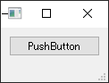
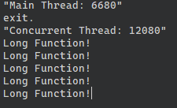

# QtConcurrentを使用して非メンバ関数を呼び出す

QtConcurrentはQtの並列処理を行うモジュールです。

## プロジェクトファイルの設定

QtConcurrentを使用するには、.proファイルにconcurrentを追加します。

```QMake
QT += concurrent
```

## サンプルプログラム

GUIアプリケーションを作成します。

まずヘッダ

```c++
#ifndef MAINWINDOW_H
#define MAINWINDOW_H

#include <QMainWindow>

QT_BEGIN_NAMESPACE
namespace Ui { class MainWindow; }
QT_END_NAMESPACE

/**
 * @brief The MainWindow class
 */
class MainWindow : public QMainWindow
{
    Q_OBJECT

public:
    MainWindow(QWidget *parent = nullptr);
    ~MainWindow();
    void AppendText(QString s);

private slots:
    void on_pushButton_clicked();

private:
    Ui::MainWindow *ui;
};
#endif // MAINWINDOW_H
```

次に実装

```c++
#include <iostream>

#include <QtConcurrent>
#include <QDebug>

#include "mainwindow.h"
#include "ui_mainwindow.h"

/**
 * @brief   LongFunction
 *          呼び出されるフリー関数
 */
void LongFunction() {
    QString s = "Concurrent Thread: " + QString::number(reinterpret_cast<quint64>(qApp->thread()->currentThreadId()));
    qDebug() << s;
    for (int count = 0; count < 5; ++count) {
        qApp->thread()->sleep(1);
        qDebug() << "Long Function!";
    }
}

/**
 * @brief       MainWindow::MainWindow
 *              コンストラクタ
 * @param[in]   parent  親ウィジェットポインタ
 */
MainWindow::MainWindow(QWidget *parent) : QMainWindow(parent), ui(new Ui::MainWindow) {
    ui->setupUi(this);
}

/**
 * @brief   MainWindow::~MainWindow
 *          デストラクタ
 */
MainWindow::~MainWindow() {
    delete ui;
}

/**
 * @brief   MainWindow::on_pushButton_clicked
 *          ボタンクリックイベントハンドラ
 */
void MainWindow::on_pushButton_clicked() {
    qDebug() << "Main Thread: " + QString::number(reinterpret_cast<quint64>(thread()->currentThreadId()));
    QFuture<void> result = QtConcurrent::run(LongFunction);
    qDebug() << "exit.";
}
```

UI定義

```xml
<?xml version="1.0" encoding="UTF-8"?>
<ui version="4.0">
 <class>MainWindow</class>
 <widget class="QMainWindow" name="MainWindow">
  <property name="geometry">
   <rect>
    <x>0</x>
    <y>0</y>
    <width>98</width>
    <height>80</height>
   </rect>
  </property>
  <property name="windowTitle">
   <string>MainWindow</string>
  </property>
  <widget class="QWidget" name="centralwidget">
   <layout class="QVBoxLayout" name="verticalLayout">
    <item>
     <widget class="QPushButton" name="pushButton">
      <property name="text">
       <string>PushButton</string>
      </property>
     </widget>
    </item>
   </layout>
  </widget>
  <widget class="QMenuBar" name="menubar">
   <property name="geometry">
    <rect>
     <x>0</x>
     <y>0</y>
     <width>98</width>
     <height>20</height>
    </rect>
   </property>
  </widget>
  <widget class="QStatusBar" name="statusbar"/>
 </widget>
 <resources/>
 <connections/>
</ui>
```

最後にメイン関数

```c++
#include "mainwindow.h"

#include <QApplication>

int main(int argc, char *argv[])
{
    QApplication a(argc, argv);
    MainWindow w;
    w.show();
    return a.exec();
}
```

## 実行結果

最後に実行結果
非メンバ関数が呼び出されているのがわかります。




***

**[戻る](../Qt.md)**
